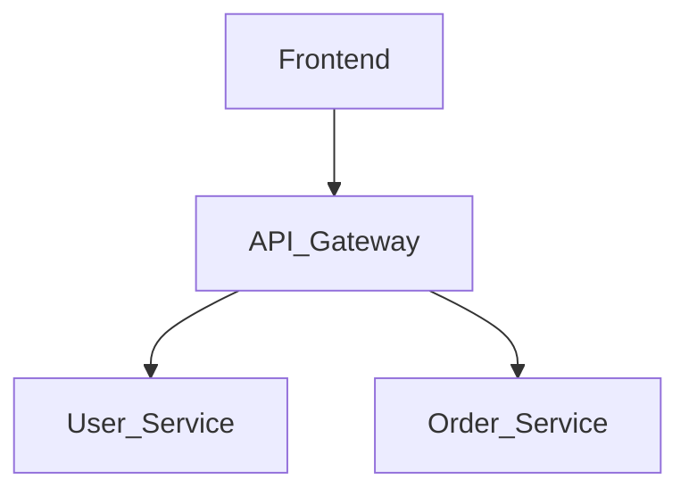

# Excel to Architecture Diagram

This skill converts Excel spreadsheet data into visual application architecture diagrams using Mermaid syntax.

## When to Use

- User says "帮我把 Excel 转成应用架构图" (Help me convert Excel to application architecture diagram)
- User uploads an Excel file and wants to visualize it as a diagram
- User has business/service data in Excel and wants to see it as a flowchart or architecture diagram
- User asks to "generate diagram from Excel data"

## Core Capability

The excel-to-diagram project (`d:\filework\excel-to-diagram`) provides:
1. **Excel Parsing** - Reads Excel files and extracts structured data
2. **Data Transformation** - Converts Excel rows/columns into diagram nodes and relationships
3. **Mermaid Generation** - Produces Mermaid syntax for various diagram types:
   - Flow diagrams
   - Architecture diagrams
   - Service dependency diagrams
   - Group/component diagrams

## Usage Pattern

### Step 1: Understand the Excel Structure

Ask the user about their Excel data structure:
- What columns represent nodes/entities?
- What columns represent relationships/flows?
- What type of diagram do they want?

### Step 2: Parse and Transform

The project uses:
- `src/services/excelParser.js` - Parse Excel files
- `src/services/dataTransformer.js` - Transform data to diagram format
- `src/composables/useExcelParser.js` - Vue composable for Excel parsing

### Step 3: Generate Mermaid Diagram

Output Mermaid syntax that can be rendered by the MermaidComponent.

## Excel Data Format

The application expects Excel files with:

| Column A | Column B | Column C | Column D |
|----------|----------|----------|----------|
| Source/From | Target/To | Relation Type | Description |
| Service A | Service B | calls | API endpoint |
| Module 1 | Module 2 | contains | Sub-component |

## Example

Input Excel:
| From | To | Type |
|------|-----|------|
| Frontend | API Gateway | calls |
| API Gateway | User Service | calls |
| API Gateway | Order Service | calls |

Output Mermaid:

## Diagram Types Supported

1. **flowchart** - Basic flow diagrams
2. **sequenceDiagram** - Sequence/interaction diagrams
3. **classDiagram** - Class structure diagrams
4. **blockDiagram** - Block/component diagrams
5. **architectureDiagram** - System architecture views

## Key Files

- `d:\filework\excel-to-diagram\src\services\excelParser.js` - Excel parsing logic
- `d:\filework\excel-to-diagram\src\services\dataTransformer.js` - Data transformation
- `d:\filework\excel-to-diagram\src\composables\useExcelParser.js` - Vue composable
- `d:\filework\excel-to-diagram\src\components\MermaidComponent.vue` - Diagram renderer

## Trigger Keywords

- "Excel转架构图"
- "把Excel转成图"
- "上传Excel生成图表"
- "Excel数据可视化"
- "Excel to diagram"
- "architecture from Excel"

## Notes

- The skill works with the excel-to-diagram Vue.js application
- Mermaid syntax is generated client-side
- Supports drag-and-drop Excel upload
- Can export diagrams as SVG/PNG
