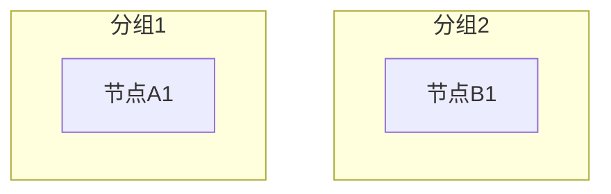

# 布局交互框架简化 Spec

## Why

当前布局选项过于复杂，存在功能重叠和用户困惑：

* 水平排列、垂直排列与布局控制的整体方向功能重叠

* 分区布局可以用布局控制实现

* 用户需要理解多个相似选项的区别

通过测试发现，Mermaid + dagre/elk 的布局行为有以下规律：

1. 分组顺序由连线方向决定，无法完全通过代码顺序控制
2. 整体方向（TB/LR）仍然有效，影响分组之间的排列方式
3. 分组内方向有效，可以控制分组内节点的排列方向

基于这些发现，可以简化布局交互框架，提升用户体验。

## What Changes

- **简化布局选项为两个**：自动布局、布局控制
- **移除独立的"水平排列、垂直排列"布局选项**，整合到布局控制的整体方向中
- **移除"分区布局"选项**，可以用布局控制实现相同效果
- **新增整体方向配置**，作为布局控制的第一级配置
- **记录 Mermaid + dagre/elk 的布局规律和能力**，作为开发参考
- **保留现有分组控制功能**：分组新增、嵌套子分组、删除、拖拽分配、方向控制、样式控制等
- **BREAKING** 移除 HORIZONTAL、VERTICAL、ZONE 布局类型，但保持向后兼容

## Impact

* Affected specs: 服务模块图、业务对象图的布局功能

* Affected code:

  * `src/composables/useMermaid/layouts/index.js` - 布局类型定义和路由

  * `src/views/AADiagramApp/components/LayoutSelector.vue` - 布局选择器

  * `src/views/AADiagramApp/components/LayoutControlPanel.vue` - 布局控制面板

  * `src/composables/useMermaid/layouts/linearLayout.js` - 可能废弃

  * `src/composables/useMermaid/layouts/elkZoneLayout.js` - 可能废弃

## ADDED Requirements

### Requirement: Mermaid 布局规律文档化

系统应记录 Mermaid + dagre/elk 的布局规律，作为开发参考。

#### Scenario: 记录布局规律

* **WHEN** 开发者需要理解 Mermaid 布局行为

* **THEN** 系统提供详细的布局规律文档，包括：

  * 连线方向对分组顺序的影响

  * 整体方向的有效性

  * 分组内方向的有效性

  * dagre vs elk 的差异

### Requirement: 简化布局选项

系统应提供简化的布局选项，避免功能重叠。

#### Scenario: 布局选项简化

* **WHEN** 用户选择布局模式

* **THEN** 系统仅显示两个选项：自动布局、布局控制

#### Scenario: 默认布局不受影响

* **WHEN** 用户未选择布局控制

* **THEN** 系统使用默认的自动布局，行为与之前完全一致

### Requirement: 整体方向作为第一级配置

系统应将整体方向作为布局控制的第一级配置。

#### Scenario: 选择整体方向

* **WHEN** 用户启用布局控制

* **THEN** 系统首先显示整体方向选择：垂直排列（TB）、水平排列（LR）

#### Scenario: 整体方向影响布局

* **WHEN** 用户选择整体方向

* **THEN** 系统根据选择生成对应的 Mermaid 代码（flowchart TB 或 flowchart LR）

### Requirement: 分组控制作为第二级配置

系统应将分组控制作为布局控制的第二级配置。

#### Scenario: 配置分组

* **WHEN** 用户需要自定义分组

* **THEN** 系统提供分组配置界面，支持添加分组、配置分组内容、设置分组内方向

#### Scenario: 分组顺序提示

* **WHEN** 用户配置分组

* **THEN** 系统提示"分组顺序可能受节点连线方向影响"

### Requirement: 向后兼容

系统应保持向后兼容，不影响现有功能。

#### Scenario: 现有配置兼容

* **WHEN** 用户加载包含 HORIZONTAL、VERTICAL、ZONE 布局类型的配置

* **THEN** 系统自动转换为对应的布局控制配置

#### Scenario: 默认布局不变

* **WHEN** 用户使用默认布局

* **THEN** 系统行为与之前完全一致

## MODIFIED Requirements

### Requirement: 布局类型定义

布局类型应简化为两个：DEFAULT 和 GROUPED。

#### Scenario: 布局类型常量

- **WHEN** 系统定义布局类型
- **THEN** 仅包含 DEFAULT 和 GROUPED 两个类型

#### Scenario: 废弃布局类型处理

- **WHEN** 系统遇到 HORIZONTAL、VERTICAL、ZONE 布局类型
- **THEN** 自动转换为 GROUPED 布局类型，并设置对应的整体方向

### Requirement: 分组控制功能保持不变

现有的分组控制功能应完全保留，不受影响。

#### Scenario: 分组新增

- **WHEN** 用户点击"添加分组"按钮
- **THEN** 系统创建一个新的分组，并分配唯一 ID

#### Scenario: 嵌套子分组

- **WHEN** 用户在分组内点击"添加子分组"
- **THEN** 系统在该分组内创建一个子分组

#### Scenario: 分组删除

- **WHEN** 用户点击分组的删除按钮
- **THEN** 系统删除该分组，分组内的容器移动到未分配列表

#### Scenario: 容器拖拽分配

- **WHEN** 用户将容器从列表拖拽到分组
- **THEN** 容器被添加到该分组，并从原位置移除

#### Scenario: 分组方向控制

- **WHEN** 用户选择分组的方向（TB/BT/LR/RL）
- **THEN** 系统更新分组的方向设置，并在预览中反映

#### Scenario: 分组样式控制

- **WHEN** 用户设置分组的显示样式
- **THEN** 分组在图表中按设置显示

## REMOVED Requirements

### Requirement: 独立的水平/垂直排列选项

**Reason**: 功能与布局控制的整体方向重叠，整合后更简洁

**Migration**:

* HORIZONTAL → GROUPED + 整体方向 LR

* VERTICAL → GROUPED + 整体方向 TB

### Requirement: 分区布局选项

**Reason**: 可以用布局控制实现相同效果，分组按行排列即可

**Migration**:

* ZONE → GROUPED + 多个分组 + 整体方向 TB + 分组内方向 LR

## Technical Design

### 布局类型定义

```javascript
export const LAYOUT_TYPES = {
  DEFAULT: 'default',
  GROUPED: 'grouped',
}

// 废弃的布局类型（向后兼容）
export const DEPRECATED_LAYOUT_TYPES = {
  HORIZONTAL: 'horizontal',
  VERTICAL: 'vertical',
  ZONE: 'zone',
}
```

### 布局控制配置

```javascript
const layoutControlConfig = {
  enabled: true,
  overallDirection: 'TB', // 'TB' | 'LR' - 整体方向
  groups: [
    {
      id: 'group-0',
      title: '分组1',
      direction: 'LR', // 分组内方向
      containers: ['container-id-1', 'container-id-2'],
    }
  ],
}
```

### Mermaid 代码生成



### 向后兼容转换

```javascript
function convertDeprecatedLayout(layoutType, config) {
  if (layoutType === 'horizontal') {
    return {
      layoutType: 'grouped',
      layoutControlConfig: {
        enabled: true,
        overallDirection: 'LR',
        groups: [/* 所有容器作为一个分组 */]
      }
    }
  }
  // ... 其他转换
}
```

## Mermaid 布局规律记录

### dagre 布局引擎

**特点：**

* 传统有向图布局算法

* 优先优化连线，减少连线交叉

* 布局紧凑

**行为规律：**

1. **分组顺序**：由连线方向决定，源头分组在上/左
2. **整体方向**：TB/LR 有效，影响分组之间的排列方式
3. **分组内方向**：有效，可以控制分组内节点的排列方向
4. **连线优化**：优先减少连线交叉

### elk 布局引擎

**特点：**

* 现代布局引擎

* 支持更复杂的布局需求

* 对分组方向控制更好

**行为规律：**

1. **分组顺序**：由连线方向决定，与 dagre 类似
2. **整体方向**：TB/LR 有效，影响分组之间的排列方式
3. **分组内方向**：有效，可以控制分组内节点的排列方向
4. **连线优化**：也会优化连线，但更尊重用户定义的方向

### 关键发现

1. **连线方向决定分组顺序**

   * 单向连线：源头分组在上/左

   * 双向连线：分组定义顺序起作用

   * 多条连线：连线方向优先，而非数量

2. **整体方向有效**

   * TB：分组垂直排列（上下）

   * LR：分组水平排列（左右）

3. **分组内方向有效**

   * 可以控制分组内节点的排列方向

   * 与整体方向独立

4. **连线定义顺序无影响**

   * 连线定义在分组前或分组后，对布局没有影响

## Acceptance Criteria

### AC-1: 布局选项简化

* **Given**: 用户在布局选择器中

* **When**: 用户查看布局选项

* **Then**: 仅显示"自动布局"和"布局控制"两个选项

* **Verification**: `human-judgment`

### AC-2: 整体方向配置

* **Given**: 用户启用布局控制

* **When**: 用户选择整体方向

* **Then**: 系统生成对应的 Mermaid 代码

* **Verification**: `programmatic`

### AC-3: 分组控制配置

* **Given**: 用户启用布局控制

* **When**: 用户配置分组

* **Then**: 系统正确生成分组代码

* **Verification**: `programmatic`

### AC-4: 向后兼容

* **Given**: 用户加载包含废弃布局类型的配置

* **When**: 系统处理配置

* **Then**: 自动转换为新的布局控制配置

* **Verification**: `programmatic`

### AC-5: 默认布局不变

* **Given**: 用户使用默认布局

* **When**: 用户生成图表

* **Then**: 系统行为与之前完全一致

* **Verification**: `programmatic`

### AC-6: 布局规律文档

* **Given**: 开发者需要理解 Mermaid 布局行为

* **When**: 开发者查看文档

* **Then**: 文档包含详细的布局规律说明

* **Verification**: `human-judgment`

## Open Questions

* [ ] 是否需要保留分区布局作为快捷方式？

* [ ] 向后兼容转换是否需要提示用户？

* [ ] 是否需要提供布局迁移工具？

