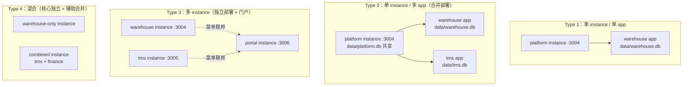
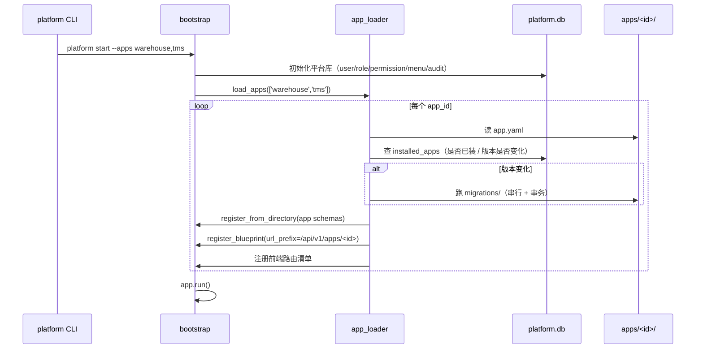

# 多产品应用平台与多实例部署 — 完整方案

> **文档定位**：回答"在现有元数据驱动平台上，如何构建多个独立产品（仓储 WMS / 运输 TMS…），并让每个产品既能独立部署成自己的 instance、又能合并部署到同一个 instance"。
>
> **与其它文档的关系**：[ENTERPRISE_PLATFORM_CAPABILITY_PLANNING.md](../ENTERPRISE_PLATFORM_CAPABILITY_PLANNING.md) 解决"能力维度"（BPMN / 多租户 / 报表 / AI…）；本文解决"应用产品维度 + 部署拓扑维度"。两份文档正交，互不替代。
>
> **状态**：v1.29.5（全部决策关闭 + 前置验证已执行 + **PoC 1 全部 7 步完成** + **PoC 2 完成（真实应用包 + 多应用各落各库）** + **PoC 4 完成（跨应用事件：不丢 / 不重 / 死信）** + **数据层前置项已收敛** + **§6.5 绑定基础设施 + 多库关闭编排已实现** + **§6.5.3 改动 1~3 已接线（`APP_DB_ROUTING`，默认关闭）** + **行业对标完成且 3 项 P0 差距已补入** + **§6.5.3 P0 复核修复：审计恒落平台库** + **PoC 3 推迟到 Phase 2（Type 2 已实测双应用同栏可见，§10.14）** + **面向 Agent/AI 的架构方向符合性 check 完成（§11 Q5：三条单向门口径入档）** + **`/mcp` 未鉴权入口已实测确认并关闭（§11 Q5）** + **应用 `migrations/` 执行环实测确认：能力已具备、缺接线 + 三项口径（§6.3.1）** + **多实例并行隔离实测通过：8 处平台库路径破口已补，主库零写入（§10.15）** + **应用权限管理维度已打通（v1.29：应用权限行补写 + 根菜单聚合 + 应用 schema 补 export/import，§10.15 (7)）** + **功能权限矩阵中应用资源的可见性已实测定性、中文标签已补（v1.29.1：`resources` 行显示"仓库/库存物料/出库单/运单"，§10.15 (8)）** + **缺陷 B 已修复（v1.29.2：SPA 内切换权限集重新加载 —— `:key` 重建 + `watch(permissionSetId)`，§10.15 (8)）** + **缺陷④ 已坐实并同日修复（v1.29.3：用户真实路由 `/detail/permission_set/1232` 二次取证（5 探针）—— "勾选菜单自动授予功能权限"在全平台静默失效的 3 处用户可及写入点改为按列自适应、新增 `permission_set_permissions.py`；"已同步 0 项"→"53 项"、矩阵保存 500→200、真页面 19 行 `1-10 / 14` 含"出库单"，§10.15 (8)）** + **缺陷⑦ 已坐实并同日修复（v1.29.4：应用资源行动作位全灰不可勾 —— 矩阵能力表只读 `resource_types.yaml`（14 个平台资源、零应用 BO）；修法 = `_build_resource_action_matrix()` 合并已启用应用的应用 BO 动作集（默认 CRUD+export/import ∪ schema 声明，setdefault 只补不覆盖），A 模式 14→18 条 / B 模式不变；真页面 outbound_order 6 动作位 全灰→全部可勾、勾"查看"→保存→F5 持久→`outbound_order:read` 落库，§10.15 (8)）** + **缺陷⑧ 已坐实并同日修复（v1.29.5：应用页面不在 landing 工作台卡片区 —— 卡片=菜单可见叶子（SSOT）无误，误伤点在 `leaf_menus` 派生规则把应用页面（`menu_auto_generator` 固定 `show_in_sidebar=0`）当"隐藏菜单"整批排除、应用根菜单又被"容器"规则排除；修法 = 放行"挂载点为应用根菜单（`page_type=''`）"的页面（1 行 + 注释，零波及实测）；真页面卡片 6→10、点新卡片落 `/outbound-order` 正常渲染、B 实例 / 侧边栏 / 权限矩阵零影响，§10.15 (8)）**）
> **最后更新**：2026-09-25
> **结论摘要**：现有平台已完成约 70% 的平台化基建（四层抽象中 L1/L2 已具备、L3/L4 缺失）。**真正缺失的只有"应用产品"这一层抽象**，Phase 1 约 40 人天可交付"单 instance 多 app 合并部署"。数据层 **3 处前置疑点已全部收敛**：F2 多库路径入口（**已实现**，§10.6）、F3 写队列/维护调度（**经核实为非缺口**，§10.7）、F1 fd 阈值（**实测降级为 P1**，§10.0）；另 1 条铁律（事务不跨库 F5）。**数据层已无阻塞项**。
>
> **行业对标（v1.18~v1.19）**：核心方向经 Salesforce / ServiceNow / Microsoft / SAP / Odoo / AWS 验证，**不需要推翻**；发现 **3 项 P0 差距已全部补入方案**（§4.4、[对标报告](./INDUSTRY_BENCHMARK_APP_PLATFORM.md)）：**G1 补 expand-contract 纪律**（§6.10 改写，蓝绿降为特例）、**G2 补表名命名空间**（§6.2.2 新增 `table_prefix` + 三层校验）、**G3 补"删除即废弃"**（§6.10）。另补 G4（卸载反向依赖检查验收项）。合计约 5.5 人天，均为规范 + 校验类改动，**不动架构**。
>
> **应用已可端到端加载并可见**：`ENABLED_APPS=hello_world` 启动后——应用路由可达、应用 BO 表自动创建、**菜单生成并挂到应用根菜单、菜单 API 真实返回**；legacy 模式零行为变化；**244 个新测试全通过**（§10.1~§10.14）。
>
> **四个实施级发现**：① 生产路径不使用 `ApplicationBuilder` → 按 §6.4.1 方案甲落地；② `deprecate_v1_crud` 中间件会把 `/api/v1/apps/*` 判为 410 → 已加白名单（§6.7）；③ 表名白名单缓存与菜单 mtime 守卫会静默拦截应用资源 → 已修复（§10.3）；④ **应用菜单必须有父菜单才可见** → 已实现 `portal_mount` 根菜单（§6.6、§10.4）。
>
> **下一步**：**① 补 P1 分流缺口**——`query_api` / `export_import_api` / `stats_api` / `association_api` 的 `_get_data_source()` 单例，以及应用包 `migrations/` 消费点、`bo_pick_service._default_data_source()`、`export_import_api.py` 的 `ManageService(_data_source)` 单例（§10.10 / §10.11 末尾"未纳入本次范围"，§10.12 末尾）——这些是**读错库的数据正确性风险**，优先级高于体验类收尾项。**② `/graphql` 关闭已列 backlog**（v1.27 决定推迟；其安全画像与已关闭的 `/mcp` **完全一致**——未鉴权 + schema 泄露，属**安全项**而非功能项，见 §6.3.1 (6)；同批发现的 `/_metrics`、`/api/v1/test/ready` 一并待定）。**③ 应用 `migrations/` 接线**——能力已具备（v1.27 §6.3.1 实测 1：per-app runner 开箱可用，接线无隐藏工作量），**但须先定三项口径**（迁移命名空间 / 执行时机 / 失败语义 + 依赖顺序），口径未定前不做接线。**`/mcp` 未鉴权入口已于 v1.26 实测确认并关闭**（原①）。**PoC 3（门户聚合）已推迟到 Phase 2 触发式启动**："TMS 与 WMS 一起展示"用 **Type 2 合并部署**即可，已实测双应用根菜单在**同一平台库、同一菜单响应**中同栏可见（v1.24 §10.14）；Type 3 的增量仅"多实例 + 跨实例菜单聚合"，触发条件（独立演进 / 不同团队 / 独立扩容 / 交付隔离，§3.2）未出现前不投入。**§6.5.3 四项改动已全部完成**（改动 1~3 → v1.20 §10.10；改动 4 → v1.17 §10.9），**PoC 2 已在真实应用包上验证通过**（v1.22 §10.12：应用库独立、平台库共享、审计归属正确、多应用各落各库），**PoC 4 已实测跨应用事件的"不丢 / 不重 / 死信"三项保证**（v1.23 §10.13）。路由模型为**双库并存**（§11 Q4）。**④ 应用权限管理维度已打通（✅ 2026-09-25，v1.29）** —— 实测**推翻**了原前提"须改 `/api/v1/menu-permission/menus/all`"（该端点**无任何前端调用方**；权限管理 UI 的真取数是 `/permission-sets/<id>/unified-permissions`，且它**已经**在 `menus` 表上工作并带应用维度）。真实堵点是三处，已全部修：应用权限行缺席（平台权限同步早于应用注册）⇒ 启动期补写 `_sync_app_permissions`；权限矩阵的授权单位是根菜单、而根菜单 `required_permissions` 初始为空 ⇒ 启动期逐 BO 聚合 `_aggregate_app_root_permissions`；应用 schema 缺 `export/import` actions ⇒ 4 个 schema 补齐（§10.15 (7)）。**残留 2 项入 backlog**：⑤ `/api/v1/admin/permissions/sync` 被 v1 sunset 劫持、⑥ `apps/hello_world/schemas/greeting.yaml` 同类悬空权限（§6.3.1 (6)）。**原第 ④ 项已同日坐实并修复（v1.29.3，见本段末尾）**。**用户偏差报告已闭环（v1.29.1）**：前端"功能权限"里看不到应用资源，实测根因是**该权限集从未分配应用根菜单**——`role_resource_action_matrix` 的资源行只从"已授予功能权限 + **已分配菜单**"推导（`auto` 来源），分配后 `resources` 16 → 20 项立即出现；**该口径经 v1.29.3 更正**——对 ps=1 成立（它自带 `*` 超级权限），**业务权限集另有前提**：功能权限行必须已存在，而缺陷④ 使该行过去永远写不进去；同时补齐应用资源中文标签（`_lookup_resource_label` 走 registry，矩阵行由 `outbound_order` → **出库单**，§10.15 (8)）。**缺陷 B 已修复（✅ 2026-09-25，v1.29.2）**：SPA 内切换权限集（路由 param 变化、组件实例复用）此前不重新加载 —— 页面标题与权限面板均停留在上一个权限集（实测：先开 897 再切 ps=1，ps=1 显示 897 的 15 行零应用行、`1-10/10`，即用户屏幕口径）；修法 = [PermissionSetDetailContent.vue](../../src/views/SystemManagement/PermissionSetDetailContent.vue) 模板 `:key="permissionSetId"`（面板整体重建）+ `watch(permissionSetId)`（重载详情/已分配组织、退出编辑态）；修复后 PlaywrightCLI 四步复测（20→15→20 行、标题跟随、选中菜单归零）全部符合预期，vitest **4 passed**（§10.15 (8)）。**缺陷④ 已坐实并修复（✅ 2026-09-25，v1.29.3）**：用户给出**实际打开的路由** `http://127.0.0.1:3007/detail/permission_set/1232` —— 与 v1.29.1 / v1.29.2 实测的 `/system/permission-set-detail/:id` **不是同一条**（该路由是 ObjectDetailPage 链，`detailPageMountKey` 强制重建 ⇒ **无缺陷 B**，但矩阵数据同源）。5 探针二次取证（应用根菜单 21 / 7 码全命中 `permissions`、菜单树可见可勾、ps=1232 无 `*`、矩阵保存 **500**、直插权限行 → 资源行出现）钉死因果：`permission_set_permissions` 实际 schema **无 `permission_code` 列**，而 **3 处用户可及写入点**均按该列 INSERT（① PUT `menu-permissions` 显式授予 ② 菜单自动同步 ③ 矩阵保存），前两处被 `except: pass` 静默吞 ⇒ "已同步 **0** 项" ⇒ `_auto_granted()` 门禁永不通过 ⇒ **业务权限集的应用资源行永久不出现（死锁）**；矩阵保存则直接 **HTTP 500**。修复 = 新增 [permission_set_permissions.py](../../meta/core/permission_set_permissions.py)（PRAGMA 按列自适应，照 v084 范式）+ 3 处替换；实测 "已同步 **53 项功能权限**"、应用权限行 0→21、`resources` **15→18**、矩阵保存 **500→200**、真页面 **19 行 / `1-10 / 14` / 出库单[outbound_order]**，且**可逆**（§10.15 (8)）。

---

## 目录

- [一、问题与目标](#一问题与目标)
- [二、架构模型：四层抽象](#二架构模型四层抽象)
- [三、四种部署拓扑](#三四种部署拓扑)
- [四、现状评估](#四现状评估)
- [五、能力清单](#五能力清单)
- [六、Phase 1（V1.0）详细设计](#六phase-1v10详细设计)
- [七、Phase 2（V2.0）概要](#七phase-2v20概要)
- [八、Phase 3（V3.0）概要](#八phase-3v30概要)
- [九、风险与缓解](#九风险与缓解)
- [十、PoC 验证路径](#十poc-验证路径)
- [十一、关键决策记录](#十一关键决策记录)
- [附录 A：相关文档与代码路径](#附录-a相关文档与代码路径)
- [附录 B：变更记录](#附录-b变更记录)

---

## 一、问题与目标

### 1.1 业务目标

在 `excel-to-diagram` 元数据驱动平台上：

1. **能构建多个应用产品**（仓储 WMS、运输 TMS、财务 FIN…），每个产品有自己的业务对象、页面、API 和菜单；
2. **每个产品可独立部署成自己的 instance**——独立进程、独立数据库、独立域名；
3. **也可合并部署到同一个 instance**——多个产品共用平台底座，共享用户 / 角色 / 权限 / 审计；
4. **允许混合部署**——核心系统独立部署，辅助系统合并部署。

### 1.2 非目标

本文不解决以下问题（属于其它专题）：

| 不解决 | 归属 |
|--------|------|
| 跨产品 BPMN 流程编排 | ENTERPRISE_PLATFORM_CAPABILITY_PLANNING 的"流程引擎" |
| AI Agent 操作护栏 | 同上 |
| 报表引擎、多租户 SaaS 计费 | 另立专题 |
| 跨产品统一门户的完整 UI | 本文仅定义菜单聚合契约，UI 留 Phase 2 |

### 1.3 核心概念

| 概念 | 含义 | 与现有概念的关系 |
|------|------|------------------|
| **App（应用产品）** | 一个可交付的业务产品，如 WMS、TMS | 现有 `product` 表是"产品目录元数据"；`App` 是它**可打包、可独立部署**的形态 |
| **App Package（应用包）** | 一个 `.bip` 文件，含 schemas / blueprints / components / migrations | **全新概念** |
| **Deploy Instance（部署实例）** | 一个跑起来的进程 + 一份数据库 | 已由 [deploy_topology.py](../../tools/lib/deploy_topology.py) 的 `DeployTarget` 抽象 |
| **App Instance（应用实例）** | 某个 Deploy Instance 内被加载的某个 App | **全新概念**，由 `installed_apps` 表记录 |

> **关键澄清（v1.3 修正）**：`product` 与 `App` **语义高度重合**——[product.yaml](../../meta/schemas/product.yaml#L8-L10) 自我描述为"代表一个独立的产品或产品系列"，与"仓储管理产品""TMS 产品"是同一层概念。二者关系**不做全局硬性二选一，而由每个应用的 `app.yaml` 声明**（`product_binding`，支持 1:1 与 1:N 两种模式，见 §6.2）。
>
> **唯一不可协商的前提**：`product` 表**必须留在 `platform.db`**。因为它是 `biz_hierarchy` 的 level 0，且 `inherit_to_children: true` 使整个产品树的权限维度由它展开（[product.yaml L16-18](../../meta/schemas/product.yaml#L16-L18)）——移入应用库会导致产品树断裂、权限失效。

---

## 二、架构模型：四层抽象

这是全文的概念骨架。**四种部署拓扑、能力清单、Phase 划分，全部基于这四层展开**。

### 2.1 四层模型

```
┌──────────────────────────────────────────────────────────────┐
│  L4  Application Layer    「加载哪些 App」                    │
│      决策：--apps warehouse,tms                               │
│      归属：本文 Phase 1 新增                                  │
├──────────────────────────────────────────────────────────────┤
│  L3  Federation Layer     「是否需要跨实例聚合」               │
│      决策：--mode portal / federation 声明                    │
│      归属：本文 Phase 2 新增                                  │
├──────────────────────────────────────────────────────────────┤
│  L2  Topology Layer       「单实例还是多实例」                 │
│      决策：instances 清单 + 端口 + DB 分配                     │
│      归属：已有雏形，Phase 1 扩展                             │
├──────────────────────────────────────────────────────────────┤
│  L1  Infrastructure Layer 「部署到哪个环境」                   │
│      决策：DeployTarget.from_name('staging')                  │
│      归属：✅ 已实现                                          │
└──────────────────────────────────────────────────────────────┘
```

**为什么必须先建立这个分层**：前两轮研究把四种部署拓扑平铺描述，导致"Type 1/2/3/4"看起来是四个互斥选项，实施时无从下手。实际上它们是**四层抽象的不同组合**——L1 早已实现，L2 有雏形，**真正要新建的只有 L4（应用层）**，L3 是 L4 之上的可选项。

### 2.2 各层的现有基础

| 层 | 现有基础 | 缺口 |
|----|---------|------|
| **L1 基础设施** | [deploy_topology.py](../../tools/lib/deploy_topology.py) 的 `DeployTarget`（735 行级别抽象）+ [path_resolvers.py](../../tools/lib/path_resolvers.py) 的可插拔路径解析 + [deploy_topology.yaml](../../tools/config/deploy_topology.yaml) 声明式配置 | 无（已支撑 staging / prod / dev / preview） |
| **L2 拓扑** | 同一份 `deploy_topology.yaml` 已描述"部署根目录"，隐含单实例假设 | 需增加 `instances:` 段描述多实例清单 |
| **L3 联邦** | [cdc_bus.py](../../meta/core/cdc_bus.py) 已埋"生产可换 Redis Stream"的伏笔 | 需实现跨实例事件与 API 联邦 |
| **L4 应用** | ❌ 无。所有业务对象、页面、API 都平铺在平台代码树中 | **Phase 1 的全部工作** |

> **重要认知**：L1 是**基础设施级**抽象（部署目标 = 环境），L4 是**应用级**抽象（部署目标 = 应用包）。两者不能混为一谈——应用包需要**部署到某个 L1 环境**，而不是替代它。前两轮研究曾把二者混用，此处修正。

---

## 三、四种部署拓扑

四种拓扑是四层抽象的组合结果，不是四个独立方案。

### 3.1 拓扑定义



| 拓扑 | 组合方式 | 典型场景 |
|------|---------|---------|
| **Type 1** | L1 + L4(单 app) | 单一产品交付、私有化小客户 |
| **Type 2** | L1 + L4(多 app) | 多产品共用底座的中大型客户 |
| **Type 3** | L1 + L2(多实例) + L3 + L4 | 产品独立演进、不同团队维护 |
| **Type 4** | Type 2 + Type 3 混合 | 核心系统独立、辅助系统合并 |

### 3.2 阶段覆盖矩阵

| 拓扑 | Phase 1 | Phase 2 | Phase 3 |
|------|:-------:|:-------:|:-------:|
| Type 1 单 inst 单 app | ✅ | ✅ | ✅ |
| Type 2 单 inst 多 app | ✅ | ✅ | ✅ |
| Type 3 多 inst | △ 仅菜单聚合雏形 | ✅ | ✅ |
| Type 4 混合 | ❌ | △ | ✅ |

> **Phase 1 的目标是 Type 1 + Type 2 做扎实**。Type 3 的跨实例数据联邦推迟到 Phase 2——因为 Type 2 已经能覆盖绝大多数企业场景，过早引入分布式复杂度会拖垮 Phase 1。
>
> **✅ v1.24 补充（PoC 3 推迟的依据，§10.14）**："WMS + TMS 一起展示"**不需要 Type 3** —— Type 2 合并部署（单 instance + 共享平台库的用户/角色/权限/菜单 + 各应用独立业务库）已实测支持**双应用根菜单同栏可见**（同一平台库、同一父菜单、同一份菜单 API 响应）。Type 3（门户聚合，原 PoC 3）改为**触发式启动**，下列任一条出现即启动：① 两个产品需**独立演进**（发版节奏互不牵制）；② 归属**不同团队**维护；③ 单 instance 的容量/故障域需隔离（**独立扩容**）；④ 需要**交付隔离**（客户只买其一 / 合规要求物理隔离）。

---

## 四、现状评估

### 4.1 可复用资产（不要重复造轮子）

| 资产 | 路径 | 在本文方案中的用途 |
|------|------|------------------|
| **ApplicationBuilder（fluent 装配链）** | [app_builder.py](../../meta/core/app_builder.py) | **L4 的改造基点**：新增 `with_app()` 累加式挂载 |
| **YAML Schema 引擎** | [yaml_loader.py](../../meta/core/yaml_loader.py) | `register_from_directory()` 已支持多次调用 → 应用 schema 直接复用 |
| **BO Framework（拦截器链）** | [bo_framework.py](../../meta/core/bo_framework.py) | 应用 BO 复用同一引擎；需增加 app 上下文（§6.5） |
| **数据源层** | [datasource.py](../../meta/core/datasource.py) | **L4 数据隔离的改造基点** |
| **CDC 事件总线（内存）** | [cdc_bus.py](../../meta/core/cdc_bus.py) | **仅可用于"可丢失"的实时通知**（`maxlen=1000`、无持久化、异常不重试）；跨应用写需新建 outbox（§6.14.1）；Phase 2 传输层换 Redis Stream |
| **GraphQL Blueprint 追加模式** | [graphql/__init__.py](../../meta/graphql/__init__.py) | 应用 API 注册的标准范式（追加 blueprint，0 破坏） |
| **菜单自动生成器** | [menu_auto_generator.py](../../meta/services/menu_auto_generator.py) | 应用菜单自动生成；需支持"应用根菜单"（§6.6） |
| **菜单元模型** | [menu.yaml](../../meta/schemas/menu.yaml) | `menu_code` 已是 `business_key + unique` → 天然支持应用命名空间前缀 |
| **权限元模型** | [permission.yaml](../../meta/schemas/permission.yaml) | 权限点命名空间复用 `resource_type` 字段 |
| **部署拓扑抽象** | [deploy_topology.py](../../tools/lib/deploy_topology.py) + [path_resolvers.py](../../tools/lib/path_resolvers.py) | **L1 已就绪**；`resource_overrides` 是应用包上传的天然入口（§6.8） |
| **数据源实例缓存（按 db_path 键）** | [datasource.py](../../meta/core/datasource.py) | **多库天然支持**——缓存键即 `(type, db_path)`；写队列随之天然每库一套（§10.7），仅 fd 阈值需调整（§6.5.1 F1） |
| **DB 路径单一入口** | [db_path.py](../../meta/core/db_path.py) | 多库方案**必须**经由此模块扩展，不得在业务代码拼路径（§6.5.1 F2） |
| **异步写入队列** | [sql_write_queue.py](../../meta/core/sql_write_queue.py) | **每库一套**（per-adapter 创建，天然多实例，§10.7）——原"需多实例化"判断已修正 |
| **DB 维护调度** | [sql_maintenance_scheduler.py](../../meta/core/sql_maintenance_scheduler.py) | ⚠️ **生产路径从未实例化**（死代码，§10.7）；实际每库维护由 `WriteQueue.checkpoint()` 承担 |
| **前端动态路由（菜单驱动）** | [dynamicRoutes.js](../../src/router/dynamicRoutes.js) | **前端已天然支持多应用**——通用页面零改动（§6.9） |

### 4.2 现状能力评分

| 能力域 | 评分 | 依据 |
|--------|:----:|------|
| 元数据驱动（YAML Schema） | ★★★★★ | 单一事实源 + 推导链已成熟 |
| BO Framework | ★★★★★ | 18 拦截器 + 多引擎 + 统一 CRUD |
| Dynamic UI | ★★★★☆ | MetaListPage / MetaForm 成熟，但前端无"应用隔离" |
| 权限体系 | ★★★★★ | 四层权限 + 维度绑定 |
| 部署工具链（L1） | ★★★★☆ | DeployTarget + PathResolver 已实施并验证 |
| **应用打包（L4）** | ☆☆☆☆☆ | **完全缺失** |
| **应用代码沙箱（L4）** | ☆☆☆☆☆ | **完全缺失**，代码平铺在宿主树 |
| **应用级数据隔离** | ★★☆☆☆ | 有 product/version 级隔离，无 app 级 |
| **跨应用联邦（L3）** | ☆☆☆☆☆ | CDC 仅内存级 |
| **统一门户** | ★★☆☆☆ | 有 TopNavHeader，无跨实例聚合 |

### 4.3 四处关键认知修正

基于对 [app_builder.py](../../meta/core/app_builder.py)、[deploy_topology.py](../../tools/lib/deploy_topology.py)、[menu.yaml](../../meta/schemas/menu.yaml)、[datasource.py](../../meta/core/datasource.py)、[db_path.py](../../meta/core/db_path.py) 的实际代码阅读，纠正早期分析中的四处偏差——**这四处直接决定 Phase 1 的工作量与实施顺序**：

**修正 1：`ApplicationBuilder` 真实存在，且是改造的有利起点。**
它是一个 700+ 行的 fluent builder（`with_data_source().with_yaml_schemas().with_services().with_interceptors().with_blueprints().build()`）。当前 `with_blueprints()` 中**硬编码了 50+ 个 `app.register_blueprint(...)`**。这意味着新增 `with_app(app_id)` 的本质是**把"硬编码注册"改为"按 app 累加注册 + 命名空间隔离"**，而非从零构建框架。工作量显著低于早期估计。

**修正 2：`deploy_topology` 是 L1 基础设施级，不是应用级。**
`DeployTarget` 描述的是 staging / prod / dev / preview 这类**环境**，其 `resolver_name` 决定路径解析策略（symlink / volume / submodule / local）。应用包部署必须**叠加在 L1 之上**（"把 app 包部署到 staging 环境"），不能与之混同。这也意味着**应用包上传可以直接复用现有工具链**（见 §6.8）。

**修正 3：菜单与权限的命名空间机制已经存在，无需发明新概念。**
[menu.yaml](../../meta/schemas/menu.yaml) 中 `menu_code` 已声明为 `business_key: true` + `unique: true`，且 `bo_bindings` 能自动推导 `required_permissions`。因此"应用级命名空间"只需**约定 `menu_code` 前缀 = `app_id`**，并在推导时注入前缀即可，不需要新建一套权限模型。

**修正 4（第四轮新增）：数据层已有实现与多应用存在冲突，是 Phase 1 的真实起点。**
深入 [datasource.py](../../meta/core/datasource.py) / [db_path.py](../../meta/core/db_path.py) / [sql_write_queue.py](../../meta/core/sql_write_queue.py) 后确认：

- **多库的技术基础已经存在**——数据源按 `(type, db_path)` 缓存，本可天然支持多库；
- **两处必须前置处理**：DB 路径单一入口未支持多库（F2，**已完成**）、写入队列与维护调度未多实例化（F3，**经核实为非缺口**）；
- **一条必须新增的铁律**：事务不跨库（F5）；
- **一处原判断过重、经 v1.7 实测降级**：fd 泄漏阈值（F1）——原以为"必然误报、启动失败"，实测**不阻断启动**，降为 P1 告警噪音（§6.5.1 F1、§10.0）。

> 详细分析见 §6.5.1。**F2 / F3 / F5 三项前置疑点已全部收敛**：F2 已实现（§10.6）、F3 经代码核查为非缺口（§10.7）、F5 为设计铁律（非编码任务）；F1 建议做但不阻塞。**数据层已无阻塞 Phase 1 开工的项**——这也意味着"数据层基本够用"这一更早的判断**部分正确**，第四轮研究中只有 F2 是真缺口。

### 4.4 行业对标（外部校验，v1.18 新增）

> **完整对标报告**：[INDUSTRY_BENCHMARK_APP_PLATFORM.md](./INDUSTRY_BENCHMARK_APP_PLATFORM.md)
> **对标对象**：Salesforce Platform / ServiceNow / Microsoft Power Platform / SAP（BTP、S/4HANA Cloud）/ Odoo / AWS SaaS Lens 参考架构。

**结论一：核心方向经行业验证，不需要推翻。**

| 我们的决策 | 行业对应 |
|-----------|---------|
| `.bip` = zip + manifest，`app.yaml` 为事实源 | Microsoft solution zip + SolutionPackager；Salesforce source-driven |
| outbox + 幂等消费 + 事件契约（§6.14） | **Transactional Outbox —— 行业标准答案** |
| 事件与业务写**同库同事务** | outbox 的本质要求 |
| `allowed_platform_modules` 白名单 | 无直接对应 —— **我们更严格** |
| 多拓扑分层（Type 1-4） | AWS「Bridge 模型」（标准层 pooled + 企业层 siloed） |
| 卸载默认保留数据 | Microsoft 卸载回退、ServiceNow「删除不可传递」—— 方向一致 |

**结论二：认知修正——我们切分的轴与行业不同。**

行业按**租户（客户）**切数据（Pool/Bridge/Silo）；我们按**应用（产品模块）**切。行业里"平台 + 应用"场景反而**几乎都选同一个库**（ServiceNow scoped app 表与平台表同库、Salesforce 共享 schema、Dataverse 单环境）。

> ⇒ 必须写清：**应用库服务的是"可独立部署成 instance"，不是"多租户隔离"**。且库命名应预留 **`<tenant>/<app>` 二维**——未来 SaaS 化时库数量 = 应用数 × 租户数。

**结论三：三处需要补课（详见对标报告 §5 差距清单）。**

| # | 差距 | 行业依据 | 优先级 |
|---|------|---------|:------:|
| **G1** | **无 expand-contract 纪律**（直接规划蓝绿） | 行业共识"默认 expand-contract，蓝绿是特例"；对数据库做蓝绿的难点是状态同步 | **P0** ✅ **已补入**（v1.19，§6.10） |
| **G2** | **无表名命名空间**（两应用可撞表） | Salesforce namespace / ServiceNow scope 前缀（**build 期强制**）/ Microsoft publisher prefix | **P0** ✅ **已补入**（v1.19，§6.2.2） |
| **G3** | **删除语义未定义**（升级删字段可能丢数据） | ServiceNow：已发布应用中的"删除"**不随后续版本传递** | **P0** ✅ **已补入**（v1.19，§6.10） |
| G4 | 卸载无反向依赖检查 | Microsoft：依赖被运行时跟踪并阻止卸载 | P1 |
| G5 | 无应用间可见性约束 | ServiceNow：跨 scope 默认拒绝 + `sys_scope_privilege` 显式授权 | P1 |
| G6 | 安装时不校验依赖版本区间 | Salesforce 2GP 显式依赖 | P1 |
| G7 | 库命名未预留"租户 × 应用"二维 | AWS Silo/Bridge 的租户切分维度 | P1 |
| G8 | 无 per-app 行为版本锁定（apiVersion） | Salesforce：包有 `apiVersion`，平台改默认语义时旧包保持旧行为 | P2 |
| G9 | outbox 只能轮询（SQLite 无 CDC 生态） | 行业建议"先轮询后 CDC"——**我们没有 CDC 选项，需显式接受该取舍** | P2 |
| G10 | 无包签名 / vendor 身份 | 行业由平台侧签名 + 审核保证 | P3 |

> **G1~G3 合计约 5-6 人天，且都是规范 + 校验类改动，不动架构**——**已于 v1.19 全部补入方案**（见对标报告 §6 的逐章节修正建议）。

**v1.19 补入结果**：

| 差距 | 落点 |
|------|------|
| **G1** | §6.10 改写为"停机升级 + **expand-contract 纪律** → 蓝绿降为特例"；§7 的 V2-1/V2-2 顺序调整；§11 Q2 补充落地路径修正说明 |
| **G2** | §6.2 新增 `table_prefix` 字段；**新增 §6.2.2**（表名命名空间 + 构建期/安装期/启动期三层校验） |
| **G3** | §6.10 新增**"删除即废弃"**规则 |
| G4 | 一并补入 §6.12 验收项（卸载反向依赖检查），实现待 Phase 1 |
| G1~G4 | §6.11 工作量增列 5.5 人天；§6.12 验收新增 4 项；§9 新增风险 R18/R19/R20 |

> **仍未补入的**：G5（应用间可见性约束，P1，Phase 1 写规范 / Phase 2 实现）、G6（安装期依赖版本校验，P1）、G7（租户×应用库命名预留，P1）、G8（per-app apiVersion，P2）、G9（SQLite 无 CDC，P2）、G10（包签名，P3）。这些**不阻塞 Phase 1 开工**。

---

## 五、能力清单

### P0 — 核心必备（缺了无法工作）

| # | 能力 | 复用 | 关键设计点 |
|---|------|------|-----------|
| **P0-1** | `app.yaml` 描述符规范 | YAML 引擎 | app_id / version / platform 约束 / dependencies / schemas / blueprints / components / menu / permission_namespace / **product_binding** / database |
| **P0-2** | 应用注册表 + 启动加载器 | `ApplicationBuilder` | `with_app(app_id)` 扫描 `apps/<id>/` 下四类资源；写入 `installed_apps` 表 |
| **P0-3** | 应用代码命名空间隔离 | GraphQL blueprint 追加范式 | 应用 blueprint 强制挂载于 `/api/v1/apps/<app_id>`；启动时检测路由冲突 |
| **P0-4** | 应用级数据隔离 | `datasource.py` | 平台表在 `data/platform.db`，应用表在 `data/<app_id>.db`；用 `contextvars` 做请求级数据源切换。**含 3 项前置改造 + 1 条铁律，见 §6.5 与 §6.5.1** |

### P1 — 提升价值

| # | 能力 | 复用 | 关键设计点 |
|---|------|------|-----------|
| **P1-1** | 应用包打包 / 安装 / 升级 / 卸载 | `deploy_archive.py` + `resource_overrides` | `platform build app` → `.bip`；`platform install` → 校验 + 写注册表 + 跑 migration |
| **P1-2** | 应用菜单双层挂载 | `menu_auto_generator.py` + `menu.yaml` | 应用内菜单写应用库；应用根菜单写平台库，作为门户入口（§6.6） |
| **P1-3** | 前端自定义页面加载 | Vite `import.meta.glob` | **仅 `custom_page` 需要**；通用页面（object_list 等）已由菜单驱动、零改动（§6.9）。**Phase 1 不做，推迟到 Phase 1.5** |

### P2 — 战略级

| # | 能力 | 关键设计点 |
|---|------|-----------|
| **P2-1** | 跨实例联邦 API + 事件总线 | 应用声明式暴露接口；CDC 升级 Redis Stream |
| **P2-2** | 门户实例模式 | `--mode portal` 聚合各实例菜单 + SSO 跳转 |
| **P2-3** | 应用签名 + 应用市场 | Ed25519 签名 + 校验 + 市场 API |
| **P2-4** | 热加载 / 灰度发布 | 见 §6.10——**Phase 1 明确不做** |

---

## 六、Phase 1（V1.0）详细设计

> **目标**：Type 1 + Type 2 完整可用，Type 3 的菜单聚合雏形。约 **40 人天**（§6.11）。
>
> **实施顺序铁律**：先做 §6.5.1 的 **F2 / F3** 前置改造（多库路径入口 + 写队列多实例化），再做应用加载（§6.3/§6.4）。顺序颠倒会导致多库数据错乱或违反既有路径铁律。
>
> **v1.13~v1.14 进展**：F2 已完成（路径入口就位，§10.6）；F3 经代码核查**为非缺口**（§10.7）——**数据层前置项已收敛完毕**，可直接进入 §6.5 请求级路由；路由落地时一并补多库关闭编排（约 0.5 天）。
>
> **v1.5 范围变化**：因跨应用交互「以写为主」，跨应用事件机制（§6.14）已由 Phase 2 提前至本阶段。

### 6.1 目录结构

```
excel-to-diagram/
├── meta/schemas/                     # 平台 schemas（现有，不动）
├── apps/                             # 【新增】应用根目录
│   ├── _template/                    # 新应用脚手架
│   ├── _backup/                      # 【新增】覆盖安装时的旧目录备份（_ 开头 → discover_apps 自动跳过）
│   └── warehouse/                    # 一个应用
│       ├── app.yaml
│       ├── schemas/                  # 应用 BO 定义
│       ├── blueprints/               # 应用 API
│       ├── components/               # 应用前端页面
│       └── migrations/               # 应用数据迁移（⚠️ 执行依赖 §6.5 请求级数据源路由，尚未接入）
├── dist/                             # 【新增】构建产物目录（build_app.py 默认输出）
│   └── hello_world-1.0.0.bip         # 应用包（zip：manifest.json + 应用目录内容）
├── data/                             # 【新增】运行时应用库目录（可由 env SQLITE_DB_DIR 重定位）
│   ├── platform.db                   # 用户/角色/权限/菜单/审计 + installed_apps（平台库）
│   ├── warehouse.db
│   └── tms.db
├── meta/core/
│   ├── app_builder.py                # 【修改】新增 with_app()（Phase 2 评估，见 §6.4.1）
│   ├── app_loader.py                 # 【新增·已完成】应用扫描 + 解析校验
│   ├── app_registry.py               # 【新增·已完成】应用注册（schema/blueprint + 冲突检测 + 安装校验）
│   ├── app_package.py                # 【新增·已完成】打包/解包核心（§10.5）
│   ├── app_installer.py              # 【新增·已完成】安装/卸载 + installed_apps 登记（§10.5）
│   ├── db_path.py                    # 【修改·已完成】多库路径入口（§6.5.1 F2、§10.6）
│   ├── datasource.py                 # 【修改·部分完成】请求级绑定基础设施（§6.5.2、§10.8）+ 多库关闭编排（§10.9）；fd 阈值待调（§6.5.1 F1）
│   ├── sql_write_queue.py            # 【微改·已完成】队列已是 per-adapter（每库一套，§10.7）；仅 stop() 加幂等短路（§10.9）
│   ├── event_outbox.py               # 【新增】outbox + Dispatcher（§6.14）
│   └── event_consumer.py             # 【新增】幂等消费框架（§6.14）
├── meta/migrations/
│   └── v090__create_installed_apps.py # 【新增·已完成】建 installed_apps 表（DDL 单一事实源）
└── tools/
    ├── build_app.py                  # 【新增·已完成】应用打包 CLI
    └── install_app.py                # 【新增·已完成】安装/升级/卸载/列表 CLI
```

### 6.2 `app.yaml` 描述符规范

```yaml
app:
  id: warehouse                    # 唯一标识：目录名 / DB 文件名 / 路由前缀
  name: 仓储管理
  version: 1.0.0
  description: WMS 仓储管理系统
  vendor: internal

  # 平台版本约束（防止平台升级破坏应用）
  platform:
    min_version: "0.9.0"
    max_version: "<1.0.0"

  # 应用间依赖（可选）
  dependencies:
    - { app: tms, min_version: ">=2.0.0", optional: true }

  # 四类入口资源
  schemas:
    - schemas/inventory_item.yaml
    - schemas/warehouse_location.yaml
  blueprints:
    - blueprints/inventory_api.py
  components:
    - components/InventoryListPage.vue
  migrations:
    directory: migrations/

  # 菜单双层挂载（详见 §6.6）
  menu:
    internal_root: /warehouse          # 应用内菜单根，写应用库
    portal_mount:                      # 应用根菜单，写平台库
      code: app_warehouse
      parent: business_apps
      icon: warehouse-icon
      order: 100
      target_url: /app/warehouse

  # 权限命名空间（应用内权限点必须以此前缀开头）
  permission_namespace: warehouse

  # 产品绑定模式（v1.3 新增，见下方说明）
  product_binding:
    mode: fixed                    # fixed = 应用与 product 1:1；multi = 应用服务多条产品线
    product_code: WMS              # mode=fixed 时必填，对应 product.code

  # 数据存储
  database:
    file: data/warehouse.db

  # 【v1.19 新增·差距 G2】表名命名空间
  # 应用 BO 的物理表名强制加该前缀（默认 = app.id），防止两个应用撞表。
  # 行业依据：Salesforce namespace / ServiceNow scope 前缀（build 期强制）/ Microsoft publisher prefix
  table_prefix: warehouse        # 缺省 = app.id；显式声明便于历史兼容

  # 允许引用的平台模块白名单（阻断应用越界 import）
  allowed_platform_modules:
    - meta.core.bo_framework
    - meta.core.datasource
```

**`app.id` 命名规则（v1.8 实现时确定，已由 `app_loader` 强制校验）**

`app.id` 同时用作 **目录名 / 路由前缀 / DB 文件名 / 权限命名空间前缀 / menu_code 前缀**，因此必须统一约束：

| 规则 | 原因 |
|------|------|
| 只允许 `^[a-z][a-z0-9_]{1,39}$`（小写字母开头，仅小写字母/数字/下划线） | 要能安全用作权限命名空间前缀（如 `warehouse.stock.read`）与 `menu_code` 前缀 |
| **不允许连字符** | 连字符在权限点/菜单码里语义不清；统一用下划线 |
| **必须与目录名一致** | 三者同源，不一致会导致路由与文件对不上 |

> 因此 PoC 与示例统一用 `apps/hello_world/`（而非 `apps/hello-world/`）、`apps/warehouse/`、`apps/tms/`。

**关于 `product_binding`（v1.3 决策：做成可选，而非全局二选一）**

`product` 表**永远在 `platform.db`**（前提，见 §1.3）。应用与 product 的关系由 `product_binding.mode` 逐应用声明：

| 模式 | 语义 | 应用库业务表 | 适用场景 |
|------|------|-------------|---------|
| **`fixed`** | 应用与 product **1:1**。安装时按 `product_code` 关联（不存在则创建）预置 product | **不需要** `product_id` 列——由 `app_id` 隐含；权限过滤由平台自动注入该 product 的 dim scope | 厂商预置的产品（WMS / TMS） |
| **`multi`** | 应用服务**多条产品线**，product 由客户自建 | **必须**保留 `product_id` 列，走现有 `dimension_bindings` 机制 | 客户自建产品线的场景 |

**为什么做成可选**：两种模式各有真实场景——预置产品（`fixed`）简单高效，客户自建产品线（`multi`）灵活。做成 per-app 声明后，平台只需实现两条代码路径，**无需在两者间做全局取舍**，也避免了"今天定了、明天客户需求变了要重构表结构"的风险。

**不变量（无论哪种模式都必须成立）**：

1. `product` 表恒在 `platform.db`，不随应用走；
2. 应用库业务表若带 `product_id`，其值必须能在 `platform.db` 的 `products` 表中找到——**跨库外键无数据库级约束，靠应用层校验**（这是 SQLite 多库的固有限制，需在安装/写入路径显式校验）；
3. 权限过滤在两种模式下都必须生效：`fixed` 由平台自动注入 dim scope，`multi` 由 `dimension_bindings` 推导。

### 6.2.1 应用库与平台库的边界约定（v1.16，由 §11 Q4 决策推导）

> **前提**：已决策采用"双库并存"（§11 Q4）——应用库只放**应用 BO 业务表**，平台表（用户/角色/权限/菜单/登录审计）恒在平台库。

由此产生三条**对应用开发者的硬约束**（写应用 `schemas/*.yaml` 时必须遵守）：

| 约束 | 内容 | 原因 |
|------|------|------|
| **不建跨库外键** | 应用 BO 引用平台对象（如 `user`）时，只存 `user_id` **值**（普通列），**不声明 FOREIGN KEY** | SQLite 不支持跨库外键；双库并存下该约束无法成立 |
| **不做跨库 JOIN** | 需要引用对象的名称/属性时，由平台侧接口提供，或前端二次查询 | 与 §6.14「事务不跨库」、Phase 2 联邦 API 替代 JOIN 一致 |
| **完整性靠应用层** | 引用完整性在写入前做应用层校验（查平台库），不依赖 DB 约束 | 跨库无法用 DB 约束保证 |

> **对应用包的影响**：`app.yaml` 的 `schemas` 中若出现引用平台对象的字段，构建期（`build_app.py`）**不**做阻断（避免误伤），但 `install_app.py` 安装时会给出一条 **WARNING** 提示——把约定变成"可见的提醒"而非"隐形的坑"。

### 6.2.2 表名命名空间（v1.19 新增，差距 G2）

> **问题**：我们有**权限**命名空间（`permission_namespace`）、**路由**命名空间（`/api/v1/apps/<id>`），但**表名没有应用前缀**。两个应用各定义一个 `item` / `status` 这类通用名 BO，就会**撞表**——而当前只有路由冲突检测，没有表名冲突检测。

**行业做法（三家全部强制）**：

| 产品 | 机制 | 强制点 |
|------|------|--------|
| Salesforce | namespace prefix，组件名自动带前缀（`ns__Obj__c`） | 平台 |
| ServiceNow | scope 前缀 `x_<company>_<app>_`，表名**必须**以其开头 | **build 期校验，不合规直接构建失败** |
| Microsoft | publisher prefix（`prefix_`） | 建表时 |

**我们的方案**：`app.yaml` 声明 `table_prefix`（缺省 = `app.id`），应用 BO 物理表名 = `<table_prefix>_<bo_id>`。

**三个强制点（对齐行业，且覆盖从构建到启动的全链路）**：

| # | 位置 | 校验内容 | 失败行为 |
|---|------|---------|---------|
| 1 | `build_app.py`（**构建期**） | `table_prefix` 合法（小写字母/数字/下划线，不以下划线结尾）；应用内 BO 表名不重复 | **构建失败**（对齐 ServiceNow：构建期阻断而非运行期静默） |
| 2 | `install_app.py`（**安装期**） | 包内表名是否与**已装其他应用**的前缀冲突 | **拒绝安装**并给出冲突清单 |
| 3 | `register_apps()`（**启动期**） | 表名冲突检测（与既有 `_route_signature` 路由冲突检测并列） | 抛 `AppRegistrationError`（启动失败，与路由冲突一致） |

> **为什么不沿用 `permission_namespace`**：权限命名空间表达的是"权限点归属"，表名前缀表达的是"物理对象归属"；二者当前取值相同（都 = `app_id`）但**语义不同**——显式拆开字段，未来才可能允许一个应用用多个前缀（如分模块）。

> **实现代价**：BO 框架本就以元数据驱动、经映射层访问物理表（`table_name_validator` 已在做白名单校验），因此"逻辑 BO 名 → 物理表名"的映射是**既有能力**，本次只是把映射规则从"同名"改为"带前缀"。

> **v1.27 实测 + backlog（2026-09-25）**：本方案要解决的问题**已用探针实测证实真实存在** —— `APP_DB_ROUTING=0` 下同名 BO **不报错、无任何告警**：不同 BO id + 同 `table_name` ⇒ 两应用各自独有的列被**合并进同一张物理表**；相同 BO id + 同 `table_name` ⇒ `registry` 被后注册方**静默覆盖**，先注册方列**丢失**（证据见 **§6.3.1 (4)**，`meta/tests/test_app_table_name_collision_probe.py`，8 passed）。
>
> **本项实现已于 2026-09-25 列入 backlog 推迟**（§6.3.1 (6)），故 §6.11 中"表名命名空间 2d"**不计入当前排期**；实测证据已固化，启动时有据可依。

### 6.3 启动流程



> **启用方式（v1.9 实施确定）：环境变量 `ENABLED_APPS`**
>
> 图中 `platform start --apps warehouse,tms` 是概念表达。实际实现用环境变量：
>
> ```
> ENABLED_APPS=hello_world,tms    # 逗号分隔；未设置/为空 → legacy 模式，不加载任何应用
> ```
>
> **为什么不用 `--apps` 命令行参数**：`server.py` 无 argparse（[server.py L877](../../meta/server.py#L877) 起从 env 读 `PORT`），且生产启动走 [waitress_server.py](../../scripts/waitress_server.py)。用环境变量与既有约定一致（`PORT` / `SQLITE_DB_PATH`），且两条启动路径都能生效。
>
> 未来若引入统一 `platform` CLI，可在此之上包装 `--apps` → 设 env 的转发。

> **安装登记校验（v1.12 实施确定）：软校验，只告警不阻断**
>
> 图中 `Loader->>Plat: 查 installed_apps` 在实现上落为 [app_registry.py](../../meta/core/app_registry.py) 的 `_verify_installed()`：
>
> | 情形 | 处置 |
> |------|------|
> | 应用已启用但 `installed_apps` **无记录** | WARNING（提示先执行 `python tools/install_app.py install <pkg>.bip`），**继续启动** |
> | 登记版本与目录 `app.yaml` 版本**不一致** | WARNING（版本漂移，需重新安装），**继续启动** |
> | `installed_apps` 表**不存在**（未跑 v090 迁移的 legacy DB） | DEBUG 静默跳过——属正常情况 |
>
> **为什么不做硬校验**：`ENABLED_APPS` 未设置即 legacy 模式，存量 DB 不会有 `installed_apps` 表，硬校验会让存量部署直接起不来。校验目标是**让漂移可见**，而非阻断启动。
>
> **图中 `alt 版本变化 → 跑 migrations/` 尚未接入（v1.27 修正表述）**：此前（含 [app_registry.py](../../meta/core/app_registry.py) L444 的注释）给人的印象是"应用 `migrations/` 无消费点、升级这条腿是断的"。**准确说法是**——升级缺的是**"结构变更执行"这一环的接线，不是能力**；迁移基础设施早已随"部署智能体"建成，且目标库与脚本目录均为构造参数，**per-app / per-db 天然支持**（v1.27 实测 1 已证实开箱可用）。
>
> 另一处修正：该环的**执行机制并不依赖请求级数据源路由**（`MigrationRunner` 的数据源/目录都是构造参数）；**目标库**则随 `APP_DB_ROUTING` 取值而定（关闭 → 平台库；开启 → 应用库）。正因分流关闭时应用与平台迁移会同库同表，优化 1「迁移命名空间」必须一并处理。详见 **§6.3.1**。

### 6.3.1 应用 `migrations/` 执行：既有基础设施 + 接线方案（v1.27 实测确认）

> **结论先行**：**能力已具备，缺的是接线 + 三项口径**。不需要新建迁移框架，也不需要 MCP / 额外基础设施。

#### (1) 既有基础设施全貌（`meta/core/migration_runner.py`，**无需新建**）

| 能力 | 落点 |
|------|------|
| 版本表 / 并发锁 | `schema_migrations`（含 checksum、status、失败记录）+ `migration_lock` |
| 幂等 | `is_migration_executed` / `is_migration_failed` / `record_migration`（按 `migration_name` 判定） |
| **目标库 + 脚本目录** | `__init__(self, data_source, migrations_dir=None)` —— **两者均为构造参数**；默认目录 `meta/core/migrations` |
| 迁移格式 | `.sql` 与 `.py`（`.py` 走 `migrate(db_path, skip_backup)` 协议） |
| 备份 / 回滚 / 超时 / 审计 | 备份落在目标库旁；rollback 删记录；审计 `db_path.parent.parent/logs/migrations.log` |
| CLI | `python -m meta.core.migration_runner [--dry-run] [--db-path PATH]` |
| 配套工具 | `tools/migration_lint.py`、`tools/monitor_migrations.py`、`tools/backfill_schema_migrations.py` |
| 平台自身用法 | 平台脚本在 `meta/migrations/`，由部署期 `deploy.sh PHASE 2.6` + `tools/staging_deploy_orchestrator.py`（Step 6 dry-run / Step 8 执行）触发 |

**实测 1**（`meta/tests/test_per_app_migration_runner_probe.py`，**6 passed / 0.87s**）：给"某应用库 + 某应用 `migrations/` 目录" new 一个 `MigrationRunner`，**开箱可用**——

| 子问题 | 实测答案 |
|--------|---------|
| `schema_migrations` / `migration_lock` 落哪 | **落应用库**（平台库反例断言通过：无探针表、无 `schema_migrations`） |
| 幂等 | 生效：第二次跑返回 0，`schema_migrations` 仅 1 行 `SUCCESS` |
| `migrations_dir` 任意目录 | 生效：构造参数覆盖默认目录 |
| 隐藏全局耦合 | **无**：换库跑同一目录 → 重新执行；备份落应用库旁 |

⇒ **接线无隐藏工作量**。唯一路径派生耦合是审计日志路径（多应用会共用一份 `logs/migrations.log`）。

#### (2) 三项待定优化（接线时必须一并定口径）

| # | 问题 | 现状 | 建议 |
|---|------|------|------|
| 1 | **迁移命名空间** | `schema_migrations` 按 `migration_name` 判定；**分流关闭时应用与平台迁移同表同库** ⇒ 两个应用的 `0001_init.py` 同名会被误判"已执行"而**静默跳过** | 迁移名加应用前缀（`<app_id>__0001_init.py`），并由 `tools/migration_lint.py` 强制校验 |
| 2 | **执行时机** | 现有为**部署期进程外 CLI**；而应用安装/升级是**运行期**动作（`install_app()` 只做"解压 + 校验 manifest + 写 `installed_apps`"，不建库/不建表） | 挂到启动期 `register_apps()`，紧随 `_sync_app_tables()`（§6.3 时序图 L511 之后） |
| 3 | **失败语义 + 依赖顺序** | 仅见 §9「串行 + 事务；升级前强制备份」 | **单向门，须现在定口径**：迁移失败是**阻断启动**还是告警放行？多应用间依赖顺序（`dependencies.yaml`）如何在迁移序列中体现？ |

#### (3) A 档：方案已写、代码未实现的 4 项（v1.27 细化）

| # | 项 | 方案位置 | 细化结论 |
|---|----|---------|---------|
| **A1** | 应用 `migrations/` 消费点 | §6.3 + §10.6 | 按 (1)(2) 接线即可，**须先定三项口径** |
| **A2** | `table_prefix` 表名命名空间 | §6.2.2 | **实测 2 已证实风险真实存在** ⇒ 建议实现，但**已列为 backlog**（2026-09-25 决定推迟） |
| **A3** | 卸载反向依赖检查（G4） | §4.4 / §6.12 | `EventContractRegistry.subscribers_for(event_name)`（`meta/core/event_outbox.py`）是现成落点 |
| **A4** | 跨应用只读视图（`ATTACH DATABASE`） | §6.2.1 | 全文**零实现代码**（`ATTACH DATABASE` 仅出现在文档描述中） |

#### (4) 实测 2：A2 的风险证据（`meta/tests/test_app_table_name_collision_probe.py`，**8 passed / 5.55s**）

用**真实 `create_app()` + 真实 `register_apps()` + 临时应用包**，在 `APP_DB_ROUTING=0` 下：

| 场景 | 实测结果 | 证据 |
|------|---------|------|
| 不同 BO id + 同 `table_name` | **不报错**；两个应用各自独有的列被**合并进同一张物理表**；无任何前缀表 | `probe_items_shared cols: ['code','id','only_a','only_b']` |
| 相同 BO id + 同 `table_name` | **不报错**；`registry` 被后注册方**静默覆盖**（`meta/core/models.py` L1277 `self._objects[id] = obj`），先注册方列**丢失** | `probe_dup_table cols: ['code','id','only_y']`（`only_x` 已不在） |
| 分流关闭时 | 未创建任何应用库文件（符合预期） | `data/` 下无 `*.db` |

**成因链**：`meta/core/yaml_loader.py` L2029 `table_name = data.get("table_name", "")` → `_sync_app_tables()` 不派生前缀 → `SchemaMigrator.migrate` 遇表已存在仅 `ALTER ADD` 补列 ⇒ **全程不报错**。

⇒ **结论：当前既无表名命名空间，也无冲突检测（选项 B：静默覆盖/共用）。**

#### (5) 本次实测未覆盖（后续可补）

per-app 场景下的 `.py` 迁移 / `prerequisites()` / `rollback()` / CLI `--dry-run`；`APP_DB_ROUTING=1` 下的同名表行为；同名 BO 对菜单/权限（进程级单例）的生产影响。（本次仅覆盖 `.sql` + 分流关闭路径。）

#### (6) Backlog（附证据，2026-09-25 决定推迟）

| 项 | 推迟理由 | 证据引用 |
|----|---------|---------|
| **A2** `table_prefix` 实现 | 当前看不出做的意义；属**单向门**，实测证据已固化，启动时有据可依 | 本节 (4) |
| **`/graphql` 关闭** | 用户暂未确认其意义。**注：其安全画像与已关闭的 `/mcp` 完全一致（未鉴权 + schema 泄露）**，属安全项而非功能项 | §11 Q5「同批发现」 |
| **未启用应用的请求语义**（v1.28 新增） | 平台级 instance 收到 `/api/v1/apps/<app>/...` 时**仍会打开该应用的应用库**（实测 `data/warehouse.db` 被写），且未注册路由最终返回 **500 而非 404/403** —— 根因是 `before_request` 的 URL 前缀解析**不校验 `ENABLED_APPS`**，叠加既有 `@app.errorhandler(Exception)` 吞 `NotFound` 的全站 quirk | §10.15 |
| **一次性运维脚本的硬编码平台库路径**（v1.28 新增） | 本轮只清了 `create_app()` **启动链路**（`server.py` / `init_auth` / `migrate_system_admin` / `init_menu_permissions`）；`meta/migrations/*`、`meta/scripts/*`、`meta/tools/drift_check.py`、`meta/ops_server.py` 等一次性脚本中仍有硬编码，不在启动链路故**刻意不扩大范围** | §10.15 / §6.5.1 F2 |
| **~~`permission_set_permissions` 写入列假设错误 ⇒ "勾选菜单自动授予功能权限"全平台静默失效~~**（v1.29 新增 / **✅ 已修复 v1.29.3**，留守留痕） | `PUT /api/v1/permission-sets/<id>/menu-permissions` 的 INSERT 带**不存在的 `permission_code` 列**，异常被 `except Exception: pass` 吞掉 ⇒ **含平台菜单在内**一律返回"已同步 0 项"。4 个库 schema 均为 `(id, permission_set_id, permission_id, granted, created_at)`，手工复现得 `OperationalError: no column named permission_code`。**用户 2026-09-25 先决定"只记录"，随后同日更正为"修 3 处用户可及写入点"并已完成修复**（照 [v084 L130](../../meta/migrations/v084__org_admin_delegation_m2.py#L130) 的"按列自适应"范式，新增 [permission_set_permissions.py](../../meta/core/permission_set_permissions.py)）；**仍未修**：`permission_set_service.py` 同款破损点（非用户可及）+ "取消勾选菜单不回收已同步权限行" | §10.15 (7) ④ / §10.15 (8) 缺陷④（v1.29.3） |
| **`/api/v1/admin/permissions/sync` 被 v1 sunset 中间件劫持**（v1.29 新增） | 返回 410 `API Moved`，`migrated_to` 指向**不存在**的 `/api/v2/bo/admin/permissions/sync`（再请求得 `NotFound` → 被全局 errorhandler 包装为 500）⇒ 管理员手工同步入口实际不可用 | §10.15 (7) ⑤ |
| **`apps/hello_world/schemas/greeting.yaml` 同类悬空权限**（v1.29 新增） | 与 §10.15 (7) 缺口③ 同款（开了 `import_export` 但 `actions` 未声明 export/import）⇒ 该应用菜单的 `greeting:export` / `greeting:import` 无对应权限行。本轮刻意不扩大范围 | §10.15 (7) ⑥ |
| **ROOT_ONLY 授权下应用根菜单可能成卡片 → `/app/*` 死路由**（v1.29.5 新增） | 权限集只授应用根菜单（子页面不可见 ⇒ 根菜单在可见树中 `nch=0`）时，按"无 children 即叶子"派生规则**根菜单反而会进 landing 卡片**，而 `/app/warehouse` / `/app/tms` **无前端路由**（`src/` 全仓零命中；动态路由只注册顶层 + 直接 children 的 `menu_path`）⇒ 点击空白页。实测 ps=1 / ps=1232 为 ROOT_ONLY（子页面因缺陷⑧ 修复已可见）故当前未触发；触发条件 = 子页面完全不可见 | §10.15 (8) 缺陷⑧ |

### 6.4 ApplicationBuilder 改造

> **⚠️ v1.8 代码核查发现（重要，影响实施路径）**：**生产运行路径当前并不使用 `ApplicationBuilder`**。
> - 生产入口是 legacy 的 `create_app()`（[server.py L307](../../meta/server.py#L307)），启动走 [waitress_server.py](../../scripts/waitress_server.py)；
> - 全仓 grep 显示 `ApplicationBuilder(` **仅出现在测试与文档中**，`app_builder.py` 自身的 docstring 也提到它；
> - 也就是说：**只给 builder 加 `with_app()` 不会影响生产**。
>
> **因此 Phase 1 必须在两条路径中二选一**（这是新增的决策点，见 §6.4.1）。

这是 L4 的核心改造点，**改造量小但要精确**：

```python
# meta/core/app_builder.py —— 新增方法（不改动现有 50+ 硬编码注册）
def with_app(self, app_id: str, app_dir: str) -> 'ApplicationBuilder':
    """按应用挂载 schemas / blueprints / components，并做命名空间隔离。"""
    # 1. schema：累加注册（register_from_directory 本身支持多次调用）
    register_from_directory(f"{app_dir}/schemas")
    # 2. blueprint：强制 url_prefix + 冲突检测
    for bp_file in glob(f"{app_dir}/blueprints/*.py"):
        bp = load_blueprint(bp_file)
        assert_no_route_conflict(self._app, bp)          # 冲突即启动失败
        self._app.register_blueprint(bp, url_prefix=f"/api/v1/apps/{app_id}")
    # 3. 前端路由清单：登记到应用路由表，供前端动态加载
    self._app_routes[app_id] = load_component_routes(app_dir)
    return self
```

设计要点：
- **累加而非替换**——现有平台的 `with_yaml_schemas()` / `with_blueprints()` 保持原样，应用挂载是**追加**；
- **冲突即失败**——路由前缀冲突时启动中止，避免运行期出现难以排查的覆盖；
- **保留白名单校验**——按 `app.yaml` 的 `allowed_platform_modules` 做 AST 扫描，阻断越界 import。

#### 6.4.1 生产路径二选一（v1.8 新增决策点）

| 方案 | 做法 | 优 | 缺 |
|------|------|----|----|
| **甲：直接改 `server.py`** | 在 legacy `create_app()` 中加应用加载步骤（读 `--apps` → `discover_apps()` → 注册 schema/blueprint） | 改动小、见效快、不触碰 50+ 硬编码注册 | 应用加载逻辑与平台启动逻辑混在同一个巨型函数里，长期可维护性差 |
| **乙：生产切到 `ApplicationBuilder`** | 让 `create_app()` 内部改用 builder 链，应用加载作为 `with_app()` 一环 | 架构干净、与方案 §6.4 原设计一致、测试与生产统一 | 需先验证 builder 链与 legacy 启动流程**行为等价**（当前 builder 只在测试中用，未经验证），风险较高 |

**建议：先甲后乙。**
- **Phase 1 用甲**——先让应用加载能力落地并跑通 PoC，不引入"迁移启动路径"这一额外风险；
- **Phase 2 再评估乙**——待 builder 链在测试中被充分验证后，作为一次独立的重构推进。

> 无论选哪个，`app_loader.py`（解析 + 校验）都是共用的，已在本轮 PoC 中实现（§10.1）。

### 6.5 数据隔离：请求级数据源路由（关键工程点）

**这是整个 Phase 1 最容易踩坑的地方。**

现有 [bo_framework.py](../../meta/core/bo_framework.py) 的 18 个拦截器（Persistence / Query / Audit / BusinessLog / Permission…）**全部围绕一个全局 data source 工作，拦截器内部没有 `app_id` 概念**。直接切换全局数据源会带来两个必答问题：

1. **审计日志、操作日志写哪个库？**
2. **多线程 / 并发请求下数据源会不会串？**

**方案：用 `contextvars` 做请求级数据源绑定，而不是 Flask `g`。**

```python
# meta/core/datasource.py
import contextvars

_app_ds_var: contextvars.ContextVar = contextvars.ContextVar('app_datasource', default=None)

def get_data_source():
    """请求级：优先返回当前 app 的数据源，回退到平台数据源。"""
    return _app_ds_var.get() or _platform_ds

def bind_app_data_source(app_id: str):
    """在请求入口（ContextInterceptor）绑定。"""
    _app_ds_var.set(_app_ds_pool.get(app_id))
```

```python
# meta/core/interceptors/context_interceptor.py
class ContextInterceptor:
    def before(self, context):
        # 从 /api/v1/apps/<app_id>/... 解析 app_id
        app_id = parse_app_id_from_route(context.request_path)
        if app_id:
            bind_app_data_source(app_id)
        # 平台路由（/api/v1/user 等）不绑定 → 走 platform.db
```

**为什么必须用 `contextvars` 而非 Flask `g`**：`g` 只在 Flask 请求上下文内有效，一旦拦截器链中出现线程池 / 异步调用（本项目已有 `async_audit_writer`、`sql_write_queue` 等后台写入组件），`g` 会失效或串值；`contextvars` 能正确随上下文传播。

**日志归属决策**：
- **审计日志 / 操作日志 → 写应用库**（`data/<app_id>.db`），因为它们记录的是应用业务对象的变更，且应用独立部署时日志本就在应用侧；
- **登录日志 / 安全日志 / 权限审计 → 写平台库**，因为它们是平台级关注点；
- 跨应用联合查询（Phase 2 需求）→ 通过联邦 API，不做跨库 JOIN。

### 6.5.2 落地前的两处新发现（v1.15）

> **✅ v1.15 已实现**：请求级绑定的**基础设施**（`contextvars` + 路由解析），33 个测试通过（§10.8）。**尚未接线**——见下方"发现 2"的待决策项。

**发现 1：`get_data_source()` 的无参形式与既有工厂函数签名冲突。**

上面伪代码写的是 `def get_data_source(): return _app_ds_var.get() or _platform_ds`。但 [datasource.py](../../meta/core/datasource.py) 里 **`get_data_source` 已经是工厂函数**，签名 `get_data_source(source_type: str, **kwargs)`（`source_type` 必填），全仓 **40+ 处**以 `get_data_source("sqlite", database=...)` 形式调用。把它改成"无参返回请求级数据源"会让同一名字承载两种语义。

> **顺带发现 3 处潜在失效调用**：`annotation_routes_api.py:46`、`audit_api.py:1686/1713` 写的是 `_data_source or get_data_source()` —— 当前会抛 `TypeError`，只因 `_data_source` 通常非空而未被触发。

**处置（已按此实现）**：**不改工厂签名**，另设显式的请求级出口 `resolve_data_source(default=None)`。工厂语义零改动 ⇒ 40+ 处既有调用无需修改。

**发现 2（真正的设计缺口，待决策）：应用请求内如何访问平台表？**

上面的伪代码隐含"应用请求 → 数据源整体切成应用库"。但应用请求同样需要平台数据：

| 应用请求需要 | 所在库 |
|-------------|--------|
| 应用 BO 业务表 | **应用库** |
| 用户 / 角色 / 权限 / 菜单 / 审计（平台关注点） | **平台库** |

若把请求数据源**整体**切到应用库，应用请求将读不到用户与权限表 → **鉴权、菜单、审计全部失败**。

> 方案 §6.5 的"日志归属决策"（审计日志→应用库 / 登录安全日志→平台库）其实**已经隐含了"双库并存"**，但伪代码没有把这一点落到接口上。这是本节需要补的最后一环。

**两种候选路由模型**：

| 模型 | 做法 | 优点 | 代价 |
|------|------|------|------|
| **甲：单库承载** | 应用库同时建平台表（用户/角色/权限/菜单）**副本**，应用请求只用一个库 | 实现最简单；跨表 JOIN 可用；与"应用独立部署成一个 instance"天然一致 | 平台数据需**同步/复制**到每个应用库；多应用一致性复杂 |
| **乙：双库并存** | 应用库只放应用 BO 表；平台表从平台库读；**按资源类型**分流 | 平台数据单一副本、无同步问题；与 §6.14「事务不跨库」铁律一致 | 需"按资源选择库"的分流约定；跨库 JOIN 不可用 |

> **✅ 已决策（v1.16）：采用模型乙（双库并存）** —— 完整决策记录见 §11 Q4。

**乙的必然推论：应用 BO 不得建跨库外键。**

采用乙之后，"应用库里的表引用平台库的对象"就**不可能**用数据库外键表达（SQLite 不支持跨库 FK）。因此约定：

| 场景 | 约定 |
|------|------|
| 应用 BO 引用平台对象（如 `user`） | 只存 `user_id` **值**（普通列），**不建 FOREIGN KEY** |
| 需要显示引用对象的名称 | 由平台侧提供读取接口 / 前端二次查询；**不做跨库 JOIN** |
| 需要保证引用完整性 | 在应用侧做**应用层校验**（写前查平台库），不做 DB 约束 |

> 这条约定会写进 §6.2 的 `app.yaml` 规范，作为应用开发者的硬约束。

### 6.5.3 §6.5「接线」落地计划（含功能开关）

> **决策已定（§11 Q4）**：模型乙。但"接线"会同时改动**请求入口 + 建表目标 + 读取路径**，任何一项单独上线都会造成"表在 A 库、读写走 B 库"的不一致（§10.6 记录的陷阱）。因此必须**同批**改动，并用**功能开关**保证可快速回退。

**改动清单（4 项，必须同批）**：

| # | 改动 | 位置 | 说明 | 状态 |
|---|------|------|------|------|
| 1 | **请求入口绑定** | Flask `before_request` / `app.before_request` 钩子（**不是** BO 拦截器 —— `ContextInterceptor` 是 BO 动作拦截器，非请求钩子，见下方陷阱） | 用 `parse_app_id_from_path(request.path)` 取 app_id，命中则 `bind_app_data_source()`；请求结束 `unbind_app_data_source()`。**⚠️ 原文不足**：应用 BO 走平台通用 API `/api/v2/bo/<object_type>`（路径无 app_id），须**另加注册期 `bo → app` 映射**推断归属（`resolve_app_id_for_request()`） | ✅ **已完成**（v1.20，§10.10） |
| 2 | **建表目标切换** | [app_registry.py `_sync_app_tables()`](../../meta/core/app_registry.py#L267) | 由"建在平台库"改为"建在该应用自己的库"（`_resolve_app_table_target()` 按开关决定；用 `open_app_data_source()` 以免污染启动期 contextvars） | ✅ **已完成**（v1.20，§10.10） |
| 3 | **读取路径分流** | BO 框架 / 各 API 的 `_get_data_source()` 取用处 | 业务资源 → `resolve_data_source(平台库)`；平台资源（用户/角色/权限/菜单/登录审计）→ **显式**平台库。本次覆盖 `bo_api._get_data_source()` 与 `BOFramework._ds()`（含事务三件套） | ✅ **已完成**（v1.20，§10.10）<br>⚠️ `query_api`/`export_import_api`/`stats_api`/`association_api` 待补 |
| 4 | **多库关闭编排** | [server.py `_cleanup_resources()`](../../meta/server.py#L270) | 由"只处理平台库"改为"遍历所有活跃数据源：flush + stop + 最终 checkpoint"（§6.5.1 F3 论据三） | ✅ **已完成**（v1.17，§10.9） |

**功能开关设计**：

```
APP_DB_ROUTING=0   # 默认（关闭）→ 应用表仍建平台库，请求不绑定 ⇒ 与现状完全一致
APP_DB_ROUTING=1   # 打开 → 应用表建应用库 + 请求绑定 + 读取分流 + 关闭编排全部生效
```

> 与 `ENABLED_APPS` 一样走环境变量，两条启动路径（`server.py` / `waitress_server.py`）都能生效，且**默认关闭** ⇒ 存量部署零风险。

**新发现的实施陷阱（必须记下）**：

| 陷阱 | 说明 |
|------|------|
| **`ContextInterceptor` 不是 Flask 请求钩子** | 方案 §6.5 伪代码写的是"在 `ContextInterceptor` 绑定"，但实际 [context_interceptor.py](../../meta/core/interceptors/context_interceptor.py) 继承的是 **BO 动作拦截器**（`before_action(context: ActionContext)`），只在 BO 动作执行时触发、且已进入业务逻辑之后。**绑定必须放在 Flask 层**（`before_request`），否则鉴权/菜单等"动作之前"的读取拿不到绑定 |
| **绑定必须先于任何数据读取** | ✅ **实测结论（v1.20）**：现有 3 个 `before_request`（`_cache_request_body` / `setup_trace` / `deprecate_v1_crud`）**都不读库**，视图内的 `login_required` 也在所有 `before_request` 之后 ⇒ 新钩子插在 `setup_trace` 之后即可，无需调整注册顺序 |
| **应用 BO 的归属无法从 URL 得到**（v1.20 新增） | 应用 BO 由**平台通用 BO API** `/api/v2/bo/<object_type>` 提供，路径里没有 app_id ⇒ 必须靠注册期 `bo → app` 映射推断。且该映射**必须按"声明的 schema 文件"建立**，不能按"本次新增的 BO"——`register_from_directory` 有目录级缓存，重复注册不产生新增，按"新增"建映射会得到**空映射 ⇒ 应用请求静默读写平台库** |
| **启动期建表不得污染请求上下文**（v1.20 新增） | `_sync_app_tables()` 在启动期需要应用库，但**不能**用 `bind_app_data_source()`（会把绑定留在主线程 contextvars 上，污染后续所有请求）⇒ 新增 `open_app_data_source()`（只解析路径 + 取缓存实例，不设 contextvars） |

**验证要求（同批交付）**：

| 验收 | 方式 | 结果（v1.20 实测） |
|------|------|------------------|
| `APP_DB_ROUTING=0` 行为与现状**完全一致** | 现有 integration 测试（10 passed）必须继续通过 | ✅ 10 passed（`test_app_bo_table_created` 断言 `greetings` 仍建在**平台库**） |
| `APP_DB_ROUTING=1` 时应用表落在应用库 | 新增测试：断言 `greetings` 表出现在 `<SQLITE_DB_DIR>/hello_world.db`，**且不在**平台库 | ✅ 表在应用库；"不在平台库"改为断言**平台库行数不变**（快照可能残留历史 `greetings` 表） |
| 应用请求读到应用库数据 | 新增测试：dev-login 后调 `/api/v1/apps/hello_world/greetings`，数据来自应用库 | ✅ 改用**应用 BO 主链路** `/api/v2/bo/greeting` 端到端验证写/读均走应用库（应用自定义 API 是占位实现、不读 DB） |
| 平台请求仍读平台库 | 新增测试：`/api/v1/user` 等平台路由不受影响 | ✅ `/health` 200；平台库行数不变；`/api/v1/user` 不产生绑定 |
| 关闭进程时所有库的写队列被 flush | 新增测试：断言多库场景下 `_cleanup_resources` 覆盖全部活跃数据源 | ✅ 已完成（v1.17，§10.9） |
| **请求结束绑定被解除**（v1.20 新增） | 线程复用（waitress）下绑定不得泄漏到下一个请求 | ✅ `teardown_request` 后 `get_bound_app_id() is None` |

### 6.5.1 数据层改造的前置条件（三处疑点 + 一条铁律）

> 本节是第四轮代码级研究的核心产出。**F2 / F3 / F5 会直接撞上，必须作为 Phase 1 第一周的任务**；**F1 经 v1.7 实测已降级为 P1 告警噪音**（见下）。
>
> **v1.14 收敛结果**：三项前置疑点全部落地——**F2 已实现**（§10.6）、**F3 经核查为非缺口**（§10.7）、**F5 为设计铁律**（非编码任务）；**F1 降为 P1**（§10.0）。⇒ **本节不再包含任何阻塞 Phase 1 的项**。原"三处冲突"中只有 **F2 是真缺口**。

#### F1 — fd 泄漏阈值：实测已降级为 P1（原判断过重）

> **✅ v1.7 实测结论**：原判断"必然误报、严格模式下直接启动失败"**不成立**。实测见 §10.0。

[datasource.py](../../meta/core/datasource.py) 已按 `(type, db_path)` 缓存数据源实例——**多库天然支持**。其 fd 泄漏防护的实际实现（[datasource.py L520-538](../../meta/core/datasource.py#L520-L538)）：

```python
# 启动 60s 后, instance_count > 5 视为 fd 泄漏
if time.time() - _data_source_cache_stats["boot_time"] > 60:   # ← 关键：60s 宽限期
    if _data_source_cache_stats["instance_count"] > 5:          # ← 硬编码阈值
        _v007_24_logger.error("... POSSIBLE FD LEAK!")
        metrics_inc("pool_init_leak_warning")
        if os.environ.get("V007_24_STRICT_MODE"):               # ← 生产从未启用
            raise DataSourceLeakError(...)
```

**实测确认的三个边界**：

| 事实 | 影响 |
|------|------|
| 判定带 **60 秒宽限期**（`boot_time` 门控） | **启动期创建任意数量实例都不触发** → 多应用启动安全 |
| 判定只在 **cache miss 路径**执行（新建实例时） | 缓存命中、周期巡检均不触发 |
| `V007_24_STRICT_MODE` **从未在生产配置中启用**（仅出现在测试文件） | 生产**不会抛异常**，只有 error 日志 + metric |

**实测出的真实触发边界**：进程运行 **> 60 秒后**，在已缓存 5 个实例的情况下**新建第 6 个** → 记 error 日志 + metric（严格模式下抛异常）。

**真实风险（降级后仍然存在，但性质变了）**：

| | |
|---|---|
| **不是** | 启动阻断 |
| **而是** | ① 运行期**误报**——"安装新应用 / 懒加载 / 驱逐后重建"时会打出 `POSSIBLE FD LEAK` 误导性告警，淹没真实 fd 泄漏；② 严格模式下运行期抛异常（但生产未启用该模式） |
| **改造** | 阈值改为"平台 1 + 已启用应用数 + 余量"动态计算，或引入白名单 |
| **优先级** | **P1**（原为 P0 阻断级）——建议做，但**不阻塞** Phase 1 开工 |

> **这是"先验证再动手"的收益**：半天实测把一条"阻断级"风险降为"1 人天清理项"，避免了为不存在的问题调整实施顺序。

#### F2 — DB 路径必须走 db_path.py 单一入口

[db_path.py](../../meta/core/db_path.py) 顶部明确规定：

> 所有需要引用数据库的代码**必须经由本模块获取路径**，禁止在业务代码内直接 `os.path.join(__file__ 推导)` 或使用 cwd 相对路径。

而当前**只有一个环境变量入口** `SQLITE_DB_PATH`。若 §6.5 的 `data/warehouse.db` 在业务代码里直接拼接，就**违反了这条既有铁律**。

> **✅ v1.13 已实现并验证（§10.6）**：[db_path.py](../../meta/core/db_path.py) 新增 `get_app_data_dir()` 与 `get_app_db_path(app_id, database_file='')`，24 个测试全通过。

> **⚠️ v1.28 实测：这条铁律此前在 8 处被绕过，正是"多实例并行隔离失效"的根因**（详见 §10.15）。`get_meta_db_path()` 虽已覆盖 80+ 处 API，但**启动链路**仍有两类破口：
> - **[server.py L505](../../meta/server.py#L505) 的 `init_menu_permissions(<硬编码 ARCH_DB_PATH>)`** —— 只认 `ARCH_DB_PATH`，导致**设了 `SQLITE_DB_PATH` 的隔离实例仍把菜单权限写回仓库内主库**；
> - **[init_auth.py](../../meta/scripts/init_auth.py) / [migrate_system_admin.py](../../meta/scripts/migrate_system_admin.py) 的模块级 `DB_PATH` 硬编码** —— 两者都在 `create_app()` 启动序列上（`server.py` L403/L405 延迟导入）；
> - 5 处 API 的惰性 fallback：`role_api` / `user_group_api` / `role_menu_api` / `management_dimension_api` / `role_dimension_scope_api`。
>
> **已全部改为经 `get_meta_db_path()` 解析**，并把该函数优先级补全为 **`SQLITE_DB_PATH` > `ARCH_DB_PATH` > 仓库内**（与 `intent_api` / `migration_runner` / `bo_framework` / `bo_pick_service` 处既有的 `SQLITE_DB_PATH or ARCH_DB_PATH` 写法对齐；此前**只认 `ARCH_DB_PATH`**）。⇒ **一个进程只读/写一个平台库**，多实例并行（Type 1 形态）由"文档承诺"变为**实测事实**。
>
> **本轮刻意不扩大范围**：`meta/migrations/*`、`meta/scripts/*`（`init_auth_tables` / `init_permission_bundles` / `init_database` / `preload_hot_roles`…）、`meta/tools/drift_check.py`、`meta/ops_server.py` 中仍有硬编码，但**均不在 `create_app()` 启动链路**（属一次性运维脚本），已入 §6.3.1 (6) backlog。

**实现后的两条解析规则（分工明确，互不越界）**：

| 维度 | 决定者 | 规则 |
|------|--------|------|
| **目录** | 部署环境 | env `SQLITE_DB_DIR` → 本地兜底 `<repo>/data` |
| **文件名** | 应用包 | `app.yaml` 的 `database.file` 取**文件名部分**；未声明则 `<app_id>.db` |

```python
# db_path.py 已实现（§6.5.1 F2）
def get_app_data_dir() -> str:
    """应用库所在目录。优先 env SQLITE_DB_DIR，本地兜底 <repo>/data。不创建目录。"""

def get_app_db_path(app_id: str, database_file: str = '') -> str:
    """应用库文件路径。
    文件名 ← database_file 的文件名部分（'data/hello_world.db' → 'hello_world.db'）
    目录   ← get_app_data_dir()
    Raises: ValueError（app_id 为空/含路径分隔符 —— 该参数可能来自 URL 路由）
    """
```

**为什么把"目录"与"文件名"拆给不同来源**：同一个 `.bip` 包在本地开发与 staging 必须落在不同磁盘路径（部署环境决定），但**文件名必须一致**（否则运维脚本、备份策略、排障都失去可预测性）。因此 `app.yaml` 只声明文件名，不固化绝对路径——`database.file` 即使写成绝对路径也**只取文件名部分**（应用包不应固化部署路径）。

**为什么 `get_app_db_path` 要校验 `app_id`**：该函数的调用方之一将是 §6.5 的 `ContextInterceptor`，其 `app_id` 直接从 URL `/api/v1/apps/<app_id>/...` 解析——**属于不可信输入**。校验拒绝空值、`.`、`..`、含 `/` 或 `\` 的取值，阻断 `../../` 路径穿越（7 个参数化用例覆盖）。

**本步刻意不做的事**：**不把应用表建到应用库**。当前 `_sync_app_tables()` 仍建在平台库——若此时改到应用库，而请求级数据源路由（§6.5 contextvars）尚未实现，运行期读写仍指向平台库，会导致"表在 A 库、读写走 B 库"的**更严重的不一致**。路径入口先就位，路由到位后再切换，是唯一安全的顺序。

#### F3 — 写入队列与维护调度：经代码核查，**原判断不成立**

> **✅ v1.14 已核实并验证（§10.7）**：F3 的三条论据中，前两条**是现有架构的既有能力**（不是缺口），第三条**基于从未在生产执行的代码**。**F3 无需"多实例化"改造。**

**论据一：`WriteQueue` 绑定单个连接池 —— 这不是缺口，而是隔离的实现方式。**

[sql_adapters.py](../../meta/core/sql_adapters.py) 的 `_connect_pool()` 在**每个 adapter 实例上**创建 `WriteQueue(self._pool, queue_config)`；而 [datasource.py](../../meta/core/datasource.py) 的 `get_data_source()` 按 `(type, db_path)` 缓存 adapter。两者相乘的结果是：**N 个库天然得到 N 个 pool → N 个 WriteQueue → N 个写线程**，零代码改动。

> **认知修正**：原判断把"绑定单个连接池"读成了"只能有一个"。实际上它描述的是**每库一套**的正确形态——"绑定单个"是**限制在库内**，而非**全局唯一**。这与 §4.3 修正 4 里 F1 的误判同源：**把"按单库设计"误读为"不支持多库"**。

**论据二：`sql_maintenance_scheduler` 需要统一编排 —— 该模块在生产路径从未被实例化。**

全仓 grep 结果：`MaintenanceScheduler(` 仅出现在**它自己的 docstring 示例**与测试文件中，**无任何生产代码 import 或实例化它**（覆盖率报告亦为 **0%**）。同样情况见 [sql_checkpoint_manager.py](../../meta/core/sql_checkpoint_manager.py)（`CheckpointManager` 同样 0% 覆盖、无生产引用）。二者与 `ApplicationBuilder`（§6.4.1）属同一类：**文档/规划里存在，生产路径里不存在**。

生产环境真正的每库维护来自 `WriteQueue` 内部的周期性 `checkpoint(mode)`（按 `checkpoint_interval` 写次数触发，**随队列走 = 随库走**），本身已是 per-DB 行为。

**论据三（这条是真缺口，但很小）：多库的关闭编排缺失。**

[server.py `_cleanup_resources(data_source)`](../../meta/server.py#L270) **只接收一个 data_source**，由 `atexit` / 信号处理器以平台数据源调用。而 `WriteQueue` 的写线程是 `daemon=True`——一旦出现第二个库，**其写队列不会被 flush/stop，在途写入会静默丢失**。

| 项 | 现状 | 何时成为问题 |
|----|------|-------------|
| 关闭时 flush 所有库的写队列 | ✅ **已修复**（v1.17，`shutdown_all_data_sources()`，§10.9） | — |
| 关闭时对每个库做最终 WAL checkpoint | ✅ **已修复**（同上） | — |
| 工作量 | ~~约 0.5 天~~ **已完成** | — |

> **不提前实现的原因**：当前生产进程内只会有 1 个缓存 adapter（`token_blacklist_service` 走独立 `sqlite3.connect`，不占数据源缓存），该缺口**今天不可触发**。待 §6.5 路由落地、多库真实存在时一并实现并**端到端验证**，比现在写一个无法验证的改动更可靠。
>
> **v1.17 更新**：已提前实现（§10.9）——它是 §6.5.3 四项改动中**唯一与请求路径无关**的一项，可独立验证；提前落地后，"接线"时就只剩请求相关的三项。

**结论**：**F3 从"8d 前置改造"降级为"§6.5 附带的一个约 0.5 天小项"**，且该小项已于 v1.17 完成；§6.11 中数据源改造由 5d 上调至 8d 的理由随之失效（见 §6.11 注）。

#### F5 — 事务不跨库（新增铁律）

[datasource.py](../../meta/core/datasource.py) 的 `transaction()` 带嵌套事务守卫，而 `in_transaction` 是**实例级**状态。多库后，跨应用写入**无法用单事务保证原子性**。

> **铁律：应用事务不跨库。** 跨应用数据变更走事件与最终一致性（Phase 2 联邦总线），**不做分布式事务**。

### 6.6 菜单双层架构

[menu.yaml](../../meta/schemas/menu.yaml) 已经支持 `parent_menu` 构建菜单树。多应用场景下，菜单需要**分两层归属**：

| 层 | 内容 | 存储 | 可见性 |
|----|------|------|--------|
| **应用内菜单** | 应用自己的业务页面（库存清单、库位树…） | 应用库 `data/<app>.db` | 仅该应用内可见 |
| **应用根菜单** | 一个"应用入口"节点（如"仓储管理"） | 平台库 `data/platform.db` | 门户 / 顶层导航可见 |

这样：
- **合并部署（Type 2）**：门户菜单树 = 各应用的根菜单集合，点击后走同源路由 `/app/warehouse/...`；
- **独立部署（Type 3）**：门户实例读取各实例的根菜单，`target_url` 指向跨域地址，Phase 2 配合 SSO 跳转。

> **✅ v1.24 实测（Type 2 已覆盖"同栏展示"，§10.14）**：同一 instance 同时启用 `warehouse` + `tms` 后，两个应用根菜单（`app_warehouse` / `app_tms`，order 901/902）落在**同一平台库**、挂**同一父菜单**，同一份菜单 API 响应中同时返回两者，且各自 `menu_path` 指向 `/app/warehouse` / `/app/tms` —— **"一起展示"不需要门户进程**，PoC 3 已推迟（§3.2）。

`menu_code` 命名约定：**应用内菜单 `warehouse.stock_list`，应用根菜单 `app_warehouse`**。由于 `menu_code` 是 unique 业务键，该约定天然防止跨应用冲突。

> **⚠️ v1.10 实测确认：为什么"应用根菜单"不是可选项，而是必需项**
>
> `menu_auto_generator.persist_to_db()` 写入时固定 `is_active=1, show_in_sidebar=0, parent_menu=''`。而菜单 API（[menu_permission_api.py](../../meta/api/menu_permission_api.py)）的可见性规则是：
>
> | 层级 | 条件 |
> |------|------|
> | 顶层菜单 | `is_active=1 AND show_in_sidebar=1` |
> | 子级菜单 | `show_in_sidebar=0 AND parent_menu IN (<可见的顶层>)` |
>
> ⇒ 自动生成的菜单 `show_in_sidebar=0`，**必须有父菜单才能出现**。若 `parent_menu=''` 则**任何位置都不显示**（实测已验证：菜单记录写入了，但前端拿不到）。
>
> **结论**：`app.yaml` 的 `menu.portal_mount` 必须落地为一条真实的**应用根菜单**记录（`show_in_sidebar=1`），并把应用内菜单的 `parent_menu` 指向它。这不是"门户聚合的锦上添花"，而是**应用菜单能否显示的前提**。
>
> **✅ v1.11 已实现并验证**：`app_registry._ensure_app_root_menu()` + `_attach_app_menus_to_root()`；端到端测试确认菜单 API 真的返回应用根菜单（§10.4）。

### 6.7 路由命名空间

```
平台路由：  /api/v1/...                    （现有 blueprint）
应用路由：  /api/v1/apps/<app_id>/...      （应用 blueprint）
前端路由：  /app/<app_id>/<page>           （按应用分组）
```

硬约束 + 启动时校验，不允许应用注册到平台前缀下。

> **⚠️ v1.9 实测发现的集成陷阱（必须处理）**：`server.py` 中有一个 `deprecate_v1_crud` 中间件（[server.py L799](../../meta/server.py#L799)），它把 `/api/v1/` 下**不在白名单内的一级路径段一律 410**（"API Moved"）。应用路由的首段是 `apps`，原本不在白名单 → **应用路由会被平台自己的中间件拦成 410**。
>
> **处置**：把 `'apps'` 加入 `V1_SPECIAL_PREFIXES` 白名单（[server.py L754](../../meta/server.py#L754)）。已实施并验证（§10.2）。
>
> **教训**：新增路由命名空间时，必须同步检查所有 `before_request` 中间件的前缀白名单——这类拦截**只在真实启动时才暴露**，单元测试测不到。

### 6.8 部署工具链集成（0 破坏）

**不需要修改 [deploy_topology.py](../../tools/lib/deploy_topology.py) 任何一行代码**——它已经预留了 `resource_overrides` 字段（按资源类型覆盖路径模式）。

应用包上传只需在 [deploy_topology.yaml](../../tools/config/deploy_topology.yaml) 中追加声明：

```yaml
staging:
  # ... 现有字段保持不变 ...
  resource_overrides:
    python_module:
      "apps/warehouse/blueprints/inventory_api.py":
        double_paths:
          - "{deploy_root}/apps/warehouse/blueprints/inventory_api.py"
          - "{deploy_root}/meta/api/apps/warehouse/inventory_api.py"
    yaml_config:
      "apps/warehouse/schemas/inventory_item.yaml":
        double_paths:
          - "{deploy_root}/apps/warehouse/schemas/inventory_item.yaml"
          - "{deploy_root}/meta/schemas/apps/warehouse/inventory_item.yaml"
```

> 双发（double_paths）是对既有踩坑教训的延续——staging 上 `meta/` 是 symlink，namespace package 解析会绕过 `meta/` 走顶层路径，历史上同类问题重复发生 ≥5 次。应用目录同样需要遵循该策略。

### 6.9 前端应用加载（第四轮修正：Phase 1 零改动）

**第四轮研究发现：前端已经天然支持多应用，不需要微前端。**

读 [dynamicRoutes.js](../../src/router/dynamicRoutes.js) 发现，前端路由是**菜单元数据驱动**的——后端返回什么菜单，前端就注册什么路由；而通用页面组件已经抽象好：

```js
const PAGE_TYPE_COMPONENTS = {
  object_list:      () => import('@/views/GenericObjectList.vue'),
  object_detail:    () => import('@/views/ObjectDetailPage.vue'),
  multi_object_hub: () => import('@/views/GenericTabContainer.vue'),
}
```

**关键结论**：只要应用页面使用上述 3 种通用类型，**前端零改动**即可支持多应用——菜单来自哪个库，路由就挂在哪个 app 前缀下。

**只有 `custom_page` 类型需要静态注册**（[dynamicRoutes.js](../../src/router/dynamicRoutes.js) 中有明确警告：未静态注册会导致页面空白）。

| 阶段 | 前端工作 |
|------|---------|
| **Phase 1** | **零改动**——只支持元数据驱动页面（object_list / object_detail / multi_object_hub） |
| **Phase 1.5** | 若需要自定义页面，引入 Vite 构建期扫描 |
| **Phase 3** | 若需要"应用独立发版"，再演进到 Module Federation |

Phase 1.5 的备选方案（届时按需启用，**Phase 1 不做**）：

```js
// router/index.js —— 仅当应用需要 custom_page 时才引入
const appRouteModules = import.meta.glob('../apps/*/routes.js', { eager: true })
// 按后端返回的已启用 app 列表，过滤并注册对应路由
```

> **收益**：把"前端微前端化"从 Phase 1 移除，**节省 3 人天并消除一个高风险项**。这也让 Phase 1 的验收更聚焦于后端应用加载与数据隔离。

### 6.10 升级策略：停机升级 + expand-contract 纪律 → 蓝绿降为特例，不做热加载

> **决策（v1.4，对应 Q2）**：目标 = **零停机**；**不做热加载**。
>
> **⚠️ 落地路径经 v1.19 行业对标修正**（[对标报告](./INDUSTRY_BENCHMARK_APP_PLATFORM.md) §2.7 / 差距 G1）：
> 原路径"停机升级 → **蓝绿部署**"**跳过了行业公认的中间层 expand-contract**。决策目标不变，只改实现顺序。

**Phase 1：停机升级 + expand-contract 纪律**

关进程 → 跑 migration → 起进程。简单可靠、数据一致，代价是数秒~数分钟业务中断。

**但 Phase 1 起就必须遵守 expand-contract 纪律**——这是本次对标最重要的一条补充：

> **应用迁移脚本必须保证：任一时刻，旧代码与新 schema 兼容、新代码与旧 schema 也兼容。**
> 即把每个破坏性变更拆成三步：**expand（加新结构）→ migrate（回填/双写）→ contract（删旧结构，通常留到下一个版本）**，每步独立可发布、可回滚。

**为什么这条必须从 Phase 1 开始（而非等 Phase 2）**：

| 收益 | 说明 |
|------|------|
| **回滚不再依赖数据恢复** | 升级失败时只需回滚代码，旧结构仍在、数据完好——不需要还原数据库 |
| **不依赖两套环境** | expand-contract 在**单库**内完成；蓝绿需要两套完整环境 + 数据同步 |
| **为蓝绿打好基础** | 蓝绿最难的不是切流，而是"切换期间新旧版本共用数据"；expand-contract 恰好解决了这一点 |

> **行业依据**：多家一致结论是"**默认 expand-contract；蓝绿留给需要原子切换、且能承受两套环境的场景**"；且明确指出"对**数据库**做蓝绿最难的是状态同步，而非切换"。我们是 SQLite 单机部署——蓝绿意味着整库复制 + 双向追平，**成本与风险倒挂**（收益只是省下数秒重启）。

**"删除即废弃"规则（差距 G3，与 expand-contract 同源）**

> **应用升级时，被移除的 BO / 字段只做"标记废弃"，不物理删除。**

行业依据：ServiceNow 明确记录"**已发布应用中的删除不会随后续版本传递到订阅方实例**"——这不是缺陷，而是**保护订阅方数据**的刻意设计。

| 场景 | 处理 |
|------|------|
| 应用 v2 移除了字段 `foo` | 元数据标 `deprecated: true`；**物理列保留**（数据不丢） |
| 应用 v2 移除了整个 BO | 同上，表保留；从菜单/路由/API 中摘除（用户不可见） |
| 确实需要物理清理 | 走**独立的管理操作**（显式、可审计），不随版本升级自动执行 |
| 后果 | 元数据与物理表可能"不严格一致"——**这是刻意的取舍**，用"废弃标记"让不一致可见、可控 |

**Phase 2：先做 expand-contract 工具化，蓝绿降为特例**

| 顺序 | 内容 |
|------|------|
| **V2-1（原）** | ~~蓝绿部署~~ → **expand-contract 工具化**：迁移脚本按 expand / migrate / contract 三阶段声明，平台**校验阶段顺序**（如禁止在同一版本内 expand+contract 同一字段）并给出升级计划预览 |
| **V2-2（原 V2-1）** | 蓝绿部署：**仅用于跨引擎 / 跨大版本 / 需原子切换**的场景，不再是 Phase 2 首项 |

```
  ┌─────────┐         ┌─────────┐
  │ 绿实例   │  ← 在用  │ 蓝实例   │  ← 新版本，先起好并验证
  │ v1.0    │         │ v1.1    │
  └─────────┘         └─────────┘
       ↓ 网关切流（秒级，零中断）        ← 仅在 expand-contract 无法覆盖时才需要
```

**为什么不做热加载**

| 理由 | 说明 |
|------|------|
| 技术不可靠 | Flask blueprint 的路由已注册到 app 对象，`importlib.reload()` 后旧路由残留 → 新旧路由共存，行为不可预测 |
| 与迁移冲突 | migration 必须等活跃事务结束，而热加载的前提恰是"不中断" |
| 性价比最低 | 实现难度最高，却只能省下数秒重启时间；而 expand-contract + 蓝绿已能以更低成本覆盖 |

热加载降级为 Phase 3 的**评估项**（非承诺项）。

### 6.11 工作量估算

| 子任务 | 估算 | 说明 |
|--------|-----:|------|
| **`db_path.py` 多库路径入口扩展** | ~~1d~~ **0d** | ✅ **已完成**（v1.13，§6.5.1 F2、§10.6）——不做则后续多库代码全部违规 |
| **fd 泄漏阈值多库感知改造** | **1d** | §6.5.1 F1；**P1**——实测不阻塞启动（v1.7），仅消除运行期误导告警 |
| `app.yaml` 规范 + 文档 | 1d | 字段已明确 |
| **表名命名空间**（`table_prefix` + 三层校验） | **2d** | **v1.19 新增**，差距 G2（§6.2.2）：构建期 / 安装期 / 启动期 |
| **expand-contract 纪律落地**（迁移阶段声明 + 阶段顺序校验） | **2d** | **v1.19 新增**，差距 G1（§6.10）：Phase 1 先立规范，Phase 2 工具化 |
| **"删除即废弃"规则落地** | **1d** | **v1.19 新增**，差距 G3（§6.10）：元数据标记 + 物理保留 + 独立清理操作 |
| **卸载反向依赖检查** | **0.5d** | v1.19 新增，差距 G4（§6.2.1） |
| `app_loader.py` 扫描 + 注册 | 2d | 复用 `register_from_directory()` |
| `ApplicationBuilder.with_app()` | 1d | 现有 `with_blueprints()` 即模板 |
| 数据源请求级路由（contextvars + ContextInterceptor） | **8d** | ⚠️ **待重估**：原"由 5d 上调至 8d"的理由是"含 §6.5.1 F3 多实例化"，而 F3 经核实为**非缺口**（§10.7）→ 上调理由失效。**绑定基础设施已完成**（v1.15，§10.8，含 33 个测试）；剩余为"接线"（请求入口绑定 + 按路由模型分流 + 多库关闭编排约 0.5d），待 §6.5.2 决策后按实测重估 |
| 拦截器 app 上下文 + 日志归属 | 3d | §6.5 的落地 |
| 路由命名空间 + 冲突检测 | 1d | Flask `url_prefix` + 校验 |
| `build_app.py` / `install_app.py` | 3d | 复用 `deploy_archive.py` 打包能力 |
| `installed_apps` 表 + migration | 2d | 新表 + 新迁移 |
| ~~前端应用路由动态加载~~ | ~~3d~~ | **移出 Phase 1**（§6.9，前端零改动），推迟到 Phase 1.5 |
| 跨应用只读视图（`ATTACH DATABASE`） | 2d | §11 Q1 决策；仅 Type 2 合并部署需要 |
| 事件契约规范（`app.yaml` events 声明 + 启动校验） | 1d | §6.14.3 |
| Outbox 表 + 与业务写同事务（拦截器集成） | 2d | §6.14.2；**"不丢"的唯一保证** |
| Dispatcher（轮询 + 批量投递 + 重试 + 死信） | 2d | §6.14.2；独立线程，不阻塞业务写 |
| 幂等消费框架（去重表 + 重试） | 3d | §6.14.2；at-least-once 下的硬要求 |
| 跨应用订阅注册 + 事件路由 | 1d | §6.14.4 第 4 条 |
| PoC 4（跨应用事件） | 1d | 见 §10 |
| PoC 1 + PoC 2 | 5d | 见 §10 |
| **合计** | **约 40 人天（≈8 周）** | 含测试，不含文档评审 |

> **估算演进说明**：早期粗估 33 人天 → 三轮研究后下调至 23 人天（`ApplicationBuilder` / `yaml_loader` / `deploy_topology` 已就绪，L4 只需"叠加"而非"重建"）→ 第四轮上调至 **28 人天**（数据层发现 3 处硬冲突，§6.5.1）→ v1.4 纳入"跨应用只读视图"增至 **30 人天** → v1.5 因 Q1 检查结论为"以写为主"，应急条款激活，纳入跨应用事件机制（§6.14）再增至 **40 人天**。
>
> **注意**：23 / 28 / 30 / 40 之间不是矛盾，而是**研究逐轮替换经验估计**的过程。**其中 30 → 40 的跳跃源于一项业务事实的确认（跨应用以写为主），而非技术复杂度重估**——这是本次增幅中唯一"由业务决策驱动"的部分。
>
> **可选的降风险做法**：若首个交付版本**不含跨应用写功能**，可将 Phase 1 拆为 1a（应用加载 + 数据隔离 + 只读视图，30 人天）与 1b（跨应用事件，10 人天），1b 紧随 1a 但在跨应用写功能上线前完成。

### 6.12 Phase 1 验收清单

- [ ] `hello-world-app` 可 build → install → 菜单出现 → uninstall → 菜单消失
- [x] `warehouse-app` 数据落 `data/warehouse.db`，用户/角色仍在 `data/platform.db` —— ✅ **已验证**（v1.22，§10.12：应用库独立且 8 张平台表均不进入应用库）
- [x] `--apps warehouse` 与 `--apps warehouse,tms` 两种启动方式均正常 —— ✅ **已验证**（v1.22，§10.12：实际开关为 `ENABLED_APPS`，§6.3；单应用与双应用同启各落各库）
- [ ] **6 个以上应用同时启用可正常启动**（已验证：启动期不触发 fd 阈值，§10.0）
- [ ] 运行 >60s 后新建数据源不再打出误导性 `POSSIBLE FD LEAK`（§6.5.1 F1 改造后）
- [ ] **所有多库路径均经由 `db_path.py` 获取**（验证 §6.5.1 F2，代码扫描无越权拼路径）——**路径入口已就位**（v1.13，§10.6），待多库代码落地后执行扫描
- [ ] 并发请求下数据源不串（`contextvars` 生效，压测验证）
- [x] **审计日志与登录日志均落平台库**（模型乙 §6.5.2 / §6.5.3 P0；本项原为"审计落应用库"，v1.16 Q4 决策后已修正）—— ✅ **已验证**（v1.21 §10.11 + v1.22 §10.12：应用库无 `audit_logs`，且 `resolve_audit_data_source(app_ds) is get_platform_data_source()`）
- [ ] 多库下 WriteQueue 与 WAL checkpoint 各自独立运行、无互相阻塞（§6.5.1 F3）——**"各自独立"已验证**（§10.7：独立 pool / 独立写线程 / 写入不串库）；"无互相阻塞"待多库实跑压测确认
- [ ] 关闭进程时**所有库**的写队列均被 flush/stop（§6.5.1 F3 论据三）——✅ **已验证**（v1.17，§10.9）
- [ ] 路由冲突时启动失败并给出明确错误
- [ ] 应用 migration 在 install / upgrade 时正确串行执行
- [ ] 前端用通用页面类型即可展示应用页面，无需重新构建前端（§6.9）
- [ ] legacy 模式（不传 `--apps`）行为与改造前完全一致（§6.13）
- [ ] `product_binding.mode` 为 `fixed` 与 `multi` 两种模式下权限过滤均正确（§6.2）
- [x] `product` 表始终位于 `platform.db`，应用库不出现 `products` 表（§1.3 前提）—— ✅ **已验证**（v1.22，§10.12：`products` 在"应用库不得出现的平台表"清单内被断言）
- [ ] 跨应用只读视图（`ATTACH`）可查询另一应用数据，且**不用于跨库写**（§11 Q1）
- [x] 业务写成功则事件必达：**kill 进程后重启，outbox 中的事件仍被投递**（§6.14.2）—— ✅ **已验证**（v1.23，§10.13：冻结 Dispatcher 模拟崩溃 → 重建 Dispatcher 后事件仍投递、运单落库）
- [x] 重复投递同一事件时，消费端**不产生重复业务数据**（幂等生效，§6.14.2）—— ✅ **已验证**（v1.23，§10.13：同幂等键事件重投 → 仍 1 张运单、去重表计数不增）
- [x] 消费端 handler 持续失败时事件进入**死信**，不无限重试、不静默丢弃（§6.14.4）—— ✅ **已验证**（v1.23，§10.13：`max_attempts=3` → `status='dead'` 且 `last_error` 保留）
- [x] 订阅了不存在的事件时**启动失败**（事件契约校验，§6.14.4）—— ✅ **已验证**（v1.23，§10.13：trigger 非法 / payload 空 / 事件不存在 / 来源应用未启用 / 缺 `idempotency_key` 均在启动期失败）
- [ ] **升级后旧版本代码仍可运行**（expand-contract 纪律：新 schema 向后兼容，§6.10）
- [ ] **应用删除字段/BO 后数据未丢失**（"删除即废弃"，§6.10）
- [ ] **两个应用定义同名 BO 时不冲突**（表名命名空间，§6.2.2）——构建期 / 安装期 / 启动期三层拦截均生效
      > **⚠️ v1.27 探针实测：本项当前判定为 ❌ 不通过** —— `APP_DB_ROUTING=0` 下两个应用同名 BO **不报错、无告警**（不同 BO id ⇒ 独有列被合并进同一张表；相同 BO id ⇒ `registry` 静默覆盖、先注册方列丢失），三层拦截一个都不存在（证据 §6.3.1 (4)）。本项实现已列 backlog（§6.3.1 (6)）。
- [ ] 卸载被其他应用依赖的应用时**被拒绝**并给出依赖清单（§6.2.1、差距 G4）

### 6.13 存量部署兼容与迁移

> 这是方案此前的最后一个缺口。现有 staging / 生产已运行在**单库 + 单 schema 目录 + 50+ 硬编码 blueprint** 的结构上，引入 `apps/` 后必须保证平滑过渡。

**兼容原则：`--apps` 未指定时进入 legacy 模式。**

| 模式 | 触发方式 | 行为 |
|------|---------|------|
| **legacy** | 不传 `--apps` | 完全沿用现状：单库、`meta/schemas/`、现有硬编码注册。**零行为变化** |
| **app** | `--apps warehouse,tms` | 新路径：多库、`apps/<id>/schemas/`、命名空间路由 |

**存量客户迁移步骤**：

1. 备份现有数据库；
2. 把 `meta/schemas/` 中的**业务 schema** 按归属拆分到 `apps/<app_id>/schemas/`（平台 schema 留在原地）；
3. 把现有库拆分为 `platform.db` + `<app_id>.db`（按表归属，见 §6.5 的归属规则）；
4. 用 `--apps <id>` 启动，跑通验收清单（§6.12）；
5. **回滚路径**：恢复 DB 备份 + 用 legacy 模式启动。

**关键约束**：**legacy 模式必须长期保留**（至少到 Phase 3）。否则存量客户无法升级，方案将无法落地。这也是 §9 风险 R14 的缓解措施。

### 6.14 跨应用事件机制（v1.5 新增范围）

> **触发条件**：Q1 检查结论为「跨应用交互以写为主」，应急条款激活，本项由 Phase 2 提前至 **Phase 1**（§11 Q1）。

#### 6.14.1 为什么现有 cdc_bus 不够用

[cdc_bus.py](../../meta/core/cdc_bus.py) 是一个**纯内存** pub/sub，设计目标是"页面实时刷新"这类**可丢失**场景：

| 现有实现 | 对写场景的问题 |
|---------|--------------|
| 事件存在 `deque`，`maxlen=1000`/实体 | 溢出即丢；进程重启即丢 |
| `publish()` 同步调用订阅者 | 订阅者慢会拖住业务写入 |
| 订阅者异常仅记日志、不重试 | 事件静默丢失 |
| 无持久化 | **业务写库成功 → 进程崩溃 → 事件永久丢失** |
| 无幂等标记 | 无法安全重放 |

**结论**：现有总线可继续用于"实时通知/SSE 推送"，但**不能承载跨应用的业务写**。

#### 6.14.2 设计：Outbox + 幂等消费

```
  ┌──────────────── 应用 A（WMS）──────────────┐
  │  业务写（出库单）                            │
  │      + outbox 写（同一事务！）              │  ← 原子：要么都成功，要么都回滚
  └───────────────────┬────────────────────────┘
                      │ Dispatcher 轮询 outbox
                      ▼
            ┌──────────────────┐
            │  事件投递         │  重试 → 死信
            └────────┬─────────┘
                     ▼
  ┌──────────── 应用 B（TMS）──────────────────┐
  │  幂等消费（consumed_events 去重表）         │
  │      → 建运单                                │
  └─────────────────────────────────────────────┘
```

**四个必需件**：

| 件 | 作用 | 关键点 |
|----|------|--------|
| **Outbox 表** | 事件与业务写**同事务**落库 | 这是"不丢"的唯一保证——不依赖内存、不依赖跨库事务 |
| **Dispatcher** | 轮询 outbox → 投递 → 标记已投 | 支持重试 + 死信；独立线程，不阻塞业务写 |
| **幂等消费** | 消费端 `consumed_events` 去重表 | 投递是 at-least-once，**消费端必须幂等** |
| **事件契约** | `app.yaml` 声明 publish / subscribe | 启动时校验：订阅的事件必须有发布方 |

#### 6.14.3 事件契约（`app.yaml` 扩展）

```yaml
# apps/warehouse/app.yaml —— 发布方
events:
  publish:
    - name: outbound_completed          # WMS 出库完成
      entity: outbound_order
      trigger: after_update
      condition: "status == 'shipped'"
      payload: [order_no, item_id, quantity, warehouse_id, shipped_at]

# apps/tms/app.yaml —— 订阅方
events:
  subscribe:
    - name: outbound_completed
      from: warehouse                   # 声明来源应用
      handler: blueprints/handlers/on_outbound_completed.py
      idempotency_key: "order_no"       # 去重依据
```

#### 6.14.4 关键约束

1. **事件只能在同一应用库内与业务写同事务**——outbox 表位于**发布方的应用库**（这是 §6.5.1 F5"事务不跨库"的正向应用）；
2. **投递语义是 at-least-once，不是 exactly-once**——消费端幂等是硬要求，不是优化项；
3. **不做分布式事务**——若消费端失败，靠重试 + 死信 + 人工介入，不引入 2PC/Saga 协调器；
4. **事件契约启动时校验**——订阅了不存在的事件应在启动时失败，而非运行期静默无响应。

#### 6.14.5 与 Phase 2 的边界

| | Phase 1（本节） | Phase 2 |
|---|---|---|
| 投递范围 | **同实例内**应用间（Type 2） | **跨实例**（Type 3） |
| 传输层 | outbox + 进程内 Dispatcher | outbox + **Redis Stream / Kafka** |
| 消费语义 | 幂等 + 重试 + 死信 | 同左 + 分区/顺序保证 |

> Phase 2 只需替换 Dispatcher 的**传输层**，outbox 与幂等消费框架可完整复用。

---

## 七、Phase 2（V2.0）概要

> **目标**：Type 3 完整可用 + 跨实例联邦 + 零停机升级。约 4-6 周。

| # | 能力 | 说明 |
|---|------|------|
| **V2-1** | **expand-contract 工具化** | 迁移脚本按 expand / migrate / contract 三阶段声明 + 阶段顺序校验 + 升级计划预览。**这是"零停机"的主力手段**（对应 Q2 决策，见 §6.10；v1.19 由"蓝绿部署"调整为该项） |
| **V2-2** | **蓝绿部署** | 复用 L2 多实例能力：起新实例 → 验证 → 网关切流 → 停旧实例。**仅用于跨引擎 / 跨大版本 / 需原子切换**的场景（v1.19 由 V2-1 降为 V2-2） |
| V2-3 | 联邦 API | 应用声明式暴露接口给其它实例，HTTP + JWT 鉴权。**与 MCP 面共用同一份能力清单与同一个鉴权入口（§11 Q5 S1/S2）——勿各自维护两套** |
| V2-4 | CDC 总线跨实例投递 | 将 §6.14 的 Dispatcher 传输层由进程内换为 Redis Stream / Kafka，支持**跨实例**事件（outbox 与幂等消费框架直接复用） |
| V2-5 | 门户实例模式 | `--mode portal` 聚合各实例菜单 + SSO 跳转。**原 Phase 1 的 PoC 3，v1.24 推迟至此（Type 2 已实测覆盖"同栏展示"，§10.14）** |
| V2-6 | 跨实例权限联邦 | 门户校验用户后签发短期 JWT，跳转目标实例 |

联邦契约示例：

```yaml
# apps/warehouse/federation.yaml —— 暴露方
expose:
  - name: stock_balance
    endpoint: /api/v1/apps/warehouse/federation/stock_balance
    auth: federated_jwt
    input_schema: { item_ids: [string], warehouse_id: string }
    output_schema: { balances: [{ item_id: string, quantity: number }] }
```

```yaml
# apps/tms/dependencies.yaml —— 消费方
federation:
  warehouse:
    base_url: ${WAREHOUSE_INSTANCE_URL}
    consumed: [stock_balance]
    events: [inventory_changed]
```

---

## 八、Phase 3（V3.0）概要

> **目标**：Type 4 混合模式 + 应用市场 + 灰度发布。约 6-8 周。
>
> 注：**零停机升级的主力手段是 Phase 2 的 expand-contract 工具化**（V2-1）；蓝绿部署（V2-2）保留给跨引擎/跨大版本场景。Phase 3 不再包含"不停机升级"目标。

| # | 能力 | 说明 |
|---|------|------|
| V3-1 | 应用签名 | Ed25519 签名 + 安装强校验 |
| V3-2 | 应用市场 | `platform marketplace list/search/install` |
| V3-3 | 热加载（评估项） | 动态 reload——**非承诺项**，仅在蓝绿部署无法满足时才评估（理由见 §6.10） |
| V3-4 | 灰度发布 | 按流量比例切换应用版本 |
| V3-5 | 混合部署工具 | 简化 Type 4 manifest 编写 |

---

## 九、风险与缓解

| # | 风险 | 触发场景 | 缓解 |
|---|------|---------|------|
| R1 | 升级破坏数据 | v1.0 → v1.1 新增必填字段 | 应用内置 `migrations/v1.0.0_to_v1.1.0/`，串行 + 事务；升级前强制备份 |
| R2 | 路由命名冲突 | 两个应用注册同名路由 | 强制 `/api/v1/apps/<id>` 前缀，冲突即启动失败 |
| R3 | 权限点冲突 | 两个应用都定义 `stock.read` | 权限命名空间 `app_id.permission_code`（复用 `resource_type` 字段） |
| R4 | 应用越界 import | 应用引用平台内部实现 | `app.yaml` 声明白名单 + 启动时 AST 扫描阻断 |
| R5 | 前端依赖版本漂移 | 应用用 EP 2.5，平台用 2.8 | 平台统一定义前端依赖版本，应用只能引用平台暴露组件 |
| R6 | **数据源串值（高优）** | 并发请求下 `contextvars` 使用不当 | 统一入口绑定；压测验证；禁止在拦截器内缓存 data source 引用 |
| R7 | **日志归属错乱（高优）** | 审计日志误写平台库 | 明确归属规则（§6.5）+ 单测覆盖 |
| R8 | 迁移中途崩溃 | migration 第 3 步失败 | 迁移脚本事务化 + 启动时检测半完成状态并回滚 |
| R9 | 平台升级破坏应用 | 平台移除应用依赖的 API | `app.yaml` 声明 `platform` 版本约束，启动时校验 |
| **R10** | **fd 阈值误报（P1，已实测降级）** | 启用 ≥6 个应用且运行 >60s 后新建数据源 | 阈值改为动态计算（平台 1 + 应用数 + 余量）或白名单；**实测不阻断启动**（§10.0）；§6.5.1 F1 |
| **R11** | **DB 路径绕过单一入口** | 业务代码直接拼 `data/<app>.db` | 扩展 `db_path.py` 并提供 app 级解析函数；代码扫描纳入 CI；§6.5.1 F2 | **✅ 缓解已就位**（v1.13）：`get_app_db_path()` 提供唯一出口 + 阻断 `app_id` 路径穿越（§10.6）；待多库代码落地后执行扫描 |
| **R12** | **多库 WAL 膨胀 / checkpoint 冲突** | 多库各自 checkpoint 互相抢占 I/O | 每库独立 WriteQueue 与调度 + 错峰；沿用 `PASSIVE` 模式（TRUNCATE 有历史 bug）；§6.5.1 F3 | **⬇ 已降级**（v1.14）：每库独立 WriteQueue/checkpoint 是**现有架构的天然结果**（§10.7 已验证）；"维护调度未编排"基于**生产从未实例化的死代码**。剩余风险仅为 I/O 竞争，属运行期调优，非前置改造 |
| **R13** | **跨库事务无法原子** | 业务操作同时写两个应用库 | 铁律：应用事务不跨库；跨应用走事件与最终一致性；§6.5.1 F5 |
| **R14** | **改造破坏存量部署** | 新结构上线后老客户无法升级 | `--apps` 未指定即 legacy 模式，零行为变化；保留回滚路径；§6.13 |
| **R15** | **事件丢失导致业务状态不一致** | 业务写成功但事件未投递（进程崩溃） | Outbox 与业务写**同事务**；kill 进程重启后仍投递（PoC 4 验证）；§6.14.2 |
| **R16** | **事件重复消费产生脏数据** | at-least-once 语义下的重复投递 | 消费端幂等去重表 + `idempotency_key` 声明；**幂等是硬要求非优化项**；§6.14.2 |
| **R17** | **现有 cdc_bus 被误用于跨应用写** | 开发者复用内存总线做业务写 | §6.14.1 明确边界：内存总线仅用于"可丢失"的实时通知；跨应用写必须走 outbox |
| **R18** | **平台升级破坏已装应用**（v1.19 新增） | 平台改变默认语义 / 移除 API，导致已装应用行为突变或崩溃 | ① `app.yaml` 的 `platform.min_version/max_version` **准入校验**（已有）；② **表名命名空间 + 删除即废弃**（§6.2.2、§6.10）；③ Phase 2 引入 per-app `api_version` 行为锁定（差距 G8）。行业参照：ServiceNow 以"scoped 命名 + 构建期强制 + 删除不可传递"三件套保证**升级安全** |
| **R19** | **应用间撞表**（v1.19 新增） | 两个应用各定义同名 BO（如 `item`） | `table_prefix` + **构建期 / 安装期 / 启动期三层校验**（§6.2.2，差距 G2）；对齐 Salesforce namespace / ServiceNow scope 前缀 / Microsoft publisher prefix。<br>**⚠️ v1.27 探针实测：风险成立且当前敞开** —— 默认关闭分流下静默覆盖 / 共表、无任何拦截（§6.3.1 (4)）；缓解措施 `table_prefix` 已列 backlog（§6.3.1 (6)） |
| **R20** | **升级删字段导致数据丢失**（v1.19 新增） | 应用 v2 移除字段，安装时自动 DROP 列 | **"删除即废弃"**：只标 `deprecated`、物理列保留，物理清理走独立管理操作（§6.10，差距 G3）。行业参照：ServiceNow 的"删除不随版本传递" |

> **R6 / R7 / R10-R13 是本方案独有的一类风险**——常规多租户方案从零设计不会遇到，因为我们的改造对象是一个**已有的、围绕"全局单库 + 单写队列 + fd 泄漏防护"构建的数据层**。这类风险全部来自"在既有实现上叠加多库"这一前提。其中 **F1（R10）已实测降级为 P1**（§10.0），**F2 / F3 / F5 仍需在 Phase 1 第一周集中处理**。R14 是所有"改造既有系统"类方案的通用风险，靠 legacy 模式兜底。R15-R17 源于"跨应用以写为主"这一业务事实（v1.5），属于**分布式一致性的经典风险**，靠 outbox + 幂等兜底。

---

## 十、PoC 验证路径

> **执行顺序**：~~10.0（前置）~~ ✅ → ~~PoC 1~~ ✅ → ~~PoC 2~~ ✅ → ~~PoC 4~~ ✅ → ~~PoC 3（门户聚合）~~ **⏸ 已推迟到 Phase 2（触发式启动，§10.14）**。
>
> 10.0 已验证完毕（结论：F1 降级为 P1，不阻塞）；PoC 1 / PoC 2 / PoC 4 已全部完成（§10.1~§10.13），**双应用同栏实测已完成（§10.14）**。**Phase 1 收尾不再包含 PoC 3** —— 下一步为 **P1 分流缺口**（数据正确性风险，§10.14 末尾）。

### 10.0 前置验证：F1 fd 阈值冲突（✅ 已执行，2026-09-23）

**目的**：确认 §6.5.1 F1 是否真的阻断多应用启动。

**执行方式**：在既有 [test_datasource_cache.py](../../meta/tests/test_datasource_cache.py) 中新增 `TestMultiAppDataSourceScale`（3 个测试，用真实 sqlite 库而非 mock），经 `python d:\filework\test.py --single` 运行。

**执行结果**：

| # | 验证项 | 结果 |
|---|--------|------|
| 1 | 启动 60s 宽限期内创建 **7 个**库（平台库 + 6 应用库），严格模式 | ✅ **不触发**，`instance_count=7` 正常 |
| 2 | 启动 60s 后，已缓存 5 个时新建**第 6 个**，严格模式 | ✅ **抛 `DataSourceLeakError`** |
| 3 | 同上但非严格模式（生产默认） | ✅ **仅告警不抛**，正常返回实例 |

**判定结论**：命中"仅告警、未阻断"一档 → **F1 降级为 P1 告警噪音**（原判断"必然误报、严格模式下直接启动失败"不成立）。

**根因（代码级）**：

| 事实 | 位置 |
|------|------|
| 判定带 **60 秒宽限期**（`boot_time` 门控），启动期完全不检查 | [datasource.py L521](../../meta/core/datasource.py#L521) |
| 阈值 `> 5` **硬编码**，不可配 | [datasource.py L522](../../meta/core/datasource.py#L522) |
| 判定仅在 **cache miss 路径**执行（新建实例时） | [datasource.py L501-538](../../meta/core/datasource.py#L501-L538) |
| `V007_24_STRICT_MODE` **生产从未启用**（仅测试文件引用） | 全仓 grep 确认 |

**后续动作**：按 §6.5.1 F1 改为动态阈值（1 人天，P1，不阻塞开工）。

**副产物（顺带发现，与本方案无关但需知晓）**：该测试文件存在 **2 个既有失败**（`test_cache_stats_hits_misses` 因 `_clear_data_source_cache_for_testing()` 不重置 `hits/misses` 计数；`test_different_db_path_returns_different_instance` 因 Windows WAL 文件句柄未释放报 `WinError 32`）。已用隔离运行确认：**在新增测试被 deselect 的情况下仍失败**，属既有问题，非本次引入。

> **这一步的收益**：半天实测把一条"阻断级"风险降为"1 人天清理项"，并修正了方案中的一处误判——**避免了为不存在的问题调整实施顺序**。

### PoC 1：`hello_world` 应用包（✅ 完成）

**目的**：验证最小闭环 `app.yaml` → 加载器 → 打包 → 安装 → 菜单出现 → 卸载。
**最小内容**：1 个 schema、1 个 blueprint、1 个页面。

| # | 步骤 | 通过标准 | 状态 |
|---|------|---------|:----:|
| 1 | 创建 `apps/hello_world/`（`app.yaml` + schema + blueprint） | 描述符可被解析与校验 | ✅ **已完成**（§10.1） |
| 2 | `python tools/build_app.py ./apps/hello_world` | 产出 `.bip`，内容完整 | ✅ **已完成**（§10.5） |
| 3 | `python tools/install_app.py install dist/hello_world-1.0.0.bip` | `installed_apps` 出现记录；平台库出现应用根菜单 | ✅ **已完成**（§10.5） |
| 4 | 启动并启用应用（`ENABLED_APPS=hello_world`） | 应用路由可用 + **应用菜单可见** | ✅ **已完成**（§10.2~§10.4） |
| 5 | 调用 `/api/v1/apps/hello_world/...` | 正常返回；**平台路由 `/api/v1/user` 仍可用** | ✅ **已完成**（§10.2） |
| 6 | `python tools/install_app.py uninstall hello_world` | 菜单消失；应用库文件按策略处理 | ✅ **已完成**（§10.5） |
| 7 | 应用注册与平台同名路由 | **启动失败并给出明确错误**（§6.7） | ✅ **已完成**（§10.2） |

**这一步的价值**：暴露 `app.yaml` 字段设计缺陷、加载器接口、菜单挂载时机——**这些正是阅读代码无法确定的**。

### 10.1 PoC 1 步骤 1 执行记录（✅ 2026-09-23）

**产出（全部为新增文件，未改动任何现有代码）**：

| 文件 | 说明 |
|------|------|
| [apps/hello_world/app.yaml](../../apps/hello_world/app.yaml) | 应用描述符，含 §6.2 全部字段（platform 约束 / schemas / blueprints / menu 双层 / permission_namespace / product_binding / database / 模块白名单） |
| [apps/hello_world/schemas/greeting.yaml](../../apps/hello_world/schemas/greeting.yaml) | 示例 BO（结构参照 [_template.yaml](../../meta/schemas/_template.yaml)） |
| [apps/hello_world/blueprints/greeting_api.py](../../apps/hello_world/blueprints/greeting_api.py) | 最小 Flask blueprint（不依赖平台内部模块） |
| [meta/core/app_loader.py](../../meta/core/app_loader.py) | 加载器：`load_manifest` / `discover_apps` / `load_apps` + `AppManifest` / `AppManifestError` |
| [meta/tests/test_app_loader.py](../../meta/tests/test_app_loader.py) | 15 个测试 |

**验证结果**：`python d:\filework\test.py --file meta/tests/test_app_loader.py` → **15 passed，Exit 0**

**本轮暴露并已确定的设计点**：

| 发现 | 处置 |
|------|------|
| `app.id` 不能含连字符（要作权限/菜单前缀），且须与目录名一致 | 已定规则并由加载器强制校验（§6.2） |
| `permission_namespace` 必须等于 `app.id`，否则前缀与路由不一致 | 已由加载器强制校验（§6.6） |
| `product_binding.mode='fixed'` 必须提供 `product_code` | 已由加载器强制校验（§6.2） |
| **生产路径不使用 `ApplicationBuilder`** | 新增决策点 §6.4.1（建议先改 `server.py`） |

**下一步（PoC 1 步骤 2-4）**：把加载器接入启动路径（按 §6.4.1 方案甲改 `server.py`），实现启用参数，使应用能真正注册 schema 与 blueprint。

### 10.2 PoC 1 步骤 4/5/7 执行记录（✅ 2026-09-23）

**产出**：

| 文件 | 变更类型 | 说明 |
|------|---------|------|
| [meta/core/app_registry.py](../../meta/core/app_registry.py) | 新增 | 注册器：`register_apps` / `get_enabled_app_ids` / 路由冲突检测；按 §6.4.1 **方案甲**接入 |
| [meta/tests/test_app_registry.py](../../meta/tests/test_app_registry.py) | 新增 | 11 个测试（用裸 Flask app，不启动平台） |
| [meta/tests/test_server_app_integration.py](../../meta/tests/test_server_app_integration.py) | 新增 | 5 个测试（真实调用 `create_app()`） |
| [meta/server.py](../../meta/server.py#L749) | **修改** | ① `create_app()` 中调用 `register_apps(app)`；② `V1_SPECIAL_PREFIXES` 加 `'apps'` |

**验证结果**（全部经 `python d:\filework\test.py`）：

| 测试文件 | 结果 |
|---------|------|
| `test_app_loader.py` | **15 passed** |
| `test_app_registry.py` | **11 passed** |
| `test_server_app_integration.py` | **5 passed**（含真实 `create_app()` 集成） |

**验证到的关键结论**：

| 结论 | 证据 |
|------|------|
| **legacy 模式零行为变化** | `ENABLED_APPS` 未设置时，真实 app 中**不存在任何** `/api/v1/apps/*` 路由，`/health` 正常 |
| **应用路由可达** | `ENABLED_APPS=hello_world` 时 `GET /api/v1/apps/hello_world/health` → **200**（未被 410 拦截） |
| **平台路由不受影响** | 同一 app 中 `/health` 仍 200 |
| **命名空间强制生效** | 应用路由全部带 `/api/v1/apps/hello_world` 前缀；裸 `/greetings` 不存在 |
| **路由冲突启动失败** | 预置同名路由后注册应用 → 抛 `AppRegistrationError`（"路由冲突"） |
| **应用路由被注册到正确前缀** | `url_map` 中存在 `/api/v1/apps/hello_world/greetings` |

**本轮暴露的关键集成陷阱**：`deprecate_v1_crud` 中间件会把 `/api/v1/apps/*` 判为 410 —— 已在 §6.7 记录，并把 `'apps'` 加入白名单修复。

**尚未完成（PoC 1 剩余）**——下表是 v1.9 时点快照，右列为后续进展：

| 缺口 | 说明 | 后续状态 |
|------|------|---------|
| **应用菜单不可见** | 应用 schema 已注册，但 `menu_auto_generator` 只监视 `meta/schemas` 目录（[menu_auto_generator.py L32-55](../../meta/services/menu_auto_generator.py#L32-L55)），应用 schema 变更不会触发菜单重生成 → 需按 §6.6 双层菜单方案扩展 | ✅ 已修复（§10.4） |
| **应用 BO 未建表** | schema 注册只是填充 registry，`greetings` 表尚未创建 → 需接入建表流程 | ✅ 已修复（§10.3） |
| **打包/安装/卸载** | 步骤 2 / 3 / 6 未开始（`build_app.py` / `install_app.py` / `installed_apps` 表） | ✅ 已实现（§10.5） |
| **应用独立 DB 未启用** | 当前仍写平台库；多库路由（§6.5 请求级路由）未开始 | ⏳ 待办（§6.5；F3 已核实无需改造，§10.7） |

### 10.3 缺口 A/B 修复记录（✅ 2026-09-23）

**目标**：让应用 BO 真正可用——① 补建表；② 补菜单。

**根因（代码级定位）**：平台的建表与菜单生成**都早于** `register_apps()`：

| 缺口 | 根因 | 位置 |
|------|------|------|
| A 建表 | 建表在 `manage_api.init_services()` → `sync_schema_from_meta()`，早于应用注册 | [manage_api.py L48-56](../../meta/api/manage_api.py#L48-L56)、[server.py L375](../../meta/server.py#L375) |
| B 菜单 | `persist_to_db()` 在应用注册之前执行；且 `_schema_mtime_changed()` 只 glob `meta/schemas/*.yaml` | [server.py L473](../../meta/server.py#L473)、[menu_auto_generator.py L31-54](../../meta/services/menu_auto_generator.py#L31-L54) |

**修复（3 处）**：

| 文件 | 变更 |
|------|------|
| [app_registry.py](../../meta/core/app_registry.py) | 新增 `_sync_app_tables()`（补建表）、`_persist_app_menus()`（补菜单）；`register_apps()` 增加 `data_source` 参数；`_register_app_schemas()` 改为返回各应用新增的 BO id |
| [menu_auto_generator.py](../../meta/services/menu_auto_generator.py#L299) | `persist_to_db()` 增加 `force: bool = False`——应用 schema 不在其监视目录内，必须跳过 mtime 守卫 |
| [server.py](../../meta/server.py#L753) | 传入 `data_source=data_source` |

**本轮抓到的 3 个集成陷阱（都是真实启动才暴露）**：

| # | 陷阱 | 现象 | 修复 |
|---|------|------|------|
| 1 | **表名白名单缓存未失效** | `Invalid table name: 'greetings'. Must be one of registered tables from YAML schemas.` | 应用 schema 注册后调用 `table_name_validator.invalidate_cache()`（[table_name_validator.py L31-40](../../meta/core/table_name_validator.py#L31-L40) 是模块级一次性缓存） |
| 2 | **模块路径** | `No module named 'meta.core.menu_auto_generator'` | 正确路径是 `meta.services.menu_auto_generator`（注意：[app_builder.py L263](../../meta/core/app_builder.py#L263) 里的同名 import 是**失效的死代码**，佐证 builder 不在生产路径） |
| 3 | **mtime 守卫** | 菜单写入被静默跳过（返回 0） | `persist_to_db(..., force=True)` |

**验证结果**：`test_server_app_integration.py` → **7 passed**（新增 2 个断言）：

| 新增断言 | 结果 |
|---------|------|
| `greetings` 表被创建 | ✅ PASSED |
| `menus` 中出现 `primary_object_type='greeting'` 的记录 | ✅ PASSED |

累计新增测试：**33 个**（loader 15 + registry 11 + integration 7）。

**新暴露的缺口（下一步）——菜单可见性**：

`persist_to_db` 写入时固定 `is_active=1, show_in_sidebar=0, parent_menu=''`（[menu_auto_generator.py L318](../../meta/services/menu_auto_generator.py#L318)），而菜单 API 的可见性规则是：

- 顶层：`is_active=1 AND show_in_sidebar=1`
- 子级：`show_in_sidebar=0 AND parent_menu IN (<可见顶层>)`

→ 应用菜单 `show_in_sidebar=0` 且**没有父菜单** ⇒ **不会出现在任何可见位置**。

**这正是 §6.6「菜单双层架构」要解决的问题**：应用 BO 生成的是**应用内菜单**，需要 `app.yaml` 里声明的 `menu.portal_mount` 在平台库创建一条**应用根菜单**（`app_hello_world`）作为其父节点。该部分**尚未实现**。

### 10.4 菜单可见性打通（✅ 2026-09-23）

**实现**（[app_registry.py](../../meta/core/app_registry.py) 新增 2 个函数）：

| 函数 | 作用 |
|------|------|
| `_ensure_app_root_menu(data_source, manifest)` | 按 `app.yaml` 的 `menu.portal_mount` 创建**应用根菜单**（`show_in_sidebar=1`、`is_active=1`），返回其 `menu_code` |
| `_attach_app_menus_to_root(data_source, bo_ids, root_code)` | 把应用内菜单的 `parent_menu` 批量指向根菜单 |

**执行顺序**（顺序错误则挂载失败）：补建表 → 补菜单 → **建根菜单** → **挂载**。

**两个防御性设计**：

| 设计 | 原因 |
|------|------|
| 若 `portal_mount.parent` 指向的菜单**不存在**，根菜单**降级为顶层**（并告警） | 否则根菜单自己也会因"父不存在"而不可见 —— 静默失败 |
| 根菜单用 `INSERT OR IGNORE` + 定向 `UPDATE` | 幂等：重复启动不产生重复菜单；同时支持改名/换图标/调顺序 |

**验证结果**：`test_server_app_integration.py` → **10 passed**，新增 3 个断言：

| 新增断言 | 结果 |
|---------|------|
| 根菜单 `app_hello_world` 存在且 `show_in_sidebar=1` | ✅ PASSED |
| 应用内菜单 `parent_menu='app_hello_world'` | ✅ PASSED |
| **菜单 API `/api/v1/menu-permission/visible` 真的返回 `app_hello_world`** | ✅ PASSED |

> 第 3 条是**端到端验证**（含 dev-login 与权限过滤），是"菜单可见"的最终证据——前两条只证明 DB 记录正确。

**累计新增测试：36 个**（loader 15 + registry 11 + integration 10）。

### 10.5 PoC 1 步骤 2/3/6 执行记录（✅ 2026-09-24）

**目标**：把应用从"目录里的源码"变成"可分发、可安装、可卸载的制品"，补齐 PoC 1 的 2 / 3 / 6 三步。

**产出（5 个新增文件 + 1 处修改）**：

| 文件 | 类型 | 说明 |
|------|------|------|
| [meta/core/app_package.py](../../meta/core/app_package.py) | 新增 | 打包/解包核心：`build_package` / `extract_package` / `read_package_manifest` / `read_bo_ids`。纯文件操作，不碰 Flask / DB，可独立单测 |
| [meta/core/app_installer.py](../../meta/core/app_installer.py) | 新增 | 安装/卸载/登记：`install_app` / `uninstall_app` / `list_installed` / `ensure_installed_apps_table`；**`INSTALLED_APPS_DDL` 是建表 DDL 的单一事实源** |
| [meta/migrations/v090__create_installed_apps.py](../../meta/migrations/v090__create_installed_apps.py) | 新增 | 建 `installed_apps` 表（`import` 上面的 DDL 常量，避免两处漂移）；含 `verify` / `downgrade` |
| [tools/build_app.py](../../tools/build_app.py) | 新增 | 打包 CLI |
| [tools/install_app.py](../../tools/install_app.py) | 新增 | 安装 / 卸载 / 列表 CLI |
| [meta/core/app_registry.py](../../meta/core/app_registry.py) | **修改** | 新增 `_verify_installed()`——让 `installed_apps` 不再是"只写表"（§6.3） |

**应用包格式（`.bip`）**：zip = `manifest.json` + 应用目录内容。`manifest.json` 逐文件记录 `size` 与 `sha256`：

```json
{
  "format_version": 1, "app_id": "hello_world", "version": "1.0.0",
  "permission_namespace": "hello_world",
  "product_binding": {"mode": "fixed", "product_code": "HELLO"},
  "database_file": "data/hello_world.db",
  "bo_ids": ["greeting"],
  "files": [{"path": "app.yaml", "size": 1443, "sha256": "1b705c8a…"}]
}
```

**`installed_apps` 表**（建在 `platform.db`）记录：`app_id / app_name / version / vendor / permission_namespace / product_binding_mode / product_code / database_file / bo_ids / menu_root_code / package_file / package_sha256 / app_dir / installed_at / updated_at`。

> **关键设计**：把 `bo_ids` 与 `menu_root_code` **落库**，使卸载**不依赖应用目录存在**——即使目录已被删除或损坏，仍能据登记精确清掉该应用生成的菜单。这一点已被测试覆盖（删目录后仍清干净 2 条菜单）。

**验证结果**（全部经 `python d:\filework\test.py --file ...`）：

| 测试文件 | 结果 |
|---------|------|
| [meta/tests/test_app_package.py](../../meta/tests/test_app_package.py) | **14 passed** |
| [meta/tests/test_app_installer.py](../../meta/tests/test_app_installer.py) | **17 passed** |
| 5 文件回归（loader 15 + registry 11 + integration 10 + package 14 + installer 17） | **67 passed** |

**CLI 端到端实测（真实跑通，非仅单测）**：

```
[build_app] 产出: …\dist\hello_world-1.0.0.bip  (3.4 KB)
[build_app] app=hello_world version=1.0.0 format=1 BO=['greeting']
[build_app] 含 3 个文件: app.yaml / blueprints/greeting_api.py / schemas/greeting.yaml

[install_app] 已安装 hello_world@1.0.0
[install_app]   权限命名空间: hello_world  产品绑定: fixed/HELLO
[install_app]   业务对象: ['greeting']  根菜单: app_hello_world

启动（ENABLED_APPS=hello_world）后：
  menus: ('greeting-list', '问候语管理', 'app_hello_world', 0, 'greeting')
         ('app_hello_world', '示例应用', '', 1, '')      ← show_in_sidebar=1
  installed_apps: ('hello_world', '1.0.0', '["greeting"]', 'app_hello_world')
  app routes: ['/api/v1/apps/hello_world/greetings', '/api/v1/apps/hello_world/health']

[install_app] 已卸载 hello_world@1.0.0
[install_app]   清理菜单: 2 条
[install_app] 已安装 0 个应用 / apps 目录已清空
```

> 日志中另有一条**符合预期的告警**：`[AppRegistry] app 'hello_world': portal_mount.parent 'business_apps' 不存在 → 根菜单降级为顶层`——这正是 §6.6 的降级设计在生效。

**三个设计决策（都是实测后才定下来的）**：

| 决策 | 内容 | 原因 |
|------|------|------|
| **覆盖安装时旧目录备份到 `apps/_backup/<app_id>-<stamp>`** | 无 `--force` 遇同名目录直接报错；有 `--force` 先备份再解包 | 备份目录以 `_` 开头，`discover_apps()` 天然跳过，**不会被误认成应用**；同时保留回滚可能 |
| **卸载默认保留应用目录与业务表** | 只删登记 + 清菜单；`--purge-files` 才删目录 | 卸载 ≠ 删数据。业务表可能已有真实数据，静默删除不可接受 |
| **先全量校验 sha256，再落盘** | `extract_package` 遍历所有文件校验通过后才写 | 避免"解包到一半失败"留下半成品目录，使下次安装的状态不可判断 |

**顺带修掉的一个安全隐患**：`extract_package` 用 `_safe_target()` 校验每个条目的落地路径必须落在目标目录内，**拒绝 `../` 路径穿越**（有专门测试覆盖）。

**与 §10.3 同一类陷阱再次出现**：`test_app_installer.py` 初次运行时 **17 个测试全部 skipped**——因为项目 `conftest.py` 的 `_check_raw_sql_in_tests()` 会 skip 任何含 `INSERT INTO` / `UPDATE \w+ SET` / `DELETE FROM` 的测试文件，而该文件为造菜单数据写了 raw SQL。**处置**：把 seed 改为**走生产路径**（`_ensure_app_root_menu` + `menu_auto_generator.persist_to_db(force=True)` + `_attach_app_menus_to_root`），既合规又更贴近真实启动流程。

**已知缺口（诚实记录）**：

| 缺口 | 原因 |
|------|------|
| **应用 `migrations/` 不执行** | 应用表当前建在平台库上，没有独立迁移目标 —— 依赖 §6.5 请求级数据源路由（路径入口已于 v1.13 就位，§10.6）。已在 [app_installer.py](../../meta/core/app_installer.py) docstring 显式记录 |
| **应用独立 DB 未启用** | 同上（依赖 §6.5 路由；F3 经核实无需改造，§10.7） |
| **`installed_apps` 仅软校验** | 见 §6.3——不做硬校验以保护 legacy 部署 |

**PoC 1 至此 7 步全部闭环**：`apps/hello_world` 可 build → install → 启动后菜单 / 路由 / 表全部可用 → uninstall 干净回收。

### 10.6 F2 多库路径入口实现记录（✅ 2026-09-24）

**目标**：在写任何多库代码之前，先让"应用库路径"有唯一合法出口——否则 §6.5 的 `data/warehouse.db` 一旦在业务代码里拼接，就违反了 [db_path.py](../../meta/core/db_path.py) 顶部的既有铁律（"所有需要引用数据库的代码必须经由本模块获取路径"）。

**产出（1 个文件修改 + 1 个测试文件新增）**：

| 文件 | 变更 | 说明 |
|------|------|------|
| [meta/core/db_path.py](../../meta/core/db_path.py) | **修改** | 新增 `get_app_data_dir()` / `get_app_db_path(app_id, database_file='')` / `_require_safe_app_id()`；`get_meta_db_path()` **保持原行为不变** |
| [meta/tests/test_db_path.py](../../meta/tests/test_db_path.py) | 新增 | **24 个测试**（5 个测试类） |

**两条解析规则**：

| 维度 | 决定者 | 规则 |
|------|--------|------|
| **目录** | 部署环境 | env `SQLITE_DB_DIR` → 本地兜底 `<repo>/data` |
| **文件名** | 应用包 | `app.yaml` 的 `database.file` 取**文件名部分**；未声明则 `<app_id>.db` |

**验证结果**（全部经 `python d:\filework\test.py --file ...`）：

| 测试文件 | 结果 |
|---------|------|
| `test_db_path.py`（新） | **24 passed** |
| 回归：loader 15 + registry 11 + integration 10 + package 14 + installer 17 | **67 passed** |
| **合计** | **91 passed，Exit 0** |

**测试覆盖的边界**：

| 类 | 覆盖点 |
|----|--------|
| `TestMetaDbPath`(2) | env 优先 / 仓库内兜底 |
| `TestAppDataDir`(3) | env 优先 / 仓库 `data/` 兜底 / **不产生副作用**（不建目录） |
| `TestAppDbPath`(7) | 从 `database.file` 取名 / 忽略其目录部分 / 绝对路径只取文件名 / 未声明时用 `<app_id>.db` / 空串兜底 / 多应用路径互异 / **env 重定位后文件名不变** |
| `TestAppIdSafety`(11) | 拒绝 `''`、`.`、`..`、`../evil`、`a/b`、`a\b`、`/abs`；接受合法 id（参数化） |
| `TestRealAppPackageIntegration`(1) | **端到端**：真实 `apps/hello_world/app.yaml` 的 `database.file='data/hello_world.db'` → 解析为 `<SQLITE_DB_DIR>/hello_world.db` |

**三个设计决策**：

| 决策 | 内容 | 原因 |
|------|------|------|
| **目录与文件名分离来源** | 目录 ← 部署环境；文件名 ← 应用包 | 同一 `.bip` 在本地/staging 必须落不同磁盘路径，但文件名必须一致（备份策略、排障、运维脚本依赖可预测的文件名） |
| **`database.file` 即使绝对路径也只取文件名** | 应用包不应固化部署路径 | 若允许绝对路径生效，应用包就绑死了部署环境，"同一包多环境部署"能力被破坏 |
| **`app_id` 做安全校验（拒绝分隔符/`..`）** | 抛 `ValueError` | 该参数的下游调用方是 §6.5 的 `ContextInterceptor`，其值直接从 URL 路由解析 → **不可信输入**，必须在此层阻断穿越 |

**本步刻意不做的事（重要）**：**不把应用表建到应用库**。当前 `_sync_app_tables()` 仍建在平台库——若此刻改到应用库，而请求级数据源路由（§6.5 contextvars）尚未实现，运行期读写仍指向平台库，就会造成"**表建在 A 库、读写走 B 库**"这种比现状**更严重**的不一致。**路径入口先就位、路由到位后再切换**，是唯一安全的顺序。

**下一步（Phase 1 数据层剩余）**——F2 已完成、F3 已核实为非缺口（§10.7），**只剩一项**：

| 项 | 内容 | 依赖 |
|----|------|------|
| **§6.5 请求级数据源路由** | `contextvars` 绑定 + `ContextInterceptor` 解析 `/api/v1/apps/<app_id>/...` + 日志归属 + **多库关闭编排**（F3 论据三，约 0.5d） | 无（F3 已确认无需前置改造） |
| **应用独立 DB 启用** | `_sync_app_tables` / 查询链路切到应用库 | §6.5 路由完成 |
| **应用 `migrations/` 执行** | 安装/升级时按应用库跑迁移 | 应用独立 DB 启用 |

### 10.7 F3 核实：写队列/维护调度**不需要多实例化**（✅ 2026-09-24）

**目标**：F3 是 §6.11 中"数据源改造由 5d 上调至 8d"的唯一理由，也是 Phase 1 前置项之一。先核实它到底要改什么——**避免为不存在的问题写代码**。

**核实方式**：代码级溯源 + 一个可执行的验证测试。

**三条论据的逐条核实结果**：

| F3 原论据 | 核实结论 | 证据 |
|-----------|---------|------|
| ① `WriteQueue(pool, config)` 绑定单个连接池 → 需多实例化 | **❌ 不成立** —— 队列在**每个 adapter 上**创建，`get_data_source()` 按 `(type, db_path)` 缓存 adapter ⇒ 每库天然一套 | [sql_adapters.py `_connect_pool`](../../meta/core/sql_adapters.py#L673) `self._write_queue = WriteQueue(self._pool, queue_config)`；[datasource.py L466-511](../../meta/core/datasource.py#L466-L511) |
| ② `sql_maintenance_scheduler` 按单 ds 构造 → 需统一编排 | **❌ 不成立** —— 该模块**在生产路径从未被实例化**（死代码，覆盖率 0%） | 全仓 grep：`MaintenanceScheduler(` 只出现在自身 docstring 与测试；[sql_checkpoint_manager.py](../../meta/core/sql_checkpoint_manager.py) 同样 0% 覆盖、无生产引用 |
| ③ WAL checkpoint 参数随库走 → 复杂度上升 | **⚠️ 部分成立（但很小）** —— 真正的缺口是**关闭编排**：`_cleanup_resources` 只处理一个 data_source，而写线程是 `daemon=True` | [server.py L270-299](../../meta/server.py#L270-L299) |

> **① 的认知修正**："绑定单个连接池"被误读为"只能有一个"。它实际描述的是**每库一套**的正确形态——"绑定单个"限制在**库内**，不是**全局唯一**。与 §4.3 修正 4 中 F1 的误判同源（把"按单库设计"误读为"不支持多库"）。

**验证测试（新增 [test_multi_db_isolation.py](../../meta/tests/test_multi_db_isolation.py)，7 passed）**：

| 测试类 | 断言 | 结果 |
|--------|------|------|
| `TestPerDatabaseInstances`(3) | 不同 db_path → 不同 adapter / 不同 pool；同 db_path → 复用同一实例（不重复起线程）；`list_data_source_instances()` 反映两个库 | ✅ |
| `TestPerDatabaseWriteQueues`(3) | **每个库有独立 `_write_queue`**；**独立写线程**（`_thread` 不同对象、均 alive）；**停掉一个不影响另一个** | ✅ |
| `TestWriteIsolation`(1) | 向 A 库写只出现在 A 库，B 库不受影响（`multi_db_marker` 标记表） | ✅ |

> **测试环境的坑**：[conftest.py](../../meta/tests/conftest.py#L513) 的 `pytest_configure` 会全局设 `DISABLE_WRITE_QUEUE=true`（测试模式隔离，避免后台写线程）。但 F3 要验证的恰恰是"每库一个独立写线程"——关闭后断言无法成立。处置：在该文件内用 `monkeypatch.setattr` 临时打开（`sql_adapters` 与 `WriteQueue.start` 都在**调用时**读取该模块全局变量，patch 模块属性即生效），用例结束自动还原。首次未处理时表现为 **3 个测试被 SKIP**（4 passed / 3 skipped），修正后为 **7 passed**。
>
> **顺带发现的测试健康问题（同一 conftest 陷阱的第 3 次出现）**：[test_connection_pool.py](../../meta/tests/test_connection_pool.py)（连接池 + 写队列的集成套件）**整文件 40 个测试全部被 SKIP** —— 因为它的断言里把 `"INSERT INTO t VALUES (1)"`、`"UPDATE t SET x=1"`、`"DELETE FROM t"` 当作**字符串字面量**（用于验证 `_classify_operation`），触发了 `_check_raw_sql_in_tests()`。也就是说这套池/队列测试在本仓库**从未真正执行**。本节的 F3 验证不依赖它（已自建 `test_multi_db_isolation.py`），但**建议单独修**（把 SQL 字面量移入 factories 白名单目录）——属独立问题，未纳入本方案范围。

**验证结果**：`python d:\filework\test.py --file meta/tests/test_multi_db_isolation.py` → **7 passed，Exit 0**（累计新增测试 **98 个**）。

**结论与影响**：

| 项 | 变化 |
|----|------|
| F3 性质 | **从"8d 前置改造"降级为"§6.5 附带的一个约 0.5 天小项"**（仅关闭编排） |
| §6.11 工作量 | "数据源请求级路由 8d"的**上调理由失效**（原由 5d 上调至 8d 即因 F3）→ 标注为**待重估**，本方案不擅自下调 |
| 风险 R12 | **降级**：每库独立 checkpoint 是现有架构的天然结果；剩余风险仅为 I/O 竞争（运行期调优，非前置改造） |
| §4.1 资产表 | `sql_write_queue.py` 由"需多实例化"改为"每库一套（无需改动）"；`sql_maintenance_scheduler.py` 标注为**死代码** |
| 阻塞项 | **数据层已无阻塞 Phase 1 的项** → 可直接进入 §6.5 |

> **这是本项目第三次"先核实再动手"的收益**：F1（§10.0）把"启动阻断"降为"告警噪音"、F2（§10.6）确认是真缺口并已实现、F3（本节）确认**根本不是缺口**。三次合计省下约 **9 人天**的无效改造。

### 10.8 §6.5 请求级绑定基础设施实现记录（✅ 2026-09-24）

**目标**：§6.5 是"应用独立 DB 可用"的核心工程点。先把**与设计无关的基础设施**落地（任何路由模型都要用），并把设计中的伪代码与真实代码对齐。

**产出（2 个文件修改 + 1 个测试文件新增）**：

| 文件 | 变更 | 说明 |
|------|------|------|
| [meta/core/datasource.py](../../meta/core/datasource.py) | **修改** | 新增 `bind_app_data_source()` / `unbind_app_data_source()` / `get_bound_app_id()` / `get_bound_app_data_source()` / `resolve_data_source(default=None)`；`get_data_source()` **签名与语义零改动** |
| [meta/core/app_registry.py](../../meta/core/app_registry.py) | **修改** | 新增 `parse_app_id_from_path()` + `APP_API_PREFIX` 常量（`/api/v1/apps/<app_id>[/...]` → app_id） |
| [meta/tests/test_request_data_source_binding.py](../../meta/tests/test_request_data_source_binding.py) | 新增 | **33 个测试**（5 个测试类） |

**两处与方案伪代码的偏差（已在 §6.5.2 记录）**：

| 偏差 | 处置 |
|------|------|
| 伪代码的 `get_data_source()` 无参形式与既有工厂函数（`source_type` 必填、40+ 处调用）冲突 | **不改工厂签名**，另设显式出口 `resolve_data_source(default)`；顺带发现 3 处潜在失效的无参调用（`annotation_routes_api.py:46`、`audit_api.py:1686/1713`） |
| 伪代码称 contextvars "能正确随上下文传播"（隐含线程池场景） | **实测修正**：contextvars **不进入新起的 `threading.Thread`**（新线程看到 default=None）。这对本项目是**期望行为**——后台写线程不应继承某个请求的 app 绑定，否则会写错库。已在代码注释与测试中固化 |

**验证结果**：

| 测试类 | 覆盖点 | 结果 |
|--------|--------|------|
| `TestParseAppIdFromPath`(14) | 应用路由解析（含 query/fragment/多段路径）；平台路由与前端路由返回 None；`..` 原样返回交由下层校验 | ✅ |
| `TestUnboundBehaviour`(3) | **未绑定 = 平台语义**（`resolve_data_source(platform) is platform`）⇒ legacy 零影响 | ✅ |
| `TestBindingLifecycle`(8) | 绑定后 app_id/DS 正确；DS 指向 `<SQLITE_DB_DIR>/<app>.db`；解绑回落；重复绑定复用实例；不同应用不同实例；**目录按需创建**；与直接 `get_data_source` 取到同一实例 | ✅ |
| `TestAppIdSafety`(6) | `..` / `../evil` / `a/b` / 空 / `.` → `ValueError`；**绑定失败不污染已有上下文** | ✅ |
| `TestCrossThreadSemantics`(2) | 新线程**不继承**绑定；线程内绑定**不泄漏**到主线程 | ✅ |

**验证命令**：`python d:\filework\test.py --file meta/tests/test_request_data_source_binding.py` → **33 passed，Exit 0**（累计新增测试 **131 个**）。

**本步刻意不做的事**：**不接线**。请求入口绑定必须与"应用表建到应用库 + 多库关闭编排"**同批**完成——否则应用请求会切到应用库、而表还建在平台库，直接读不到数据（这正是 §10.6 记录的同一个陷阱）。而"接线"依赖 §6.5.2「发现 2」的路由模型决策。

**决策已定（v1.16）**：应用请求内的平台表访问采用**双库并存**（模型乙）—— 决策记录见 §11 Q4，落地计划见 §6.5.3，配套约定见 §6.2.1。

### 10.9 多库关闭编排实现记录（✅ 2026-09-24）

**目标**：落地 §6.5.3 的**改动 4**（§6.5.1 F3 论据三）——它是四项改动中**唯一与请求路径无关**的一项，可独立实现与验证，提前做掉可缩小后续"接线"的改动面。

**问题（代码级）**：[server.py `_cleanup_resources(data_source)`](../../meta/server.py#L270) **只接收一个 data_source**（由 `atexit` / 信号处理器以平台数据源调用），而 `WriteQueue` 的写线程是 `daemon=True` ⇒ 一旦出现第二个库，**该库的写队列不会被 flush/stop，在途写入静默丢失**。

**产出（3 个文件修改 + 1 个测试类扩充）**：

| 文件 | 变更 | 说明 |
|------|------|------|
| [meta/core/datasource.py](../../meta/core/datasource.py) | **修改** | 新增 `shutdown_all_data_sources(timeout, final_checkpoint, primary)` —— 遍历所有活跃数据源逐个执行 flush → stop → 最终 WAL checkpoint → 释放连接池；返回可断言的摘要 `{total, db_paths, errors}` |
| [meta/server.py](../../meta/server.py#L270) | **修改** | `_cleanup_resources()` 改为调用上述编排；**保留原单库逻辑作为兜底**（编排不可用时回退，行为与改造前一致） |
| [meta/core/sql_write_queue.py](../../meta/core/sql_write_queue.py#L146) | **修改** | `stop()` 增加**幂等短路** —— 见下方"顺带修掉的真 bug" |
| [meta/tests/test_multi_db_isolation.py](../../meta/tests/test_multi_db_isolation.py) | 扩充 | 新增 `TestShutdownOrchestration`（**4 个测试**） |

**顺带修掉的真 bug（性能，非功能）**：`WriteQueue.flush()` 向队列投递一个 barrier 并等待**写线程**消费；**写线程已退出时无人消费 → `barrier.wait()` 必然阻塞满 timeout**。而关闭路径会重复调用 `stop()`（"编排" + 数据源 `disconnect()` 各一次）⇒ 每个库白等 **2 个 timeout**。

| 度量 | 修复前 | 修复后 |
|------|-------|-------|
| `test_multi_db_isolation.py` 总耗时 | **82.49s** | **12.69s** |
| 单个 `stop()` 重复调用 | 阻塞满 timeout（10s） | 立即返回 |

> 修法：`stop()` 在 `not self._running and (thread is None or not thread.is_alive())` 时直接返回；`shutdown_all_data_sources()` 也只对**仍在运行**的队列做 flush/stop。二者都不改变"首次停止"的语义（仍先 flush 再 drain 再 join）。

**验证结果**：

| 测试类 / 文件 | 覆盖点 | 结果 |
|--------------|--------|------|
| `TestShutdownOrchestration`(4) | 编排覆盖**每个**库（两个写线程都被停）；primary 已在缓存中时**不被重复处理**；编排**幂等**；`stop()` 重复调用**不抛错** | ✅ |
| 回归（10 文件） | multi_db 11 + binding 33 + db_path 24 + loader 15 + registry 11 + **server_integration 10** + package 14 + installer 17 | **135 passed** |

> **`test_server_app_integration.py` 10 passed 是关键**——它是唯一真实调用 `create_app()` 的集成测试，证明 `server.py` 的关闭路径改动**未破坏启动/关闭链路**。

**已知的既有问题（非本次引入，未修）**：
- `test_datasource_cache.py`：2 failed + 8 teardown errors。根因独立于本次改动 —— ① `_clear_data_source_cache_for_testing()` 不重置 `hits/misses` 计数（导致 `assert 6 == 1`）；② `temp_db` fixture 的 `os.unlink` 在 `clean_cache` 断连**之前**执行 ⇒ WinError 32。**证据**：本次对 `datasource.py` 的改动是 `git diff` 显示的 **89 行纯新增、0 行删除**，未触碰 `get_data_source` 与缓存逻辑。
- `test_v007_40_no_truncate_default.py`：14 skipped（既有的 conftest raw-SQL 误判）。

### 10.10 §6.5.3 改动 1~3 实现记录（✅ 2026-09-24）

**目标**：落地 §6.5.3 的**改动 1（请求入口绑定）+ 改动 2（建表目标切换）+ 改动 3（读取路径分流）**——三项同批交付，由 `APP_DB_ROUTING` 控制（**默认关闭 ⇒ 存量零风险**）。

**实施中发现的设计缺口（必须先决策才能动手）**：§6.5.3 改动 1 原文只写"用 `parse_app_id_from_path(request.path)` 取 app_id"。但**应用 BO 走的是平台通用 BO API** `/api/v2/bo/<object_type>`（[bo_api.py](../../meta/api/bo_api.py#L21)），**路径里没有 app_id**（前端/e2e 也全是这样调用的）。⇒ 只按 URL 前缀绑定，**应用 BO 永远绑不上**，正好撞上 §10.6 记的"表在 A 库、读写走 B 库"陷阱。

**决策（用户确认）**：

| 议题 | 选定方案 | 备选与放弃原因 |
|------|---------|---------------|
| 应用 BO 如何归属应用 | **注册期 `bo → app` 映射 + `before_request` 统一绑定** | ① 新增应用命名空间 BO 路由 —— 需复制 40+ 条路由、前端改造、与 `deprecate_v1_crud` 中间件交互复杂；② 请求头 `X-App-Id` —— 平台侧自发请求（导出/审计/e2e）不带该头，遗漏即静默写错库 |
| 应用 BO 的 DB 落点机制 | **单例 `BOFramework` + `resolve_data_source` 逐点解析** | 每应用一个 `BOFramework` 实例 —— 需把 `server.py`(L447-485) 与 `app_builder.py`(L219-257) **已重复两遍**的拦截器注册块抽成公共函数再复用第三遍，改动面显著更大 |

**产出（7 个文件：4 改 3 测）**：

| 文件 | 变更 | 说明 |
|------|------|------|
| [meta/core/datasource.py](../../meta/core/datasource.py#L608) | 修改 | 新增 `ENV_APP_DB_ROUTING` + `is_app_db_routing_enabled()`；抽出 `open_app_data_source()`（**不触碰 contextvars**，供启动期建表用，避免把绑定留在主线程污染后续请求） |
| [meta/core/app_registry.py](../../meta/core/app_registry.py#L46) | 修改 | 新增归属索引（`_bo_to_app` / `_app_database_files`）+ `get_app_id_for_bo()` / `get_app_database_file()` / `parse_bo_object_type_from_path()` / `resolve_app_id_for_request()` / `reset_app_routing_index()`；`_sync_app_tables()` 增加 `manifest` 参数并由 `_resolve_app_table_target()` 决定目标库（改动 2） |
| [meta/server.py](../../meta/server.py#L606) | 修改 | 新增 `before_request: bind_request_app_data_source` + `teardown_request: unbind_request_app_data_source`（改动 1）。**放在 Flask 层而非 BO 拦截器** —— `ContextInterceptor` 是 BO 动作拦截器，触发太晚（§6.5.3 陷阱） |
| [meta/api/bo_api.py](../../meta/api/bo_api.py#L125) | 修改 | `_get_data_source()` 改为 `resolve_data_source(平台库)`；关联中间表与 `ManageService` 改用 `bo._ds()`（权限类服务仍显式持平台库，符合模型乙） |
| [meta/core/bo_framework.py](../../meta/core/bo_framework.py#L71) | 修改 | 新增 `_ds()`；`execute()` / `begin_transaction()` / `commit()` / `rollback()` / `deep_insert()` 改用 `_ds()` —— 保证**同一次动作只碰一个库**（含事务，避免跨库事务） |
| [meta/tests/test_app_db_routing.py](../../meta/tests/test_app_db_routing.py) | **新增** | 34 个单元测试（开关语义 / BO 路径解析 / 归属解析 / 建表目标 / 读取分流） |
| [meta/tests/test_server_app_db_routing_integration.py](../../meta/tests/test_server_app_db_routing_integration.py) | **新增** | 9 个端到端测试（真实 `create_app()` + `APP_DB_ROUTING=1`） |

**归属映射为什么按"声明的 schema 文件"建立，而不是"本次新增的 BO"**：
`register_from_directory()` 有目录级缓存，重复调用**不产生新增 BO**。若按"新增"建映射，在 registry 已预热（重复 `create_app()` / 热重载）的场景下会得到**空映射** ⇒ 应用请求静默读写平台库（**数据错库**，无任何报错）。故改为按 `app.yaml` 声明的 schema 文件解析 BO id（`load_yaml_directory`），并把"声明 BO / 本次新增"分别记入日志。

**验证结果（实测，`python d:\filework\test.py --file <path>`）**：

| 测试类 / 文件 | 覆盖点 | 结果 |
|--------------|--------|------|
| `test_app_db_routing.py`(34) | 开关 6 种取值语义；`/api/v2/bo/<t>` 路径解析（含平台 BO 不归属）；两条归属来源；建表目标（关闭→平台库 / 打开→应用库 / 复用同一实例 / **不污染 contextvars**）；`_sync_app_tables` 端到端；`BOFramework._ds()` 与 `bo_api._get_data_source()` 分流与解绑复原 | ✅ 34 passed |
| `test_server_app_db_routing_integration.py`(9) | 应用表**落在应用库**；平台库**行数不变**（未收到应用写入）；应用 BO 经平台通用 API **写/读均走应用库**；同一条数据**不在平台库**；应用自定义 API 仍可达；平台路由不受影响；**请求结束绑定已解除** | ✅ 9 passed |
| 回归（8 文件） | multi_db 11 + binding 33 + db_path 24 + loader 15 + registry 11 + server_integration 10 + package 14 + installer 17 | **135 passed**（与基线一致，零回归） |

> **`test_server_app_integration.py` 10 passed 是"默认关闭零行为变化"的关键证据**——它是唯一真实调用 `create_app()` 的集成测试，其中 `test_app_bo_table_created` 断言 `greetings` 仍建在**平台库**，证明 `APP_DB_ROUTING` 关闭时与改造前完全一致。

**测试写法的两个坑（已规避，供后续参考）**：

| 坑 | 规避方式 |
|----|---------|
| `before_request` 的开关是**请求期**读取的 ⇒ 类级 fixture 不能在 `create_app()` 之后复原 `APP_DB_ROUTING` | `routed_env` 用 `yield` 把开关保持到**类级 teardown** 才复原 |
| 平台库快照来自 `meta/architecture.db`，**历史上可能残留 `greetings` 表** ⇒ 不能断言"平台库没有该表" | 改为断言**行数不变**（语义等价，且不受历史残留影响） |

**尚未纳入本次范围（记录为后续项）**：`query_api` / `export_import_api` / `stats_api` / `association_api` 各自的 `_get_data_source()` 单例仍指向平台库；应用 BO 的导入导出与统计若走这些 API，需要同样接入 `resolve_data_source()`。本次只覆盖 BO CRUD 主链路（`bo_api` + `bo_framework`）。

**P1 三项（v1.21 复核后仍不修，仅记录）**——三者都只在"应用 BO 真的走这些 API"时才暴露，属功能可用性缺口（**非数据错库、非静默丢审计**），故不阻塞路由启用：

| # | 缺口 | 位置 | 现象 | 为何可延后 |
|---|------|------|------|-----------|
| P1① | 应用包 `migrations/` 从未被执行 | [app_loader.py](../../meta/core/app_loader.py) 解析出 `AppManifest.migrations_dir`，但**全仓无消费点** | 应用自带的数据迁移脚本不生效 | 依赖 F2（应用独立库）；应用表由 `_sync_app_tables` 建表已覆盖主要场景 |
| P1② | 值帮助 / 选单固定平台库 | [bo_pick_service.py](../../meta/services/bo_pick_service.py#L49) 的 `_default_data_source()` | 应用 BO 的值帮助若未显式传 ds，会去平台库找该表 | 只影响下拉候选为空（可用性），不会写错库；调用方多数已显式传 ds |
| P1③ | 导入导出固定平台库 | [export_import_api.py](../../meta/api/export_import_api.py#L74) 的 `ManageService(_data_source)` 单例 | 应用 BO 走导入导出会读写平台库 | 与 P1② 同源；本次只覆盖 CRUD 主链路 |

---

### 10.11 §6.5.3 P0 修复：审计恒落平台库（✅ 2026-09-24）

**触发**：§10.10 交付后做遗漏复核，发现**改动 3（读取路径分流）漏掉了审计这一整类取用点**——它不是"待补的第四个 API"，而是会让审计**静默断链**的 P0。

**根因（代码级证据）**：
1. 应用库只建应用 BO 表 —— [schema_generator.py `SchemaMigrator.migrate()`](../../meta/core/schema_generator.py#L381) 只建**传入的 BO 表 + 索引**，**不建任何平台表**；而 `audit_logs` / `audit_logs_archive` / `v_audit_all` / `users` 都是平台资源。
2. 审计写入点与业务数据**共用同一个 ActionExecutor** —— [persistence_interceptor.py](../../meta/core/interceptors/persistence_interceptor.py#L57) 的 `ActionRegistry(context.data_source)` 持的是**路由后的 ds**（应用库）⇒ `AuditLogger` 的 `AuditService` 也指向应用库。
3. 后果是**双重静默**：写入侧 [_write_audit_log_v2](../../meta/core/action_executor.py#L2419) 只记 warning（合规规范要求"审计失败不影响业务"）；读取侧 `updated_at` 是**审计派生字段**，应用库没有 `audit_logs` ⇒ 派生值取不到 ⇒ 字段静默变空（**用户可见**）。
4. 该缺陷**测试发现不了**：`PYTEST_CURRENT_TEST` 下 `_write_audit_log_v2` 整体跳过（[L2315](../../meta/core/action_executor.py#L2315)）。

**用户决策**：**审计统一落平台库**（否决"应用库补建平台表副本"——违反"应用库只放应用 BO 表"、每库一套审计无法集中查询、后续用户/角色表会失控）。即模型乙"平台表恒从平台库读写"的直接推论。

**实现（7 改 1 测）**：

| 文件 | 修改 | 说明 |
|------|------|------|
| [datasource.py](../../meta/core/datasource.py#L717) | 新增 `get_platform_data_source()` / `resolve_audit_data_source()` | 前者**忽略**请求级绑定（复用 `bo_framework._data_source`，未初始化时回落 `get_meta_db_path()`）；后者**开关关闭时返回业务库本身** ⇒ 存量零变化 |
| [action_executor.py](../../meta/core/action_executor.py#L171) | `AuditLogger` 新增 `audit_ds` | 覆盖 `users` 查询（L226）、`AuditService(self.audit_ds)`（L258）、`_enrich_read_record` 的 `v_audit_all`（L1673）、`_write_audit_log_v2` 的**事务判断与包装**（L2372/L2409） |
| [audit_derived_fields.py](../../meta/core/audit_derived_fields.py#L334) | `enrich_audit_virtual_fields()` 的 `STRATEGY_AUDIT_DERIVED` 分支 | 该函数是 `updated_at` 派生字段的**唯一公共入口**（3 个调用方），改一处即全覆盖；物化列分支**仍用业务 ds**（那是业务表的列） |
| [manage_service.py](../../meta/services/manage_service.py#L58) | 新增 `self.audit_ds`（复用 executor 已解析结果） | `_get_latest_audit_log_id()` 改用它 |
| [bo_api.py](../../meta/api/bo_api.py#L249) | 变更历史 `AuditService(resolve_audit_data_source(...))` | BO 详情页"变更历史"来自 `audit_logs` |
| [association/fallback.py](../../meta/core/association/fallback.py#L188) | `query_audit_logs()` 的 4 处 `_execute_audit_query` 改传 `audit_ds` | `_query_child_ids` / `_query_relationship_ids` 查业务表，**仍用业务 ds** |
| [association_engine.py](../../meta/core/association_engine.py#L667) | `_write_audit_log()` 改传 `resolve_audit_data_source(...)` | 关联审计原跟随业务库，会被 `association_audit` 的 `except` 静默吞掉 |

**复核中确认"无需修改"的点（已逐个溯源，非猜测）**：`structured_logger._write_to_audit_logs` 已自行解析到 `async_audit_writer._ds` / `bo_framework._data_source`（平台）；`audit_retry` 用 `get_meta_db_path()`；`association_api` / `enum_api` / `manage_api` / `permission_*_api` / `user_api` 的 `_get_data_source()` **不经 `resolve_data_source`**（恒平台库）；`core/interceptors/audit_interceptor.py` 的 `_get_audit_service()` 是**死代码**（全仓无调用），其关联审计走 `context.add_pending_audit` → `bo_framework._flush_pending_audit_records()`（平台）。

**验证**：新增 [test_audit_platform_routing.py](../../meta/tests/test_audit_platform_routing.py) **15 passed**（开关语义 / `get_platform_data_source` 忽略绑定 / `AuditLogger`·`ManageService` 接线 / **端到端：审计落平台库且应用库无审计表** / `updated_at` 派生走平台库且在无审计表时回落 `created_at` / 关联审计与 `query_audit_logs` 走平台库）；8 文件回归 **157 passed**（app_db_routing 34 + binding 33 + db_path 24 + loader 15 + registry 11 + server_integration 9 + package 14 + installer 17）；审计相关 7 套件全绿（audit_compliance / audit_api / audit_logger / audit_integration 62 / deletion_blocked_audit / association_audit_e2e / audit_log_fk_structuring_r018）。

> **既有失败如实记录（非本次引入，已用 `git stash` 隔离验证）**：`test_action_executor.py` 2 failed —— 该文件自建 `audit_logs` 表的 DDL 缺 `parent_object_type` / `error_message` 列，与路由无关；隔离本次改动后**失败完全相同**。

### 10.12 PoC 2 执行记录：真实应用包 `warehouse` + 多应用各落各库（✅ 2026-09-24）

**目标**：把 PoC 1 的示例包 `hello_world` 换成**真实应用包**，在 `APP_DB_ROUTING=1` 下验证"应用库独立、平台库共享、日志与审计归属正确"，并首次覆盖**多应用同启**（§6.12 第二项）。

**产出（1 应用包 + 1 测试 + 2 处代码修复）**：

| 文件 | 类型 | 说明 |
|------|------|------|
| [apps/warehouse/app.yaml](../../apps/warehouse/app.yaml) | 新建 | 真实应用包描述符：2 个 schema、1 个 blueprint、`menu.portal_mount`、`permission_namespace: warehouse`、`product_binding: fixed/WMS`、`database.file: data/warehouse.db`、`allowed_platform_modules` 白名单 |
| [apps/warehouse/schemas/warehouse.yaml](../../apps/warehouse/schemas/warehouse.yaml) | 新建 | BO `warehouse`（表 `warehouses`）：业务键 `code` + 唯一索引、`1:N → stock_item` |
| [apps/warehouse/schemas/stock_item.yaml](../../apps/warehouse/schemas/stock_item.yaml) | 新建 | BO `stock_item`（表 `stock_items`）：`quantity` 为 `float`、`warehouse_id` 为**同库外键**（跨库外键禁止，§6.2.1） |
| [apps/warehouse/blueprints/inventory_api.py](../../apps/warehouse/blueprints/inventory_api.py) | 新建 | 应用自定义 API `/api/v1/apps/warehouse/stock-summary`，经 `resolve_data_source(get_platform_data_source())` 读**自己的库**（§6.5 统一出口） |
| [meta/tests/test_warehouse_app_poc2.py](../../meta/tests/test_warehouse_app_poc2.py) | 新建 | 端到端 **17 passed**（隔离 13 + 多应用 4） |
| [meta/core/app_registry.py](../../meta/core/app_registry.py#L210) | 修复 | 补建表 / 补菜单由"本次新增 BO"改为"**声明的 BO**" |
| [meta/core/interceptors/persistence_interceptor.py](../../meta/core/interceptors/persistence_interceptor.py#L58) | 修复 | `_get_registry` 由"缓存首个 registry"改为"**按数据源分桶缓存**" |

**实施中发现并修复的两个缺陷（共同特征：单应用场景下不可见）**：

1. **补建表 / 补菜单按"本次新增 BO" ⇒ 静默漏建表**。[register_from_directory](../../meta/core/yaml_loader.py) 有**目录级缓存**，同进程第二次 `create_app()`（或启用第二个应用）时"本次新增"为空 ⇒ 建表与菜单写入被整体跳过。修复：改按**声明的 schema 文件**重放（`added_by_app` → `declared_by_app`，写入幂等），与缓存状态无关。这与 v1.20 建"归属映射"踩的是**同一个坑**（§10.10），本次把剩下的建表 / 菜单两处一并改为"按声明"。
2. **`PersistenceInterceptor._get_registry()` 缓存首个 registry ⇒ 跨应用写错库（P0）**。该拦截器是**全局单例**（`server.py` 只注册一次），原实现 `if self._registry is None: self._registry = ActionRegistry(context.data_source)` 把**第一个请求**的数据源固化下来：多应用路由下第二个应用（hello_world）的写入被送进第一个应用（warehouse）的库 —— 表不存在 ⇒ 静默失败（`[SQLiteDataSource.insert] FAILED ... no such table`），**表同名 ⇒ 写错库且无任何报错**。修复：`self._registries: Dict[DataSource, ActionRegistry]` **按数据源身份分桶**（`DataSource` 未覆写 `__eq__`/`__hash__` ⇒ 身份语义），同一 data_source 复用、不同 data_source 各自新建；`self._registry` 保留为"最近使用的 registry"，故 [action_executor.py](../../meta/core/action_executor.py#L2732) 的 `getattr(interceptor, '_registry')` 与既有 24 处 `interceptor._registry = mock` 的测试写法**均不受影响**。

**验收结果（§6.12 逐项对应）**：

| 验收项 | 结果 | 证据（均在 `test_warehouse_app_poc2.py`） |
|--------|------|------|
| 应用数据落 `data/warehouse.db` | ✅ | `test_app_db_is_a_separate_file` / `test_app_bo_write_lands_in_app_db` |
| 平台表**不进入**应用库（模型乙 §6.5.2） | ✅ | `test_app_db_has_no_platform_tables`（`users`/`roles`/`menus`/`audit_logs`/`audit_logs_archive`/`installed_apps`/`permissions`/`products` 八个全查） |
| 应用 BO 经平台通用 API 读写**应用库** | ✅ | `test_app_bo_read_comes_from_app_db` + 反面 `test_app_bo_data_absent_from_platform_db` |
| 应用自定义 API 读自己的库（§6.5 统一出口） | ✅ | `test_app_custom_api_reads_own_db`（`total_quantity` 与库内 `SUM(quantity)` 一致） |
| 应用根菜单 + 应用内菜单挂载（§6.6） | ✅ | `test_app_menus_mounted_to_root`（`app_warehouse` 为 `show_in_sidebar=1`，子菜单父节点全为 `app_warehouse`）/ `test_menu_api_returns_app_root` |
| 审计归属正确 | ✅ | `test_audit_belongs_to_platform_db`（`resolve_audit_data_source(app_ds) is get_platform_data_source()`，且应用库无 `audit_logs`） |
| 请求结束解绑（线程复用不泄漏） | ✅ | `test_binding_released_after_request` |
| **多应用各落各库** | ✅ | `test_write_goes_to_matching_app_db`（warehouse→`warehouse.db`、hello_world→`hello_world.db`，且互不出现对方的表） |
| 工具链 install → uninstall **不动应用库数据**（§6.10） | ✅ | `test_uninstall_keeps_app_db_data`（真实 `.bip` 打包 → 安装 → 卸载后 `stock_items` 行数不变） |

**测试写法踩坑（供后续复用）**：
1. **一个测试文件只允许调用一次 `create_app()`**。`bo_framework` 是进程级单例，而 `create_app()` 会把整套拦截器**追加**进 `bo_framework._interceptors`（[server.py](../../meta/server.py#L466)）⇒ 同进程第二次 `create_app()` 会注册出**两个** `PersistenceInterceptor`，同一次 create 被持久化两遍，第二遍撞上第一遍刚写的业务键 ⇒ 400「值已存在」。本文件因此把 fixture 提为 `scope="module"`，两组场景共用同一实例（同时启用 warehouse + hello_world）。
2. **跨库反查必须容忍"表不存在"**：断言"某表**不应**在这个库"时，表不存在本身就是期望结果之一，需先查 `sqlite_master` 再查数据（新增 `_rows_if_table()`）；平台库只断言"行数/数据不存在"，不断言"表不存在"（历史残留，同 v1.20 记录）。

**回归（独立进程逐个运行，共 9 个文件）**：PoC 2 **17 passed**；app_db_routing 34 / server_app_db_routing_integration 9 / server_app_integration 10 / app_installer 17 / app_registry / app_loader / app_package / interceptors 单元 **全绿**（`Exit: 0`）。

> **既有失败如实记录（非本次引入）**：`meta/tests/interceptors/test_persistence_interceptor_detailed.py` **1 failed** —— `test_enriches_virtual_redundancy_fields` 断言 `_do_read` 会调用 `EnrichmentEngine.enrich_one`，而当前 [_do_read](../../meta/core/interceptors/persistence_interceptor.py#L181) 只调用 `enrich_fk_display_names`（`enrich_one` 已不在读路径）⇒ 属**陈旧断言**；本次对 `persistence_interceptor.py` 的改动仅在 `__init__` 与 `_get_registry` 两处（`git diff --unified=0` 可证），与 `_do_read` 无关。

> **PoC 2 仍未覆盖（不阻塞收尾，如实记录）**：① `query_api` / `export_import_api` / `stats_api` / `association_api` 的 `_get_data_source()` 单例仍指向平台库（§10.10 末尾"未纳入本次范围"，v1.21 记为 P1）；② v1.21 记录的 P1 三项（应用包 `migrations/` 无消费点 / `bo_pick_service._default_data_source()` 固定平台库 / `export_import_api.py` 的 `ManageService(_data_source)` 单例）；③ 多库并发压测（"WriteQueue 无互相阻塞"，§6.12）。

### 10.13 PoC 4 执行记录：跨应用事件"不丢 / 不重 / 死信"（✅ 2026-09-24）

**目标**：验证 §6.14 核心保证——WMS 出库完成（`outbound_order.status → shipped`）→ TMS 自动建运单，覆盖 §10 PoC 4 的三条关键验证点（不丢 / 不重 / 死信），并首次验证**事件契约启动期校验**与 **outbox 同事务**语义。

**产出（3 个核心模块 + 1 应用包 + 3 处接线 + 1 测试）**：

| 文件 | 类型 | 说明 |
|------|------|------|
| [meta/core/event_outbox.py](../../meta/core/event_outbox.py) | 新建 | 四件套主体：outbox 表 `event_outbox`（含 status 索引）、契约注册表 `EventContractRegistry`（`(app_id, event_name)` 为键、重复注册幂等、`validate()` 启动期校验）、条件求值 [evaluate_condition](../../meta/core/event_outbox.py#L244)（`ast` 白名单，**拒绝函数调用**）、[enqueue_event](../../meta/core/event_outbox.py#L317)（同事务入队，**不自行提交**；同 `(event_name, entity_id, transaction_id)` 去重）、[EventDispatcher](../../meta/core/event_outbox.py#L416)（轮询 / 批量 / 重试 / 死信 / 后台线程，`max_attempts=3`） |
| [meta/core/event_consumer.py](../../meta/core/event_consumer.py) | 新建 | 幂等消费：`consumed_events` 去重表（`UNIQUE (consumer_app, event_name, idempotency_key)`）+ [consume_event](../../meta/core/event_consumer.py#L57)，**去重标记与业务写在消费端同一事务**；handler 抛异常 ⇒ 整体回滚（标记不残留，可安全重试） |
| [meta/core/interceptors/outbox_interceptor.py](../../meta/core/interceptors/outbox_interceptor.py) | 新建 | `OutboxInterceptor`，**priority=94**（`after` 阶段按 `reversed(priority)` 执行 ⇒ 紧随 95 `PersistenceInterceptor` 之后拿到持久化结果）；`should_execute` 在契约注册表为空时短路 ⇒ **legacy 零影响** |
| [apps/warehouse/app.yaml](../../apps/warehouse/app.yaml) | 修改 | 新增 `events.publish`（`outbound_completed` / `after_update` / `condition: "status == 'shipped'"` / 5 字段 payload） |
| [apps/warehouse/schemas/outbound_order.yaml](../../apps/warehouse/schemas/outbound_order.yaml) | 新建 | 发布方 BO `outbound_order`（表 `outbound_orders`，`status` 默认 `created`） |
| [apps/tms/](../../apps/tms/) | 新建 | 订阅方应用包：`app.yaml`（`events.subscribe` + `idempotency_key: order_no`）+ `schemas/waybill.yaml` + handler [on_outbound_completed.py](../../apps/tms/blueprints/handlers/on_outbound_completed.py)（经 `ActionRegistry(data_source)` 建运单，**用消费方库**）+ 自定义 API [dispatch_api.py](../../apps/tms/blueprints/dispatch_api.py) |
| [meta/core/app_loader.py](../../meta/core/app_loader.py#L198) | 修改 | `events` 声明解析（`EventPublishDecl` / `EventSubscribeDecl`：trigger 白名单、payload 非空、handler 文件存在性均在**加载期**校验） |
| [meta/core/app_registry.py](../../meta/core/app_registry.py#L449) | 修改 | `_register_event_contracts()`（注册 + **启动期 `validate(enabled_app_ids)`**，失败转 `AppRegistrationError`）+ `_prepare_event_tables()`（建 outbox / consumed 表） |
| [meta/server.py](../../meta/server.py#L488) | 修改 | 注册 `OutboxInterceptor()`；`register_apps` 后 `start_event_dispatcher()`；`_cleanup_resources` 首行 `stop_event_dispatcher()` |
| [meta/tests/test_event_outbox_poc4.py](../../meta/tests/test_event_outbox_poc4.py) | 新建 | **25 passed**（契约 16 + 跨应用流 9） |
| [meta/tests/test_warehouse_app_poc2.py](../../meta/tests/test_warehouse_app_poc2.py#L252) | 修复 | 陈旧断言：warehouse 现声明 3 个 BO（新增 `outbound_order`）⇒ `bo_ids` 期望值同步（**非行为回归**） |

**三条关键验证点（§10 PoC 4 原文逐条对应）**：

| 验证点 | 结果 | 证据（均在 `test_event_outbox_poc4.py`） |
|--------|------|------|
| ① 业务写成功后立即 `kill` → 重启后事件仍被投递 | ✅ | `test_event_survives_simulated_process_kill` —— fixture 内 `stop_event_dispatcher()` 冻结后台投递（= 崩溃点前未投递），业务写已提交、outbox 行仍在 → **新建 `EventDispatcher` 实例（= 重启后重新扫描）** → 运单落库、outbox 标记 delivered |
| ② 人为重复投递同一事件 → 不产生重复运单 | ✅ | `test_duplicate_delivery_creates_no_second_waybill` —— 同幂等键事件重投（**经生产 API `enqueue_event` 再入队同载荷事件**表达 at-least-once）→ 仍 1 张运单、`consumed_events` 仍 1 条 |
| ③ handler 抛异常 → 死信而非无限重试 | ✅ | `test_handler_failure_lands_in_dead_letter` —— 临时覆盖订阅为抛异常 handler，`max_attempts=3` 跑 3 轮 → `status='dead'` / `attempts=3` / `last_error` 含失败标记；且**去重标记已随事务回滚**（consumed=0）⇒ "标记 + 业务数据"原子 |

**机制正确性（比三条关键点更基础的断言）**：

- **同事务**：`test_outbox_row_rolls_back_with_business_transaction` —— 业务事务内 `enqueue_event()` 后抛异常 ⇒ outbox 行数不变（"不丢"的前提是"要么都成、要么都回滚"，§6.14.4 第 1 条）；
- **表归属**：`test_event_tables_live_in_app_dbs` / `test_business_write_enqueues_event_in_same_db` —— `event_outbox` 在**发布方** warehouse 库、`consumed_events` 在**消费方** tms 库，两者都不出现在平台库，也不出现在对方库；且 `after_create`（非命中 trigger）不产生事件；
- **契约启动期校验**：trigger 非法 / payload 空 / 同应用既发布又订阅 ⇒ 加载期 `AppManifestError`；订阅不存在的事件 / 来源应用未启用 / 缺 `idempotency_key` ⇒ 注册期 `AppRegistrationError`（§6.14.4 第 4 条）；注册幂等（重复注册不报错）；
- **条件求值安全**：7 组表达式求值正确 + 拒绝 `__import__('os').system(...)` 等非字面量表达式；
- **端到端读取**：`test_consumer_app_api_reads_own_db`（TMS 自定义 API 读到本库运单）+ `test_distinct_orders_create_distinct_waybills`（不同订单各自建单）。

**测试写法踩坑（供后续复用）**：
1. **契约注册表是进程级单例，端到端用例内不得 `reset()`**：端到端用例依赖 `create_app()` 期间注册的真实契约；若在用例后清理，`OutboxInterceptor.should_execute` 会因注册表为空而整体短路 —— 现象是"出库完成未产生事件 + `scanned: 0`"，**极像机制失效**（本次曾据此误判，后经探针脚本证实机制本身正常）。清理仅限**纯契约用例**（本文件收敛为 `TestEventContracts` 类内 autouse fixture）。
2. **conftest raw-SQL 铁律**：测试正文出现 `UPDATE … SET` 即**全文件 skip**（"use Factory"）。"人为重复投递"因此改用生产 API `enqueue_event(..., transaction_id='txn-dup-probe')` 再入队表达，**不得用 `ALLOW_RAW_SQL=1` 绕过**（标准入口必须能过）。
3. **死信用例临时替换订阅后须复原**：`register_subscribe` 以 `(app_id, event_name)` 为键天然可替换，测试结束须换回真实订阅；handler 加载带进程级缓存（同文件内 `EventDispatcher.clear_handler_cache()` 失效）。

**验证与回归**：PoC 4 测试 **25 passed**；13 个既有文件回归**全绿**（PoC 2 17 / app_db_routing 34 / server_app_db_routing_integration 9 / server_app_integration 10 / app_loader 15 / app_registry 11 / app_installer 17 / app_package 14 / db_path 24 / audit_platform_routing 15 / audit_interceptor_comprehensive 35 / 拦截器单元与 BO 框架退出码 0）。均经 `python d:\filework\test.py --file <path>` 独立进程运行（项目铁律，禁直接 pytest）。

> **未纳入本次范围（不阻塞收尾，如实记录）**：① Dispatcher 为**同实例进程内**轮询（§6.14.5：跨实例投递属 Phase 2，届时只替换传输层，outbox 与幂等框架复用）；② 事件 payload 为**扁平字段快照**（不做富化 / 引用展开）；③ **死信人工重投工具**未做（当前靠重新入队或直接改库）。

### 10.14 双应用同栏实测 + PoC 3 推迟决策（✅ 2026-09-24）

**触发**：PoC 3（门户聚合 / Type 3 雏形）开工前的决策复核。用户提出——"如果我需要 TMS 与 WMS 一起展示，是不是可以一起部署在一个 DB？"。复核结论：**成立**，Type 2 合并部署（单 instance + 共享平台库 + 各应用独立业务库）已覆盖该场景；"同栏展示"此前缺的只是一次**显式实测**（既有测试只断言过**单应用**根菜单可见：[test_warehouse_app_poc2.py](../../meta/tests/test_warehouse_app_poc2.py#L180) 断言 `app_warehouse`、[test_server_app_integration.py](../../meta/tests/test_server_app_integration.py#L91) 断言 `app_hello_world`）。

**实测**（新建 [test_merged_two_apps_menu.py](../../meta/tests/test_merged_two_apps_menu.py)，**9 passed**）：`ENABLED_APPS=warehouse,tms` + `APP_DB_ROUTING=1` 单实例（全文件唯一一次 `create_app()`，PoC 2 教训 §10.12），断言 5 组：

| # | 断言 | 证据（测试用例） |
|---|------|------|
| 1 | 两个应用根菜单**同落平台库**且均 `is_active=1 / show_in_sidebar=1` | `test_both_root_menus_in_platform_db` |
| 2 | 两行**挂同一父菜单**（同栏；`business_apps` 缺失时一起降级为顶层）+ 声明排序 901 < 902 生效 | `test_roots_share_same_parent` |
| 3 | 各自的应用内菜单**各挂各的根**（合并不串树） | `test_internal_menus_attached_to_their_own_root` |
| 4 | **同一份菜单 API 响应**（`/api/v1/menu-permission/visible`）同时返回两个根菜单，`menu_path` 分别为 `/app/warehouse` / `/app/tms` | `test_menu_api_returns_both_roots_in_one_tree` |
| 5 | 业务库隔离（`warehouse.db` / `tms.db` 互不串表、平台表不进应用库）+ 应用写入**行级探针**不落平台库 + 两个应用路由共存 | `TestMergedAppIsolation` 5 例 |

> **测试写法记录（供后续复用）**：① 平台库在 `--file`（非 xdist）模式下就是共享开发库 `meta/architecture.db` ⇒ "平台库不得出现应用表"这条**表级**断言不成立（历史残留），已改为 PoC 2 同款**行级探针**（写入后查同一行是否出现在平台库）；② 本文件同样只允许一次 `create_app()`（进程级单例），且冻结后台事件投递线程避免轮询干扰。

**决策：PoC 3 推迟到 Phase 2（触发式启动）**。理由：
1. **能力已覆盖** —— Type 2 交付的就是"单 instance 多应用**同栏**"（第 4 条断言即门户效果的等价物）；Type 3 的增量只有"多实例 + 跨实例菜单聚合 + 跨域跳转"，且 §3.2 矩阵原本就把 Type 3 的正式目标排在 Phase 2（Phase 1 只承诺"菜单聚合雏形"）。
2. **复杂度不划算** —— 门户聚合需要 portal 进程跨实例读取菜单（跨实例一致性 + SSO 跳转），而触发条件（独立演进 / 不同团队 / 独立扩容 / 交付隔离）当前均未出现。
3. **Phase 1 收尾资源转向 P1 分流缺口** —— `query_api` / `export_import_api` / `stats_api` / `association_api` 的单例数据源是**读错库的数据正确性风险**，优先级高于"体验类"的门户聚合。

**回归**：本文件 9 passed；本次为**纯新增测试文件、零生产代码改动**，既有套件不受影响（运行经 `python d:\filework\test.py --file meta/tests/test_merged_two_apps_menu.py`，项目铁律禁直接 pytest）。

### 10.15 多实例并行隔离：平台库串号确认 + 修复（✅ 2026-09-25）

**触发**：用户提出核心使用场景 —— "**我并行地在同一个代码库里开发**：应用架构管理（平台级）+ WMS + TMS，在 localhost **起多个 instance** 并行开发 / 测试 / 验证"，要求确认这个能力**真的可用**，而不是只写在文档里。执行顺序按"**先钉事实 → 再动隔离 → 再补权限面**"（本版完成前两步）。

#### (1) 实测 1（修复前，同库）—— 串号确认

两个进程都指向**仓库内主库**（A：`ENABLED_APPS=warehouse,tms` @3021；B：**平台级**，不设 `ENABLED_APPS` @3022）：

| 指标 | A | B（平台级） |
|------|---|---|
| `/api/v1/menu-permission/visible` | 23 条 | **23 条 —— 与 A 字节级完全相同**（`MD5=44325ED767B6CF1FFC194AA9913A989A`、36107 B） |
| B 能否看到应用菜单 | — | **能**（`app_warehouse` / `app_tms` / `app_hello_world`） |
| B 请求 `/api/v1/apps/warehouse/health` | — | **500**（内里 `NotFound`），且**打开了 `data/warehouse.db` 连接池** |
| 主库写入 | — | B 启动让主库 **+4096 B**（mtime `10:34:46 → 10:55:36 → 10:57:01`） |
| `menus` 表（三阶段采样） | 48 行（恒等） | 48 行（无写冲突） |

⇒ **平台级 instance 会串到应用菜单、会打开未启用应用的应用库**。这与 §3.1 的 Type 1 承诺（"多 instance 各管各的库"）不符。

#### (2) 根因（代码级）

`get_meta_db_path()` 这个**统配入口本身是对的**（80+ 处 API 已使用），破口在**启动链路的 8 处绕过**（清单与逐处说明见 §6.5.1 F2）。最关键是三处：`server.py` L505 的 `init_menu_permissions(<硬编码 ARCH_DB_PATH>)`、`init_auth.py` 与 `migrate_system_admin.py` 的模块级 `DB_PATH` —— 它们**都在 `create_app()` 启动序列上**，因此 `SQLITE_DB_PATH` 被"抄近路"绕过，隔离实例的启动期写入全部落回主库。

#### (3) 实施（8 文件 / 15 处编辑）

| 文件 | 改动 |
|------|------|
| [db_path.py](../../meta/core/db_path.py) | `get_meta_db_path()` 优先级补全为 **`SQLITE_DB_PATH` > `ARCH_DB_PATH` > 仓库内**；docstring 优先级表同步 |
| [server.py](../../meta/server.py#L505) | `init_menu_permissions(get_meta_db_path())`（原为只认 `ARCH_DB_PATH`） |
| [init_auth.py](../../meta/scripts/init_auth.py) | 模块级 `DB_PATH` 改走 `get_meta_db_path()`；`except ImportError` 兜底同款 env 解析（直接以脚本运行/被 `sys.path.insert(<repo>/meta)` 导入时 `meta` 包不可见） |
| [migrate_system_admin.py](../../meta/scripts/migrate_system_admin.py) | 同构改造（同上） |
| `role_api` / `user_group_api` / `role_menu_api` / `management_dimension_api` / `role_dimension_scope_api` | 5 处惰性 fallback 改走 `get_meta_db_path()` |

`python -m py_compile` 8 文件全部通过。

#### (4) 实测 2（修复后，三份库设计）—— 核心断言全通过

主库**只读对照** + `plat_a.db`（A 用）+ `plat_b.db`（B 用，且**预删全部 `app_%` 菜单**以放大差异）：

| 断言 | 修复前 | 修复后 |
|------|--------|--------|
| 主库是否被写 | **是** | **否** —— MD5 `6F6748243811A2434E2F4476619C34C7` / `110133248` B / mtime `11:08:01`，**3 次采样（启动前 / 两实例起来后 / 关闭后）零变化** |
| B 是否看到应用菜单 | 是（与 A 完全相同） | **否** —— `CODE_COUNT` 15、`HAS_app_warehouse` / `HAS_app_tms` 均 `False`、`app_*` 零命中；根菜单 5（A 为 8） |
| 两实例 visible 是否相同 | 相同（23 = 23） | **不同** —— A 23 条含 `app_warehouse` / `app_tms`；B 15 条（`MD5=1ADFC007…`） |
| 各实例是否写自己的库 | — | **是** —— `plat_a.db` mtime `11:10:04 → 11:16:52`、`plat_b.db → 11:16:54` |

日志直证路径切换（同一行，改前 → 改后）：

```
migrate_system_admin: 数据库路径: D:\filework\excel-to-diagram\meta\architecture.db   ← 改前（硬编码）
migrate_system_admin: 数据库路径: d:\filework\_mpp_probe\plat_a.db                    ← 改后
init_auth:            Initializing auth system with DB: d:\filework\_mpp_probe\plat_a.db
enum 迁移:            开始迁移枚举值到数据库: d:\filework\_mpp_probe\plat_a.db
```

#### (5) 回归

[test_db_path.py](../../meta/tests/test_db_path.py) **24 passed**；8 文件串行回归：`test_role_api` 20 / `test_user_group_api` 22 / `test_server_app_integration` 10 / `test_merged_two_apps_menu` 9 / `test_server_app_db_routing_integration` 9 / `test_app_registry` 11 **passed**、`test_management_dimension_api` **18 skipped**（环境门禁 `SubscriptionFactory`，非失败）、`test_role_menu_dim_api` **8 failed**。

> **`test_role_menu_dim_api.py` 8 failed 属既有问题（非本次引入）**：`role_menu_bp` 全仓**只有定义、无任何 `register_blueprint`** —— [app_builder.py L282](../../meta/core/app_builder.py#L282) 注释明确记载 Spec16 Plan D 已把 `role_api` / `user_group_api` / `role_dimension_scope_api` / `role_menu_api` 四个旧 Blueprint 模块标为 **dead import**。测试打不到路由 → `NotFound` → 被既有 `@app.errorhandler(Exception)`（`server.py` L709）包装为 500 ⇒ **请求到了不存在的蓝图**；本次改动未触及任何蓝图注册。

#### (6) 结论与残留

**结论：多 instance 并行 + 平台库互不污染，从本版起有实测证据**（此前只有设计承诺）。残留两项已入 §6.3.1 (6) backlog：① **未启用应用的请求语义**（仍会打开该应用的应用库；未注册路由返回 500 而非 404/403）；② **一次性运维脚本的硬编码路径**（本轮刻意不扩大范围）。

**下一步（用户已授权）**：打通**应用权限管理维度** —— 已于本版（v1.29）执行完毕，见下文 **(7)**。原拟改的 `/api/v1/menu-permission/menus/all` 经实测**不是权限管理 UI 的取数入口**，该前提被推翻。

> **证据留档**：`d:\filework\_mpp_probe\`（三份库 + A/B 两轮日志 + visible JSON + cookie jar，保留不删）。

#### (7) 应用权限管理维度打通（✅ 2026-09-25，v1.29）

**第一步是"先实测"：原"下一步"的前提被推翻**

| 检查项 | 实测结论 |
|--------|---------|
| `/api/v1/menu-permission/menus/all` | 读 `menu_permissions` 表（12 条平台菜单），但**全仓零前端调用方** ⇒ 它不是权限管理 UI 的取数入口 |
| 权限管理 UI 的真实取数 | `/api/v1/permission-sets/<id>/unified-permissions`（+ `/<id>/menu-permissions`）—— 已读 `menus` 表且以 `show_in_sidebar = 1` 为授权单位（[permission_set_menu_api.py L332](../../meta/api/permission_set_menu_api.py#L332)）、**已带应用维度** |
| A 实例（`ENABLED_APPS=warehouse,tms`） | unified 返回 **14 条**（含 `app_warehouse` / `app_tms`） |
| B 实例（平台级） | **11 条**（零应用菜单） |

⇒ **取数链路本已正确**；真正缺的是"菜单 ↔ 权限"的三处内容缺口（下表）。

**三个真实缺口（均有实测证据）**

| 缺口 | 现象 | 根因 |
|------|------|------|
| ① 应用权限行缺失 | `permissions` 表 319 行、**零应用权限** ⇒ 菜单 `required_permissions` 里的 `<bo>:<action>` 全是悬空码 | `init_auth_system()`（[server.py L403](../../meta/server.py#L403)）走 `PermissionSyncService.sync_all()`，它是从**内存 registry** 推导权限码的，而该调用跑在 `register_apps()`（[L826](../../meta/server.py#L826)）**之前** ⇒ 那一刻应用 BO 尚未注册；应用注册链路也不补同步 |
| ② 应用根菜单空壳 | `app_warehouse` 的 `bo_bindings='[]'` / `required_permissions='[]'`；勾选应用菜单 → "已同步 0 项"、权限矩阵 `groups=0` | 应用内菜单固定 `show_in_sidebar=0`，而矩阵/菜单 API 的授权单位只认 `show_in_sidebar=1` ⇒ 真正带权限的应用内菜单读不到，可见的根菜单却是空壳。对照平台 hub `arch-data`：bindings=6 / reqperm=32 / groups=6 |
| ③ 悬空权限 | 菜单共需 28 条应用权限码，同步后仍缺 8 条 = 4 BO × `export`/`import` | 4 个应用 schema 开了 `import_export` 但 `actions` 未声明 export/import（平台 `domain.yaml` 有同款 BUG-V051 修法） |

**实施（用户拍板：聚合到应用根菜单 + 补 export/import）**

| 改动 | 落点 | 说明 |
|------|------|------|
| **P1 补权限行** | [app_registry.py `_sync_app_permissions()`](../../meta/core/app_registry.py#L416) | 启动循环内逐 BO `PermissionSyncService(data_source).sync_for_object(bo_id)`。**用类不用 `get_permission_sync_service()` 单例** —— 后者在 `init_auth` 阶段可能已用临时连接适配器创建，连接关闭后复用它静默丢写 |
| **P2 根菜单聚合** | [app_registry.py `_aggregate_app_root_permissions()`](../../meta/core/app_registry.py#L446) | 逐 BO 调 `menu_auto_generator.generate_object_list_menu(obj)` 取**全量** `bo_bindings` / `required_permissions`，合并去重后 `UPDATE menus` 写回根菜单。**刻意不动** `page_type` / `object_types` / `primary_object_type`（[dynamicRoutes.js](../../src/router/dynamicRoutes.js) 会据此决定路由 props）；也不用 `generate_multi_object_menu` / `_derive_bo_bindings(read_only=True)` —— 它们会把除首个以外的 BO 降级为只读 ⇒ **少授权** |
| **P3 补 actions** | `apps/warehouse/schemas/{warehouse,stock_item,outbound_order}.yaml` + `apps/tms/schemas/waybill.yaml` | 各补 `export` / `import` 两个 business action，委托统一 `/api/v1/export-import/*` 端点（不为每个 BO 单建端点） |

**实测 3（修复后）**

- **启动日志（A）**：`app 'warehouse': 补建表 3 个, 补菜单 3 条, 根菜单 'app_warehouse', 挂载 3 条, 补权限 21 条, 根菜单聚合 21 条`；`app 'tms': …, 补权限 7 条, 根菜单聚合 7 条`
- **DB（A）**：`permissions` 应用行 **0 → 28**（4 BO × 7）；`app_warehouse` reqperm=21 / bindings=3、`app_tms` 7 / 1（`page_type` / `object_types` 保持空，未越界改动）
- **`unified-permissions`（ps=1）**：`app_warehouse` 3 / 21 / **groups=3**（bo_ids: outbound_order, stock_item, warehouse）、`app_tms` 1 / 7 / 1 —— 与平台 `arch-data`（6 / 32 / 6）同构
- **离线探针**（`_mpp_probe/probe_perm_sync.py`）：`CREATED_TOTAL 28`、`APP_CREATED 28`、**`MISSING_AFTER_SYNC []`**（缺口③ 归零）
- **B（平台级）回归**：日志 `ENABLED_APPS 未设置 → legacy 模式, 不加载应用`；`permissions` 319 行**不变**、零应用权限、零应用根菜单

**回归**：`test_app_registry` 11 / `test_warehouse_app_poc2` 17 / `test_merged_two_apps_menu` 9 / `test_permission_sync_api` 10 / `test_menu_permission_api` 12 —— **全 passed**（入口 `python d:\filework\test.py --file meta/tests/<f>.py`）。

**残留项（④ 已于同日坐实并修复 v1.29.3，见 (8)；⑤⑥ 仍入 §6.3.1 (6) backlog，本轮按用户决定"只记录"）**

| # | 项 | 证据 / 影响 |
|---|---|---|
| **④** | ~~**PUT `/permission-sets/<id>/menu-permissions` 的"勾选菜单 → 自动授予功能权限"在全平台（含平台菜单）恒返回"已同步 0 项"**~~ → **✅ 已修复 v1.29.3**（用户当日从"只记录"更正为"修 3 处用户可及写入点"；修复后"已同步 **53 项**"、矩阵保存 **500→200**，见 (8)） | INSERT 带 `permission_code` 列，而 4 个库 schema 均为 `(id, permission_set_id, permission_id, granted, created_at)` ⇒ `OperationalError: no column named permission_code` 被 `except Exception: pass`（[permission_set_menu_api.py L800](../../meta/api/permission_set_menu_api.py#L800)）静默吞掉。**对照实测**：平台菜单（`arch-data` / `domain-list` / `product-management`）同样为 0 ⇒ 与本次应用改动**无关的既有缺陷**。同款写法另见 [permission_dimension_api.py L2295](../../meta/api/permission_dimension_api.py#L2295) |
| **⑤** | `/api/v1/admin/permissions/sync` 被 v1 sunset 中间件劫持 | 410 `API Moved` → `migrated_to` 指向不存在的 v2 路径（`NotFound` → 全局 errorhandler 包装为 500）⇒ 管理员手工同步入口实际不可用 |
| **⑥** | `apps/hello_world/schemas/greeting.yaml` 同类悬空权限 | 与缺口③ 同款，本轮刻意不扩大范围 |

**行为变化提示（P2 的预期副作用）**：应用根菜单的 `required_permissions` 由空变为 21 / 7 条 ⇒ 与平台菜单语义一致，**非超管角色需被授予应用菜单才可见 / 可进**（此前无条件可见）。

#### (8) 应用资源在功能权限矩阵中的可见性 + 中文标签修复 + 缺陷 B 修复 + 缺陷④ 修复 + 缺陷⑦ 修复 + 缺陷⑧ 修复（✅ 2026-09-25，v1.29.1 / v1.29.2 / v1.29.3 / v1.29.4 / v1.29.5）

**用户偏差报告**：人工验证 A 实例前端（`http://127.0.0.1:3007/`）时，**"功能权限"里看不到应用资源（对象）**，要求定位原因。

**根因（实测钉死；结论：不是缺口，而是数据来源语义）**

"资源 × 功能权限"UI 的行来源是 `/api/v2/bo/permission_dimension/meta` 的 `role_resource_action_matrix.resources`（后端 `_build_role_matrices()`），其资源行 = `include`（手工授予）+ `auto`（**已分配菜单** → `menus.required_permissions`）+ `derived` + `exclude`。

| 事实 | 实测证据（A 实例 @3031） |
|------|------|
| 应用根菜单是本轮启动期新建，**从未被分配给任何权限集** | `permission_set_menu_permissions`（ps=1）只有 6 条平台菜单（user-management / permission-set-management / org-management / audit-log / arch-data / product-management） |
| **分配后应用资源立即出现** | PUT `menu-permissions` 分配 `['app_tms','app_warehouse', +6 条平台]`（HTTP 200）后 `resources` **16 → 20 项**，新增 `outbound_order` / `stock_item` / `warehouse` / `waybill` |
| 真实页面同步呈现 | `/system/permission-set-detail/1` → "权限配置" tab → 矩阵存在、分页 `1-10 / 15`、行标签含应用对象；前端 [ResourceActionMatrix.vue](../../src/views/SystemManagement/components/ResourceActionMatrix.vue) 的 `cloneMatrixRows()` **不过滤**（`label: r.label \|\| ''`） |
| 平台级实例不受影响 | B 实例（无 `ENABLED_APPS`）`resources` 仍 16 项、零应用行 |

⇒ **"未分配菜单 ⇒ 资源行不出现"是设计使然**（最小授权，与决策②一致），不是缺陷；管理员需在应用根菜单上打勾，应用对象才进入矩阵（另有第二条可见性前提：应用 BO 的 `permissions` 行必须存在，见 (7) 缺口①）。

**修复：应用资源的中文标签（用户决定"现在补"）**

- **现象**：应用资源行显示英文 id（`outbound_order`），平台行显示中文（`产品` / `领域` / `审计日志`）。
- **根因**：`_RESOURCE_TYPE_LABELS` 是**硬编码平台资源表**，`resource_types.yaml` 只声明平台 BO；应用 BO 经 `app_registry` 累加注册进 registry，但**不在上述两处** ⇒ 走英文兜底 `resource_type_labels[rt] = rt`（两处：`_build_role_matrices()` 的 `extra_rts` 分支、meta 级三处白名单分支）。
- **修法**（[permission_dimension_api.py](../../meta/api/permission_dimension_api.py)）：新增 `_lookup_resource_label(rt)`（从 registry 取 `MetaObject.name` 中文名，取不到返回 None）+ `_is_app_bo(rt)`（`app_registry.get_app_id_for_bo()`）；①`extra_rts` 分支、②`resource_types.yaml` 声明分支 → `_lookup_resource_label(rt) or rt`；③meta 级白名单门禁放宽为 **`rt in _META_LABELS_ALLOWED_RTS or _is_app_bo(rt)`** —— 漂移 rt（`relationship` / `annotation`）**既非白名单也非应用 BO，仍被过滤，r3 防漂移语义不变**。
- **实测（A 实例重启后）**：4 个应用行 label = **仓库 / 库存物料 / 出库单 / 运单**；`resource_type_labels` **14 → 18**（+4 应用 BO），`relationship` / `annotation` **不在其中**。**B 实例复测**：16 行 / 14 标签 / 零应用行，与修复前完全一致。
- **[更正 2026-09-25 同日]** 上文初版的页面结论"真实页面行标签已含「出库单」"**不完整、且被用户当场质疑**（用户："矩阵中我看没有任何与 warehouse tms 相关的资源啊"）。**二次页面取证（精确选择器 `.ram-resource-label` + 组件内部状态 + 逐页翻页）**：
  - 组件状态实证 —— `rows`=20 / `filteredRows`=20（前端**不过滤**，数据完整到达），但 `treeMode=true` 且资源树把 `product → version → domain → sub_domain → service_module → business_object` 折叠为 1 个顶层节点 + 5 个子行 ⇒ **顶层节点 = 15**（20 - 5），`PAGE_SIZE=10` ⇒ **共 2 页**。
  - 第 1 页 `1-10 / 15` 仅含 `产品…枚举类型` + **出库单**（唯一落在第 1 页的应用资源）；第 2 页 `11-15 / 15` = **权限集 / 业务关系 / 库存物料 / 仓库 / 运单**（后端 `extra_rts` 排在末尾 ⇒ 应用 BO 落在最后一页）。
  - **设计路径实测**：点左侧菜单树「仓储管理」→ 矩阵标题变 `资源 × 动作 · 仓储管理`、`1-3 / 3`、行 = **出库单 / 库存物料 / 仓库**；点「运输管理」→ `1-1 / 1`、行 = **运单**（allowlist 模式按菜单关联资源筛选）。
  - **教训**：首版页面探针的选择器过宽（`[class*="res"]` / `td:first-child` / 全文关键词计数），会把筛选下拉选项与左侧菜单树文字误判为矩阵行 ⇒ 结论不可信；页面级验证必须**定位到矩阵行元素本身（`.ram-resource-label`）并覆盖分页**。
- **【缺陷 B（2026-09-25 实测 → 同日修复，v1.29.2）】SPA 内切换权限集不重新加载矩阵数据**：`PermissionConfigPanel.vue` 只在 `onMounted` 调 `initPermissions()`（→ `loadMenus` / `loadMatrixMeta` / `loadScopeMatrix`），**没有 `watch(() => props.permissionSetId)`**；`/system/permission-set-detail/:id` 仅参数变化时组件实例被复用 ⇒ 矩阵（以及页面标题 / 状态 / 已分配组织）保留**上一个权限集**的内容。
  - **实测隔离**：整页加载 ps=1 → `rows=20`（顶层 15、`1-10/15`，第 1 页含「出库单」）；SPA 内 `push('/…/897')` → **仍 `rows=20`**（应为 15）；再 `push('/…/1')` → 仍 20。反向（先 897 再 1）→ **ps=1 显示 897 的 15 行、零应用行、`1-10/10`** —— 与用户截图口径一致。
  - **UX 后果**：用户"切权限集后看不到应用资源"很可能是**看到了上一个权限集的数据**；修复前 workaround = **F5 整页刷新**。
  - **修复（用户决策"现在修"）**：改 [PermissionSetDetailContent.vue](../../src/views/SystemManagement/PermissionSetDetailContent.vue) ① 模板 `PermissionConfigPanel` 加 **`:key="permissionSetId"`** ⇒ 权限面板整体重建（选中菜单 / 未保存矩阵与范围变更 / 资源矩阵视图状态全部归零后重新 `initPermissions()`）；② 新增 **`watch(permissionSetId)`** ⇒ 退出编辑态 + `loadPermissionSet()`（内部串行 `loadAssignedGroups()`）⇒ 页面标题 / 状态 / 已分配组织同步跟随。修复点收敛在调用方单点（内层组件不动），无双重加载。
  - **修复后实测（PlaywrightCLI @3007→3031，四步）**：A 整页 ps=1 → `rows=20 / 1-10 / 15`；B 点左侧「仓储管理」→ `1-3 / 3`；**C SPA 切 ps=897 → `rows=15 / 1-10 / 10`**、标题 `系统管理员` → `供应链云架构数据管理`、选中菜单归零（head 回「资源 × 动作 · 全部资源」）；**D SPA 切回 ps=1 → `rows=20 / 1-10 / 15`**（修复前 C/D 均停留在 20 行）。
  - **回归测试**：[PermissionSetDetailContent.spec21.spec.js](../../src/views/SystemManagement/__tests__/PermissionSetDetailContent.spec21.spec.js) 新增用例「路由 param 变化（SPA 内切换权限集）重新拉取数据」→ `npx vitest run` **4 passed（原 3 + 新 1）**。
- **各权限集实测（同库，未做整页刷新时的 API 真值）**：ps=1/2/3（系统管理员/编辑者/查看者）`resources=20`（含 4 应用行）；ps=897（仅 `arch-data`）及其余 1200+ 业务权限集 `resources=15`、**零应用行**（15 - 5 折叠 = 顶层 10 = 单页 `1-10/10`）⇒ 未勾选应用根菜单的权限集本来就没有应用资源行（= 决策②"手动勾选"的预期结果）。

**两项用户决策（2026-09-25，AskUserQuestion）**

| # | 问题 | 决策 | 理由（选项描述） |
|---|------|------|------|
| ① | 应用资源在权限矩阵里显示英文名，是否现在补中文标签？ | **现在补** | 改动小且集中（中文名来源 registry）；补完矩阵里显示"仓库 / 库存物料 / 出库单 / 运单" |
| ② | 应用注册后，是否自动把应用根菜单分配给系统管理员权限集？ | **保持手动勾选** | 维持最小授权：新应用菜单默认不分配给任何权限集，由管理员按需勾选（符合 SAP PFCG 风格，也是当前行为） |

**回归说明**：[test_permission_dimension_api.py](../../meta/tests/test_permission_dimension_api.py) 在本环境**整体 skip**（`18 skipped`，依赖 `SubscriptionFactory` RawSQL 门禁，非本次引入）⇒ 本项证据以 4 条实测为主（A 实例 API / B 实例 API / 真实页面 / DB 直查）；全仓 grep 确认**无任何测试断言 `resource_type_labels`**，改动面无断言风险。

**【缺陷④ 坐实 → 同日修复（v1.29.3）】"勾选菜单自动授予功能权限"全平台静默失效 —— 用户真实路由二次取证**

**触发（前提纠正）**：用户给出实际打开的 URL —— **`http://127.0.0.1:3007/detail/permission_set/1232`**。v1.29.1 / v1.29.2 的全部实测与修复都发生在 `/system/permission-set-detail/:id`（[PermissionSetDetailContent.vue](../../src/views/SystemManagement/PermissionSetDetailContent.vue)），**与用户实际使用的不是同一条路由**：

| 路由 | 组件链 | 与本轮缺陷的关系 |
|------|--------|----------------|
| `/system/permission-set-detail/:id` | `PermissionSetDetailContent.vue` → `PermissionConfigPanel`（`onMounted` 初始化，**参数变化复用实例**） | 缺陷 B 所在（v1.29.2 已修） |
| **`/detail/permission_set/:id`（用户实际使用）** | [ObjectDetailPage.vue](../../src/views/SystemManagement/ObjectDetailPage.vue) → `DetailPage` 的 `#section-permissions` slot → `PermissionConfigPanel` | `detailPageMountKey`（objectType+id+mode）**强制重建** ⇒ **无缺陷 B**；但矩阵数据同源，缺陷④ 表现一致 |

**ps=1232 二次取证（5 探针，均实跑）**

| 探针 | 结论 |
|------|------|
| `app_menu_req.py` | `app_warehouse`（id=58088）`required_permissions` **21 码** / `app_tms`（id=58090）**7 码**，**全部命中 `permissions` 表（缺失 0）** ⇒ 非 v1.29 缺口③ 复现 |
| `menu_tree_visibility.py` | 两个应用根菜单均 `is_active=1 / show_in_sidebar=1 / parent_menu=''` ⇒ **菜单树可见、用户可勾选**（应用内 `-list` 子菜单 `show_in_sidebar=0` 被 GET 过滤，符合设计） |
| `ps_1232_perm_origin.py` | ps=1232（「时间管理子领域编辑」/ TMROLE / `is_system=0`）有 **22 行平台功能权限**，全部属 `arch-data` 32 码子集，**无 `*` 超级权限** |
| `ps_1232_matrix_put.py` | 矩阵保存端点实测 **HTTP 500** —— `table permission_set_permissions has no column named permission_code` + 事务回滚 |
| `ps_1232_simulate_fix.py` | **因果前提实测**：直插 `outbound_order` 权限行 → `resources 15→16`、应用行 `['outbound_order']`；还原回 15 ⇒ **只要功能权限行写进去，应用资源行就会出现** |

**根因（坐实 v1.29 缺陷④，并新发现第 3 处写入点）**：`permission_set_permissions` 实际 schema = `(id, permission_set_id, permission_id, granted, created_at)`（**无 `permission_code`**），而 **3 处用户可及写入点**均按"带 `permission_code` 的 INSERT"写：

| # | 写入点 | 修前行为 |
|---|--------|---------|
| 1 | [permission_set_menu_api.py](../../meta/api/permission_set_menu_api.py#L787)（PUT `menu-permissions` 显式授予分支） | 异常被 `except Exception: pass` **静默吞掉** ⇒ 返回"**已同步 0 项功能权限**"、DB 零变化 ⇒ 勾选菜单永不写入功能权限行 ⇒ `_auto_granted()` 门禁（[permission_dimension_api.py](../../meta/api/permission_dimension_api.py#L1241)）永不通过 ⇒ **业务权限集的应用资源行永久不出现（死锁）** |
| 2 | [permission_set_menu_api.py](../../meta/api/permission_set_menu_api.py#L809)（菜单自动同步分支） | 同上（同一响应里两处尝试都不落库） |
| 3 | [permission_dimension_api.py](../../meta/api/permission_dimension_api.py#L2346)（矩阵保存 `granted` 分支） | **HTTP 500** + 整个 PUT 事务回滚 ⇒ **矩阵勾选保存完全不可用** |

**修复（用户决策："修 3 处用户可及写入点"）**

- **新增** [meta/core/permission_set_permissions.py](../../meta/core/permission_set_permissions.py)：`get_columns(ds)`（PRAGMA 探测 + 按 `id(ds)` 缓存并持强引用防 id 复用）/ `_set_id_column(cols)`（`permission_set_id` 或 `role_id`）/ **`ensure_granted(ds, permission_set_id, permission_id, code='')`** —— 按实际列名组 INSERT（有 `permission_code` 才带、有 `granted` 才带、有 `created_at` 才带），**先 `UPDATE granted=1` 再 `INSERT OR IGNORE`**；失败记 warning 返回 False（照 **v084 迁移的"按列自适应"范式**）。
- **两文件 3 处替换**：① [permission_set_menu_api.py](../../meta/api/permission_set_menu_api.py#L792) 显式授予分支 → `if ensure_psp_granted(...): synced_permissions.append(code)`；② 同文件 [菜单自动同步分支](../../meta/api/permission_set_menu_api.py#L811) 同款；③ [permission_dimension_api.py](../../meta/api/permission_dimension_api.py#L2353) 矩阵保存 → `if not ensure_psp_granted(...): raise RuntimeError(...)`（本端点原语义就是**失败即 500 回滚、不静默**）。
- **未纳入范围**：[permission_set_service.py](../../meta/services/permission_set_service.py#L285) 同款破损写入（+ 读取点），调用方仅 P13 迁移脚本与测试，**非用户可及**，本轮未改。

**修复后实测（`ps_1232_fix_verify.py`，A 实例 @3031 / `verify_app.db`）**

| 步骤 | 修前 | 修后 |
|------|------|------|
| PUT `menu-permissions`（勾选 `['app_warehouse','arch-data']`） | "已同步 **0** 项功能权限"、DB 功能权限行 22→22 | "**已同步 53 项功能权限**"、**应用权限行 0→21** |
| `/permission_dimension/meta` 的 `resources` | 15 行、零应用行 | **15 → 18 行**，应用行 = `['outbound_order','stock_item','warehouse']` |
| PUT `resource-action-matrix`（矩阵保存） | **HTTP 500** | **HTTP 200**（`{"granted":1,...}`） |
| 还原（删本次新增 31 行） | — | 回到 22 行 / 15 行 / 零应用行（**可逆**） |

**真页面取证（PlaywrightCLI @3007→3031）**：在 `/detail/permission_set/1232` 勾选 `app_warehouse + app_tms` → 页面矩阵 **19 行**、分页 **`1-10 / 14`**、第 1 页出现 **`出库单[outbound_order]`**（截图 `_mpp_probe/fix_ps1232_page1.png`）；验证后已还原。

**口径更正（重要）**：v1.29.1 的"分配应用根菜单后应用资源立即出现"**仅对 ps=1 成立** —— ps=1 能看到 4 个应用行**只因它自带 `*` 超级权限**（`permission_id=77`，`_auto_granted()` 直接全 True）；**业务权限集（如 ps=1232）必须"功能权限行已存在"才有应用资源行**，而该行过去永远写不进去（缺陷④）⇒ **这才是用户报告的真正因果链**。

**回归**：A 实例 ps=1 = 20 行（含 4 应用行）/ ps=897 = 15 / ps=1232 = 15（修后与修前一致）；B 实例（平台级）ps=1/2/3 均 16 行、零应用行（隔离保持）；[test_permission_set_menu_dim_api.py](../../meta/tests/test_permission_set_menu_dim_api.py) **10 passed / 2 failed** —— 两处失败为**预存在的空请求体文案断言不符**（`'请求体' in error` vs 实际 `'请求内容不能为空'`；另一处 message 为空），`git diff` 证实本次改动仅 3 处 INSERT + import，与失败无关。

**遗留（未授权，勿擅动）**：① `permission_set_service.py` 同款破损点（非用户可及）；② **取消勾选菜单不会回收已同步的功能权限行**（既有语义缺口，本轮刻意不扩展范围）。

**【缺陷⑦ 坐实 → 同日修复（v1.29.4）】应用资源行动作位全灰不可勾 —— 矩阵能力表缺应用 BO**

**现象（真实页面 + 用户路由）**：缺陷④ 修复后应用资源行（出库单 / 库存物料 / 仓库 / 运单）已在矩阵出现，但 **6 个动作位全部灰化**（"该资源不支持此动作"），用户无法授权。实测单元格全为 `ram-cell ram-cell--unsupported`（对照平台 `product` 行为 `ram-cell--clickable`）。

**根因**：`_build_resource_action_matrix()` 的能力表**只读 `meta/schemas/resource_types.yaml`** —— 该文件只声明 14 个平台资源，**没有任何应用 BO**。前端"可授权动作"完全由该表驱动（`/meta` 的 `resource_action_matrix`），查不到 rt ⇒ 每列都判"不支持"并灰化。而应用 BO 支持动作有三重证据：① 应用 schema 已声明 `actions`（[outbound_order.yaml](../../apps/warehouse/schemas/outbound_order.yaml) 的 `export/import`，BUG-V051 同款）；② `permissions` 表已有 **28 条**应用权限码（4 BO × 7）；③ 平台 BO 同款范式（`domain` / `product` 的 `actions: [read, create, update, delete, export, import]`）。

**修法（用户决策："meta 侧合并应用 BO 动作"）**：[permission_dimension_api.py](../../meta/api/permission_dimension_api.py#L1045) 新增 `_build_app_resource_actions(default_actions)` —— 按 `ENABLED_APPS` 遍历 `apps/<app_id>/schemas/*.yaml`，动作集 = **默认 CRUD+export/import ∪ 该 BO 声明 actions**（与平台 BO 同款：未声明有默认、声明了并入，只增不减）；`_build_resource_action_matrix()` 以 **`setdefault` 合并**（只补缺口、不覆盖平台声明；异常 `logger.warning` 兜底非阻断）。不复用 `BoSchemaLoader` 的原因：`_load_schema_yaml()` / `BoSchemaLoader` 只认 `meta/schemas`（平台目录），取不到应用 schema。

**验证（离线 + 真实 UI + DB 直查，数据保留不还原）**

| 验证点 | 结果 |
|------|------|
| 离线（A 模式 `ENABLED_APPS=warehouse,tms`） | 矩阵 **14 → 18** 条（+`outbound_order` / `stock_item` / `warehouse` / `waybill`，各 6 动作）；主矩阵列不变（`read/create/update/delete/export/import`） |
| 离线（B 模式，无 `ENABLED_APPS`） | **仍 14 条**、零应用条目 ⇒ 平台级实例零影响 |
| 真实 UI（`/detail/permission_set/1232`，A @3031） | 应用行 6 动作位：**全 unsupported → 全部可勾**（截图 `_mpp_probe/closure_app_1_recon.png`）；`audit_log` 仍只「查看 / 导出」可勾、`product` 行不变（平台收窄未回归） |
| 勾选 `outbound_order × 查看` → 保存 | 保存无报错、退出编辑态；**F5 后仍保持已勾**（截图 `_mpp_probe/closure_app_3_reload_read.png`） |
| DB 终局（`verify_app.db`） | `permissions` 新增 `outbound_order:read`（id=616，rt/action 正确）+ `permission_set_permissions` 关联行写入 ⇒ **端到端落库** |
| 与缺陷④ 咬合 | 菜单自动同步授予的 `outbound_order:export` / `:import`（平铺式码，本就存在）在矩阵中**直接显示已勾** |

**回归**：A 实例矩阵 14→18 条（仅新增应用条目，平台条目未变）；B 实例（无应用）启动无异常、行为与修前一致；[test_permission_dimension_api.py](../../meta/tests/test_permission_dimension_api.py) **18 skipped**（与修前一致，本环境整体 skip）。**观察（未列入修复范围）**：① 矩阵保存对缺失的平铺式码会**自动创建**（`outbound_order:read`），与菜单自动同步的 legacy 码（`outbound_order:outbound_order_read`）并存 —— 平台 BO 本就双形态（`domain_read` + `read`），矩阵统一用平铺式，新授予与之自洽；② "矩阵保存后元数据不自动重拉（需 F5）"仍为既有观察项。**遗留证据**：`_mpp_probe/`（`dump_app_perm_rows.py` / `check_app_matrix.py` / `closure_app_actions.py` / `closure_app_recon2.py` / `verify_app_grant.py` + `closure_app_1_recon.png` / `closure_app_3_reload_read.png`）。

**【缺陷⑧ 用户质疑触发 → 同日修复（v1.29.5）】应用页面不在 landing 工作台卡片区 —— 卡片派生规则误伤 sid=0 应用页面**

**现象（用户报告）**：用户打开工作台（`http://localhost:3007/`）问"**为何在 landing page 上没有看到这几个**" —— 快捷应用仅 6 张平台卡片（架构数据管理 / 产品版本管理 / 用户 / 权限集 / 日志管理 / 组织管理），无「仓储管理 / 运输管理」及应用页面。

**SSOT 链路确认（用户两次追问）**：用户追问"landing page 的卡片是从菜单 derive 出来的，不是吗，我们这里难道不是单一事实吗" / "难道不是菜单的叶子节点展示成卡片吗" —— 实测确认**用户模型完全正确**：卡片 = `menus` 表的**可见叶子**，链路 `menus` → `GET /api/v1/menu-permission/visible` 的 `leaf_menus`（服务端派生，[ArchWorkspaceNew.vue](../../src/components/ArchWorkspaceNew.vue#L137) `quickApps = leafMenus`）→ 仅缓存/失败时才用前端 fallback 本地重算（同规则）。

**根因（三层证据，A 实例 @3031 / `verify_app.db`；`landing_probe*.py` 等 5 探针）**：① 应用 4 个页面（`outbound_order-list` / `stock_item-list` / `warehouse-list` / `waybill-list`）**确实是叶子**（`parent=app_warehouse|app_tms`、`page_type=object_list`、BO 绑定/RBAC 齐备），但 `menu_auto_generator` 生成的应用内菜单**固定 `show_in_sidebar=0`**（语义"只作父菜单子项、不进侧边栏顶层"）；② 后端 `leaf_menus` 规则"隐藏菜单（sid=0）不作为 landing 卡片"（[menu_permission_api.py L472](../../meta/api/menu_permission_api.py#L472)）把它们整批排除；③ 应用根菜单（sid=1）又因"有 children 的容器"规则被排除 ⇒ **两侧皆排除**。对照平台叶子（用户 / 权限集 / 日志管理 / 组织管理）sid=1 ⇒ 是卡片 —— **唯一差异就是这个字段**。**波及面实测**：全库 sid=0 共 **32 条** = 24 条平台遗留 `*-list`（parent='' ⇒ 本就不在可见 flat）+ 4 条任务管理子项（`auto_generated=0`，**刻意隐藏不当卡片**）+ **4 条应用页面（被误伤）**。

**用户决策**："**修：应用页面作为 landing 卡片（推荐）**"（只改 `leaf_menus` 派生规则一处；不动菜单数据、不动权限矩阵授权单位、不动侧边栏）。

**修法（1 行 + 注释）**：[menu_permission_api.py](../../meta/api/menu_permission_api.py#L472) 的 sid 判定加例外 —— `if not m.get('show_in_sidebar') and parent_page_types.get(m.get('parent_menu')) != '': continue`：放行"挂载点为应用根菜单（其 `page_type=''`；`parent_page_types` 为既有映射 L448 已构建、零新增取数）"的应用页面。**零波及（`pt_empty_check.py` 实测）**：`page_type=''` 全库**仅** `app_warehouse` / `app_tms`；task-management 子项 parent 的 `page_type` 非空 ⇒ 仍排除；平台遗留 `*-list`（parent='' ⇒ `.get('')`=None）仍排除。**为什么不改菜单数据**：`show_in_sidebar=1` 同时是**权限矩阵 / 维度范围的"授权单位宇宙"取数条件**（[role_menu_api.py](../../meta/api/role_menu_api.py) / [permission_set_menu_api.py](../../meta/api/permission_set_menu_api.py) / [dimension_scope_engine.py](../../meta/core/dimension_scope_engine.py)）⇒ 直接改 sid 会连带改授权语义。

**验证（API + 真实 UI + 点击落点 + 回归）**

| 验证点 | 结果 |
|------|------|
| API `leaf_menus`（A @3031） | **6 → 10**（+ `outbound_order-list` / `stock_item-list` / `warehouse-list` / `waybill-list`）；task-* 仍不在；平台 6 叶子不变；顶层 codes 结构不变 |
| 真实 landing 卡片（PlaywrightCLI @3007） | **6 → 10**：+ 出库单管理 / 库存物料管理 / 仓库管理 / 运单管理（截图 `_mpp_probe/landing_fix_1.png`）；应用根菜单"仓储管理/运输管理"**未**重复成卡片（`parent_codes` 规则仍生效） |
| 点击卡片落点 | 点「出库单管理」→ `/outbound-order`，列表已渲染（含"出库单号"表头，`landing_fix_2.png`）✅ 现成路由可用 |
| 回归 | 侧边栏结构不变（`sidebar_regress.png`）；B 实例（无应用 @3032）leaf 仍 **6**、零应用页面；[test_menu_permission_api.py](../../meta/tests/test_menu_permission_api.py) **12 passed** |

**顺带发现（未修，已入 §6.3.1 (6) backlog）**：**ROOT_ONLY 授权**（权限集只授应用根菜单、子页面不可见）时根菜单在可见树中变 `nch=0` ⇒ 按现规则**反而会进卡片**，而 `/app/warehouse` **无前端路由**（`src/` 全仓零命中）⇒ 点击空白页隐患。**遗留证据**：`_mpp_probe/`（`pt_empty_check.py` / `landing_fix_verify.py` / `b_instance_regress.py` / `sidebar_regress.py` / `landing_probe.py` / `landing_probe2.py` / `landing_probe3.py` / `menu_shape_check.py` / `menu_grant_asym.py` / `hidden_menus.py` / `app_child_fields.py` / `app_route_check.py` + `landing_fix_1.png` / `landing_fix_2.png` / `sidebar_regress.png` / `app_page_route.png`）。同步更新 §6.3.1 (6)（+1 backlog）/ 头部（状态 v1.29.5）/ 附录 B（本行）

### PoC 2：`warehouse-app`（✅ 完成，见 §10.12）

### PoC 3：`portal-app`（⏸ 已推迟到 Phase 2，触发式启动 —— 见 §10.14）
验证 Type 3 雏形：启动 warehouse(3004) + tms(3005) + portal(3006)，门户聚合菜单，点击跳转。
**推迟依据（v1.24）**："WMS + TMS 一起展示"用 **Type 2 合并部署**即可 —— 已实测双应用根菜单**同栏可见**（§10.14）；Type 3 的增量仅"多实例 + 跨实例菜单聚合 + 跨域跳转"，触发条件（独立演进 / 不同团队 / 独立扩容 / 交付隔离，§3.2）未出现前不投入。

### PoC 4：跨应用事件（✅ 完成，见 §10.13）
验证 §6.14 核心保证：WMS 出库完成 → TMS 自动建运单。**关键验证点是"不丢"与"不重"**：
1. 业务写成功后立即 `kill` 进程 → 重启后事件仍被投递（outbox 生效）—— ✅ 已验证
2. 人为重复投递同一事件 → TMS 不产生重复运单（幂等生效）—— ✅ 已验证
3. handler 故意抛异常 → 事件进入死信而非无限重试—— ✅ 已验证

> **执行建议**：10.0、PoC 1、PoC 2、**PoC 4**、F2、F3、§6.5 绑定基础设施、多库关闭编排、§6.5.3 四项改动（含 P0 审计修复）、**双应用同栏实测（§10.14）**均已完成——方案中最大的两类不确定性（数据层阻断、接口设计缺陷）已消除，**数据层、应用库路由、跨应用事件三项均无阻塞项**。**PoC 3 已推迟到 Phase 2（触发式启动，§10.14 / §3.2）**。**下一步建议按此顺序**：① 补 §10.10 / §10.11 / §10.12 末尾记录的 **P1 分流缺口**（`query_api` / `export_import_api` / `stats_api` / `association_api` 单例、应用包 `migrations/` 消费点、`bo_pick_service` 与 `ManageService` 单例）——**数据正确性风险，优先**；② 其余 Phase 1 收尾项（§6.12 验收清单剩余条目）。

---

## 十一、关键决策记录

> **全部决策已关闭**（Q1 / Q2 / Q3 / **Q4**），且 Q1 的启动前前置检查已于 v1.5 完成（结论：跨应用交互「以写为主」→ 应急条款激活，§6.14 提前至 Phase 1）。本方案**无遗留待澄清项**。

**Q1：跨应用数据访问方式 —— ✅ 已决策（v1.4）：按"读/写"与"拓扑"两个维度分开**

**决策**：不做 A/B 二选一，而是按场景拆分：

| 场景 | Type 2（合并部署） | Type 3（独立部署） |
|------|-------------------|-------------------|
| **跨应用读** | `ATTACH DATABASE` + **只读视图** | 联邦 API（V2-3） |
| **跨应用写** | **事件 + 最终一致性** | 事件总线（V2-4） |

**关键技术依据**：SQLite 官方明确 **WAL 模式下跨 ATTACH 数据库的事务不保证原子提交**——主机若在 COMMIT 中途崩溃，可能 `warehouse.db` 已写而 `tms.db` 未写。本项目正是 WAL 模式，因此**跨应用写不能靠 `ATTACH` 事务**，必须走事件。这恰好印证了 §6.5.1 F5 的铁律"应用事务不跨库"。

**Phase 划分**：
- **Phase 1**：`ATTACH` 只读视图（跨应用读）+ **跨应用事件机制**（跨应用写，见 §6.14）
- **Phase 2**：联邦 API（跨实例读）+ 事件总线跨实例投递

**✅ 启动前检查已完成（v1.5）：业务跨应用交互「以写为主」**

据此**应急条款已激活**——跨应用事件机制**提前到 Phase 1**，不能等 Phase 2。影响：

| 项 | 变化 |
|----|------|
| Phase 1 范围 | 新增 §6.14「跨应用事件机制」 |
| Phase 1 工作量 | 30 → **40 人天** |
| 新增前置认知 | 现有 [cdc_bus.py](../../meta/core/cdc_bus.py) 是**纯内存**实现，**不足以支撑写场景**，需补 outbox + 幂等消费（§6.14） |

**为什么"以写为主"必须提前**：读场景丢一次事件只是少看一条数据，可重试；写场景丢一次事件意味着**业务状态永久不一致**（如"WMS 已出库、TMS 无运单"），必须靠持久化投递保障。

**Q2：应用升级原子性 —— ✅ 已决策（v1.4）：停机升级 → 零停机，不做热加载**（**落地路径经 v1.19 对标修正**）

| 阶段 | 方案 | 停机 | 说明 |
|------|------|------|------|
| Phase 1 | 停机升级 **+ expand-contract 纪律** | 数秒~数分钟 | 简单可靠、数据一致；迁移脚本**必须向后兼容两个版本** |
| **Phase 2** | **expand-contract 工具化（V2-1）** | **零** | 迁移三阶段声明 + 阶段顺序校验；单库内完成，**不需要两套环境** |
| Phase 2 | 蓝绿部署（V2-2） | 零 | **仅用于**跨引擎 / 跨大版本 / 需原子切换 |
| Phase 3 | 热加载 | — | **评估项，非承诺项**（理由见 §6.10） |

**决策理由**：真正解决"不停服"的不是热加载——后者实现难度最高，却只能省下数秒重启时间。

> **⚠️ v1.19 落地路径修正（行业对标差距 G1）**：原路径"停机升级 → 蓝绿部署"**跳过了行业公认的中间层 expand-contract**。行业一致结论是"**默认 expand-contract；蓝绿留给需要原子切换、且能承受两套环境的场景**"，并明确指出"对**数据库**做蓝绿最难的是状态同步，而非切换"。我们是 SQLite 单机部署——蓝绿意味着整库复制 + 双向追平，**成本与风险倒挂**。
>
> **决策目标（零停机、不做热加载）不变，只改实现顺序**：先立 expand-contract 纪律（Phase 1）→ 工具化（Phase 2 首项）→ 蓝绿降为特例。详见 §6.10 与 [对标报告](./INDUSTRY_BENCHMARK_APP_PLATFORM.md) §2.7。

完整设计见 §6.10。

**Q3：`product` 与 `App` 的映射关系 —— ✅ 已决策（v1.3）：做成可选**

**决策**：不做全局二选一，改由每个应用的 `app.yaml` 中 `product_binding.mode` 逐应用声明。

| 模式 | 语义 | 应用库业务表 | 适用场景 |
|------|------|-------------|---------|
| **`fixed`** | 应用与 product **1:1**（厂商预置） | 不需要 `product_id` 列 | WMS / TMS 等预置产品 |
| **`multi`** | 应用服务**多条产品线**（客户自建） | 必须保留 `product_id` 列 | 客户自建产品线场景 |

**不可协商的前提**：`product` 表恒在 `platform.db`。它是 `biz_hierarchy` 的 level 0，且 `inherit_to_children: true` 使整个产品树的权限维度由它展开（[product.yaml L16-18](../../meta/schemas/product.yaml#L16-L18)）——移入应用库会导致产品树断裂。

**决策理由**：两种模式各有真实场景，做成 per-app 声明后平台只需实现两条代码路径，避免"今天定了、明天客户需求变了要重构表结构"。

完整设计（含 3 条不变量）见 §6.2。**本项已关闭，不再是阻塞项。**

**Q4：应用请求内的「平台表访问」如何路由 —— ✅ 已决策（v1.16）：双库并存（模型乙）**

**背景**：应用请求既要用**应用库**的业务表，又要用**平台库**的用户/角色/权限/菜单。若把请求数据源整体切成应用库，应用请求将读不到用户与权限表 ⇒ **鉴权、菜单、审计全部失败**。

**决策**：**双库并存**——应用库只放应用 BO 业务表；平台表恒从平台库读；**按资源类型分流**。

| 候选 | 结论 |
|------|------|
| **乙：双库并存** | ✅ **采纳** |
| 甲：单库承载（应用库同时建平台表副本） | ❌ 未采纳——把"平台数据多副本 + 同步"这一长期负担压进核心数据层 |

**决策理由**：
1. 与本文其余决策**自洽**——§6.14「事务不跨库」铁律、§6.5 日志归属（审计→应用库 / 登录安全→平台库）、Phase 2「联邦 API 替代 JOIN」都指向双库；
2. **平台数据保持单一副本**，无同步与一致性问题；
3. 甲虽然实现更快、能用跨库 JOIN，但代价是把数据一致性复杂度长期留在数据层。

**代价与配套约定**（已写入 §6.2.1）：
- 应用 BO 引用平台对象时**只存 id 值、不建跨库外键**；不做跨库 JOIN；完整性靠应用层校验；
- 需要一条"按资源类型选择库"的分流约定（§6.5.3 改动 3）。

**落地方式**：4 项改动**同批**交付 + 环境变量功能开关 `APP_DB_ROUTING`（默认关闭 ⇒ 存量零风险）。完整计划见 §6.5.3。

**Q5：面向 Agent / AI 的能力暴露 —— ✅ 已决策（v1.25）：三条"单向门"只定口径，AI 能力整体顺延**

**背景**：2026-09-24 架构方向符合性 check。行业趋势（MCP 已成 B2B 默认集成面；按需装配 / 渐进披露；capability manifest 为分发单元）指向"**动态性落在能力层，部署层反而收敛**"。核对结论：**现有架构方向符合**——声明式 `app.yaml`、权限命名空间、事件契约、业务分库、L1–L4 分层均天然适配，Agent / AI 能力**整体推迟到 Phase 2/3**；仅以下三处属**单向门**，现在固化口径（文档级，零代码），避免将来返工。

| # | 单向门 | 口径（约束） | 现状是否已符合 |
|---|--------|-------------|:---:|
| **S1** | 能力清单的**唯一事实源** | "能力清单"（已注册实体 + 菜单 + 权限点 + 事件声明）**只能**是 YAML schema 引擎注册表（`MetaRegistry`）的只读投影；**禁止维护第二份清单** | ❌ **不符**：MCP 面 20 个 tools 派生自 [../../meta/graphql/\_\_init\_\_.py](../../meta/graphql/__init__.py) 中**硬编码**的 `ENTITY_SCHEMAS`（10 个平台实体），与应用 schema 引擎互不相通 ⇒ **应用能力无法暴露** |
| **S2** | 调用者身份 / 权限的**统一入口** | HTTP / BO / 事件处理 / **Agent(MCP)** 的能力调用必须经**同一鉴权入口**获取用户与权限上下文 | ❌ **不符**：[../../mcp/tools.py](../../mcp/tools.py) 的 `execute(..., user_context=None)` 为**手工传参**，且 `apply_rls_to_result` 在 [../../mcp/\_\_init\_\_.py](../../mcp/__init__.py) 标 `[DECORATIVE]` ⇒ 权限不强制 |
| **S3** | 库命名预留 **`tenant × app` 二维** | 与 §4.4 G7 一致；SaaS 化前必须落地（命名铺开后难改） | ⚠️ 待落地（P1） |

**配套的当下动作（唯一代码级）—— ✅ 已执行（v1.26，2026-09-24）**：

`/mcp` 三个路由（`POST /mcp`、`GET /mcp/tools`、`GET /mcp`）经核查**未见任何鉴权**——`meta/server.py` 的 4 个 `before_request` 均非鉴权（缓存 body / trace / 数据源绑定 / v1 废弃拦截），且 blueprint 未加任何装饰器。

**实测（未登录 HTTP，真实 dev 服务）**：

| 请求 | 关闭前 | 关闭后 |
|------|:---:|:---:|
| `GET /mcp` | **200**（12.7KB：name / protocol / 20 tools + schema） | 无此路由（NotFound） |
| `GET /mcp/tools` | **200**（12.7KB：20 tools + `inputSchema`） | 无此路由（NotFound） |
| `POST /mcp`（`tools/list`） | **200**（13.5KB） | 无此路由（NotFound） |
| `POST /mcp`（`tools/call` → `list_user` / `get_user_by_id`） | **200**，但返回 `rls_blocked`（`role set() cannot read user`）⇒ **数据未泄漏** | 无此路由 |
| 对照：`/api/v1/auth/me`、`/api/v1/permission-sets`、`/api/v1/roles`、`/api/v1/menu-permission/visible`、`/api/v2/bo/user`、`/api/v1/schema/entities` | **401** | **401**（未变） |

⇒ 结论：**能力清单（20 tools + 字段 schema）与 server info 完全裸露；实体数据因 RLS「空上下文即拒绝」而未被取到，属偶然的 fail-closed，不是鉴权边界**（且 `apply_rls_to_result` 自标 `[DECORATIVE]`、`user_context` 为手工传参）。

**实施**：按方案 A 关闭入口 —— **两处注册均已移除**（`meta/server.py` 生产路径 + `meta/core/app_builder.py`），`mcp/` 模块保留（`mcp/tests` 8 用例仍独立通过），Agent 面待 Phase 2 从统一鉴权入口（S2）重开。

**同批发现（未处理，待决策）**：`/graphql` 亦不在统一鉴权入口内 —— `GET /graphql/health`（200，回显 10 个实体名）、`POST /graphql`（200，无鉴权）。实测 `users` / `roles` / `userGroups` / `products` / `domains` / `businessObjects` 六个根查询**均返回空数组**（resolver 以空 context 走 `bo_framework`，数据权限层同样 fail-closed）⇒ 与 `/mcp` 同类：**schema 目录可枚举、数据未泄漏**。是否一并关闭见 §7 V2-3 相关口径。

**明确不做（双向门 / 触发式）**：MCP 协议升级（2024-11-05 → 2026-07-28）、工具级授权、渐进披露、skill 包、A2A / Agent Card、应用市场、门户聚合（V2-5）、cell 故障域拆分、WASM 沙箱、备份 / 复制（Litestream / Turso）——**全部顺延 Phase 2/3**。

---

## 附录 A：相关文档与代码路径

**架构与原则**
- [ARCHITECTURE_V2.md](../ARCHITECTURE_V2.md)
- [01-principles.md](../architecture/01-principles.md)
- [02-yaml-conventions.md](../architecture/02-yaml-conventions.md)
- [10-deployment-and-ops.md](../architecture/10-deployment-and-ops.md)

**互补规划**
- [ENTERPRISE_PLATFORM_CAPABILITY_PLANNING.md](../ENTERPRISE_PLATFORM_CAPABILITY_PLANNING.md) — 能力维度规划
- [INDUSTRY_BENCHMARK_APP_PLATFORM.md](./INDUSTRY_BENCHMARK_APP_PLATFORM.md) — **行业对标报告（外部校验，§4.4）**

**核心框架代码**
- [app_builder.py](../../meta/core/app_builder.py) — ApplicationBuilder（L4 改造基点）
- [app_loader.py](../../meta/core/app_loader.py) — 应用扫描 + 解析校验（§6.3）
- [app_registry.py](../../meta/core/app_registry.py) — 应用注册 / 菜单挂载 / 安装登记校验（§6.3、§6.6）
- [app_package.py](../../meta/core/app_package.py) — 应用打包 / 解包（`.bip`，§10.5）
- [app_installer.py](../../meta/core/app_installer.py) — 安装 / 卸载 + `installed_apps` 登记（§10.5）
- [bo_framework.py](../../meta/core/bo_framework.py) — 拦截器链
- [datasource.py](../../meta/core/datasource.py) — 数据源（多库缓存 + fd 阈值，§6.5.1 F1）
- [db_path.py](../../meta/core/db_path.py) — DB 路径单一入口（§6.5.1 F2 **已完成**：平台库 + 应用库双入口，§10.6）
- [sql_write_queue.py](../../meta/core/sql_write_queue.py) — 异步写入队列（**每库一套**，per-adapter 创建；仅 `stop()` 加了幂等短路；§10.7、§10.9）
- [sql_maintenance_scheduler.py](../../meta/core/sql_maintenance_scheduler.py) — DB 维护调度（⚠️ **生产路径从未实例化**，死代码；§10.7）
- [sql_checkpoint_manager.py](../../meta/core/sql_checkpoint_manager.py) — WAL checkpoint 管理（⚠️ 同上，死代码；§10.7）
- [yaml_loader.py](../../meta/core/yaml_loader.py) — Schema 加载
- [event_outbox.py](../../meta/core/event_outbox.py) — **跨应用事件（Phase 1）**：outbox 表 + 契约注册表 + Dispatcher（§6.14、§10.13）
- [event_consumer.py](../../meta/core/event_consumer.py) — 幂等消费去重表（`consumed_events`，§6.14、§10.13）
- [outbox_interceptor.py](../../meta/core/interceptors/outbox_interceptor.py) — 同事务入队拦截器（priority=94，§6.14、§10.13）
- [cdc_bus.py](../../meta/core/cdc_bus.py) — 内存事件总线（**仅限实时通知**；跨应用业务写须走 outbox，§6.14.1）
- [graphql/\_\_init\_\_.py](../../meta/graphql/__init__.py) — Blueprint 追加范式

**前端**
- [dynamicRoutes.js](../../src/router/dynamicRoutes.js) — 菜单驱动动态路由（前端多应用基础，§6.9）

**元模型**
- [menu.yaml](../../meta/schemas/menu.yaml) · [permission.yaml](../../meta/schemas/permission.yaml)
- [product.yaml](../../meta/schemas/product.yaml) · [version.yaml](../../meta/schemas/version.yaml)

**部署工具链（L1）**
- [deploy_topology.py](../../tools/lib/deploy_topology.py) · [path_resolvers.py](../../tools/lib/path_resolvers.py)
- [deploy_topology.yaml](../../tools/config/deploy_topology.yaml)
- [2026-09-13-deploy-topology-generalization.md](../retrospectives/2026-09-13-deploy-topology-generalization.md)

---

## 附录 B：变更记录

| 日期 | 版本 | 内容 |
|------|------|------|
| 2026-09-23 | v0.9 | 初稿：目标、现状、4 种拓扑、能力清单、Phase 1-3 |
| 2026-09-23 | v1.0 | 融合代码级研究：确立四层抽象为骨架；修正 ApplicationBuilder / deploy_topology / menu_code 三处认知；补充 contextvars 数据隔离、菜单双层架构、部署工具链 0 破坏集成、前端 Vite glob 方案；明确 Phase 1 不做热加载；工作量重估为 23 人天 |
| 2026-09-23 | **v1.1** | **第四轮数据层深挖**：新增 §4.3 修正 4 与 §6.5.1，识别出 3 处数据层硬冲突（fd 泄漏阈值阻断多应用 / DB 路径单一入口未支持多库 / 写队列与维护调度未多实例化）与 1 条新铁律（事务不跨库）；§6.9 修正为"前端 Phase 1 零改动"并推迟 Vite glob；工作量上调至 28 人天；新增风险 R10-R13；新增待澄清决策 Q3（`product` 与 `App` 映射） |
| 2026-09-23 | **v1.2** | **补存量兼容缺口**：新增 §6.13「存量部署兼容与迁移」，确立 `--apps` 未指定即 legacy 模式（零行为变化）+ 存量迁移 5 步 + 回滚路径；新增风险 R14；验收清单补 legacy 模式验证项 |
| 2026-09-23 | **v1.3** | **Q3 决策关闭**：确认 `product` 与 `App` 语义高度重合（修正 §1.3 原"二者不是一回事"的表述）；决策为"做成可选"——新增 `app.yaml` 的 `product_binding` 声明（`fixed` 1:1 / `multi` 1:N 两种模式）+ 3 条不变量；明确 `product` 表恒在 `platform.db` 为不可协商前提 |
| 2026-09-23 | **v1.4** | **Q1/Q2 决策关闭**：Q1 确立"按读/写与拓扑拆分"——跨应用读走 `ATTACH` 只读视图（Phase 1）/ 联邦 API（Phase 2），跨应用写走事件 + 最终一致性（依据：WAL 下跨库事务不保证原子提交）；Q2 确立"停机升级 → 蓝绿部署 → 不做热加载"，**蓝绿部署提升为 Phase 2 首项 V2-1**（零停机升级）；§6.10 改写为升级策略章节；§8 移除"不停机升级"目标、热加载降级为评估项；§11 更名为「关键决策记录」并标记全部关闭 |
| 2026-09-23 | **v1.5** | **Q1 启动前检查结论：跨应用交互「以写为主」，应急条款激活**。新增 §6.14「跨应用事件机制」并提前至 Phase 1：确认现有 [cdc_bus.py](../../meta/core/cdc_bus.py) 为纯内存实现（`maxlen=1000` 溢出即丢、异常不重试、无持久化），**不足以承载跨应用写**；设计 outbox + Dispatcher + 幂等消费 + 事件契约四件套；Phase 1 工作量 30 → **40 人天**（并给出 1a/1b 拆分选项）；新增验收项 4 条、风险 R15-R17、PoC 4；§7 V2-3 调整为"CDC 跨实例投递"（复用 outbox 框架） |
| 2026-09-23 | **v1.6** | **§10 由"路径说明"扩写为"可执行清单"**：新增 10.0 前置验证（F1 fd 阈值冲突的 4 步验证 + 3 种结果判定与对应动作）、PoC 1 的 7 步执行清单与通过标准、明确执行顺序（10.0 → PoC 1 → PoC 2 → PoC 4 → PoC 3）；验证命令遵循项目铁律（经 `test.py --file`，禁止直接 pytest） |
| 2026-09-23 | **v1.7** | **§10.0 前置验证已执行，推翻 F1 原判断**：实测确认 fd 阈值判定带 **60 秒宽限期**（启动期不检查）、仅在 cache miss 路径执行、且 `V007_24_STRICT_MODE` **生产从未启用** → 原"必然误报、严格模式下直接启动失败"**不成立**，**F1 由 P0 阻断级降为 P1 告警噪音**；Phase 1 前置任务由 3 项收敛为 **F2 / F3 两项**；同步修正 §4.3 修正 4、§6.5.1 F1、§6 实施顺序铁律、§6.11 工作量说明、§6.12 验收项、§9 R10；在 [test_datasource_cache.py](../../meta/tests/test_datasource_cache.py) 新增 `TestMultiAppDataSourceScale`（3 个测试，全部通过）；并记录该文件 **2 个既有失败**（已隔离验证非本次引入） |
| 2026-09-23 | **v1.8** | **PoC 1 步骤 1 完成 + 两项实施级发现**。① 产出应用包 [apps/hello_world/](../../apps/hello_world/)（app.yaml / schema / blueprint）与加载器 [meta/core/app_loader.py](../../meta/core/app_loader.py)，新增 15 个测试全通过（§10.1，未改动任何现有代码）；② **发现生产路径不使用 `ApplicationBuilder`**（`server.py` 走 legacy `create_app()`，builder 仅测试用）→ 新增决策点 §6.4.1「生产路径二选一」，建议先改 `server.py`；③ 确定 **`app.id` 命名规则**（仅小写字母/数字/下划线、禁连字符、须与目录名一致），故示例统一为 `hello_world` 而非 `hello-world`，已写入 §6.2 并由加载器强制校验 |
| 2026-09-23 | **v1.9** | **PoC 1 步骤 4/5/7 完成：最小闭环跑通**。① 新增注册器 [meta/core/app_registry.py](../../meta/core/app_registry.py)，按 §6.4.1 **方案甲**接入 [server.py](../../meta/server.py#L749)（`create_app()` 中调用 `register_apps`）；② 实测发现 **`deprecate_v1_crud` 中间件会把 `/api/v1/apps/*` 判为 410** → 将 `'apps'` 加入 `V1_SPECIAL_PREFIXES` 白名单修复，并写入 §6.7 作为集成陷阱记录；③ 启用方式确定为环境变量 **`ENABLED_APPS`**（非 `--apps` CLI 参数，因 `server.py` 无 argparse 且生产走 waitress），已写入 §6.3；④ 新增 11 + 5 = **16 个测试**（含真实 `create_app()` 集成），累计 **31 个新测试全通过**；⑤ 记录 PoC 1 剩余缺口（应用菜单、BO 建表、打包安装、独立 DB） |
| 2026-09-23 | **v1.10** | **缺口 A/B 修复：应用 BO 建表 + 菜单生成打通**（§10.3）。根因定位：平台建表（`manage_api.init_services`）与菜单生成（`persist_to_db`）**都早于** `register_apps()`。修复 3 处：`app_registry` 新增 `_sync_app_tables` / `_persist_app_menus` 且 `register_apps` 增 `data_source` 参数；`menu_auto_generator.persist_to_db` 增 `force` 参数（应用 schema 不在其 mtime 监视目录内）；`server.py` 传 `data_source`。**抓到 3 个只在真实启动暴露的集成陷阱**：① 表名白名单 `_VALID_TABLES_CACHE` 是模块级一次性缓存，未失效则建表报 `Invalid table name`；② 正确模块路径是 `meta.services.menu_auto_generator`（`app_builder.py` 内同名 import 是死代码）；③ mtime 守卫会静默跳过菜单写入。验证：integration 测试 7 passed（新增"表已建""菜单已生成"两个断言），累计 **33 个新测试全通过**。**新暴露缺口**：自动生成菜单固定 `show_in_sidebar=0 + parent_menu=''` ⇒ **不会显示**，必须实现 §6.6 的 `menu.portal_mount` 应用根菜单（已写入 §6.6 与 §10.3） |
| 2026-09-23 | **v1.11** | **菜单可见性打通，PoC 1 步骤 4 完成**（§10.4）。新增 `app_registry._ensure_app_root_menu()`（按 `menu.portal_mount` 创建 `show_in_sidebar=1` 的应用根菜单）与 `_attach_app_menus_to_root()`（把应用内菜单 `parent_menu` 指向根菜单）；执行顺序为"补建表 → 补菜单 → 建根菜单 → 挂载"。两个防御设计：`portal_mount.parent` 不存在时**降级为顶层**（否则根菜单自己也不可见）；`INSERT OR IGNORE` + 定向 `UPDATE` 保证幂等。验证：integration **10 passed**，含**端到端断言**"菜单 API `/api/v1/menu-permission/visible` 真的返回 `app_hello_world`"（经 dev-login + 权限过滤）；累计 **36 个新测试全通过**。同步更新 §6.6（标注已实现）与 PoC 1 进度表（步骤 4 → ✅） |
| 2026-09-24 | **v1.12** | **PoC 1 步骤 2/3/6 完成，7 步全部闭环**（§10.5）。新增 5 个文件：打包核心 [app_package.py](../../meta/core/app_package.py)（`.bip` = zip + 逐文件 sha256，含**路径穿越防护**与**先全量校验再落盘**）、安装器 [app_installer.py](../../meta/core/app_installer.py)（`INSTALLED_APPS_DDL` 为 DDL 单一事实源）、迁移 [v090__create_installed_apps.py](../../meta/migrations/v090__create_installed_apps.py)、CLI [build_app.py](../../tools/build_app.py) / [install_app.py](../../tools/install_app.py)；修改 [app_registry.py](../../meta/core/app_registry.py) 新增 `_verify_installed()` **软校验**（无登记/版本漂移 → WARNING，表不存在 → DEBUG 静默，**不阻断启动**，见 §6.3）。三个设计决策：覆盖安装备份到 `apps/_backup/`（`_` 前缀使 `discover_apps` 跳过）、**卸载默认保留业务数据**（`--purge-files` 才删目录）、`bo_ids` + `menu_root_code` 落库使**卸载不依赖应用目录存在**。验证：package **14 passed** + installer **17 passed**，5 文件回归 **67 passed**；CLI 端到端实测 build → install → 启动（菜单/路由/登记一致）→ uninstall（清 2 条菜单 + 目录回收）全通过。**已知缺口**：应用 `migrations/` 不执行（依赖 F2）、应用独立 DB 未启用（F2）。同步更新 §6.1 目录结构、§10 PoC 1 进度表（2/3/6 → ✅）、§10.2 缺口表（加"后续状态"列）、附录 A |
| 2026-09-24 | **v1.13** | [db_path.py](../../meta/core/db_path.py) 新增 `get_app_data_dir()` / `get_app_db_path(app_id, database_file='')` / `_require_safe_app_id()`；`get_meta_db_path()` 行为不变。确立两条规则：**目录 ← 部署环境**（env `SQLITE_DB_DIR`，兜底 `<repo>/data`）、**文件名 ← 应用包**（`app.yaml` 的 `database.file` 取文件名部分，绝对路径亦只取文件名以免包绑定部署环境）。`app_id` 做安全校验（拒绝空值 / `.` / `..` / 含 `/`、`\`）——因其下游调用方是 §6.5 的 `ContextInterceptor`，值来自 URL 路由属不可信输入。**刻意不做**：不把应用表建到应用库（请求级路由未就位时切换会造成"表在 A 库、读写走 B 库"的更严重不一致）。验证：新增 [test_db_path.py](../../meta/tests/test_db_path.py) **24 passed**（含"真实 app.yaml → 解析为 `<SQLITE_DB_DIR>/hello_world.db`"端到端用例），6 文件回归 **91 passed**。同步更新 §6.1 / §6.3 / §6.5.1 F2 / §6.11 工作量 / §6.12 验收项 / §9 R11 / §10.2 / §10.5 / §11 附录 A |
| 2026-09-24 | **v1.14** | **F3 核实：写队列/维护调度不需要多实例化，数据层前置项全部收敛**（§10.7）。代码级溯源推翻 F3 的两条论据：① `WriteQueue` 在**每个 adapter 上**创建，`get_data_source()` 按 `(type, db_path)` 缓存 adapter ⇒ **每库天然一套 pool/WriteQueue/写线程**（原判断把"绑定单个连接池"误读为"全局唯一"）；② `sql_maintenance_scheduler`（及 `sql_checkpoint_manager`）**生产路径从未实例化**，覆盖率 0%，与 `ApplicationBuilder` 同属"文档里存在、生产里不存在"；③ 真缺口只剩**多库关闭编排**（`_cleanup_resources` 只处理一个 data_source，写线程 `daemon=True` ⇒ 在途写入静默丢失），约 **0.5 天**，因当前不可触发而**不提前实现**（待 §6.5 多库真实存在时一并做并端到端验证）。验证：新增 [test_multi_db_isolation.py](../../meta/tests/test_multi_db_isolation.py) **7 passed**（独立 pool / 独立写线程 / 停一个不影响另一个 / 写入不串库），辅助 DDL+DML 置于 factories 白名单目录 `_multi_db_helpers.py`；**踩坑记录**：conftest 全局 `DISABLE_WRITE_QUEUE=true` 会让 3 个核心断言被 SKIP，须在文件内 monkeypatch 打开（4 passed/3 skipped → 7 passed）。累计新增测试 **98 个**。影响：F3 由"8d 前置改造"降为"0.5d 附带项"；§6.11 中 8d 的上调理由失效（标注待重估，不擅自下调）；R12 降级；§4.1 资产表两行改写。**结论：数据层已无阻塞 Phase 1 的项**，下一步直接进入 §6.5 请求级路由。同步更新 §4.1 / §4.3 / §6 / §6.1 / §6.5.1 F3 / §6.11 / §6.12 / §9 R12 / §10.2 / §10.5 / §10.6 / §10 执行建议 / 附录 A |
| 2026-09-24 | **v1.15** | **§6.5 请求级绑定基础设施实现 + 两处方案伪代码修正**（§6.5.2、§10.8）。[datasource.py](../../meta/core/datasource.py) 新增 `bind_app_data_source()` / `unbind_app_data_source()` / `get_bound_app_id()` / `get_bound_app_data_source()` / `resolve_data_source(default=None)`；[app_registry.py](../../meta/core/app_registry.py) 新增 `parse_app_id_from_path()`（`/api/v1/apps/<app_id>[/...]`）。**两处与方案伪代码的偏差**：① 伪代码的 `get_data_source()` 无参形式与既有工厂函数（`source_type` 必填、40+ 处调用）冲突 → **不改工厂签名**，另设显式出口 `resolve_data_source(default)`（顺带发现 3 处潜在失效的无参调用）；② 伪代码称 contextvars "随上下文传播"，**实测修正为不进入新起的 `threading.Thread`** —— 这对本项目是期望行为（后台写线程不应继承请求的 app 绑定）。验证：新增 [test_request_data_source_binding.py](../../meta/tests/test_request_data_source_binding.py) **33 passed**（解析 14 + 未绑定语义 3 + 绑定生命周期 8 + app_id 安全 6 + 跨线程语义 2），累计新增测试 **131 个**。**新暴露一个待决策缺口（阻塞接线）**：应用请求内的**平台表访问**如何路由 —— 单库承载（甲）vs 双库并存（乙），见 §6.5.2「发现 2」。**本步刻意不接线**：请求入口绑定须与应用表建到应用库、多库关闭编排**同批**完成，否则应用请求会切到应用库而表仍在平台库。同步更新 §6.1 / §6.5.2（新增）/ §6.11 / §10.8（新增） |
| 2026-09-24 | **v1.16** | **Q4 决策关闭：应用请求内的平台表访问采用「双库并存」（模型乙）**（§11 Q4、§6.5.2、§6.5.3）。**背景**：应用请求既要用应用库的业务表，又要用平台库的用户/角色/权限/菜单；若把请求数据源整体切成应用库，鉴权/菜单/审计将全部失败 —— 这是 §6.5 伪代码未落到接口的最后一环。**决策**：应用库只放应用 BO 表，平台表恒从平台库读，**按资源类型分流**；未采纳"甲：应用库同时建平台表副本"（会把"平台数据多副本 + 同步"压进核心数据层）。**乙的必然推论**（新增 §6.2.1 边界约定）：应用 BO 引用平台对象只存 id 值、**不建跨库外键**、不做跨库 JOIN、完整性靠应用层校验；`install_app.py` 对违反约定的引用给 **WARNING**（不阻断）。**落地计划（新增 §6.5.3）**：4 项改动**同批**交付（请求入口绑定 / 建表目标切换 / 读取路径分流 / 多库关闭编排），由环境变量开关 **`APP_DB_ROUTING`** 控制（**默认关闭 ⇒ 存量零风险**），并列出 5 条验收要求。**新发现实施陷阱**：方案伪代码说"在 `ContextInterceptor` 绑定"，但该拦截器实为 **BO 动作拦截器**（`before_action`）而非 Flask 请求钩子，绑定必须放在 Flask `before_request` 层，否则鉴权/菜单等"动作之前"的读取拿不到绑定。同步更新 §6.2.1（新增）/ §6.5.2 / §6.5.3（新增）/ §10.8 / §11 |
| 2026-09-24 | **v1.17** | **§6.5.3 改动 4 完成：多库关闭编排**（§10.9）。[datasource.py](../../meta/core/datasource.py) 新增 `shutdown_all_data_sources()`（遍历所有活跃数据源 → flush → stop → 最终 WAL checkpoint → 释放连接池，返回可断言摘要）；[server.py `_cleanup_resources()`](../../meta/server.py#L270) 改为调用编排并**保留原单库逻辑兜底**。**顺带修掉一个真 bug**：`WriteQueue.flush()` 的 barrier 在写线程已退出时无人消费 ⇒ 重复 `stop()` 各阻塞满 timeout；而关闭路径会重复 stop（编排 + `disconnect()`）⇒ 每库白等 2 个 timeout。[sql_write_queue.py `stop()`](../../meta/core/sql_write_queue.py#L146) 增加**幂等短路**，测试套件耗时 **82.49s → 12.69s**。验证：`TestShutdownOrchestration` 新增 4 个测试（覆盖每个库 / primary 不重复处理 / 幂等 / 重复 stop 不抛错），10 文件回归 **135 passed**（含真实 `create_app()` 的 integration 10 passed ⇒ 关闭链路未被破坏）。**既有问题如实记录（非本次引入）**：`test_datasource_cache.py` 2 failed + 8 teardown errors（计数未重置 + fixture 卸载顺序），`test_v007_40_no_truncate_default.py` 14 skipped；证据是本次对 `datasource.py` 的改动为 **89 行纯新增、0 行删除**。同步更新 §6.1 / §6.5.1 F3 / §6.5.3 / §6.12 / §10.9（新增） |
| 2026-09-24 | **v1.18** | **行业对标完成：核心方向经验证，识别 3 项 P0 差距**。新增独立报告 [INDUSTRY_BENCHMARK_APP_PLATFORM.md](./INDUSTRY_BENCHMARK_APP_PLATFORM.md)（8 维度逐项对标 Salesforce / ServiceNow / Microsoft Power Platform / SAP / Odoo / AWS SaaS Lens），并在 §4.4 汇总结论。**结论一（验证）**：`.bip` 包格式、outbox + 幂等消费、事件与业务写同库同事务、多拓扑分层、卸载保留数据——**均与行业做法一致**，其中 `allowed_platform_modules` 白名单**比行业更严格**。**结论二（认知修正）**：行业按**租户**切数据、我们按**应用**切；行业"平台+应用"场景几乎都选同库（ServiceNow scoped app 表与平台表同库）⇒ 须写明"**应用库服务的是可独立部署，不是多租户隔离**"，并预留 `<tenant>/<app>` 二维库命名（未来 SaaS 化时库数 = 应用数 × 租户数）。**结论三（3 项 P0 差距）**：**G1 无 expand-contract 纪律**（行业共识"默认 expand-contract，蓝绿是特例"，我们直接规划蓝绿，对 SQLite 单机成本/风险倒挂）、**G2 无表名命名空间**（行业三家全部强制表名前缀，ServiceNow 甚至 build 期阻断）、**G3 删除语义未定义**（ServiceNow：已发布应用的"删除"不随后续版本传递 ⇒ 我们升级删字段可能丢数据）；另列 G4~G10（卸载反向依赖检查、应用间可见性、依赖版本校验、租户×应用库命名、per-app apiVersion、SQLite 无 CDC 需显式接受轮询、包签名）。**G1~G3 合计约 4-6 人天，均为规范+校验类改动，不动架构**。**G1 涉及修改已关闭 Q2 的落地路径，待确认后再改 §6.10**，本版仅记录。同步更新 §4.4（新增）/ 头部 / 附录 A |
| 2026-09-24 | **v1.19** | **3 项 P0 差距全部补入方案**（对标报告 §6 的逐章节修正）。**G1 升级路径修正**：§6.10 改写为"停机升级 + **expand-contract 纪律** → expand-contract 工具化（Phase 2 首项）→ **蓝绿降为特例**"（仅用于跨引擎/跨大版本/需原子切换）；核心新增"**应用迁移脚本必须保证任一时刻旧代码与新 schema 兼容、新代码与旧 schema 也兼容**"；§7 的 V2-1/V2-2 顺序随之调整（原 V2-1 蓝绿 → V2-2），V2-3~V2-6 顺延；§8 注同步修正；**§11 Q2 补落地路径修正说明**（决策目标"零停机 + 不做热加载"不变，只改实现顺序）。**G2 表名命名空间**：§6.2 的 `app.yaml` 新增 `table_prefix` 字段；**新增 §6.2.2**（行业三家全部强制表名前缀，ServiceNow 甚至 build 期阻断；我们的三个强制点 = 构建期 `build_app.py` / 安装期 `install_app.py` / 启动期 `register_apps`）。**G3 "删除即废弃"**：§6.10 新增规则——应用升级时被移除的 BO/字段只标 `deprecated`、**物理列保留**，物理清理走独立管理操作（行业依据：ServiceNow"删除不随版本传递"）。**G4**：§6.12 补卸载反向依赖检查验收项。**连带更新**：§6.11 工作量增列 5.5 人天（表名命名空间 2d / expand-contract 2d / 删除即废弃 1d / 反向依赖 0.5d）；§6.12 验收新增 4 项（升级后旧代码可运行 / 删除字段不丢数据 / 两应用同名 BO 不冲突 / 被依赖应用拒绝卸载）；§9 新增 **R18 平台升级破坏已装应用 / R19 应用间撞表 / R20 升级删字段丢数据**；§4.4 标注 G1~G3 已补入并列出仍未补入的 G5~G10（不阻塞 Phase 1 开工） |
| 2026-09-24 | **v1.20** | **§6.5.3 改动 1~3 完成：应用库路由接线**（§10.10）。**实施中发现方案缺口并已决策**：改动 1 原文只按 URL 前缀绑定，但**应用 BO 走平台通用 API `/api/v2/bo/<object_type>`（路径无 app_id）**⇒ 只按前缀绑定会让应用 BO 永远绑不上，正好撞上"表在 A 库、读写走 B 库"。**用户确认的两项决策**：① 归属采用**注册期 `bo → app` 映射 + `before_request` 统一绑定**（放弃"应用命名空间 BO 路由"与"请求头 `X-App-Id`"）；② 落库采用**单例 `BOFramework` + `resolve_data_source` 逐点解析**（放弃"每应用一个 BOFramework 实例"，因需把已在两处重复的拦截器注册块再复制一遍）。**产出（4 改 3 测）**：[datasource.py](../../meta/core/datasource.py#L608) 新增 `APP_DB_ROUTING` 开关与 `open_app_data_source()`（**不触碰 contextvars**，供启动期建表）；[app_registry.py](../../meta/core/app_registry.py#L46) 新增归属索引与 `resolve_app_id_for_request()` 等，`_sync_app_tables()` 按开关切换目标库；[server.py](../../meta/server.py#L606) 新增 `before_request` 绑定 + `teardown_request` 解绑（**放在 Flask 层**，因 `ContextInterceptor` 是 BO 动作拦截器触发太晚）；[bo_api.py](../../meta/api/bo_api.py#L125) 与 [bo_framework.py](../../meta/core/bo_framework.py#L71) 取用点接入 `resolve_data_source`（含事务三件套，**保证同一次动作只碰一个库**）。**归属映射按"声明的 schema 文件"而非"本次新增的 BO"建立** —— `register_from_directory` 有目录级缓存，按"新增"建映射在 registry 已预热时会得到**空映射 ⇒ 静默数据错库**。**验证**：新增 [test_app_db_routing.py](../../meta/tests/test_app_db_routing.py) **34 passed** + [test_server_app_db_routing_integration.py](../../meta/tests/test_server_app_db_routing_integration.py) **9 passed**（真实 `create_app()` + `APP_DB_ROUTING=1`：应用表落应用库、应用 BO 读写走应用库、平台库行数不变、请求结束绑定已解除）；8 文件回归 **135 passed**（与基线一致，**默认关闭零行为变化**）。**记录两个测试写法坑**：类级 fixture 不能在 `create_app()` 后复原开关（开关是**请求期**读取）；平台库快照可能残留 `greetings` 表 ⇒ 改为断言行数不变。**未纳入本次范围**：`query_api` / `export_import_api` / `stats_api` / `association_api` 的 `_get_data_source()` 单例仍指向平台库（本次只覆盖 BO CRUD 主链路）。同步更新 §6.5.3 / §10.10（新增）/ 头部 |
| 2026-09-24 | **v1.21** | **§6.5.3 P0 复核修复：审计恒落平台库**（§10.11）。**触发**：v1.20 交付后做遗漏复核，发现改动 3（读取路径分流）**漏掉审计这一整类取用点**——它不是"待补的第四个 API"，而是会**静默断链**的 P0。**根因（代码级）**：① 应用库只建应用 BO 表（[SchemaMigrator.migrate()](../../meta/core/schema_generator.py#L381) 只建传入的 BO 表），`audit_logs` / `audit_logs_archive` / `v_audit_all` / `users` 都是平台资源；② 审计写入与业务数据**共用同一 ActionExecutor**（[persistence_interceptor.py](../../meta/core/interceptors/persistence_interceptor.py#L57) 的 `ActionRegistry(context.data_source)` 持路由后 ds）⇒ `AuditLogger` 的 `AuditService` 也指向应用库；③ 后果是**双重静默**——写入侧 [_write_audit_log_v2](../../meta/core/action_executor.py#L2419) 只记 warning，读取侧 `updated_at`（审计派生字段）取不到值 ⇒ **字段静默变空（用户可见）**；④ 该缺陷**测试发现不了**（`PYTEST_CURRENT_TEST` 下 `_write_audit_log_v2` 整体跳过）。**用户决策**：**审计统一落平台库**（否决"应用库补建平台表副本"——违反"应用库只放应用 BO 表"、每库一套审计无法集中查询、后续用户/角色表会失控）。**产出（7 改 1 测）**：[datasource.py](../../meta/core/datasource.py#L717) 新增 `get_platform_data_source()`（**忽略**请求级绑定）/ `resolve_audit_data_source()`（**开关关闭时返回业务库本身 ⇒ 存量零变化**）；[action_executor.py](../../meta/core/action_executor.py#L171) `AuditLogger` 新增 `audit_ds` 并覆盖 `users` 查询 / `AuditService(self.audit_ds)` / `v_audit_all` 读取 / `_write_audit_log_v2` 的**事务判断与包装**；[audit_derived_fields.py](../../meta/core/audit_derived_fields.py#L334) `STRATEGY_AUDIT_DERIVED` 分支改走平台库（该函数是 `updated_at` 派生的**唯一公共入口**，改一处全覆盖；物化列分支仍用业务 ds）；[manage_service.py](../../meta/services/manage_service.py#L58) `_get_latest_audit_log_id()` 改用 `self.audit_ds`；[bo_api.py](../../meta/api/bo_api.py#L249) 变更历史；[association/fallback.py](../../meta/core/association/fallback.py#L188) `query_audit_logs()` 的 4 处 `v_audit_all` 查询（`_query_child_ids` / `_query_relationship_ids` 查业务表仍用业务 ds）；[association_engine.py](../../meta/core/association_engine.py#L667) `_write_audit_log()`（原跟随业务库会被 `association_audit` 的 `except` 静默吞掉）。**复核确认"无需修改"并已逐个溯源**：`structured_logger._write_to_audit_logs`（自行解析到平台 ds）/ `audit_retry`（`get_meta_db_path()`）/ `association_api`·`enum_api`·`manage_api`·`permission_*_api`·`user_api` 的 `_get_data_source()`（不经 `resolve_data_source`）/ `core/interceptors/audit_interceptor.py` 的 `_get_audit_service()`（**死代码**，其关联审计走 `context.add_pending_audit` → `bo_framework._flush_pending_audit_records()`）。**验证**：新增 [test_audit_platform_routing.py](../../meta/tests/test_audit_platform_routing.py) **15 passed**（含端到端"审计落平台库且应用库无审计表"、"`updated_at` 派生走平台库"）；8 文件回归 **157 passed**（app_db_routing 34 + binding 33 + db_path 24 + loader 15 + registry 11 + server_integration 9 + package 14 + installer 17）；审计相关 7 套件全绿。**P1 三项写入"未纳入本次范围"（仅记录不修）**：应用包 `migrations/` 无消费点 / 值帮助 `bo_pick_service._default_data_source()` 固定平台库 / `export_import_api.py` 的 `ManageService(_data_source)` 单例——均为功能可用性缺口，非数据错库。**既有失败如实记录（非本次引入，已用 `git stash` 隔离验证失败完全相同）**：`test_action_executor.py` 2 failed（该文件自建 DDL 缺 `parent_object_type` / `error_message` 列）。同步更新 §10.10 末尾 P1 表 / §10.11（新增）/ 头部 |
| 2026-09-24 | **v1.22** | **PoC 2 完成：真实应用包 + 多应用各落各库**（§10.12）。**产出**：新建**真实应用包** [apps/warehouse/](../../apps/warehouse/)（`app.yaml` + 2 个 schema `warehouse`/`stock_item` + 自定义 blueprint `inventory_api`，含 `menu.portal_mount` / `product_binding` / `allowed_platform_modules` 白名单）；新增端到端测试 [test_warehouse_app_poc2.py](../../meta/tests/test_warehouse_app_poc2.py) **17 passed**（隔离 13 + 多应用 4）。**修复两个"单应用场景不可见"的缺陷**：① [app_registry._register_app_schemas](../../meta/core/app_registry.py#L210) 的补建表/补菜单由"**本次新增 BO**"改为"**声明的 BO**"（`added_by_app` → `declared_by_app`）—— `register_from_directory` 的**目录级缓存**使"本次新增"在同进程第二次 `create_app()` 时为空 ⇒ 建表/菜单被静默跳过（与 v1.20 建归属映射踩的是同一个坑）；② **P0**：[PersistenceInterceptor._get_registry()](../../meta/core/interceptors/persistence_interceptor.py#L58) 原实现把**首个请求**的 registry 永久固化（拦截器是全局单例）⇒ 多应用路由下第二个应用的写入被送进第一个应用的库——表不存在则**静默失败**，**表同名则写错库且无报错**；改为 `self._registries: Dict[DataSource, ActionRegistry]` **按数据源身份分桶缓存**，`self._registry` 仍指向最近使用的 registry（故 [action_executor.py](../../meta/core/action_executor.py#L2732) 的 `getattr(interceptor, '_registry')` 与既有 24 处 `interceptor._registry = mock` 测试写法均不受影响）。**验证**：§6.12 九个验收项逐项有证据（应用库独立 / 8 张平台表不进入应用库 / BO 读写分流 / 应用自定义 API 读自己库 / 双层菜单 / **审计恒平台库** / 请求结束解绑 / **多应用各落各库** / install→uninstall 不动应用库数据）；9 文件回归全绿（PoC 2 17 + app_db_routing 34 + server_app_db_routing_integration 9 + server_app_integration 10 + app_installer 17 + app_registry / app_loader / app_package / interceptors 单元）。**新增两条测试写法坑**：① **一个测试文件只允许调用一次 `create_app()`** —— `bo_framework` 是进程级单例而 `create_app()` 会把整套拦截器**追加**注册（[server.py](../../meta/server.py#L466)）⇒ 第二次 `create_app()` 出现两个 `PersistenceInterceptor`，同一次 create 被持久化两遍 ⇒ 400「值已存在」（本文件 fixture 因此提为 `scope="module"`）；② 跨库反查必须容忍"表不存在"（新增 `_rows_if_table()`）。**既有失败如实记录（非本次引入）**：`test_persistence_interceptor_detailed.py` 1 failed —— `test_enriches_virtual_redundancy_fields` 断言 `_do_read` 调用 `enrich_one` 属**陈旧断言**（`enrich_one` 已不在读路径），本次改动仅 `__init__` + `_get_registry`（`git diff --unified=0` 可证）。同步更新 §6.12（4 项打勾，其中"审计落应用库"按 v1.16 Q4 决策修正为"审计与登录日志均落平台库"）/ §10.12（新增）/ §10 PoC 2 占位标 ✅ / §10 执行建议 / 头部（测试数 193 → 210） |
| 2026-09-24 | **v1.23** | **PoC 4 完成：跨应用事件"不丢 / 不重 / 死信"**（§10.13）。**产出（3 模块 + 1 应用包 + 3 处接线 + 1 测试）**：新建 [event_outbox.py](../../meta/core/event_outbox.py)（outbox 表 + `EventContractRegistry` 契约注册表 + `ast` 白名单条件求值 + `enqueue_event` **同事务入队** + `EventDispatcher` 轮询/重试/死信）、[event_consumer.py](../../meta/core/event_consumer.py)（`consumed_events` 幂等去重，**标记与业务写同事务**，handler 异常整体回滚可重试）、[outbox_interceptor.py](../../meta/core/interceptors/outbox_interceptor.py)（**priority=94**，紧随 95 `PersistenceInterceptor`；契约注册表为空即短路 ⇒ legacy 零影响）；新建**订阅方应用包** [apps/tms/](../../apps/tms/)（`events.subscribe` + `waybill` BO + handler + 自定义 API），发布方 [apps/warehouse/](../../apps/warehouse/) 新增 `events.publish` 与 `outbound_order` schema；接线 [app_loader.py](../../meta/core/app_loader.py#L198)（events 解析）/ [app_registry.py](../../meta/core/app_registry.py#L449)（契约注册 + **启动期 `validate()`** + 建事件表）/ [server.py](../../meta/server.py#L488)（注册拦截器 + 启动/停止 Dispatcher）。**三条关键验证点全部有实测证据**：① 冻结 Dispatcher 模拟 kill → 重建 Dispatcher 后事件仍投递、运单落库（`test_event_survives_simulated_process_kill`）；② 同幂等键重投 → 仍 1 张运单、去重表计数不增（`test_duplicate_delivery_creates_no_second_waybill`）；③ 抛异常 handler + `max_attempts=3` → `status='dead'` 且去重标记随事务回滚（`test_handler_failure_lands_in_dead_letter`）。另有**同事务回滚**、表归属（outbox 在发布方库 / consumed 在消费方库 / 平台库与对方库均无）、**契约启动期校验**（trigger 非法 / payload 空 / 事件不存在 / 来源应用未启用 / 缺 `idempotency_key`）、条件求值安全（拒绝函数调用）等断言。**验证**：新增 [test_event_outbox_poc4.py](../../meta/tests/test_event_outbox_poc4.py) **25 passed**（契约 16 + 跨应用流 9）；13 个既有文件回归全绿；修正 PoC 2 一处陈旧断言（warehouse 现声明 3 个 BO，**非行为回归**）。**新增三条测试写法坑**：① 契约注册表是**进程级单例**，端到端用例内不得 `reset()`（否则 `should_execute` 静默短路，现象酷似机制失效，清理仅限纯契约用例）；② conftest raw-SQL 铁律下"人为重复投递"须用生产 API `enqueue_event` 重投表达，**不得 `ALLOW_RAW_SQL=1` 绕过**；③ 死信用例临时替换订阅后须复原并清 handler 缓存。同步更新 §6.12（4 项事件条目打勾）/ §10.13（新增）/ §10 PoC 4 占位标 ✅ / §10 执行顺序与执行建议（下一步 **PoC 3 门户聚合**）/ 头部（测试数 210 → 235） |
| 2026-09-24 | **v1.24** | **双应用同栏实测完成 + PoC 3 推迟到 Phase 2（触发式启动）**（§10.14）。**触发**：PoC 3 开工前复核"TMS 与 WMS 一起展示是否只要一起部署"——结论**成立**，Type 2 合并部署（单 instance + 共享平台库 + 各应用独立业务库）已覆盖；"同栏"此前缺的只是一次**显式实测**（既有断言均为**单应用**根菜单可见）。**产出（纯新增 1 测试文件，零生产代码改动）**：新建 [test_merged_two_apps_menu.py](../../meta/tests/test_merged_two_apps_menu.py) **9 passed** —— `ENABLED_APPS=warehouse,tms` + `APP_DB_ROUTING=1` 单实例下断言：① 两个根菜单**同落平台库**且 `is_active=1 / show_in_sidebar=1`；② 两行**挂同一父菜单**（同栏；`business_apps` 缺失时一起降级为顶层）+ 排序 901 < 902 生效；③ 各自应用内菜单**各挂各的根**（合并不串树）；④ **同一份菜单 API 响应**同时返回 `app_warehouse` / `app_tms`，`menu_path` 分别指向 `/app/warehouse` / `/app/tms`；⑤ 业务库隔离（`warehouse.db` / `tms.db` 互不串表、平台表不进应用库）+ 应用写入**行级探针**不落平台库 + 两应用路由共存。**决策**：**PoC 3 推迟到 Phase 2 触发式启动**——理由：① 能力已覆盖（Type 2 交付的就是"单 instance 多应用同栏"，Type 3 增量仅"多实例 + 跨实例菜单聚合 + 跨域跳转"，§3.2 原本就把 Type 3 正式目标排在 Phase 2）；② 门户聚合需 portal 进程跨实例读菜单（一致性 + SSO），而触发条件（独立演进 / 不同团队 / 独立扩容 / 交付隔离，§3.2）均未出现；③ Phase 1 收尾资源转向 **P1 分流缺口**（`query_api` / `export_import_api` / `stats_api` / `association_api` 等单例数据源 —— **读错库的数据正确性风险**，优先级高于体验类门户聚合）。**新增一条测试写法坑**：平台库在 `--file`（非 xdist）模式下就是共享开发库 `meta/architecture.db` ⇒ "平台库不得出现应用表"的**表级**断言不成立（有历史残留表），须改为 PoC 2 同款**行级探针**。同步更新 §3.2（推迟依据 + 4 条触发条件）/ §6.6（Type 2 已覆盖"同栏展示"实测注）/ §10.14（新增）/ §10 PoC 3 占位标 ⏸ / §10 执行建议（下一步改指 P1 分流缺口）/ 头部（状态、测试数 235 → 244、下一步） |
| 2026-09-24 | **v1.25** | **架构方向符合性 check（面向 Agent / AI）+ 三条单向门口径入档**（§11 Q5，零代码、无新增测试）。**背景**：用户确认 AI / Agent 能力**整体推迟**，当下只做"架构是否符合该方向"的核对。**核对结论：方向符合** —— 声明式 `app.yaml`（= 机器可读的能力描述）、权限命名空间 = `app.id`、事件契约（= 行业标准 outbox）、业务分库（= per-app / per-tenant 多库主流）、L1–L4 分层与应用边界三层校验（= modular monolith 主流答案）均天然适配，且 Type 1/2/3 是同一能力图的不同投影，未来"动态性落在能力层"时拓扑无需重做。**核对发现一处真实不符（单向门）**：**能力清单的事实源分裂** —— MCP 面 20 个 tools 派生自 [meta/graphql/\_\_init\_\_.py](../../meta/graphql/__init__.py) 中**硬编码**的 `ENTITY_SCHEMAS`（10 个平台实体），而应用能力注册在 YAML schema 引擎（`MetaRegistry`），两者互不相通 ⇒ **应用能力无法暴露**。**入档三条单向门口径**：S1 能力清单 = schema 引擎注册表的**只读投影**（禁止第二份清单）；S2 调用者身份 / 权限走**统一鉴权入口**（现状 MCP 为手工传 `user_context`、RLS 标 `[DECORATIVE]`）；S3 库命名预留 `tenant × app` 二维。**发现一个当下真实暴露面（唯一代码级动作）**：`/mcp` 三路由**未见鉴权**（`meta/server.py` 4 个 `before_request` 均非鉴权），需先实测确认再关入口。**明确不做**：MCP 协议升级 / 工具级授权 / 渐进披露 / skill 包 / A2A / 应用市场 / 门户（V2-5）/ cell 拆分 / WASM 沙箱 / 备份复制 —— 全部顺延 Phase 2/3。同步更新 §七 V2-3（注明与 MCP 面共用能力清单与鉴权入口）/ 头部（状态、下一步）/ 附录 B |
| 2026-09-24 | **v1.26** | **`/mcp` 未鉴权入口：实测确认 + 已关闭**（§11 Q5「配套的当下动作」，代码级 4 行改动）。**触发**：v1.25 记录的唯一代码级动作——"先实测确认（未登录请求该端点），确认后关入口"。**实测（真实 dev 服务 `python dev.py`，`FLASK_PORT=3015`，不带任何 Cookie / Authorization）**：`GET /mcp` **200**（12.7KB：`name` / `protocol: mcp-2024-11-05` / 20 tools）、`GET /mcp/tools` **200**（12.7KB：20 tools + `inputSchema`）、`POST /mcp`（`tools/list`）**200**（13.5KB）；`POST /mcp` 的 `tools/call`（`list_user` / `get_user_by_id`）亦 **200**，但返回 `{"tool":"rls_blocked","allowed":false,"deny_reason":"role set() cannot read user"}` ⇒ **能力清单与 server info 完全裸露，实体数据因 RLS「空上下文即拒绝」而未被取到**（属偶然 fail-closed，非鉴权边界）。**基线对照**：`/api/v1/auth/me`、`/api/v1/permission-sets`、`/api/v1/roles`、`/api/v1/menu-permission/visible`、`/api/v2/bo/user`、`/api/v1/schema/entities` 未登录**全部 401**（证明"未鉴权"不是全站设计）。**实施（方案 A：关入口，4 行）**：[meta/server.py](../../meta/server.py#L802) 生产路径 + [meta/core/app_builder.py](../../meta/core/app_builder.py#L370) 新入口，**两处 `from mcp import mcp_bp` / `register_blueprint(mcp_bp)` 均已移除**（只留说明性注释，指向 §11 Q5 S2）；[mcp/\_\_init\_\_.py](../../mcp/__init__.py#L10) 与 [mcp/server.py](../../mcp/server.py#L9) 的"回滚说明"改写为当前状态。`mcp/` 模块保留（Agent 面 Phase 2 从统一鉴权入口重开）。**验证**：关闭后三路由在服务端日志中为 `werkzeug.exceptions.NotFound`（与任意未注册路径 `/definitely-not-a-route` 行为一致；HTTP 状态 500 源于**既有** [@app.errorhandler(Exception)](../../meta/server.py#L707) 吞掉 `NotFound` 的全站 quirk，非本次引入）；`/api/v1/*` 仍全部 401（未变）；[mcp/tests/test_server.py](../../mcp/tests/test_server.py) **8 passed**（blueprint 独立测试不受影响）；[test_merged_two_apps_menu.py](../../meta/tests/test_merged_two_apps_menu.py) **9 passed**（create_app 路径回归）。**既有失败如实记录（与本次改动无关）**：`test_app_builder.py` 3 failed —— `TestStandardActionLoaderStartup` 三例硬断言 16 个标准动作，实际 23（export / import / manage / search / list / read / grant / revoke… 系 2026-09-12 后扩充），属**陈旧断言**；本次改动仅从 `with_blueprints()` 移除一个 import 与一次 register，与 `StandardActionLoader` 无调用关系。**同批发现（未处理，已记入 §11 Q5 待决策）**：`/graphql` 同属未受保护入口 —— `GET /graphql/health` 200（回显 10 个实体名）、`POST /graphql` 200；实测 `users` / `roles` / `userGroups` / `products` / `domains` / `businessObjects` 六个根查询**均返回空数组**（resolver 以 `{}` 走 `bo_framework`，数据权限层同样 fail-closed）⇒ 与 `/mcp` 同类（schema 目录可枚举、数据未泄漏），是否一并关闭待定。同步更新 §11 Q5（配套动作标 ✅ 已执行 + 实测表 + 同批发现）/ 头部（状态、下一步）/ 附录 B |
| 2026-09-25 | **v1.27** | **应用 `migrations/` 执行环：认知修正 + 两项探针实测**（§6.3.1 新增；零生产代码改动，纯新增 2 个探针测试文件）。**认知修正（本轮最重要）**：此前（含 [app_registry.py L444](../../meta/core/app_registry.py#L444) 的注释）给人的印象是"应用 `migrations/` 无消费点、升级这条腿是断的" —— **准确说法是"升级缺的是结构变更执行这一环的接线，不是能力"**：迁移基础设施早已随"部署智能体"建成，`MigrationRunner.__init__(data_source, migrations_dir=None)` 的**目标库与脚本目录均为构造参数** ⇒ per-app / per-db 天然支持（含 `schema_migrations` 版本表 / `migration_lock` 并发锁 / checksum / 幂等 / 备份 / rollback / 超时 / 审计日志 / `--dry-run` CLI）。同时修正另一处表述：该环的**执行机制并不依赖请求级数据源路由**（原 §6.3 如此记载），只有**目标库**随 `APP_DB_ROUTING` 取值而定。**实测 1**（新文件 [test_per_app_migration_runner_probe.py](../../meta/tests/test_per_app_migration_runner_probe.py)，**6 passed / 0.87s**）：`schema_migrations` / `migration_lock` **落应用库**（平台库反例断言通过：无探针表、无版本表）、幂等生效（第二次返回 0，仅 1 行 `SUCCESS`）、`migrations_dir` 任意目录有效、**无全局耦合**（换库即重新执行、备份落应用库旁）⇒ **接线无隐藏工作量**；唯一路径派生耦合是审计日志路径（多应用共用一份 `logs/migrations.log`）。**实测 2**（新文件 [test_app_table_name_collision_probe.py](../../meta/tests/test_app_table_name_collision_probe.py)，**8 passed / 5.55s**，**真实 `create_app()` + 真实 `register_apps()` + 临时应用包**）：`APP_DB_ROUTING=0` 下同名 BO **不报错、无任何告警** —— 不同 BO id + 同 `table_name` ⇒ 两应用各自独有的列被**合并进同一张物理表**（证据 `probe_items_shared cols: ['code','id','only_a','only_b']`）；相同 BO id + 同 `table_name` ⇒ `registry` 被后注册方**静默覆盖**（[models.py L1277](../../meta/core/models.py#L1277) `self._objects[id] = obj`），先注册方列**丢失**（证据 `probe_dup_table cols: ['code','id','only_y']`）⇒ **当前既无表名命名空间、也无冲突检测（选项 B）**。成因链：[yaml_loader.py L2029](../../meta/core/yaml_loader.py#L2029) 直取 `table_name` → `_sync_app_tables()` 不派生前缀 → `SchemaMigrator.migrate` 遇表已存在仅 `ALTER ADD` 补列。**三项待定优化（接线时必须一并定口径）**：① **迁移命名空间** —— 分流关闭时应用与平台迁移**同库同表**，两个应用的 `0001_init.py` 同名会被误判"已执行"而**静默跳过**（须加 `<app_id>__` 前缀 + `tools/migration_lint.py` 强制校验）；② **执行时机** —— 现有为**部署期进程外 CLI**，而应用安装/升级是**运行期**动作（`install_app()` 只解压 + 校验 + 登记）⇒ 建议挂启动期 `register_apps()`，紧随 `_sync_app_tables()`；③ **失败语义 + 依赖拓扑顺序** —— **单向门，须现在定**（失败阻断启动还是告警放行？多应用依赖顺序如何进迁移序列）。**A 档四项细化**：A1 应用 `migrations/` 消费点（按上表接线，须先定三项口径）、A2 `table_prefix` 表名命名空间（**实测 2 已证实风险真实存在**）、A3 卸载反向依赖检查 G4（`EventContractRegistry.subscribers_for(event_name)` 是现成落点）、A4 跨应用只读视图（`ATTACH DATABASE` 全文**零实现代码**）。**决策（用户 2026-09-25）**：**A2 `table_prefix` 实现 + `/graphql` 关闭一并列为 backlog 推迟**（`/graphql` 注：其安全画像与已关闭的 `/mcp` **完全一致** —— 未鉴权 + schema 泄露，属**安全项**而非功能项；同批发现的 `/_metrics`、`/api/v1/test/ready` 一并待定）。**本次实测未覆盖（后续可补）**：per-app 场景下的 `.py` 迁移 / `prerequisites()` / `rollback()` / CLI `--dry-run`；`APP_DB_ROUTING=1` 下的同名表行为；同名 BO 对菜单 / 权限（进程级单例）的生产影响。同步更新 §6.3（修正表述）/ §6.3.1（新增）/ 头部（状态、下一步）/ 附录 B |
| 2026-09-25 | **v1.28** | **多实例并行隔离：串号实测确认 + 8 处平台库路径破口修复**（§10.15 新增）。**触发**：用户提出核心使用场景——"**并行地在同一代码库里开发**应用架构管理（平台级）+ WMS + TMS，在 localhost **起多个 instance** 并行开发 / 测试 / 验证"，要求确认该能力**真的可用**而非只写在文档里；按其"**先钉事实 → 再动隔离 → 再补权限面**"的顺序执行（本版完成前两步）。**实测 1（修复前，A/B 同指仓库内主库）——串号确认**：A（`ENABLED_APPS=warehouse,tms` @3021）与 B（**平台级** @3022）的 `/api/v1/menu-permission/visible` **字节级完全相同**（同为 23 条 / `MD5=44325ED7…` / 36107 B），**B 能看到 `app_warehouse` / `app_tms` / `app_hello_world`**；B 请求 `/api/v1/apps/warehouse/health` 返回 **500**（内里 `NotFound`）且**打开了 `data/warehouse.db` 连接池**；B 启动使主库 **+4096 B**（mtime `10:34:46 → 10:55:36 → 10:57:01`）。**根因（代码级）**：统配入口 [get_meta_db_path()](../../meta/core/db_path.py) 本身正确（80+ 处 API 已用），破口在**启动链路的 8 处绕过**——最关键是 [server.py L505](../../meta/server.py#L505) 的 `init_menu_permissions(<硬编码 ARCH_DB_PATH>)`（**只认 `ARCH_DB_PATH`，故设了 `SQLITE_DB_PATH` 的隔离实例仍写回主库**）、[init_auth.py](../../meta/scripts/init_auth.py) 与 [migrate_system_admin.py](../../meta/scripts/migrate_system_admin.py) 的模块级 `DB_PATH`（两者均在 `create_app()` 启动序列上，`server.py` L403/L405 延迟导入），另有 5 处 API 惰性 fallback（`role_api` / `user_group_api` / `role_menu_api` / `management_dimension_api` / `role_dimension_scope_api`）。**实施（8 文件 / 15 处编辑）**：`get_meta_db_path()` 优先级补全为 **`SQLITE_DB_PATH` > `ARCH_DB_PATH` > 仓库内**（与 `intent_api` / `migration_runner` / `bo_framework` / `bo_pick_service` 既有的 `SQLITE_DB_PATH or ARCH_DB_PATH` 写法对齐）；`server.py` / `init_auth.py` / `migrate_system_admin.py` 改走该入口（后两者带 `try/except ImportError` 兜底，因直接以脚本运行或被 `sys.path.insert(<repo>/meta)` 导入时 `meta` 包不可见）；5 处 API fallback 同构改造；`py_compile` 8 文件全过。**实测 2（修复后，三份库设计：主库只读对照 + `plat_a.db` + 预删全部 `app_%` 菜单的 `plat_b.db`）—— 核心断言全反转**：① 主库 MD5 `6F6748243811A2434E2F4476619C34C7` / `110133248` B / mtime `11:08:01`，**3 次采样零变化**（此前 B 启动即写主库）；② B 的 visible `CODE_COUNT` 15、`HAS_app_warehouse` / `HAS_app_tms` **均 False**、`app_*` **零命中**；③ 两实例不再相同（A 23 条含两应用 vs B 15 条）；④ 各实例写自己的库（`plat_a.db` mtime `11:10:04 → 11:16:52`、`plat_b.db → 11:16:54`）。**日志直证路径切换**：`migrate_system_admin` 打印 `D:\filework\excel-to-diagram\meta\architecture.db`（改前）→ `d:\filework\_mpp_probe\plat_a.db`（改后）。**回归**：[test_db_path.py](../../meta/tests/test_db_path.py) **24 passed**；8 文件串行回归（`test_role_api` 20 / `test_user_group_api` 22 / `test_server_app_integration` 10 / `test_merged_two_apps_menu` 9 / `test_server_app_db_routing_integration` 9 / `test_app_registry` 11 passed；`test_management_dimension_api` 18 skipped 属环境门禁）。**既有失败如实记录（非本次引入，已亲自 grep 核实）**：`test_role_menu_dim_api.py` **8 failed** —— `role_menu_bp` 全仓**只有定义、无任何 `register_blueprint`**，[app_builder.py L282](../../meta/core/app_builder.py#L282) 注释记载 Spec16 Plan D 已把四个旧 Blueprint 模块标为 **dead import**；测试打不到路由 → `NotFound` → 被既有 `@app.errorhandler(Exception)` 包装为 500，本次改动未触及任何蓝图注册。**两项残留入 §6.3.1 (6) backlog**：① 未启用应用的请求语义（仍会打开该应用的应用库；未注册路由返回 **500 而非 404/403**，根因 `before_request` URL 前缀解析不校验 `ENABLED_APPS`）；② 一次性运维脚本（`meta/migrations/*`、`meta/scripts/*`、`meta/tools/drift_check.py`、`meta/ops_server.py`）仍有硬编码，**不在启动链路故刻意不扩大范围**。**下一步（用户已授权）**：应用权限管理维度——`/api/v1/menu-permission/menus/all` 改读 `menus` 表并带应用维度（当前只 12 条平台菜单、无应用维度）。同步更新 §6.5.1 F2（v1.28 实测块）/ §6.3.1 (6)（+2 条 backlog）/ §10.15（新增）/ 附录 B（本行） |
| 2026-09-25 | **v1.29** | **应用权限管理维度打通：实测推翻原前提 + 三缺口修复 + 3 项残留入 backlog**（§10.15 (7) 新增）。**触发**：v1.28 授权的下一步——"`/api/v1/menu-permission/menus/all` 改读 `menus` 表并带应用维度，使多 instance 登录后各自在权限管理里看到自己的 WMS / TMS 菜单对象"。**实测 1（前提推翻，本轮最重要）**：`/api/v1/menu-permission/menus/all` **全仓零前端调用方**（grep 前端源码无命中）；权限管理 UI 的真实取数是 `GET /api/v1/permission-sets/<id>/unified-permissions`，而它**本来就**在 `menus` 表上工作、**本来就**带应用维度（实测 A 实例 ps=1 返回 **14 条**菜单，含 `app_warehouse` / `app_tms`；对照 B 实例 11 条）。⇒ 原方案"改端点"是伪需求，**真实堵点在应用侧数据是否齐备**。**实测 2（三缺口定位，均以 DB 直查 + 离线探针取证）**：**缺口①** 应用权限行缺席——`permissions` 表应用行 **0**（总 319）⇒ 权限矩阵里应用对象的功能权限**无行可选**（根因：平台 `PermissionSyncService` 同步早于 `register_apps()`，且应用 BO 不在其扫描范围内）；**缺口②** 权限矩阵的**授权单位是 `show_in_sidebar=1` 的菜单**，而应用内菜单固定 `show_in_sidebar=0`，应用根菜单 `required_permissions` 又为空 ⇒ 应用根菜单在矩阵中**有菜单无权限**（对照 `arch-data` hub：6 BO / 32 权限 / 6 groups）；**缺口③** 应用 schema 缺 `export/import` actions ⇒ 8 条权限码**悬空**（菜单 `required_permissions` 引用但 `permissions` 表无行）。**实施（P1/P2/P3 三层，5 文件）**：**P3** 4 个应用 schema 补 `actions: export/import`（[warehouse.yaml](../../apps/warehouse/schemas/warehouse.yaml) / [stock_item.yaml](../../apps/warehouse/schemas/stock_item.yaml) / [outbound_order.yaml](../../apps/warehouse/schemas/outbound_order.yaml) / [waybill.yaml](../../apps/tms/schemas/waybill.yaml)，均指向已有通用端点 `/api/v1/export-import/{export,import}`，`conflict_key` 与既有 `import_export` 块对齐）；**P1** [app_registry.py](../../meta/core/app_registry.py) 新增 `_sync_app_permissions()`（启动期按已声明 BO 逐个 `sync_for_object()` 补写 `permissions` 行）；**P2** 新增 `_aggregate_app_root_permissions()`（逐 BO 调 `generate_object_list_menu()`，**去重合并**其 `bo_bindings` / `required_permissions` / `resource_types` 后 `UPDATE menus SET bo_bindings/required_permissions/data_permission_hint WHERE menu_code=<根菜单>`；**刻意不用** `generate_multi_object_menu` / `_derive_bo_bindings(read_only=True)`——后者会少授权；**刻意不动** `page_type` / `object_types` / `primary_object_type`——根菜单是挂载点不是 hub）。启动顺序固化为"补建表 → 补菜单 → 建根菜单 → 挂载 → **补权限 → 根菜单聚合**"。**实测 3（修复后 A 实例 @3031 / `t8_c.db`，B 实例 @3032 / `t8_d.db` 作对照）**：启动日志 `app 'warehouse': … 补权限 21 条, 根菜单聚合 21 条` / `app 'tms': … 7 条 / 7 条`；`permissions` 应用行 **0 → 28**（总 347）；根菜单 `app_warehouse` **reqperm=21 / bindings=3**、`app_tms` **7 / 1**，且 `page_type=''` / `object_types=[]`（未越界）；`unified-permissions` 中 `app_warehouse` **bindings=3 / reqperm=21 / groups=3**（outbound_order / stock_item / warehouse）、`app_tms` **1 / 7 / 1**；离线探针 `CREATED_TOTAL 28` / `APP_CREATED 28` / **`MISSING_AFTER_SYNC []`**（缺口③归零）；**B 实例隔离保持**：日志 `ENABLED_APPS 未设置 → legacy 模式`，`permissions` 319 行不变、零应用权限、零应用根菜单。**回归**：[test_app_registry.py](../../meta/tests/test_app_registry.py) 11 / [test_warehouse_app_poc2.py](../../meta/tests/test_warehouse_app_poc2.py) 17 / [test_merged_two_apps_menu.py](../../meta/tests/test_merged_two_apps_menu.py) 9 / [test_permission_sync_api.py](../../meta/tests/test_permission_sync_api.py) 10 / [test_menu_permission_api.py](../../meta/tests/test_menu_permission_api.py) 12，全通过。**新发现缺陷④（v1.29 当时决定"只记录 backlog 不修" → 同日晚更正为"修 3 处用户可及写入点"，已修复，见本表 v1.29.3）**：`permission_set_permissions` 表在 4 个库（`meta/architecture.db` / `arch_backup.db` / `t8_a.db` / `t8_b.db`）的 schema **均为 `(id, permission_set_id, permission_id, granted, created_at)`——无 `permission_code` 列**，而 [permission_set_menu_api.py](../../meta/api/permission_set_menu_api.py) 的 PUT 路径按"带 `permission_code` 的 INSERT"写入且异常被 `except Exception: pass` 吞 ⇒ **权限矩阵里勾选菜单"自动授予功能权限"在全平台静默失效**（实测：PUT 应用菜单与 PUT 平台菜单**同样报"已同步 0 项"**，证明与本轮应用改动无关；手工复现 `OperationalError: table permission_set_permissions has no column named permission_code`，去掉该列则 INSERT 成功）。**同批入 backlog**：⑤ `/api/v1/admin/permissions/sync` 被 v1 sunset 中间件劫持为 410；⑥ `apps/hello_world/schemas/greeting.yaml` 同类悬空权限（同缺口③成因）。**行为变化提示**：P2 后根菜单 `required_permissions` 由空变为 21 / 7 条 ⇒ 权限矩阵里应用根菜单会**新出现功能权限勾选项**（预期行为，非回归）。**遗留证据文件**：`_mpp_probe/`（`dump_unified.py` / `dbcheck.py` / `prove_insert.py` / `probe_perm_sync.py` + `t8_c.db` / `t8_d.db` 与日志）。同步更新 §6.3.1 (6)（+3 条 backlog）/ §10.15 (6)（改写"下一步"）/ §10.15 (7)（新增）/ 头部（状态、下一步）/ 附录 B（本行） |
| 2026-09-25 | **v1.29.1** | **功能权限矩阵中应用资源的可见性实测定性 + 中文标签修复**（§10.15 (8) 新增）。**触发**：用户人工验证 A 实例前端（`http://127.0.0.1:3007/`）时报偏差——"**功能权限中没有看到相关的资源（对象）**"。**实测 1（根因定性：不是缺口，是数据来源语义）**：前端"资源 × 功能权限"的行来源是 `/api/v2/bo/permission_dimension/meta` 的 `role_resource_action_matrix.resources`，其行 = `include`（手工授予）+ `auto`（**已分配菜单** → `menus.required_permissions`）+ `derived` + `exclude`；而应用根菜单是本轮启动期新建、**从未分配给任何权限集**（实测 `permission_set_menu_permissions`（ps=1）只有 6 条平台菜单）⇒ 应用 BO 的 `auto` 来源为空 ⇒ **不进矩阵**。**实测 2（分配后立即出现，反证成立）**：PUT `menu-permissions` 分配 `['app_tms','app_warehouse', +6 条平台]`（HTTP 200）后 `resources` **16 → 20 项**，新增 `outbound_order` / `stock_item` / `warehouse` / `waybill`；真实页面 `/system/permission-set-detail/1` → "权限配置" tab 矩阵存在、行标签含应用对象（前端 `cloneMatrixRows()` 不过滤）；B 实例（平台级）`resources` 仍 16 项、零应用行。**实测 3（附带确认）**：应用 BO 行显示**英文 id**（`outbound_order`），因 `_RESOURCE_TYPE_LABELS` 是硬编码平台表、`resource_types.yaml` 只声明平台 BO，应用 BO 经 `app_registry` 进 registry 但不在上述两处 ⇒ 走 `resource_type_labels[rt] = rt` 英文兜底。**实施（用户拍板"现在补"）**：在 [permission_dimension_api.py](../../meta/api/permission_dimension_api.py) 新增 `_lookup_resource_label(rt)`（registry 取 `MetaObject.name`，取不到返回 None）+ `_is_app_bo(rt)`（`app_registry.get_app_id_for_bo()`）；两处矩阵/标签分支改 `_lookup_resource_label(rt) or rt`；meta 级白名单门禁（r3 防漂移）放宽为 `rt in _META_LABELS_ALLOWED_RTS or _is_app_bo(rt)` —— **漂移 rt（relationship / annotation）既非白名单也非应用 BO，仍被过滤，原防护语义不变**。**实测 4（修复后，A 实例重启）**：4 个应用行 label = **仓库 / 库存物料 / 出库单 / 运单**；`resource_type_labels` **14 → 18**（+4 应用 BO），`relationship` / `annotation` 不在其中；真实页面行标签含 **出库单**；B 实例复测 16 行 / 14 标签 / 零应用行（与修复前一致）；后端日志无新增异常（仅既有 `object_owd` 表缺失告警）。**两项用户决策**：① "应用资源显示英文名是否现在补中文标签" → **现在补**；② "应用注册后是否自动把应用根菜单分配给系统管理员权限集" → **保持手动勾选**（最小授权，符合 SAP PFCG 风格，即当前行为）。**回归说明**：[test_permission_dimension_api.py](../../meta/tests/test_permission_dimension_api.py) 在本环境 **18 skipped**（`SubscriptionFactory` RawSQL 门禁，非本次引入），故证据以 4 条实测为主；全仓 grep 确认无任何测试断言 `resource_type_labels`。**遗留证据**：`_mpp_probe/`（`probe_resources.py` / `page_probe4.py` / `why_missing.py` + `verify_app.db` / `verify_plat.db` 与日志）。同步更新头部（状态 v1.29.1、下一步段落末尾）/ §10.15 (8)（新增）/ 附录 B（本行） |
| 2026-09-25 | **v1.29.2** | **缺陷 B：SPA 内切换权限集不重新加载矩阵（用户质疑触发二次取证 → 同日修复）**（§10.15 (8) 追加）。**触发**：用户对 v1.29.1 的页面结论当场质疑——"矩阵中我看没有任何与 warehouse tms 相关的资源啊，你验证过了吗"（随后补充"我看到分页：1-10 / 10"）。**二次取证（精确选择器 `.ram-resource-label` + 组件内部状态 + 逐页翻页，替换首版过宽选择器探针）**：① 组件状态 `rows`=20 / `filteredRows`=20（前端不过滤，数据完整到达）；② 树形折叠（product→version→domain→sub_domain→service_module→business_object 折 1 顶层 + 5 子行）⇒ ps=1 顶层 15 = `1-10 / 15` 两页、ps=897 等顶层 10 = `1-10 / 10` 单页；③ 设计路径实测：点左侧「仓储管理」→ `1-3 / 3`（出库单 / 库存物料 / 仓库）、「运输管理」→ `1-1 / 1`（运单）。**教训入档**：首版探针用 `[class*="res"]` / `td:first-child` / 全文关键词计数，会把筛选下拉选项与左侧菜单树文字误判为矩阵行 ⇒ 页面级验证必须定位**矩阵行元素本身**并覆盖分页。**缺陷 B 定性（本次新发现）**：`PermissionConfigPanel.vue` 只在 `onMounted` 调 `initPermissions()`（**无 `watch(() => props.permissionSetId)`**）+ 路由 `/system/permission-set-detail/:id` 仅参数变化时组件实例被复用 ⇒ 切权限集不重载（标题 / 状态 / 已分配组织同样滞留）。**实测隔离**：整页加载 ps=1 → `rows=20`；SPA 内 `push(897)` → **仍 20**（应为 15）；再 `push(1)` → 仍 20；反向（先 897 再 1）→ ps=1 显示 897 的 15 行零应用行、`1-10/10`（= 用户屏幕口径）。**各权限集真值**：ps=1/2/3 = 20 行含 4 应用行；ps=897 及其余 1200+ 业务权限集 = 15 行零应用行（未勾应用根菜单，= 决策②"手动勾选"的预期结果）。**修复（用户决策"现在修"）**：[PermissionSetDetailContent.vue](../../src/views/SystemManagement/PermissionSetDetailContent.vue) ① 模板 `PermissionConfigPanel` 加 **`:key="permissionSetId"`**（面板整体重建 ⇒ 选中菜单 / 未保存矩阵与范围变更 / 资源矩阵视图状态归零后重新 init）；② 新增 **`watch(permissionSetId)`** ⇒ 退出编辑态 + `loadPermissionSet()`（内部串行 `loadAssignedGroups()`）⇒ 标题 / 状态 / 已分配组织跟随。**修复后实测（PlaywrightCLI @3007→3031，四步）**：A 整页 ps=1 `rows=20 / 1-10 / 15`；B 点「仓储管理」`1-3 / 3`；C SPA 切 897 `rows=15 / 1-10 / 10` + 标题 `系统管理员` → `供应链云架构数据管理` + 选中菜单归零；D 切回 ps=1 `rows=20 / 1-10 / 15`（修复前 C/D 均停留 20 行）。**回归**：[PermissionSetDetailContent.spec21.spec.js](../../src/views/SystemManagement/__tests__/PermissionSetDetailContent.spec21.spec.js) 新增用例「路由 param 变化（SPA 内切换权限集）重新拉取数据」→ `npx vitest run` **4 passed（原 3 + 新 1）**。**用户决策**：缺陷 B **现在修**（已完成）；roadmap 更正段 **暂不提交 git**（保留工作区）。**遗留证据**：`_mpp_probe/`（`switch_refresh_test.py` / `switch_fix_verify.py` / `title_follow_check.py` + `matrix_page1.png` / `matrix_page2.png` / `matrix_menu_wms.png` / `matrix_menu_tms.png` / `ps_897_matrix.png` / `fix_switch_897.png` / `fix_switch_ps1.png` / `fix_title_follow.png`）。同步更新头部（状态 v1.29.2、下一步段落末尾）/ §10.15 (8)（标题 + 缺陷 B 修复块）/ 附录 B（本行） |
| 2026-09-25 | **v1.29.3** | **用户真实路由纠正 → 缺陷④ 坐实并同日修复："勾选菜单自动授予功能权限"全平台静默失效的 3 处写入点**（§10.15 (8) 追加）。**触发（前提纠正）**：用户给出实际打开的 URL —— **`http://127.0.0.1:3007/detail/permission_set/1232`**，而 v1.29.1 / v1.29.2 的全部实测与修复都在**另一条路由** `/system/permission-set-detail/:id`（`PermissionSetDetailContent.vue`）。用户路由是 **ObjectDetailPage 链**（`ObjectDetailPage.vue` → `DetailPage` 的 `#section-permissions` slot → `PermissionConfigPanel`），其 `detailPageMountKey`（objectType+id+mode）**强制重建** ⇒ **该路由无缺陷 B**；但矩阵数据同源，缺陷④ 在两条路由上表现一致。**ps=1232 二次取证（5 探针，全部实跑）**：`app_menu_req.py`（`app_warehouse` 21 码 / `app_tms` 7 码**全部命中 `permissions` 表、缺失 0** ⇒ 非 v1.29 缺口③ 复现）；`menu_tree_visibility.py`（两个应用根菜单 `is_active=1 / show_in_sidebar=1 / parent_menu=''` ⇒ **菜单树可见、用户可勾选**）；`ps_1232_perm_origin.py`（ps=1232「时间管理子领域编辑」22 行平台权限全属 `arch-data` 32 码子集、**无 `*`**）；`ps_1232_matrix_put.py`（**矩阵保存 HTTP 500** + 事务回滚）；`ps_1232_simulate_fix.py`（直插 `outbound_order` 权限行 → `resources 15→16`、应用行 `['outbound_order']`，还原回 15 ⇒ **因果前提实测成立**）。**根因（坐实缺陷④ + 新发现第 3 处写入点）**：`permission_set_permissions` 实际 schema = `(id, permission_set_id, permission_id, granted, created_at)`（**无 `permission_code`**，v084 迁移有三形态注释），而 **3 处用户可及写入点**均按"带 `permission_code` 的 INSERT"写：① [permission_set_menu_api.py L787-793](../../meta/api/permission_set_menu_api.py#L787)（PUT `menu-permissions` 显式授予分支，异常被 `except Exception: pass` 静默吞 ⇒ "**已同步 0 项功能权限**" ⇒ `_auto_granted()` 门禁永不通过 ⇒ **业务权限集的应用资源行永久不出现（死锁）**）；② 同文件 [L809-812](../../meta/api/permission_set_menu_api.py#L809)（菜单自动同步分支，同上）；③ [permission_dimension_api.py L2346-2353](../../meta/api/permission_dimension_api.py#L2346)（矩阵保存 `granted` 分支，**HTTP 500** + 整个 PUT 回滚 ⇒ 矩阵勾选保存完全不可用）。**修复（用户决策："修 3 处用户可及写入点"）**：**新增** [meta/core/permission_set_permissions.py](../../meta/core/permission_set_permissions.py)（`get_columns()` PRAGMA 探测 + 按 `id(ds)` 缓存并持强引用防 id 复用 / `_set_id_column()` 兼容 `permission_set_id` 与 `role_id` / **`ensure_granted()`** 按实际列名组 INSERT、先 `UPDATE granted=1` 再 `INSERT OR IGNORE`、失败记 warning 返回 False —— 照 **v084 迁移"按列自适应"范式**）；**3 处替换**（前两处 `if ensure_psp_granted(...): synced_permissions.append(code)`；第三处失败即 `raise RuntimeError`，保持"500 回滚、不静默"原语义）。**修复后实测（`ps_1232_fix_verify.py`，A 实例 @3031 / `verify_app.db`）**：勾选 `['app_warehouse','arch-data']` → **"已同步 53 项功能权限"**、DB 应用权限行 **0→21**、`resources` **15→18**（应用行 `['outbound_order','stock_item','warehouse']`）；矩阵保存 **500 → 200**（`{"granted":1,...}`）；**可逆**（删本次新增 31 行后回 22 行 / 15 行 / 零应用行）。**真页面取证（PlaywrightCLI @3007→3031）**：在用户路由勾选 `app_warehouse + app_tms` → 矩阵 **19 行**、分页 **`1-10 / 14`**、第 1 页出现 **`出库单[outbound_order]`**（截图 `_mpp_probe/fix_ps1232_page1.png`）；验证后已还原。**口径更正（重要）**：v1.29.1 的"分配应用根菜单后应用资源立即出现"**仅对 ps=1 成立**（它自带 `*` 超级权限 / `permission_id=77`，`_auto_granted()` 直接全 True）；**业务权限集必须"功能权限行已存在"才有应用资源行**，而该行过去永远写不进去（缺陷④）⇒ **这才是用户报告的真正因果链**。**回归**：A 实例 ps=1 = 20 行（含 4 应用行）/ ps=897 = 15 / ps=1232 = 15（修后与修前一致）；B 实例（平台级）ps=1/2/3 均 16 行、零应用行（隔离保持）；[test_permission_set_menu_dim_api.py](../../meta/tests/test_permission_set_menu_dim_api.py) **10 passed / 2 failed**（两处为**预存在的空请求体文案断言不符**，`git diff` 证实本次改动仅 3 处 INSERT + import，与失败无关）。**遗留（未授权，勿擅动）**：① [permission_set_service.py](../../meta/services/permission_set_service.py#L285) 同款破损点（P13 迁移 / 遗留服务，非用户可及）；② **取消勾选菜单不回收已同步的功能权限行**（既有语义缺口，本轮刻意不扩展范围）。**遗留证据**：`_mpp_probe/`（`app_menu_req.py` / `menu_tree_visibility.py` / `ps_1232_perm_origin.py` / `ps_1232_matrix_put.py` / `ps_1232_simulate_fix.py` / `ps_1232_fix_verify.py` / `fix_ps1232_page_demo.py` / `fix_regression_check.py` + `fix_ps1232_page1.png`）。同步更新 §6.3.1 (6)（缺陷④ 行标 ✅ 已修复 v1.29.3）/ §10.15 (8)（标题 + 缺陷④ 小节）/ §10.15 (7) ④ （v1.29 行内表述更正为已修）/ 头部（状态 v1.29.3、下一步）/ 附录 B（本行） |
| 2026-09-25 | **v1.29.4** | **缺陷⑦ 坐实并同日修复：应用资源行动作位全灰不可勾（矩阵能力表缺应用 BO）**（§10.15 (8) 追加）。**触发（用户第三次质疑促成真实 UI 闭环取证）**：用户对缺陷④ 修复的"闭环验证"表达怀疑——"**我还是没看到你验证闭环了吗**"（根因：此前取证后均还原数据，用户刷新页面看到的仍是修前状态）。本轮改为**保留数据不还原** + 在**用户真实路由**跑完整闭环 + F5 复验 + DB 终局直查。**实测 1（真实页面，A 实例 @3031 / `verify_app.db` / `ENABLED_APPS=warehouse,tms`）**：`/detail/permission_set/1232` 矩阵分页 `1-10 / 14`（18 条资源含 4 应用 BO），4 个应用 BO 行（出库单 / 库存物料 / 仓库 / 运单）的 **6 个动作位列全部为 `ram-cell--unsupported` 灰化**、无可交互控件（td 内无 `label.el-checkbox`）；对照平台行 `audit_log` 只「查看 / 导出」有控件（平台 schema 声明的收窄正确生效）。**根因（代码级）**：`/meta` 下发的 `resource_action_matrix` 由 `_build_resource_action_matrix()` 生成，该函数**只读 `meta/schemas/resource_types.yaml`**（14 个平台资源、零应用 BO）⇒ 前端查不到应用 rt 的能力集 ⇒ 每列判定"不支持" ⇒ 灰化（`_load_schema_yaml` / `BoSchemaLoader` 也**只认 `meta/schemas`**，取不到 `apps/<app_id>/schemas/*.yaml`）。**用户决策**："**meta 侧合并应用 BO 动作（推荐）**"（即在 meta 侧能力表补齐应用 BO，不动前端判定逻辑）。**修复（1 文件 2 处）**：[permission_dimension_api.py](../../meta/api/permission_dimension_api.py) 新增 `_build_app_resource_actions(default_actions)`（遍历 `get_enabled_app_ids()` → `get_apps_root()/<app_id>/schemas/*.yaml`，动作集 = 默认 `read/create/update/delete/export/import` **∪** 该 BO schema 声明的 `actions`（与平台 BO 同款范式，兼容 str/dict 两种声明形态）；跳过 `_is_identity_resource` 与重名 BO；单文件读取失败 `logger.warning` 后跳过）；`_build_resource_action_matrix()` 末尾以 `result.setdefault(rt, acts)` 合并（**只补不覆盖** ⇒ 平台 rt 能力集零变化），外层 `try/except` 兜底为**非阻断**（异常不影响平台矩阵下发）。**验证 1（离线探针 `check_app_matrix.py`，双重模式）**：A 模式（`ENABLED_APPS=warehouse,tms`）矩阵 **14 → 18 条**（+outbound_order / stock_item / warehouse / waybill，各 `['read','create','update','delete','export','import']`）；B 模式（无 env）**仍 14 条**零应用条目；主矩阵列筛选（`_matrix_action_columns` 支持率阈值 0.5）两者均不变。**验证 2（真实 UI 闭环，`closure_app_recon2.py`，数据保留）**：① 应用行 6 动作位列**全部出现可交互 `label.el-checkbox`**（对照修前全灰）；② 点「编辑」→ `pcp--editing`，勾 `outbound_order × 查看` → 状态 `C`（已勾）（导出/导入列**本就已勾**——缺陷④ 修复后菜单自动同步授予的平铺码 `outbound_order:export/:import` 与矩阵单元格自然咬合）；③ 点「保存」→ 退出编辑态、无报错；④ **F5 刷新后该格仍为 `C`** ✅ 持久；⑤ DB 终局：`permissions` 新增 `outbound_order:read`（id=616）+ ps=1232 的 `permission_set_permissions` 关联行写入 ✅ 端到端落库。**回归（三重）**：① 平台行未变——`audit_log` 仍只 2 个动作有控件、product 行不变（收窄语义未回归）；② [test_permission_dimension_api.py](../../meta/tests/test_permission_dimension_api.py) **18 skipped**（与修前一致，本环境既有门禁）；③ B 实例（平台级 @3032）离线 14 条 + 启动日志无新增异常。**观察（未修，已记 roadmap）**：矩阵保存自动创建**平铺式**权限码（`outbound_order:read`）与 legacy 前缀式码（`outbound_order:outbound_order_read`）并存——平台 BO 本就双形态（domain/product 亦然），矩阵统一用平铺式，自洽；"保存后矩阵元数据不自动重拉（需 F5）"为既有观察项。**遗留证据**：`_mpp_probe/`（`dump_app_perm_rows.py` / `check_app_matrix.py` / `closure_app_actions.py` / `closure_app_recon2.py` / `verify_app_grant.py` / `closure_app_codes.py` + `closure_app_1_recon.png` / `closure_app_3_reload_read.png`）。同步更新 §10.15 (8)（标题 + 缺陷⑦ 小节）/ 头部（状态 v1.29.4）/ 附录 B（本行） |
| 2026-09-25 | **v1.29.5** | **缺陷⑧ 坐实并同日修复：应用页面不在 landing 工作台卡片区**（§10.15 (8) 追加）。**触发（用户质疑）**：用户打开工作台问"**为何在 landing page 上没有看到这几个**"，并两次追问 SSOT ——"landing page 的卡片是从菜单 derive 出来的，不是吗，我们这里难道不是单一事实吗" / "难道不是菜单的叶子节点展示成卡片吗"。**结论**：用户模型正确 —— 卡片 = `menus` 表可见叶子（`menus` → `GET /api/v1/menu-permission/visible` 的 `leaf_menus` → [ArchWorkspaceNew.vue](../../src/components/ArchWorkspaceNew.vue#L137) `quickApps`）。**根因（三层证据 + 5 探针，A 实例 @3031 / `verify_app.db`）**：应用 4 个功能页面（`outbound_order-list` / `stock_item-list` / `warehouse-list` / `waybill-list`）**确实是叶子**（parent=应用根菜单、BO 绑定/RBAC 齐备），但应用内菜单由 `menu_auto_generator` 固定写 `show_in_sidebar=0`（语义"只作父菜单子项"），被后端"隐藏菜单不当卡片"规则整批排除；应用根菜单（sid=1）又被"有 children 的容器"规则排除 ⇒ **两侧皆排除**（对照平台叶子 sid=1 即成卡片 ⇒ 唯一差异是该字段）。**波及面**：全库 sid=0 共 32 条 —— 24 条平台遗留 `*-list`（parent='' 本就不在可见 flat）+ 4 条任务管理子项（刻意隐藏）+ **4 条应用页面（被误伤）**。**用户决策**："修：应用页面作为 landing 卡片（推荐）"（只改派生规则一处）。**修复（1 行 + 注释）**：[menu_permission_api.py L472](../../meta/api/menu_permission_api.py#L472) 放行"挂载点为应用根菜单（`page_type=''`）"的页面（`parent_page_types` 为既有映射、零新增取数）；**零波及实测**（`pt_empty_check.py`）：`page_type=''` 全库仅 `app_warehouse`/`app_tms`，task-* 子项 parent 非空仍排除；**不改菜单数据的原因**：`show_in_sidebar=1` 同时是权限矩阵/维度范围的"授权单位宇宙"取数条件（role_menu_api / permission_set_menu_api / dimension_scope_engine）。**验证（API + 真实 UI + 点击落点 + 回归）**：API `leaf_menus` **6→10**；真实 landing 卡片 **6→10**（+出库单管理/库存物料管理/仓库管理/运单管理，`_mpp_probe/landing_fix_1.png`）、应用根菜单**未**重复成卡片；点「出库单管理」→ `/outbound-order` 渲染列表（含"出库单号"表头，`landing_fix_2.png`）；回归 = 顶层/侧边栏结构不变、B 实例（无应用 @3032）leaf 仍 6、[test_menu_permission_api.py](../../meta/tests/test_menu_permission_api.py) **12 passed**。**顺带发现（未修，入 §6.3.1 (6) backlog）**：ROOT_ONLY 授权下根菜单因 `nch=0` 反而进卡片，而 `/app/*` 无前端路由 ⇒ 空白页隐患。同步更新 §6.3.1 (6)（+1 backlog）/ §10.15 (8)（标题 + 缺陷⑧ 小节）/ 头部（状态 v1.29.5）/ 附录 B（本行） |
