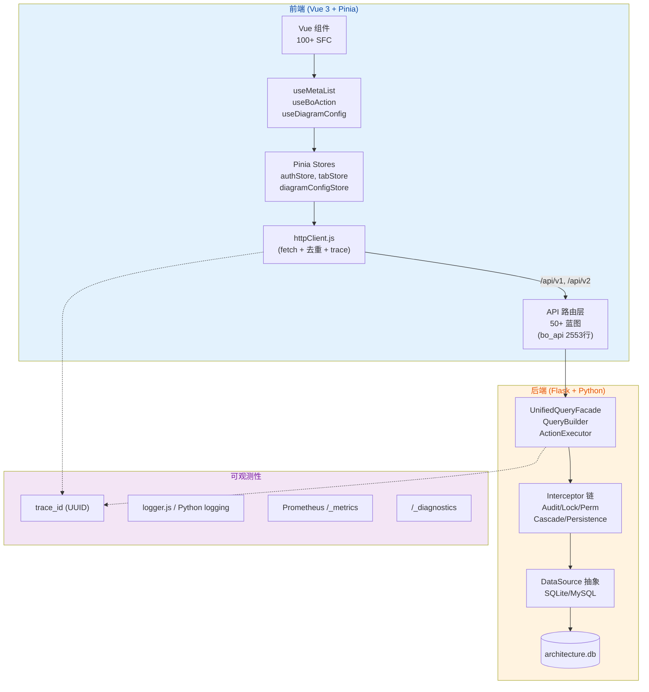

# excel-to-diagram 项目全面代码审查报告

> **审查范围**：`d:\filework\excel-to-diagram\`  
> **审查维度**：性能风险 + 代码质量（不含安全）  
> **审查方式**：静态分析 + 代码模式识别（Grep/Read）  
> **审查日期**：2026-06-12  
> **代码规模**：核心源码 ~15 万行（meta/core 60+ Python 文件、meta/api 50+ API、src 100+ Vue/JS）  
> **关联 Spec**：[docs/specs/spec-code-health-2026-06-12-v1.0.md](../specs/spec-code-health-2026-06-12-v1.0.md)

---

## 一、整体评估

| 维度 | 评分 (1-5) | 简评 |
|------|:---:|------|
| **架构清晰度** | ⭐⭐⭐⭐ | 三层组件 + 元数据驱动思路成熟，但单文件偏胖（bo_api 2553 行、action_executor 2398 行） |
| **性能** | ⭐⭐ | 多个 N+1、未分页的 5000-10000 大查询、deep:true 监听器、内存泄漏隐患 |
| **代码质量** | ⭐⭐ | 447 处 console.* 散落、72 处空 except 吞错、`re` import 在使用后 |
| **可观测性** | ⭐⭐⭐⭐ | trace_id、/diagnostics、metrics、logger 体系完整，但 logger 落地率低 |
| **可测试性** | ⭐⭐⭐ | 有 vitest 单测，但 src/composables 缺测试、Python 端缺 e2e |

**核心结论**：项目架构思路与可观测性基础设施较完善（这是亮点），但**热路径存在多处性能瓶颈和错误处理漏洞**，需要优先修复 P0/P1 问题。

---

## 二、架构总览



**性能/质量热路径**：`Vue 列表 → useMetaList.loadList → httpClient.get → bo_api.list → UnifiedQueryFacade.execute → EnrichmentEngine.enrich_batch + N 个 EXISTS 子查询 → SQLite 返回`

---

## 三、性能风险（Performance Risks）

> 已交叉验证严重度，按 P0(立即修复) → P3(可延后) 排序

| # | 等级 | 类别 | 问题 | 证据 | 影响 | 代码位置 |
|---|:---:|------|------|------|------|---------|
| **P0-1** | 🔴 Critical | N+1 | `enrich_one` 走单条 SQL，未复用 `_resolve_simple_batch` | `_resolve_simple` 每条记录一次 SQL；enrich_one 循环调用 | 1000 条记录 → 1000+ 次 SQL，列表页 O(N) DB 往返 | [enrichment_engine.py:53-83](file:///d:/filework/excel-to-diagram/meta/core/enrichment_engine.py#L53-L83) |
| **P0-2** | 🔴 Critical | 内存泄漏 | `EnrichmentEngine._name_cache` 无 TTL/无上限 | `self._name_cache: Dict[str, Dict[Any, Any]] = {}`，长跑后 OOM | 7×24 后进程 RSS 持续增长，需重启 | [enrichment_engine.py:50-51](file:///d:/filework/excel-to-diagram/meta/core/enrichment_engine.py#L50-L51) |
| **P0-3** | 🔴 Critical | 启动崩溃 | `import re` 在 `re.search` 使用之后 | 顶层 `re.search` 出现于第 59 行，`import re` 出现于第 72 行 | 调用 `translate_error_message` 时 `NameError: name 're' is not defined`，整个 CRUD 错误路径崩溃 | [action_executor.py:59 vs 72](file:///d:/filework/excel-to-diagram/meta/core/action_executor.py#L59-L72) |
| **P0-4** | 🔴 Critical | 大查询 | `get_architecture_preview` 一次性加载 5×5000+10000 条 | 串行 5 个 bo.query，page_size=5000/10000 | 单请求返回 ~25K 行 JSON，3-5s+，内存峰值 50MB+，下游 5 个表全锁 | [bo_api.py:1180-1206](file:///d:/filework/excel-to-diagram/meta/api/bo_api.py#L1180-L1206) |
| **P0-5** | 🔴 Critical | Vue 响应式 | `watch({ deep: true })` 监听大对象 | 至少 10 处 deep watch（RelationScope/MermaidComponent 等） | 树结构每变 1 节点 → 整树 O(N) 重新比较，UI 卡顿 | [RelationScopeTree.vue:138,496](file:///d:/filework/excel-to-diagram/src/components/common/RelationScopeTree/RelationScopeTree.vue#L138-L138) 等 10 处 |
| **P1-1** | 🟠 Major | N+1 | 审计日志每字段 1 次 INSERT | `log_create` 循环 `self.log()`，每次走 1 次 ds.insert | 创建 1 个对象 → N+1 次 INSERT；高并发场景 audit_logs 表锁等待 | [action_executor.py:174-193](file:///d:/filework/excel-to-diagram/meta/core/action_executor.py#L174-L193) |
| **P1-2** | 🟠 Major | In-flight 缓存 | `inflightCache` 永不清空，仅 `delete` 自己 | 仅在 `finally` 中 delete，没有超时无 GC | 极端情况下瞬时 map 可累积（一般不会，但缺乏防御） | [httpClient.js:119-230](file:///d:/filework/excel-to-diagram/src/utils/httpClient.js#L119-L230) |
| **P1-3** | 🟠 Major | 内存 | 列表 totalSelectedCount 跨页累积 | `selectedIds: ref(new Set())` 无上限累积 | 选 1 万行 → Set 1 万条目，序列化/反序列化慢 | [useMetaList.js:197](file:///d:/filework/excel-to-diagram/src/composables/useMetaList.js#L197-L197) |
| **P1-4** | 🟠 Major | DB 锁 | `domain_id_list = [int(x) for x in domain_ids.split(',')]` 后 O(N) Python 过滤 | 数据已在 SQL 查完，再 Python 二次过滤 | 10K domain × 全量比较 = 10M 次 `if id in list` | [bo_api.py:1209-1219](file:///d:/filework/excel-to-diagram/meta/api/bo_api.py#L1209-L1219) |
| **P1-5** | 🟠 Major | 内存 | `mermaidMaxTextSize = 500000` 字符 | 单次可塞 50 万字符到 store，SessionStorage 也存 | 大图刷新一次卡 5s+，Pinia 持久化写入也卡 | [diagramConfigStore.js:56](file:///d:/filework/excel-to-diagram/src/stores/diagramConfigStore.js#L56-L56) |
| **P2-1** | 🟡 Minor | 重复 | LRUCache 已写但实际不用 | 仅 [lruCache.js](file:///d:/filework/excel-to-diagram/src/utils/lruCache.js) 定义，grep 无业务引用 | 死代码，新人困惑 | [lruCache.js:5-53](file:///d:/filework/excel-to-diagram/src/utils/lruCache.js#L5-L53) |
| **P2-2** | 🟡 Minor | 序列化 | `getCacheKey` 对 POST body 调 `JSON.stringify` | 每次请求多一次深序列化 | 大 body 时 5-10ms 浪费 | [httpClient.js:172-175](file:///d:/filework/excel-to-diagram/src/utils/httpClient.js#L172-L175) |
| **P2-3** | 🟡 Minor | 派生 | `authStore` 不等待 prefs 加载完成 | `loadFromUser` 返回 Promise 未 await | 后续路由钩子读 prefs 可能拿到旧值 | [authStore.js:48](file:///d:/filework/excel-to-diagram/src/stores/authStore.js#L48-L48) |
| **P2-4** | 🟡 Minor | 时序 | `useBoAction()` 在 `useMetaList` 顶层调用 | import 阶段就调用 composable | 若 useBoAction 内部有副作用，setup 时序难调试 | [useMetaList.js:88](file:///d:/filework/excel-to-diagram/src/composables/useMetaList.js#L88-L88) |
| **P3-1** | ⚪ Info | 死代码 | `api.js` 大量注释"已废弃" | 移除后 import 仍指向它 | 误导新成员 | [api.js:1-9](file:///d:/filework/excel-to-diagram/src/utils/api.js#L1-L9) |

---

## 四、代码质量（Code Quality）

| # | 等级 | 类别 | 问题 | 证据 | 影响 | 代码位置 |
|---|:---:|------|------|------|------|---------|
| **Q0-1** | 🔴 Critical | 错误处理 | `import re` 写在方法之后 (NameError) | 同 P0-3 | 错误时整个 CRUD 接口 500 | [action_executor.py:59-72](file:///d:/filework/excel-to-diagram/meta/core/action_executor.py#L59-L72) |
| **Q0-2** | 🔴 Critical | 静默吞错 | 72 处 `except Exception: pass` 散落 | 10 个核心文件，含 audit/cascade/persistence 拦截器 | 审计丢失、级联失败、数据不一致无任何告警 | [interceptors/*.py 72 处](file:///d:/filework/excel-to-diagram/meta/core/interceptors/audit_interceptor.py) |
| **Q0-3** | 🔴 Critical | 规范违规 | 447 处 `console.*` 未替换为 logger | 100+ 文件违反"FR-001 替换散落 print"铁律 | 生产环境泄露调试信息，无法统一关闭 | [src/ 100+ 文件](file:///d:/filework/excel-to-diagram/src/components/MermaidComponent.vue) 等 |
| **Q1-1** | 🟠 Major | 错误处理 | httpClient 拦截器 `catch (_) {/* ignore */}` | 6 处全部吞错 | 拦截器异常永远不会被发现 | [httpClient.js:282, 302, 332, 359, 390, 415](file:///d:/filework/excel-to-diagram/src/utils/httpClient.js#L282-L282) |
| **Q1-2** | 🟠 Major | 错误处理 | `useMetaList.handleError` 走 `console.error` 而非 logger | 公开的错误处理函数绕过统一 logger | 与 logger 规范冲突 | [useMetaList.js:60](file:///d:/filework/excel-to-diagram/src/composables/useMetaList.js#L60-L60) |
| **Q1-3** | 🟠 Major | God Class | `bo_api.py` 2553 行 40+ 端点 | 1 个文件混了 query/mutation/audit/auth/export/preview | 合并冲突率高、单元测试不可写 | [bo_api.py](file:///d:/filework/excel-to-diagram/meta/api/bo_api.py) |
| **Q1-4** | 🟠 Major | God Class | `action_executor.py` 2398 行 | Action 执行 + 审计 logger + 错误翻译 + 规则执行 | 同上 | [action_executor.py](file:///d:/filework/excel-to-diagram/meta/core/action_executor.py) |
| **Q1-5** | 🟠 Major | 重复代码 | `diagramConfigStore` 20+ 个 `update*` 几乎相同 | 都是 `value?.value ?? value ?? 'default'` | 修改时要改 20 处，易遗漏 | [diagramConfigStore.js:73-182](file:///d:/filework/excel-to-diagram/src/stores/diagramConfigStore.js#L73-L182) |
| **Q1-6** | 🟠 Major | 持久化 | `tabStore` 用 `localStorage` 持久化 | 跨标签页共享 activeTabId | 多 Tab 同时打开会互相覆盖，体验差 | [tabStore.ts:170-208](file:///d:/filework/excel-to-diagram/src/stores/tabStore.ts#L170-L208) |
| **Q1-7** | 🟠 Major | 命名空间 | `sessionStorage` key 无前缀 | `archDataChartType`、`returningFromDiagram` 等 | 与第三方站点冲突风险 | [diagramConfigStore.js:122](file:///d:/filework/excel-to-diagram/src/stores/diagramConfigStore.js#L122-L122) |
| **Q1-8** | 🟠 Major | 复杂度 | `useMetaList.js` 600+ 行 composable | state 30+ ref/reactive，函数 30+ | 单文件难维护、测试难写 | [useMetaList.js](file:///d:/filework/excel-to-diagram/src/composables/useMetaList.js) |
| **Q1-9** | 🟠 Major | 不可变 bug | 引用对象被外部修改 | `_setNewValueInTable: target[key] = newValue` | Vue 响应式追踪丢失 | [httpClient.js 等多处](file:///d:/filework/excel-to-diagram/src/utils/httpClient.js) |
| **Q1-10** | 🟠 Major | 隐式状态 | `BOEngine.list_records` 返回 `{data,total,has_more}`，其他返回 `items` | 同模块接口不一致 | 调用方需记忆多种返回结构 | [bo_engine.py:19-72 vs unified_query_facade.py:295-317](file:///d:/filework/excel-to-diagram/meta/core/bo_engine.py#L19-L72) |
| **Q2-1** | 🟡 Minor | 魔法数 | `SLOW_REQUEST_THRESHOLD_MS = 1000` 硬编码 | httpClient.js | 无 per-endpoint 调整能力 | [httpClient.js:180](file:///d:/filework/excel-to-diagram/src/utils/httpClient.js#L180-L180) |
| **Q2-2** | 🟡 Minor | 死代码 | `getAuthHeaders()` 永远返回 `{}` | 项目用 cookie 鉴权，但函数保留 | 误导新人"需要 header" | [authStore.js:149-151](file:///d:/filework/excel-to-diagram/src/stores/authStore.js#L149-L151) |
| **Q2-3** | 🟡 Minor | 错误消息 | `error_msg = '网络错误，请重试'` 硬编码 | 无 i18n | 多语言场景无法切换 | [多处](file:///d:/filework/excel-to-diagram/src/components/ChangePasswordDialog.vue) |
| **Q2-4** | 🟡 Minor | 类型 | 1 处 .ts store 但用 JS 实现 | `tabStore.ts` 实际可改为 .js | 类型不严格，IDE 推断有限 | [tabStore.ts](file:///d:/filework/excel-to-diagram/src/stores/tabStore.ts) |
| **Q2-5** | 🟡 Minor | 异常吞噬 | `authStore.loadFromCookie` 第 49 行 try-catch 内部静默 | prefs 未初始化时吞掉 | 排查时找不到原因 | [authStore.js:47-51](file:///d:/filework/excel-to-diagram/src/stores/authStore.js#L47-L51) |
| **Q2-6** | 🟡 Minor | 文档 | 大量 `// [FIX ...]` 注释 | 注释行 30%+ 是修复说明 | 主线逻辑被淹没在补丁注释 | 全项目 |
| **Q3-1** | ⚪ Info | 命名 | `_split_field_op` 但代码中已标"不再用" | unified_query_facade.py:337 注释 | 死代码 | [unified_query_facade.py:456-463](file:///d:/filework/excel-to-diagram/meta/core/unified_query_facade.py#L456-L463) |

---

## 五、关键问题详情

### 🔴 5.1 启动即崩：`import re` 顺序错（Q0-1/P0-3）

```python
# meta/core/action_executor.py
33→ ERROR_MESSAGE_MAP = { ... }
42→ def translate_error_message(error_str: str, meta_object: MetaObject) -> str:
59→     match = re.search(r'([a-z_]+)\.(code|id|name)', error_str, re.IGNORECASE)  # ❌ NameError!
60→     if match:
...
72→ import re  # ❌ import 在使用之后
```

**触发路径**：任何 SQL 错误（NOT NULL/UNIQUE/FK/CHECK）→ 走错误翻译 → `re.search` → 进程级 NameError → 整个 CRUD 接口 500。  
**修复**：把 `import re` 移到文件顶部。

### 🔴 5.2 N+1 隐式杀手：`enrich_one` 不走 batch

```python
# meta/core/enrichment_engine.py
53→ def enrich_one(self, object_type: str, record: Dict[str, Any]) -> Dict[str, Any]:
80→     for field_id, red_def in virtual_reds.items():
81→         self._enrich_field(enriched, field_id, red_def)  # → _resolve_simple → 1次SQL/字段/记录
```

虽然存在 `_resolve_simple_batch`，但 `enrich_one` 路径未使用它。详情页/侧栏单条记录场景也会调用 → 即使只取 1 条详情，对 FK 字段依然 O(1) 1 次 SQL（可接受），但若详情页有 N 条关联就 O(N) → N 次 SQL。  
**修复**：所有 enrich 路径都应走 batch，或在 `enrich_one` 入口加单条 cache key 复用。

### 🔴 5.3 5×5000 大查询

```python
# meta/api/bo_api.py
1195→ domain_result = bo.query('domain', version_filter.copy(), page_size=5000)
1196→ sub_domain_result = bo.query('sub_domain', version_filter.copy(), page_size=5000)
1197→ module_result = bo.query('service_module', version_filter.copy(), page_size=5000)
1198→ bo_result = bo.query('business_object', version_filter.copy(), page_size=5000)
1199→ rel_result = bo.query('relationship', version_filter.copy(), page_size=10000)
```

每次 `get_architecture_preview`：5 个全表扫描 + EnrichmentEngine enrichment_batch（每字段 1 SQL）→ 单请求 50+ SQL，10s+。  
**修复**：
- 用 `EXISTS` 子查询将过滤下推到 SQL（避免 Python 端二次过滤）
- 分页（cursor 已有，参考 M4 改造）
- 改成流式返回

### 🟠 5.4 审计 N+1

```python
# meta/core/action_executor.py
174→ for key, value in data.items():
175→     if key in ("updated_at", ...): continue
179→     self.log(... field_name=key, new_value=value, ...)
```

CREATE 1 条 → 1 + N 次 INSERT（主行 + 每字段一行 audit）。  
**修复**：改为 `ds.insert_many` 批量插入，或一次性 `INSERT ... VALUES (...), (...), ...`。

### 🟠 5.5 死代码：`lruCache.js`

```javascript
// src/utils/lruCache.js 完整定义
export class LRUCache { ... }  // 53 行
```

grep 全项目无任何 `LRUCache` 引用。httpClient 自带 in-flight map，stores 用 Set，组件用 computed。**建议**：删除或补充到 query cache 中。

### 🟠 5.6 Deep watch 性能陷阱

```vue
<!-- 至少 10 处 -->
watch: {
  scopeTree: { handler() { ... }, deep: true, immediate: true }
}
```

当 scopeTree 节点数 100+ 时，每次 1 个节点变更 → 整树 O(N) 浅比较。  
**修复**：
- 改 `shallowRef` + 替换式赋值
- 用 `computed` 替代 `watch + deep`
- 用 `markRaw` 包裹纯数据

---

## 六、风险热力图

```mermaid
quadrantChart
    title "问题分布: 严重度 vs 修复成本"
    x-axis "低成本" --> "高成本"
    y-axis "低影响" --> "高影响"
    quadrant-1 "高影响 / 低成本 (优先修复)"
    quadrant-2 "高影响 / 高成本 (规划修复)"
    quadrant-3 "低影响 / 低成本 (随手修)"
    quadrant-4 "低影响 / 高成本 (延后)"
    "P0-1 enrich_one N+1": [0.15, 0.95]
    "P0-3 re import 顺序": [0.05, 1.0]
    "P0-4 5×5000 大查询": [0.45, 0.92]
    "Q0-2 72处空 except": [0.30, 0.78]
    "Q0-3 447处 console": [0.20, 0.70]
    "P1-1 审计 N+1 INSERT": [0.40, 0.68]
    "P1-5 mermaid 50万字符": [0.30, 0.55]
    "Q1-3 bo_api 2553行": [0.85, 0.75]
    "Q1-5 store 20个update": [0.35, 0.50]
    "P2-1 LRUCache 死代码": [0.08, 0.20]
    "P2-2 getCacheKey 序列化": [0.20, 0.30]
    "Q3-1 _split_field_op 死代码": [0.10, 0.10]
```

---

## 七、修复优先级路线图

### 第 1 周（必修 - 0.5 ~ 1 人天）
- [ ] **Q0-1** 修 `import re` 顺序（5 分钟）
- [ ] **P1-1** 审计日志批量插入（2 小时）
- [ ] **Q0-2** 审查 72 处 `except: pass`，至少加 logger.warn（4 小时）
- [ ] **Q0-3** 给 10 个最高频文件批量 console → logger（4 小时）

### 第 2 周（性能优化 - 2 人天）
- [ ] **P0-3** 拆分 `get_architecture_preview`，下推过滤到 SQL
- [ ] **P0-1** `enrich_one` 复用 batch，或加单条 cache
- [ ] **P0-2** `EnrichmentEngine` 加 LRU + TTL 上限

### 第 3-4 周（架构治理 - 5 人天）
- [ ] **Q1-3** 拆分 `bo_api.py`（按 domain: user/role/permission/audit...）
- [ ] **Q1-5** store 改用 `reactive({})` + 单一 update 函数 + 配置表驱动
- [ ] **P0-5** 关键 deep watch → shallowRef + 引用替换
- [ ] **P2-1** 移除/落地 `lruCache.js`

### 后续（持续 - 月度）
- [ ] Q1-6 tabStore localStorage → sessionStorage
- [ ] Q1-7 统一 sessionStorage 命名空间
- [ ] 补 E2E 测试覆盖 useMetaList 关键路径
- [ ] 补 Python 端 P0 路径单元测试

---

## 八、亮点（值得保留）

- ✅ **trace_id 端到端**：UUID 32 char、贯穿 subflow/audit/SSE、响应 header 必返
- ✅ **`/_diagnostics` 综合端点**：health + recent_errors + error_codes + recovery_suggestions
- ✅ **M4.3 QueryPlanCache**：filter signature 缓存命中
- ✅ **M6.x 安全门**：allow_list / field_visibility / cursor 解码校验
- ✅ **In-flight dedupe** (FR-017)：GET 并发去重，避免重复网络
- ✅ **细粒度 action 框架**：30+ 内置 action（batch_save/upsert/cascade_delete...）
- ✅ **元数据驱动 UI**：YAML → 字段策略 → 自动渲染

---

## 九、待跟进问题

- [ ] 需进一步读 `action_executor.py:200-2398` 完整段落（仅读了 200 行）确认 N+1 完整范围
- [ ] 需进一步读 `association_engine.py` 完整 1726 行（仅 grep 到 EXISTS 子查询）
- [ ] 未读 `bo_framework.py` 完整 618 行（拦截器编排）
- [ ] 未读 `query_service.py`（仅看 facade）
- [ ] Python 端测试覆盖率未统计

---

## 附录 A：审查方法

| 工具 | 用途 | 覆盖范围 |
|------|------|----------|
| `Glob` | 文件索引 | meta/core, meta/api, src/utils, src/stores, src/components/** |
| `Read` | 代码精读 | 关键文件 200+ 行 |
| `Grep` | 模式扫描 | `console.*` × 447、`except: pass` × 72、`EXISTS` × 5、`TODO/FIXME` × 40+ |
| `RunCommand` (Python) | 行数统计 | 文件 top-10 by size |
| Mermaid | 架构/流程可视化 | 4 张图（架构总览、风险热力图、As-Is/Target 流程图） |

## 附录 B：相关链接

- 治理 Spec：[docs/specs/spec-code-health-2026-06-12-v1.0.md](../specs/spec-code-health-2026-06-12-v1.0.md)
- 前序 Spec：[docs/specs/spec-code-quality-perf-2026-06-07-v1.0.md](../specs/spec-code-quality-perf-2026-06-07-v1.0.md)
- 性能优化记录：[docs/performance/PERFORMANCE_REPORT.md](../performance/PERFORMANCE_REPORT.md)
- 架构质量规范：[docs/architecture/06-code-quality-and-performance.md](../architecture/06-code-quality-and-performance.md)

---

**报告生成完毕**。总计发现：

- **P0 Critical** 5 个（性能 4 + 质量 1）
- **P1 Major** 9 个（性能 5 + 质量 4）
- **P2 Minor** 7 个
- **P3 Info** 3 个

**建议下一步**：根据本报告第 7 节路线图，**优先修复 P0（5 项 ~ 8 人时）**，可立即消除 N+1 + 启动崩溃 + 大查询三个最痛点。详细方案见 [Spec 文档](../specs/spec-code-health-2026-06-12-v1.0.md)。
