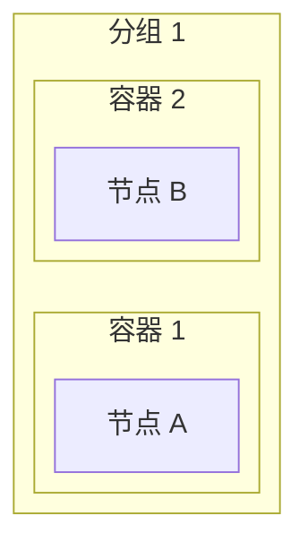

# ELK 布局引擎嵌套分组问题排查记录

## 问题描述
ELK 布局引擎下，分组嵌套（subgraph 内嵌套 subgraph）无法正常显示，而 Dagre 引擎正常工作。

## 根本原因
发现**两个关键问题**：

### 1. 容器 ID 冲突
**问题**：多个分组使用相同的容器 ID（如 `C1`, `C2`），导致 ID 冲突。

**错误日志**：
```
Error: Cannot read properties of undefined (reading 'posX')
Syntax error in text mermaid version 11.13.0
```

**原因**：代码中使用 `C${index + 1}` 作为容器 ID，当有多个分组时，每个分组都从 `C1` 开始编号，导致 ID 冲突。

**解决方案**：使用全局唯一的容器 ID，格式为 `G${groupIndex}_C${containerIndex}`：
```javascript
// 修复前
const containerId = `C${idx + 1}`

// 修复后
const groupIndex = index + 1  // 全局分组索引（从 1 开始）
const containerId = `G${groupIndex}_C${idx + 1}`
```

### 2. 嵌套层级索引问题
**问题**：`depth + 1` 作为 groupIndex 对所有顶级分组都返回 1。

**原因**：`depth` 只对嵌套子分组递增，顶级分组的 depth 都是 0。

**解决方案**：使用全局分组索引，在 `generateGroupedLayout` 调用时传入：
```javascript
// 反转分组顺序：Mermaid 渲染时后定义的元素出现在布局的前面位置（上/左）
const reversedGroups = [...groups].reverse()

reversedGroups.forEach((group, index) => {
  const groupIndex = index + 1  // 使用数组索引作为全局分组索引
  const result = generateGroupCode(group, containers, nodeMap, definedNodes, 0, groupIndex)
  // ...
})
```

## ELK 配置要点

### 关键配置
```javascript
mermaid.initialize({
  startOnLoad: false,
  layout: 'elk',
  elk: {
    'elk.spacing.nodeNode': 80,
    'elk.layered.spacing.nodeNodeBetweenLayers': 150,
    'elk.padding': '[30, 30, 30, 30]',
    'elk.hierarchyHandling': 'INCLUDE_CHILDREN',  // 关键：支持嵌套结构
  },
  flowchart: {
    htmlLabels: true,
    useMaxWidth: false,
    rankdir: 'LR'
  }
})
```

### ELK 模块加载
```javascript
import elkLayouts from '@mermaid-js/layout-elk'
mermaid.registerLayoutLoaders(elkLayouts)
```

## 正确的嵌套语法

### 父级声明子级 ID（推荐）
```mermaid
flowchart-elk TB
  subgraph G1["分组 1"]
    direction TB
    C1    %% 先声明子容器 ID
    C2    %% 先声明子容器 ID
    subgraph C1["容器 1"]
      direction LR
      A["节点 A"]
    end
    subgraph C2["容器 2"]
      direction LR
      B["节点 B"]
    end
  end
  A --> B
```

### 直接嵌套（官方测试使用）


## 排查方法

### 1. 创建独立测试文件验证语法
```javascript
// 使用 mermaid.render() 直接测试生成的代码
const result = await mermaid.render('test-svg', generatedCode)
container.innerHTML = result.svg
```

### 2. 检查日志中的代码预览
```javascript
console.log('ELK mermaid code preview:', mermaidCode.substring(0, 800))
console.log('ELK mermaid code suffix:', mermaidCode.substring(mermaidCode.length - 300))
```

### 3. 常见错误
- `Cannot read properties of null (reading 'getBoundingClientRect')` - DOM 元素未准备好或代码语法错误
- `Cannot read properties of undefined (reading 'posX')` - ID 冲突
- `Syntax error in text mermaid` - 代码格式错误

## 相关文件
- `src/composables/useMermaid/layouts/groupedLayout.js` - 分组布局代码生成
- `src/composables/useMermaid/config/useMermaidConfig.js` - ELK 配置
- `src/components/MermaidComponent.vue` - 渲染组件

## 重要发现

### 内部连线不影响容器内其他节点的均匀布局

**测试场景**：在 ELK 嵌套分离容器测试中，容器C（无外部连线）内部增加了 A2→A3 的内部连线。

**测试结果**：
- ✅ 容器C的 `direction TB` 方向设置被正确尊重
- ✅ 容器C内其他节点（A4-A11, A13-A18）仍然保持均匀网格布局
- ✅ A2 和 A3 之间的连线不影响整体布局的均匀性

**结论**：
- 容器内部的节点间连线（内部连线）**不会破坏**容器的 direction 设置
- 内部连线**不会干扰**容器内其他节点的均匀布局
- 这与 "外部连线导致容器 direction 失效" 是不同的行为

**代码示例**：
```mermaid
flowchart-elk TB
  subgraph C["容器C (有内部连线_无外部连线)"]
    direction TB
    A2["A2"]
    A3["A3"]
    A4["A4"]
    ...
    A18["A18"]
    A2 --> A3  %% 内部连线：不影响其他节点均匀布局
  end
```

## 2024-最新发现：后处理导致容器重叠问题

### 问题现象
测试发现：ELK 原生布局正常，但实际应用中容器出现重叠和间距为0的问题。

### 根本原因
**`fixContainerTitlePosition` 函数**增加了每个容器 rect 的高度 30px，但没有同步调整：
1. 同级容器之间的间距
2. 父容器的边界

```javascript
// 问题代码
const fixContainerTitlePosition = (svgEl) => {
  const titlePadding = 30

  allContainers.forEach((container) => {
    const rect = container.querySelector('rect')
    const currentH = parseFloat(rect.getAttribute('height')) || 0
    const newHeight = currentH + titlePadding
    rect.setAttribute('height', newHeight.toFixed(2))
    // ❌ 没有调整同级容器之间的间距
    // ❌ 没有扩展父容器的边界
  })
}
```

### 验证方法
通过测试文件 `test-elk-spacing-validation.html` 对比：
- **无后处理**：ELK 原生布局正常，无重叠
- **有后处理**（启用 fixContainerTitlePosition）：出现容器重叠和间距为0

### 解决方案
**方案1（已执行）**：移除 `fixContainerTitlePosition` 调用

在 `useSvgProcessor.js` 中注释掉该调用：
```javascript
// 修改前
fixContainerTitleY(svgEl)
fixContainerTitlePosition(svgEl)  // ⚠️ 问题根源
fixElkContainerBounds(...)

// 修改后
fixContainerTitleY(svgEl)
// fixContainerTitlePosition(svgEl) // 方案1：移除，ELK原生布局无间距问题
fixElkContainerBounds(...)
```

### 核心原则
**ELK 原生布局引擎本身没有问题，不需要通过 SVG 后处理来"修复"布局参数。**
- 如果布局有问题，应该调整 ELK 配置参数
- 而不是通过后处理来强行修改 SVG 元素

### 违反原则的后处理函数
| 函数 | 问题 | 状态 |
|------|------|------|
| `fixContainerTitlePosition` | 无条件增加容器高度 30px，但不调整间距和父容器边界 | ⚠️ **已移除** |
| `fixElkContainerBounds` | 有条件修复：只在间距 < minGap 时才调整 | ✅ 可保留 |

### 原则总结
1. **ELK 原生布局引擎本身没问题**，不需要通过 SVG 后处理来"修复"布局参数
2. 如果布局有问题，应该调整 **ELK 配置参数**，而不是通过后处理强行修改 SVG
3. 后处理函数应该是**有条件修复**（如 fixElkContainerBounds），而不是**无条件修改**（如 fixContainerTitlePosition）

## 2024-发现：Mermaid + ELK 子图 direction 限制

### 问题描述
业务对象图中，小容器在水平方向上出现重叠或间距不足。

### 根本原因：Mermaid + ELK 的架构限制

**官方确认的行为**（GitHub Issues #5864, #6438, #6785, #6271）：
> 当子图(subgraph)内的节点有**外部连线**时，子图的 `direction` 设置会被**忽略**，子图会继承父图的方向。

### 影响
| 场景 | 预期行为 | 实际行为 |
|------|----------|----------|
| 容器设置 `direction TB` | 容器内节点垂直排列 | ❌ 继承父图方向 |
| 容器设置 `direction LR` | 容器内节点水平排列 | ❌ 继承父图方向 |
| 分组下多个容器 | 按 direction 排列 | ❌ 统一按父方向排列 |

### 结论
1. **容器的 direction 设置在有外部连线时无效**
2. **这是 Mermaid/ELK 的已知限制，无法通过代码修改解决**
3. **唯一有效的优化方向是调整数据/分组结构**

### 可行的优化方案
1. 减少同一层级下的容器数量
2. 调整分组结构，让每个分组下的容器数量更均衡
3. 对于节点多的容器，考虑拆分成多个小容器

### 相关文件
- `src/composables/useMermaid/layouts/groupedLayout.js` - 容器 direction 设置（已添加注释说明限制）
- `src/composables/useMermaid/config/useMermaidConfig.js` - ELK 配置

## 2024-发现：COFFMAN_GRAHAM layerBound 与"倒三角"问题

### 问题描述
业务对象图中，整体布局偏向"倒三角"——第一层（最上层）塞满了10个容器，底下各层节点逐渐减少。

### 尝试的解决方案

尝试使用 COFFMAN_GRAHAM 分层策略 + layerBound 参数来限制每层最大节点数：

```javascript
'elk.layered.nodeLayering.strategy': 'COFFMAN_GRAHAM',
'elk.layered.coffmanGraham.layerBound': 6,  // 每层最多6个直接子节点（容器）
```

### 失败原因

**Mermaid 只暴露了部分 ELK 配置选项**，不支持 COFFMAN_GRAHAM 的 layerBound 参数。

Mermaid 直接支持的 ELK 选项（`elkConfig.elk`）：
```javascript
{
  mergeEdges: boolean,
  nodePlacementStrategy: "SIMPLE" | "NETWORK_SIMPLEX" | "LINEAR_SEGMENTS" | "BRANDES_KOEPF",
  cycleBreakingStrategy: "GREEDY" | "DEPTH_FIRST" | "INTERACTIVE" | "MODEL_ORDER" | "GREEDY_MODEL_ORDER",
  forceNodeModelOrder: boolean,
  considerModelOrder: "NONE" | "NODES_AND_EDGES" | "PREFER_EDGES" | "PREFER_NODES"
}
```

不支持的选项：
- `coffmanGraham.layerBound` ❌
- `nodeLayering.strategy: COFFMAN_GRAHAM` ❌

### "倒三角"的根本原因

第一层有10个容器是因为：**这些容器内的节点都是"源节点"（没有入边，只有出边）**。

ELK 的分层算法会将所有"源节点"放到第一层，这是符合算法预期的行为。

### 结论

1. **Mermaid 不支持 COFFMAN_GRAHAM layerBound**，无法通过配置限制每层节点数
2. **"倒三角"是由业务数据的连线结构决定的**，不是配置问题
3. **唯一可行的解决方案是调整数据结构**：
   - 减少源节点数量（给某些节点添加入边）
   - 拆分大容器
   - 或者接受现状

### 相关文件
- `src/composables/useMermaid/config/useMermaidConfig.js` - ELK 配置（已移除无效的 COFFMAN_GRAHAM 配置）

## 参考
- Mermaid ELK Schema: https://mermaid.js.org/config/schema-docs/config-properties-elk.html
- GitHub Issue #6027, #1305, #4291
- ELK Layered Options: https://eclipse.dev/elk/reference/options.html
