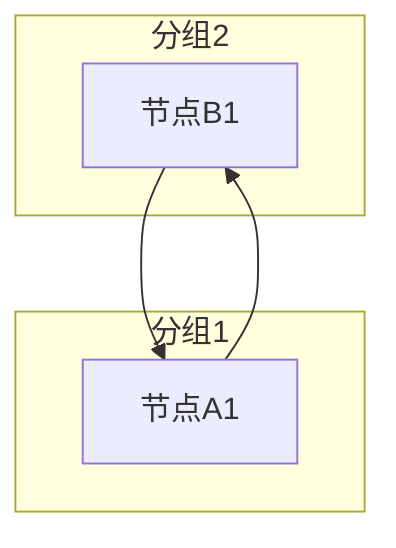
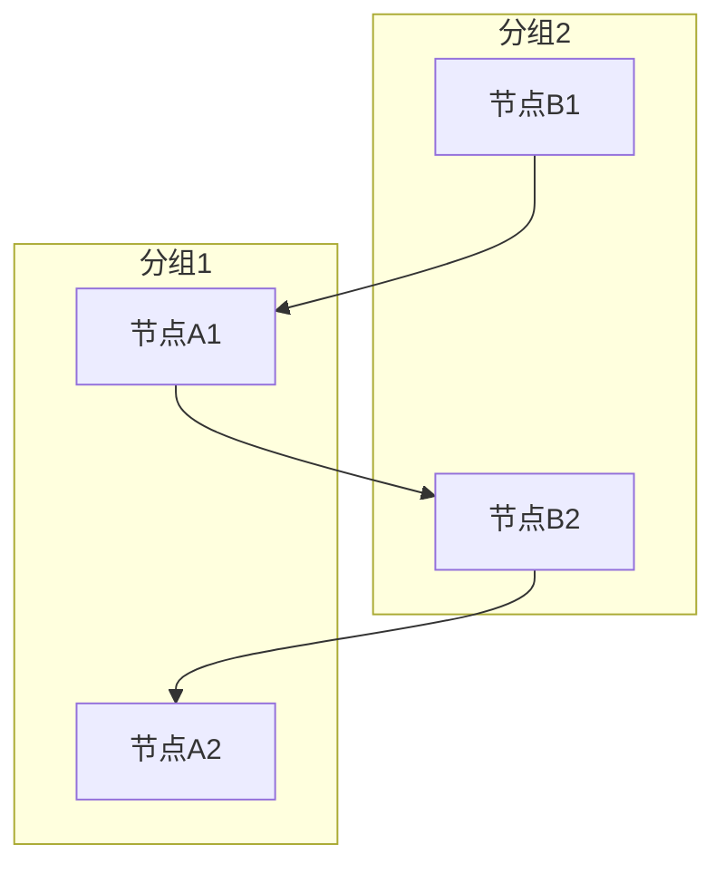
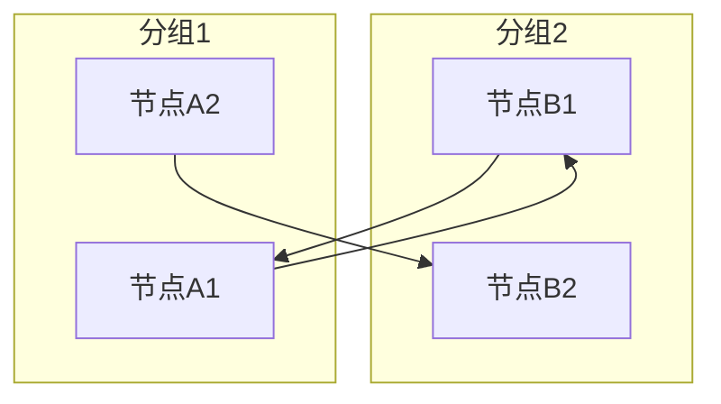
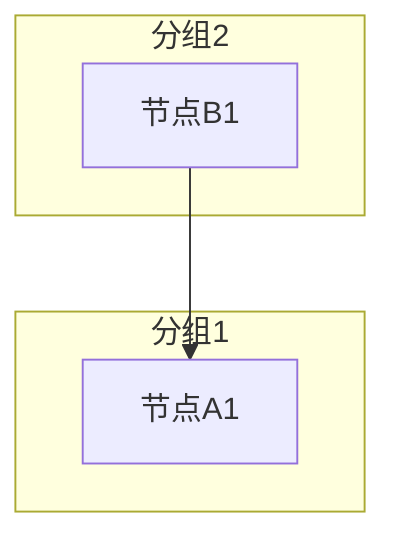
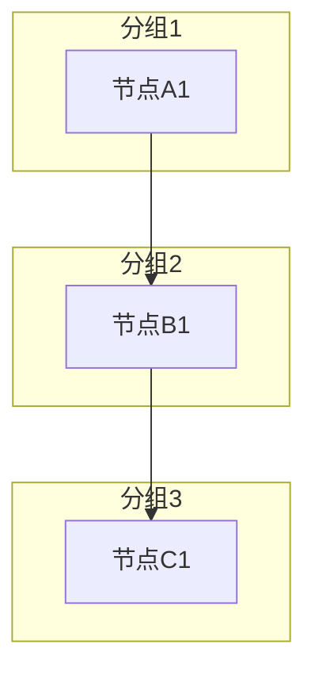
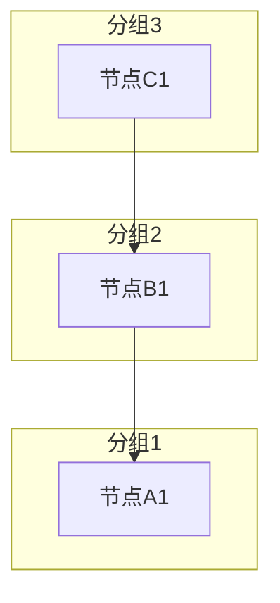

# Mermaid 分组布局与连线关系研究

## 研究背景

在使用 Mermaid.js 绘制分组布局时，发现分组顺序与预期不符。经过深入测试，发现连线方向对分组布局有重要影响。

## 测试结果

### 场景1：同一对节点双向连线

**测试代码：**


**结果：** 都是分组2在上，分组1在下

**结论：** 双向连线时，连线定义顺序不影响布局。分组定义顺序起作用（分组2先定义，所以在上）

---

### 场景2：多个连线（不同方向）

**测试2.1：** 2条G2→G1，1条G1→G2


**结果：** 分组1在左（偏下一点），分组2在右（偏上一点）

**测试2.2：** 1条G2→G1，2条G1→G2


**结果：** 分组1在左，分组2在右

**关键发现：** 两种情况结果相同！**连线数量不是决定因素**

---

### 场景3：连线定义顺序的影响

**测试3.1：** 连线定义在分组之前


**结果：** 分组2在上，分组1在下

**测试3.2：** 连线定义在分组之后


**结果：** 分组2在上，分组1在下

**结论：** 连线定义在分组前还是分组后，对布局没有影响

---

### 场景4：三个分组的情况

**测试4.1：** 顺序连线（分组1→分组2→分组3）


**结果：** 从上到下：分组1, 2, 3

**测试4.2：** 反向连线（分组3→分组2→分组1）


**结果：** 从上到下：分组3, 2, 1

**结论：** 连线方向决定了分组顺序，源头分组在上

---

## 核心发现

### 发现1：连线方向是主要因素

```
单向连线：源头分组在上/左
- A→B：A在上/左，B在下/右
- B→A：B在上/左，A在下/右
```

### 发现2：双向连线的特殊情况

```
双向连线：分组定义顺序起作用
- A→B 和 B→A 同时存在时
- 后定义的分组在上（分组2在上）
```

### 发现3：多条连线的复杂情况

```
场景2的结果很特殊：
- 2.1：2条G2→G1，1条G1→G2 → 分组1在左
- 2.2：1条G2→G1，2条G1→G2 → 分组1在左

两种情况结果相同，说明：
1. 连线数量不是决定因素
2. 只要存在G1→G2的连线，分组1就会在左
```

### 发现4：分组定义顺序的作用

```
无连线或双向连线时：分组定义顺序决定布局
- 后定义的分组在上/左

有单向连线时：连线方向决定布局
- 源头分组在上/左
```

---

## Mermaid 布局算法推测

根据测试结果，推测 Mermaid 的布局算法如下：

1. **分析连线关系**：统计每个分组到其他分组的连线
2. **确定分组层级**：根据连线方向确定分组的层级关系
3. **处理特殊情况**：
   - 双向连线：使用分组定义顺序
   - 多条连线：优先考虑连线方向，而非数量
4. **生成布局**：根据层级关系和分组定义顺序生成最终布局

---

## 对当前项目的影响

### 问题描述

用户反馈：服务模块图中，分组2中容器节点有连线到分组1中容器中的节点，导致分组顺序与预期不符。

### 问题分析

根据测试结果：
- 如果只有G2→G1的连线：分组2会在上/左
- 如果同时有G1→G2的连线：分组定义顺序起作用
- 如果有多条不同方向的连线：布局会更复杂

---

## 可能的解决方案

### 方案1：接受 Mermaid 的自动布局（推荐）

**优点：**
- 简单，不改变业务逻辑
- 连线方向有业务意义，不应该改变

**缺点：**
- 用户无法完全控制分组顺序

**适用场景：**
- 连线方向有业务意义，不应该改变

---

### 方案2：添加虚拟连线

**方法：**
- 添加从分组1到分组2的虚拟连线

**优点：**
- 可以控制分组顺序

**缺点：**
- 可能影响布局美观
- 需要隐藏虚拟连线

**适用场景：**
- 用户需要严格控制分组顺序

---

### 方案3：使用其他布局引擎

**方法：**
- 使用 elk 布局引擎

**优点：**
- 可能有更好的分组顺序控制

**缺点：**
- 需要测试 elk 的行为

**适用场景：**
- dagre 无法满足需求时

---

### 方案4：调整分组定义顺序

**方法：**
- 根据连线方向调整分组定义顺序

**问题：**
- 从测试结果看，分组定义顺序在有单向连线时不起作用

---

## 建议

基于测试结果，建议：

1. **优先接受 Mermaid 的自动布局**：连线方向是业务逻辑的一部分，不应该为了布局而改变
2. **如果用户需要控制分组顺序**：可以考虑添加虚拟连线，但需要进一步测试
3. **提供用户选择**：让用户选择是否接受自动布局，或者手动调整分组顺序

---

## 测试文件

- [test-link-impact.html](./test-link-impact.html) - 基础连线影响测试
- [test-link-comprehensive.html](./test-link-comprehensive.html) - 全面连线影响测试
- [test-link-order.html](./test-link-order.html) - 连线定义顺序测试

---

## 相关代码文件

- [groupedLayout.js](./src/composables/useMermaid/layouts/groupedLayout.js) - 分组布局生成逻辑
- [useServiceModuleSyntax.js](./src/composables/useMermaid/syntax/useServiceModuleSyntax.js) - 服务模块图语法生成

---

## 记录日期

2026-03-29
