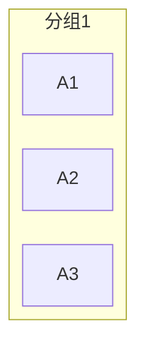
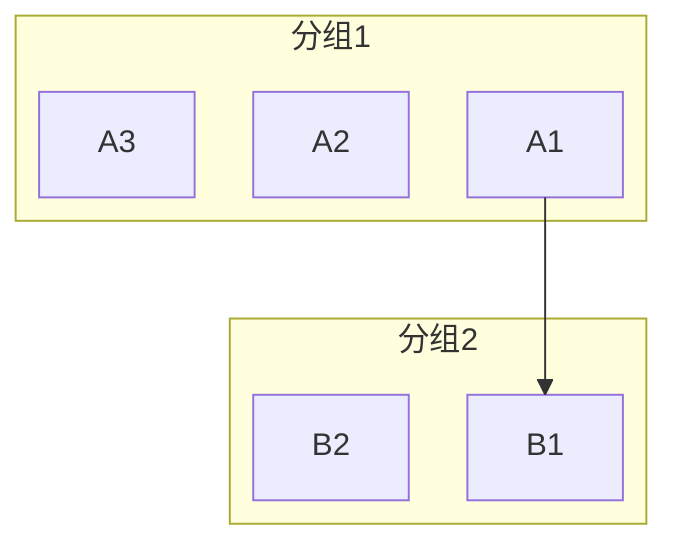
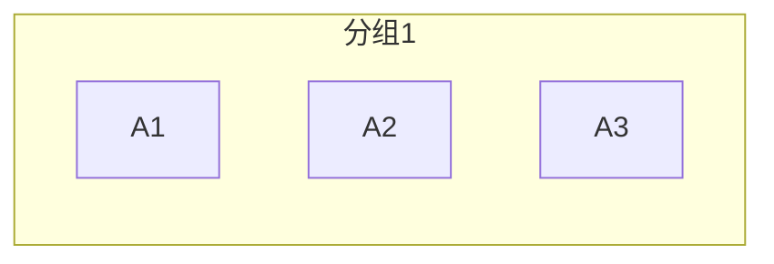
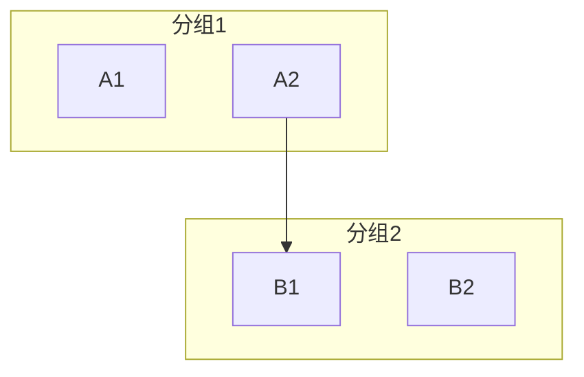

# Mermaid 布局规律文档

## 概述

本文档记录了 Mermaid.js 在使用 dagre 和 elk 布局引擎时的行为规律，特别是分组布局和连线方向对布局的影响。这些规律适用于业务对象图和服务模块图。

## 测试环境

- Mermaid.js 版本：最新版
- 布局引擎：dagre、elk
- 测试日期：2026-04-10

---

## 核心发现

### 规则总结

| 场景 | dagre 行为 | elk 行为 |
|------|------------|----------|
| **无外部连线** | ✅ 尊重子图方向（TB/LR 有效） | ✅ 尊重子图方向 |
| **有外部连线** | ❌ 只看全局方向，子图方向无效 | ❌ 只看全局方向，子图方向无效 |
| **嵌套结构** | ✅ 无影响，规则同上 | ✅ 无影响，规则同上 |

### 关键结论

> **当子图无外部连线时，elk 和 dagre 都能尊重子图的 direction 设置。**
>
> **当子图有外部连线时，无论 elk 还是 dagre，都会忽略子图的 direction，以全局方向为准。**

---

## elk 布局引擎

### 行为规律

#### 1. 无外部连线时：子图方向有效



**结果：** 节点按 TB 垂直排列 ✅

#### 2. 有外部连线时：忽略子图方向



**结果：** 子图方向被忽略，全局方向 TB 决定整体布局

#### 3. 嵌套结构：规则相同

嵌套层次不影响方向控制规则的生效，父容器和子容器各自独立判断是否有外部连线。

---

## dagre 布局引擎

### 行为规律

#### 1. 无外部连线时：子图方向有效

当子图内的节点没有跨子图连线时：



**结果：** 节点按 TB 垂直排列 ✅

#### 2. 有外部连线时：只看全局方向



**结果：** 子图方向被忽略，全局方向 TB 决定整体布局

---

## 自动分组方案

基于以上规律，可以采用以下策略优化 ELK 布局：

### 核心原则

```
每个业务容器 → 拆分为两个子容器
├── 子容器_内部: 无外部连线的节点 → direction TB 有效 ✅
└── 子容器_边界: 有外部连线的节点 → direction TB 可能无效
```

### 算法步骤

```javascript
function autoGroupForELK(nodes, edges, containerConfig) {
  const nodeExternalLinks = new Map();

  for (const node of nodes) {
    const externalEdges = edges.filter(e =>
      (e.source === node.id || e.target === node.id) &&
      !isSameContainer(e.source, e.target, containerConfig)
    );
    nodeExternalLinks.set(node.id, externalEdges.length > 0);
  }

  const innerNodes = nodes.filter(n => !nodeExternalLinks.get(n.id));
  const boundaryNodes = nodes.filter(n => nodeExternalLinks.get(n.id));

  let code = '';
  code += `subgraph ${containerConfig.id}["${containerConfig.name}"]\n`;
  code += `  direction ${containerConfig.direction}\n`;

  if (innerNodes.length > 0) {
    code += `  subgraph ${containerConfig.id}_inner[" "]\n`;
    code += `    direction TB\n`;
    for (const node of innerNodes) {
      code += `    ${node.id}["${node.name}"]\n`;
    }
    code += `  end\n`;
  }

  if (boundaryNodes.length > 0) {
    code += `  subgraph ${containerConfig.id}_boundary[" "]\n`;
    code += `    direction TB\n`;
    for (const node of boundaryNodes) {
      code += `    ${node.id}["${node.name}"]\n`;
    }
    code += `  end\n`;
  }

  code += `end\n`;
  return code;
}
```

### 配置选项

```javascript
const elkGroupingConfig = {
  enabled: true,
  splitByExternalLinks: true,
  innerContainerDirection: 'TB',
  boundaryContainerDirection: 'TB',
  hideInnerContainerTitle: true,
  hideBoundaryContainerTitle: true
};
```

---

## 测试文件

- `test-elk-nested-direction.html` - 子图方向控制综合测试

测试场景包括：
1. 基础嵌套容器
2. 多级嵌套
3. 同级多容器
4. 跨容器连线影响
5. 混合方向容器
6. 真实场景模拟
7. 按连线分离容器
8. 混合容器 vs 分离容器
9. 嵌套分离容器

---

## 参考资料

- [Issue #5864 - Sub-graph direction in flowchart-elk cannot change direction](https://github.com/mermaid-js/mermaid/issues/5864)
- [Issue #7477 - Flowchart subgraph direction TB and LR are swapped](https://github.com/mermaid-js/mermaid/issues/7477)
- [Mermaid.js 官方文档](https://mermaid.js.org/)
- [dagre 布局算法](https://github.com/dagrejs/dagre)
- [ELK 布局算法](https://www.eclipse.org/elk/)

---

## 更新记录

- 2026-03-29：初始版本，记录 dagre 和 elk 的布局规律
- 2026-03-30：
  - 更新核心发现：外部连线导致子图方向失效
  - 添加 dagre 和 elk 的对比表格
  - 添加子图方向控制流程图
  - 更新实践建议
- 2026-04-10：
  - 更新核心结论：无外部连线时 elk 也能尊重子图方向
  - 添加嵌套结构测试结果
  - 添加自动分组方案建议
