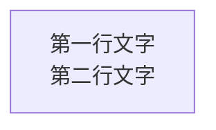

# Mermaid 流程图节点文字显示问题解决方案

## 问题描述

在使用 Mermaid.js 绘制流程图时，遇到以下问题：
1. 节点文字显示不完整（被截断）
2. 节点文字无法居中显示
3. 增大节点尺寸配置后仍然无效

## 问题根因分析

### 1. SVG 元素的特殊性
- SVG 的 `<rect>`、`<text>` 等元素的 `width`、`height` 是 **XML 属性**，不是 CSS 样式
- CSS 的 `min-width`、`min-height` 对 SVG 元素**不生效**
- Mermaid 在渲染时会根据文字内容自动计算节点尺寸，可能计算不准确

### 2. htmlLabels 配置的影响
- `htmlLabels: false`（默认）：Mermaid 使用 SVG `<text>` 元素渲染文字
  - 优点：与 SVG 图形集成好
  - 缺点：文字样式控制受限，CSS 无法强制设置尺寸
  
- `htmlLabels: true`：Mermaid 使用 HTML `<div>` 元素（通过 `<foreignObject>`）渲染文字
  - 优点：可以使用完整的 CSS 样式控制
  - 缺点：需要额外处理 HTML 与 SVG 的集成

### 3. 节点尺寸计算问题
- Mermaid 的 `flowchart.nodeWidth` 和 `flowchart.nodeHeight` 配置**仅作为参考**
- 实际渲染时，Mermaid 会根据文字内容自动调整尺寸
- 长文字或特殊字符可能导致尺寸计算不准确

## 解决方案

### 方案 1：使用 HTML Labels + CSS 强制尺寸（推荐）

#### 配置 Mermaid
```javascript
mermaid.initialize({
  flowchart: {
    htmlLabels: true,  // 启用 HTML 标签模式
    nodeWidth: 280,    // 参考宽度
    nodeHeight: 100,   // 参考高度
    wrappingWidth: 500 // 文字换行宽度
  }
})
```

#### CSS 强制尺寸和居中
```css
/* 节点容器强制尺寸 */
.mermaid-content :deep(.node .label) {
  width: 280px !important;
  height: 90px !important;
  min-width: 280px !important;
  min-height: 90px !important;
  
  /* Flexbox 居中 */
  display: flex !important;
  align-items: center !important;
  justify-content: center !important;
  text-align: center !important;
  
  /* 文字样式 */
  font-size: 16px !important;
  font-weight: bold !important;
  line-height: 1.4 !important;
  padding: 10px !important;
  box-sizing: border-box !important;
}

/* 节点内容容器 */
.mermaid-content :deep(.node .label-content) {
  display: flex !important;
  flex-direction: column !important;
  align-items: center !important;
  justify-content: center !important;
  width: 100% !important;
  height: 100% !important;
}
```

#### 优点
- ✅ 完全控制节点尺寸
- ✅ 文字完美居中
- ✅ 不会显示不全
- ✅ 可以使用所有 CSS 属性

#### 缺点
- 需要启用 `htmlLabels: true`

### 方案 2：纯 SVG 模式（备选）

如果必须使用 `htmlLabels: false`，可以采用以下方案：

#### 配置 Mermaid
```javascript
mermaid.initialize({
  flowchart: {
    htmlLabels: false,
    nodeWidth: 280,
    nodeHeight: 100,
    useMaxWidth: false
  }
})
```

#### CSS 调整
```css
/* SVG rect 元素 - 使用属性选择器 */
.mermaid-content :deep(.node rect) {
  /* 注意：CSS 无法直接修改 SVG 属性，只能通过 JS */
}

/* SVG text 元素居中 */
.mermaid-content :deep(.node text),
.mermaid-content :deep(.node .nodeLabel),
.mermaid-content :deep(.node tspan) {
  text-anchor: middle !important;      /* 水平居中 */
  dominant-baseline: middle !important; /* 垂直居中 */
  font-size: 16px !important;
  white-space: normal !important;
  overflow: visible !important;
}
```

#### JavaScript 修复 viewBox
```javascript
// 渲染后调整 SVG viewBox，防止负值裁剪
const svg = container.querySelector('svg')
const viewBox = svg.getAttribute('viewBox')
if (viewBox) {
  const parts = viewBox.split(' ').map(Number)
  if (parts[0] < 0 || parts[1] < 0) {
    const padding = 20
    const newViewBox = `${parts[0] - padding} ${parts[1] - padding} ${parts[2] + padding * 2} ${parts[3] + padding * 2}`
    svg.setAttribute('viewBox', newViewBox)
  }
}
```

#### 缺点
- ❌ 无法通过 CSS 强制设置节点尺寸
- ❌ 需要额外的 JavaScript 处理
- ❌ 文字居中可能不完美

## 最佳实践总结

### 1. 优先使用 HTML Labels 模式
```javascript
htmlLabels: true  // 强烈推荐
```

### 2. 配置参数建议值
```javascript
flowchart: {
  nodeWidth: 280,      // 节点宽度（参考值）
  nodeHeight: 100,     // 节点高度（参考值）
  nodeSpacing: 120,    // 节点间距
  rankSpacing: 150,    // 层级间距
  diagramPadding: 40,  // 画布边距
  wrappingWidth: 500   // 文字换行宽度
}
```

### 3. CSS 样式模板
```css
/* 节点容器 - 强制尺寸 + Flexbox 居中 */
.mermaid-content :deep(.node .label) {
  width: 280px !important;
  height: 90px !important;
  display: flex !important;
  align-items: center !important;
  justify-content: center !important;
  font-size: 16px !important;
  font-weight: bold !important;
  padding: 10px !important;
}
```

### 4. 节点定义格式


使用 `\n` 换行符实现多行文字显示。

### 5. 调试技巧

#### 检查节点实际尺寸
```javascript
const nodes = svg.querySelectorAll('.node')
nodes.forEach((node, index) => {
  const rect = node.querySelector('rect')
  if (rect) {
    const bbox = rect.getBBox()
    console.log(`节点 ${index} 尺寸:`, {
      width: rect.getAttribute('width'),
      height: rect.getAttribute('height'),
      bbox: bbox
    })
  }
})
```

#### 检查父元素样式
```javascript
let parent = svg.parentElement
let level = 0
while (parent && level < 5) {
  const computedStyle = window.getComputedStyle(parent)
  console.log(`父元素 ${level}:`, {
    tagName: parent.tagName,
    width: computedStyle.width,
    height: computedStyle.height,
    overflow: computedStyle.overflow
  })
  parent = parent.parentElement
  level++
}
```

## 常见问题 FAQ

### Q1: 为什么设置了 `nodeWidth` 但节点还是很窄？
**A**: Mermaid 的 `nodeWidth` 仅作为参考值，实际渲染时会根据文字内容自动调整。需要通过 CSS 强制设置尺寸。

### Q2: 为什么 CSS 的 `min-width` 对节点不生效？
**A**: 在 `htmlLabels: false` 模式下，节点使用 SVG 元素，CSS 的 `min-width` 对 SVG 元素不生效。需要启用 `htmlLabels: true` 使用 HTML 元素。

### Q3: 文字为什么被截断？
**A**: 可能原因：
1. 节点尺寸太小 - 增大 `width` 和 `height`
2. `white-space: nowrap` - 改为 `white-space: normal`
3. `overflow: hidden` - 改为 `overflow: visible`
4. viewBox 有负值 - 调整 viewBox 添加 padding

### Q4: 如何让文字完美居中？
**A**: 
- HTML Labels 模式：使用 Flexbox (`display: flex` + `align-items: center` + `justify-content: center`)
- SVG 模式：使用 `text-anchor: middle` + `dominant-baseline: middle`

## 参考资料

- [Mermaid 官方文档](https://mermaid.js.org/)
- [Mermaid Flowchart 配置](https://mermaid.js.org/syntax/flowchart.html#configuration)
- [SVG text-anchor](https://developer.mozilla.org/en-US/docs/Web/SVG/Attribute/text-anchor)
- [CSS Flexbox](https://developer.mozilla.org/en-US/docs/Web/CSS/CSS_Flexible_Box_Layout)
