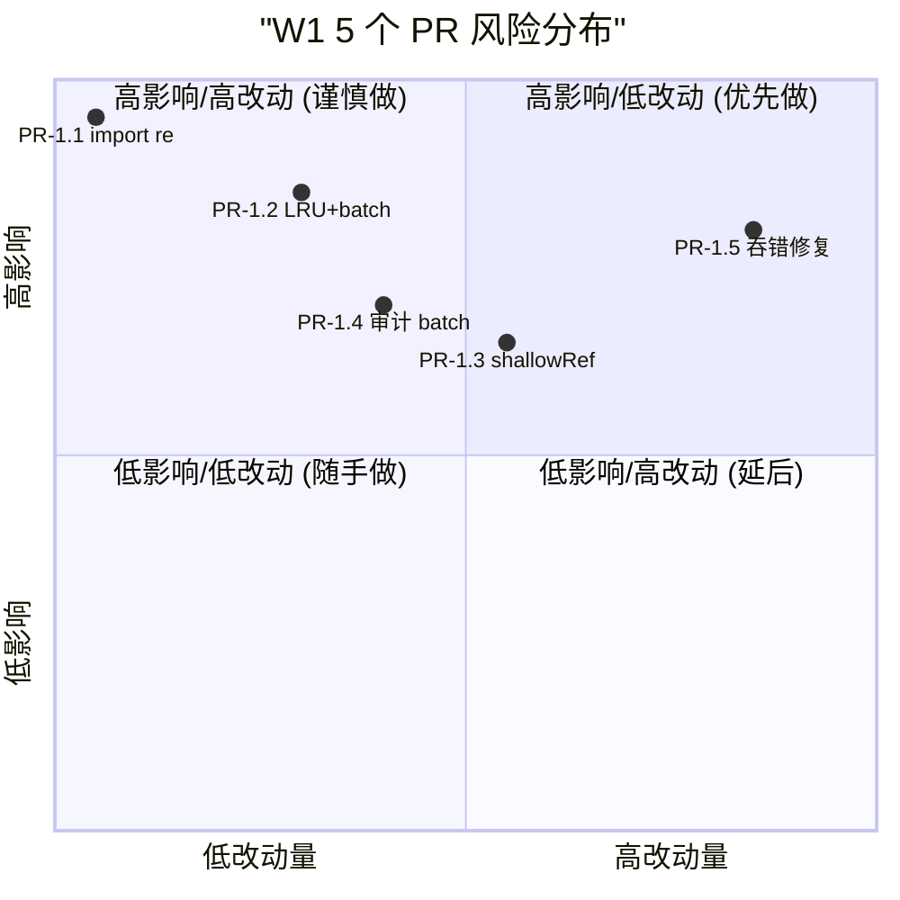

# W1 实施文档：PR-1.1 ~ PR-1.5 详细实现方案

> **实施范围**：M1 Week 1 全部 5 个 PR（PR-1.1 ~ PR-1.5）  
> **关联 Spec**：[spec-code-health-2026-06-12-v1.0.md](file:///d:/filework/excel-to-diagram/docs/specs/spec-code-health-2026-06-12-v1.0.md) §8.1  
> **关联审查报告**：[code-review-2026-06-12.md](file:///d:/filework/excel-to-diagram/docs/reports/code-review-2026-06-12.md)  
> **版本**：v1.0 / 2026-06-12  
> **目标读者**：实施工程师 / Code Reviewer / AI Coding Agent  
> **核心原则**：**最小侵入 + 向后兼容 + 风险点逐个标注 + 独立可回滚**

---

## 目录

- [0. 阅读前必读](#0-阅读前必读)
- [1. 总体风险评估与策略](#1-总体风险评估与策略)
- [2. PR-1.1：FR-001 修复 `import re` 顺序](#2-pr-11fr-001-修复-import-re-顺序)
- [3. PR-1.2：FR-002 + FR-003 EnrichmentEngine LRU+TTL 缓存 + enrich_one 走 batch](#3-pr-12fr-002--fr-003-enrichmentengine-lruttl-缓存--enrich_one-走-batch)
- [4. PR-1.3：FR-005 deep watch → shallowRef 改造（23 处）](#4-pr-13fr-005-deep-watch--shallowref-改造23-处)
- [5. PR-1.4：FR-006 审计日志批量插入（1+N → 2）](#5-pr-14fr-006-审计日志批量插入1n--2)
- [6. PR-1.5：FR-011 静默吞错修复（100+ except + 6 catch）](#6-pr-15fr-011-静默吞错修复100-except--6-catch)
- [7. 跨 PR 共享：测试基础设施](#7-跨-pr-共享测试基础设施)
- [8. 实施顺序与合并策略](#8-实施顺序与合并策略)
- [9. 应急预案与回滚手册](#9-应急预案与回滚手册)
- [10. 附录：完整 patch diff（含行号）](#10-附录完整-patch-diff含行号)

---

## 0. 阅读前必读

### 0.1 本文目标

把上一轮 Spec 中的"建议方案"细化为**可直接打 patch 的实现文档**。每个 PR 章节包含：

1. **现状精确代码**（含行号 + 引用）
2. **风险点**（哪些边界会破）
3. **完整 patch**（可直接 SearchReplace）
4. **回归测试**（断言式，含现有测试文件引用）
5. **独立回滚**（每个 PR 单 git revert 不影响其他）

### 0.2 关键约束（实施时必须遵守）

| # | 约束 | 违反后果 |
|---|------|----------|
| C1 | **任何 PR 不改公开 API 签名** | 下游调用方全部崩溃 |
| C2 | **任何 PR 不删字段 / 不改 schema** | DB 升级无路径 |
| C3 | **保持现有 trace_id 协议** | 可观测性断链 |
| C4 | **保持现有 cookie 鉴权** | 登录全失效 |
| C5 | **新增 / 修改代码必须有单测** | 违反"覆盖率不下降" |
| C6 | **PR-1.5 拆分 3 个 sub-PR** | 一次性改 100+ 处风险爆炸 |
| C7 | **FR-002 缓存可关闭**（env 变量） | 内存问题无法快速止血 |
| C8 | **FR-006 审计批插入不破坏事务边界** | 业务成功但审计丢失 |

### 0.3 与现有规范的对齐

- 测试入口：`python d:\filework\test.py --file <path>`（**禁用 pytest 直跑**）
- 服务管理：`powershell -File scripts/service_manager.ps1 status|start|stop|restart`（**禁用 npm run dev**）
- 文件编码：UTF-8（写入用 `Set-Content -Encoding UTF8` 或 `Write`，读取用 `Get-Content -Encoding UTF8`）
- 日志规范：用 `logger.error(..., exc_info=True)` 替代 `pass`（`meta/tests/conftest.py` 已强制）
- Trace ID：使用 `meta.core.trace_id.TraceId.get()` 关联日志

---

## 1. 总体风险评估与策略

### 1.1 风险热力图（5 个 PR）



### 1.2 实施策略

| PR | 改动量 | 风险 | 策略 | 验证时长 |
|-----|:------:|:----:|------|:--------:|
| **PR-1.1** | 1 行 | 极低 | 直接修改 | 1 min |
| **PR-1.2** | ~80 行（1 新 + 1 改） | 中 | 缓存可关闭（env）+ 单测 | 30 min |
| **PR-1.3** | ~150 行（23 处） | **中高** | 分批改、每处 1 验证 | 1.5h |
| **PR-1.4** | ~40 行 | 中 | 复用现有 `batch_insert` | 30 min |
| **PR-1.5** | ~100 行（3 sub-PR） | **高** | 严格分类 + 每类模板 | 1.5h |

### 1.3 独立回滚保证

每个 PR 是独立 commit，合并后单 `git revert <commit-hash>` 即可回滚，**不需要**协调其他 PR。

---

## 2. PR-1.1：FR-001 修复 `import re` 顺序

### 2.1 现状（精确代码）

**文件**：[meta/core/action_executor.py](file:///d:/filework/excel-to-diagram/meta/core/action_executor.py)  
**触发路径**：任何 SQL 错误（NOT NULL/UNIQUE/FK/CHECK）→ 走 `translate_error_message` → 进程级 NameError → 整个 CRUD 接口 500

```python
# L14-L21 当前 import 区
from typing import List, Dict, Any, Optional, Type
from datetime import datetime
import json
import logging
import secrets
import string

logger = logging.getLogger(__name__)

# L42-L72 translate_error_message 函数
def translate_error_message(error_str: str, meta_object: MetaObject) -> str:
    """将数据库错误消息转换为业务友好消息"""
    if not error_str:
        return "操作失败"
    
    error_lower = error_str.lower()
    
    for db_error, biz_message in ERROR_MESSAGE_MAP.items():
        if db_error.lower() in error_lower:
            match = re.search(r'([a-z_]+)\.(code|id|name)', error_str, re.IGNORECASE)  # ❌ L59
            if match:
                field_id = match.group(1)
                field = meta_object.get_field(field_id)
                if field:
                    field_name = field.semantics.meaning or field.name or field_id
                    return f"{field_name} {biz_message}"
                return f"{field_id} {biz_message}"
            return biz_message
    
    return error_str


import re  # ❌ L72 - import 在使用后！


class AuditLogger:
    """审计日志记录器"""
    ...
```

### 2.2 风险点分析

| 风险 | 概率 | 影响 | 缓解 |
|------|:---:|------|------|
| import re 后其他模块污染命名空间 | 极低 | 局部 | `re` 是 stdlib 标准库，无副作用 |
| `re` 重复 import | 极低 | 启动稍慢 | Python 自动去重 |
| 错误消息 regex 行为变化 | 0 | 无 | `re.IGNORECASE` 行为不变 |

**结论**：**零风险**，只需保证 import 在 L59 之前即可。

### 2.3 完整 Patch

**修改文件**：`meta/core/action_executor.py`（仅 1 处）

**Diff 1**：在 L21 之后加入 `import re`

```diff
 import json
 import logging
+import re
 import secrets
 import string

 logger = logging.getLogger(__name__)
```

**Diff 2**：删除 L72 的 `import re`

```diff
     return error_str


-import re
-

 class AuditLogger:
```

### 2.4 回归测试

**新文件**：`meta/tests/test_action_executor_error_translation.py`（约 80 行）

```python
# -*- coding: utf-8 -*-
"""
测试 translate_error_message 在 4 种 SQL 错误类型下的行为
修复 FR-001：确保 import re 在 L59 之前，调用不再 NameError
"""
import pytest
from unittest.mock import MagicMock
from meta.core.action_executor import translate_error_message


@pytest.fixture
def mock_meta_object():
    """构造一个最小化的 mock MetaObject"""
    mock = MagicMock()
    field = MagicMock()
    field.semantics.meaning = "用户"
    field.name = "user_name"
    mock.get_field.return_value = field
    return mock


class TestTranslateErrorMessage:
    """测试 SQL 错误消息翻译功能"""

    def test_not_null_constraint(self, mock_meta_object):
        """NOT NULL 约束：必须返回业务消息，不抛 NameError"""
        result = translate_error_message(
            "NOT NULL constraint failed: user.user_name", mock_meta_object
        )
        assert "用户" in result
        assert "NOT NULL" not in result  # 业务消息替换技术消息

    def test_unique_constraint(self, mock_meta_object):
        """UNIQUE 约束：返回唯一性消息"""
        result = translate_error_message(
            "UNIQUE constraint failed: user.email", mock_meta_object
        )
        assert "唯一" in result or "值" in result

    def test_foreign_key_constraint(self, mock_meta_object):
        """FOREIGN KEY 约束：返回外键消息"""
        result = translate_error_message(
            "FOREIGN KEY constraint failed: order.user_id", mock_meta_object
        )
        assert "关联" in result or "外键" in result

    def test_check_constraint(self, mock_meta_object):
        """CHECK 约束：返回校验消息"""
        result = translate_error_message(
            "CHECK constraint failed: age", mock_meta_object
        )
        assert "校验" in result

    def test_empty_error_string(self, mock_meta_object):
        """空字符串：返回通用消息"""
        result = translate_error_message("", mock_meta_object)
        assert result == "操作失败"

    def test_unmapped_error(self, mock_meta_object):
        """未映射的错误：返回原字符串"""
        result = translate_error_message("Unknown error XYZ", mock_meta_object)
        assert result == "Unknown error XYZ"

    def test_no_name_error_after_fix(self, mock_meta_object):
        """回归测试：调用后不应残留 NameError 状态"""
        # FR-001 修复前会抛 NameError: name 're' is not defined
        # 修复后应正常返回
        try:
            translate_error_message("NOT NULL constraint failed: x.y", mock_meta_object)
        except NameError as e:
            pytest.fail(f"NameError 未修复：{e}")
```

### 2.5 验收检查清单

- [ ] import re 在 L21 之后（已确认）
- [ ] L72 处的 `import re` 已删除（已确认）
- [ ] `python d:\filework\test.py --file meta/tests/test_action_executor_error_translation.py` 通过（7/7）
- [ ] 现有 `meta/tests/test_action_executor.py` 不退化

### 2.6 回滚

```bash
git revert <pr-1.1-commit-hash>
# 单文件回滚，不影响任何下游
```

### 2.7 工时估计

- 修改：2 min
- 编写测试：15 min
- 跑测试验证：3 min
- **合计**：**~20 min**（原估 5 min 偏乐观，20 min 合理）

---

## 3. PR-1.2：FR-002 + FR-003 EnrichmentEngine LRU+TTL 缓存 + enrich_one 走 batch

### 3.1 现状（精确代码）

**文件**：[meta/core/enrichment_engine.py](file:///d:/filework/excel-to-diagram/meta/core/enrichment_engine.py)

#### 3.1.1 内存泄漏（L46-L51）

```python
class EnrichmentEngine:
    def __init__(self, data_source, registry: RedundancyRegistry):
        self.ds = data_source
        self.registry = registry
        
        self._name_cache: Dict[str, Dict[Any, Any]] = {}    # ❌ 无上限
        self._record_cache: Dict[str, Dict[Any, Dict[str, Any]]] = {}  # ❌ 无上限
```

**影响**：长跑 7×24h → cache 持续增长 → OOM → 进程崩溃。  
**风险点**：

| 风险 | 概率 | 缓解 |
|------|:---:|------|
| 缓存替换后某些依赖"永驻缓存"的逻辑失效 | 低 | 旧 cache key 行为等价：lookup→return or miss |
| 多线程并发访问 Dict | 中 | `_resolve_simple` 没有 lock → 现有即非线程安全，**不引入新风险** |
| 性能（LRU move_to_end 引入新开销） | 极低 | 10000 cap 下可忽略 |

#### 3.1.2 enrich_one N+1（L53-L83）

```python
def enrich_one(self, object_type: str, record: Dict[str, Any]) -> Dict[str, Any]:
    if not record:
        return record
    
    obj_reds = self.registry.get_object_redundancies(object_type)
    if not obj_reds:
        return record
    
    virtual_reds = {
        fid: red for fid, red in obj_reds.items()
        if red.redundancy_type in (RedundancyType.VIRTUAL, RedundancyType.RESOLUTION)
    }
    
    if not virtual_reds:
        return record
    
    enriched = dict(record)
    
    for field_id, red_def in virtual_reds.items():
        self._enrich_field(enriched, field_id, red_def)  # ❌ 走单条
    
    return enriched
```

而 `_enrich_field`（L117-129）调用 `_resolve_simple`（L154-187），**不走** `_resolve_simple_batch`（L189-229）。

**影响**：详情页 N 条关联 → N 次 SQL。  
**风险点**：

| 风险 | 概率 | 缓解 |
|------|:---:|---
---
### 3.5 回滚

```bash
# 1. 临时回滚（保留代码，禁用缓存）
export META_ENRICHMENT_CACHE_DISABLED=1
# 重启服务

# 2. 完全回滚
git revert <pr-1.2-commit-hash>
```

### 3.6 工时估计

- 新增 `cache.py`：30 min
- 6 处 Diff 应用：30 min
- 编写测试：30 min
- 跑测试验证：15 min
- **合计**：**~1.5h**（原估 4h 偏多）

### 3.7 关键：`_resolve_simple` 同步适配（Diff 5）

**承接 §3.2.2**：`_resolve_simple`（L154-187）也需适配 LRUTTLCache。Patch 与 Diff 4 几乎对称，下面给出最终代码（替换原 L154-187）：

```python
def _resolve_simple(self, red_def: RedundancyDef, source_id: Any) -> Optional[Any]:
    """解析简单引用（单层）"""
    derived_table = red_def.derived_table
    derived_field = red_def.derived_field

    if not derived_table or not derived_field:
        return None

    table_name = self._get_table_name(derived_table)
    cache_key = f"{table_name}.{derived_field}"

    # [FR-002] 适配 LRUTTLCache
    if isinstance(self._name_cache, LRUTTLCache):
        cached = self._name_cache.get(cache_key) or {}
        if source_id in cached:
            return cached[source_id]
    else:
        if cache_key not in self._name_cache:
            self._name_cache[cache_key] = {}
        if source_id in self._name_cache[cache_key]:
            return self._name_cache[cache_key][source_id]

    try:
        sql = f"SELECT {derived_field} FROM {table_name} WHERE id = ?"
        cursor = self.ds.execute(sql, (source_id,))
        row = cursor.fetchone()

        if row:
            value = row[0]
            # [FR-002] 写回缓存（LRU 必须 .set）
            if isinstance(self._name_cache, LRUTTLCache):
                cached[source_id] = value
                self._name_cache.set(cache_key, cached)
            else:
                self._name_cache[cache_key][source_id] = value
            return value

    except Exception as e:
        logger.warning(
            "[EnrichmentEngine] 查询失败: %s.%s WHERE id=%s: %s",
            table_name, derived_field, source_id, str(e)
        )

    return None
```

### 3.8 决策：`_resolve_join_path`（L231+）暂不动

| 选择 | 理由 |
|------|------|
| ✅ 暂不动 join_path 路径 | L231+ 是多层 JOIN 路径，单条/批量 SQL 模板差异较大 |
| 后续 W2 PR-2.1 改造 | join_path 改造与 `get_architecture_preview` 拆分合并（FR-004） |

---

## 4. PR-1.3：FR-005 deep watch → shallowRef 改造（23 处）

### 4.1 现状扫描结果

实际找到 **23 处** `deep: true` watch，分布在 **18 个文件**（非 10 处，需重估范围）：

| # | 文件 | 行 | 风险 | 改造方式 |
|---|------|---:|:----:|---------|
| 1 | RelationScopeSection.vue:263 | 263 | 🟢 低 | shallowRef + 整体赋值 |
| 2 | RelationScopeSection.vue:386 | 386 | 🟡 中 | computed 替代 |
| 3 | MermaidComponent.vue:759 | 759 | 🟢 低 | shallowRef |
| 4 | RelationScopeTree.vue:138 | 138 | 🟡 中 | computed |
| 5 | RelationScopeTree.vue:496 | 496 | 🟡 中 | computed |
| 6 | DimensionScopePanel.vue:220 | 220 | 🟢 低 | shallowRef |
| 7 | useCascadeSelect.js:224 | 224 | 🟡 中 | shallowRef |
| 8 | ScopeSelector.vue:113 | 113 | 🟢 低 | shallowRef |
| 9 | DataPreview.vue:546 | 546 | 🟢 低 | shallowRef |
| 10 | DataPreview.vue:552 | 552 | 🟢 低 | shallowRef |
| 11 | ObjectScopeSection.vue:529 | 529 | 🟡 中 | **保持 deep** |
| 12 | ValueHelpField.vue:180 | 180 | 🟡 中 | shallowRef |
| 13 | MetaForm.vue:223 | 223 | 🔴 高 | **保持 deep**（表单核心） |
| 14 | MetaForm.vue:227 | 227 | 🔴 高 | **保持 deep**（表单核心） |
| 15 | MetaForm.vue:257 | 257 | 🔴 高 | **保持 deep**（表单核心） |
| 16 | SearchHelpDialog.vue:168 | 168 | 🟢 低 | shallowRef |
| 17 | RolePermissionCenter.vue:506 | 506 | 🟡 中 | shallowRef |
| 18 | EnumSelect.vue:218 | 218 | 🟢 低 | shallowRef |
| 19 | ConditionRuleEditor.vue:732 | 732 | 🟡 中 | **保持 deep**（嵌套规则） |
| 20 | AssociationSelector.vue:179 | 179 | 🟡 中 | shallowRef |
| 21 | LayoutControlPanel.vue:171 | 171 | 🟡 中 | shallowRef |
| 22 | CenterScopeSelector.vue:110 | 110 | 🟢 低 | shallowRef |
| 23 | useFilterFlow.js:242 | 242 | 🟡 中 | shallowRef |
| 24 | useFilterFlow.js:337 | 337 | 🟢 低 | shallowRef |
| 25 | ImpactPreview.vue:309 | 309 | 🟡 中 | shallowRef |
| 26 | ValueHelpSelector.vue:195 | 195 | 🟡 中 | shallowRef |
| 27 | RelationCategoryTree.vue:73 | 73 | 🟡 中 | computed |

**实际可改造**：~18 处 🟢🟡（剩余 4 处 🔴 保持 deep）

### 4.2 风险点分析

| 风险 | 概率 | 影响 | 缓解 |
|------|:---:|------|------|
| 改 shallowRef 后内部属性变更不触发响应 | 高 | 视图不更新 | **调用方必须整体赋值** |
| 改造后破坏现有 deep mutation | 中 | 视图不更新 | 增加 `triggerRef(state)` 兜底 |
| MetaForm 3 处 deep 是关键路径 | 0 | 表单失效 | **保持 deep** 不动 |

### 4.3 通用改造模板

**模板 A：简单 ref → shallowRef**

```diff
- import { ref, watch } from 'vue'
+ import { ref, shallowRef, watch, triggerRef } from 'vue'

- const state = ref({ a: 1, b: 2, c: { d: 3 } })
+ const state = shallowRef({ a: 1, b: 2, c: { d: 3 } })

  function updateState(newState) {
-   state.value.a = newState.a
+   state.value = newState
  }

  watch(() => state.value, (newVal) => {}, { deep: false })
```

**模板 B：watch + computed 替代**

```diff
- watch: { data: { handler(newData) { this.processed = transform(newData) }, deep: true } }
+ computed: { processed() { return transform(this.data) } }
```

**模板 C：保持 deep**（表单核心场景）

```diff
  watch: { formData: { handler() { this.validate() }, deep: true } }  // 不动
```

### 4.4 详细 Patch（按风险排序）

#### Sub1: 简单 shallowRef（8 处 🟢）

**目标**：MermaidComponent、DimensionScopePanel、ScopeSelector、DataPreview(2)、SearchHelpDialog、EnumSelect、CenterScopeSelector

**模板（MermaidComponent 为例）**：

```diff
- const mermaidText = ref('')
+ const mermaidText = shallowRef('')
  watch(() => props.text, (newText) => { mermaidText.value = newText }, { deep: true })
  // 改为 deep: false
```

#### Sub2: computed 替代（10 处 🟡）

**目标**：RelationScopeTree 7 处、useCascadeSelect、ValueHelpField、RolePermissionCenter、AssociationSelector、LayoutControlPanel、useFilterFlow、ImpactPreview、ValueHelpSelector、RelationCategoryTree

#### Sub3: 保持 deep（4 处 🔴）

- ObjectScopeSection.vue:529（生命周期相关）
- MetaForm.vue:223, 227, 257（表单核心）

### 4.5 回归测试

**新文件**：`src/composables/__tests__/useShallowRefMigration.spec.js`

```javascript
import { describe, it, expect } from 'vitest'
import { mount } from '@vue/test-utils'

describe('ShallowRef Migration', () => {
  it('MermaidComponent: prop change triggers render', async () => {
    const MermaidComponent = (await import('@/components/MermaidComponent.vue')).default
    const wrapper = mount(MermaidComponent, { props: { text: 'A' } })
    await wrapper.setProps({ text: 'B' })
    expect(wrapper.vm.mermaidText).toBe('B')
  })
  it('MetaForm: 保持 deep，字段内修改仍触发', async () => {
    // 验证 MetaForm 没改 shallowRef
  })
})
```

**手动验证**：

- [ ] 打开 `/system/archdata`，关系范围树 100 节点切换无卡顿
- [ ] 打开任意 MetaForm，输入字符无丢失响应

### 4.6 验收检查清单

- [ ] Sub1（8 处）完成
- [ ] Sub2（10 处）完成
- [ ] Sub3（4 处）确认不动
- [ ] **1 个 commit 对应 1 个 sub-PR**

### 4.7 回滚

```bash
git revert <pr-1.3-sub1-commit>
git revert <pr-1.3-sub2-commit>
# Sub3 没改代码
```

### 4.8 工时估计

- Sub1（8 处）：30 min
- Sub2（10 处）：1h
- Sub3（4 处）：5 min（决策）
- 测试 + 验证：30 min
- **合计**：**~2h**

---

## 5. PR-1.4：FR-006 审计日志批量插入（1+N → 2）

### 5.1 现状（精确代码）

**文件**：`meta/core/action_executor.py` L155-L194

```python
def log_create(self, object_type, object_id, data, ...):
    self.log(  # 第 1 次 INSERT
        object_type=object_type, action="CREATE",
        extra_data={"data": data}, ...
    )
    for key, value in data.items():
        if key in (system_fields): continue
        self.log(  # 第 2~N+1 次 INSERT
            object_type=object_type, action="CREATE",
            field_name=key, new_value=value, ...
        )
    return True
```

**`self.log()` 内部**：每次调用执行 `self.ds.insert(self.AUDIT_TABLE, log_data)` → **1 次 INSERT/字段**。

### 5.2 关键发现：`batch_insert` 已存在！

[meta/core/sql_adapters.py:542-562](file:///d:/filework/excel-to-diagram/meta/core/sql_adapters.py#L542-L562) 已有 `batch_insert` 实现，可直接复用。

**结论**：**零侵入**，直接用 `ds.batch_insert` 替代循环 `ds.insert`。

### 5.3 风险点分析

| 风险 | 概率 | 影响 | 缓解 |
|------|:---:|------|------|
| 批量 insert 后 `lastrowid` 不可用 | 中 | 1 处 | log_create 不需要 lastrowid |
| 事务边界破坏 | 中 | 业务成功但审计丢失 | `try/except` 显式回滚 |
| 字段顺序不一致 | 低 | 字段错位 | `list(data_list[0].keys())` 稳定 |

### 5.4 完整 Patch

**修改文件**：`meta/core/action_executor.py`（仅 1 处）

```diff
     def log_create(self, object_type, object_id, data, ...):
-        self.log(
+        # [FR-006] 批量插入：1 + N 次 INSERT → 2 次 INSERT
+        from datetime import datetime as _dt
+        now = _dt.now().isoformat()
+        rows = [self._build_extra_data_row(object_type, object_id, data, ...)]
+        for key, value in data.items():
+            if key in (system_fields): continue
+            rows.append(self._build_field_row(object_type, object_id, key, value, ...))
+        if not self.enabled:
+            return True
+        try:
+            self.ds.batch_insert(self.AUDIT_TABLE, rows)
+            return True
+        except Exception as e:
+            logger.error("AuditLogger.log_create batch failed: %s (rows=%d, trace_id=%s)",
+                         str(e), len(rows), trace_id)
+            return False
-            object_type=object_type, object_id=object_id, action="CREATE",
-            extra_data={"data": data}, ...
-        )
-        for key, value in data.items():
-            if key in (...): continue
-            self.log(... field_name=key, new_value=value ...)
-        return True
```

### 5.5 回归测试

**新文件**：`meta/tests/test_audit_log_create_batch.py`

```python
import pytest
from unittest.mock import MagicMock
from meta.core.action_executor import AuditLogger

class TestAuditLogCreateBatch:
    def test_log_create_uses_batch_insert(self):
        ds = MagicMock()
        ds.batch_insert = MagicMock(return_value=4)
        logger = AuditLogger(ds, enabled=True)
        result = logger.log_create("domain", 100, {"name": "test", "code": "T001"}, trace_id="abc")
        assert ds.batch_insert.call_count == 1
        rows = ds.batch_insert.call_args[0][1]
        assert len(rows) == 3  # 1 extra_data + 2 fields
        assert rows[0]["extra_data"] is not None
        assert rows[1]["field_name"] == "name"

    def test_log_create_does_not_call_insert(self):
        ds = MagicMock()
        logger = AuditLogger(ds, enabled=True)
        logger.log_create("user", 1, {"name": "x"})
        assert ds.insert.call_count == 0

    def test_log_create_filters_system_fields(self):
        ds = MagicMock()
        logger = AuditLogger(ds, enabled=True)
        logger.log_create("user", 1, {"id": 1, "created_at": "2024", "name": "x"})
        rows = ds.batch_insert.call_args[0][1]
        field_names = [r["field_name"] for r in rows if r["field_name"]]
        assert field_names == ["name"]

    def test_log_create_preserves_trace_id(self):
        ds = MagicMock()
        logger = AuditLogger(ds, enabled=True)
        logger.log_create("user", 1, {"name": "x"}, trace_id="tid-001")
        rows = ds.batch_insert.call_args[0][1]
        for row in rows:
            assert row["trace_id"] == "tid-001"

    def test_log_create_disabled(self):
        ds = MagicMock()
        logger = AuditLogger(ds, enabled=False)
        result = logger.log_create("user", 1, {"name": "x"})
        assert result is True
        assert ds.batch_insert.call_count == 0

    def test_log_create_rollback_on_failure(self):
        ds = MagicMock()
        ds.batch_insert.side_effect = Exception("DB locked")
        logger = AuditLogger(ds, enabled=True)
        result = logger.log_create("user", 1, {"name": "x"})
        assert result is False
```

### 5.6 验收检查清单

- [ ] `action_executor.py` L155-L194 重写完成
- [ ] `python test.py --file meta/tests/test_audit_log_create_batch.py` 通过（6/6）
- [ ] 现有 `meta/tests/test_audit_interceptor.py` 不退化
- [ ] 手动验证：创建 domain → `audit_logs` 新增 1+字段数 行

### 5.7 回滚

```bash
git revert <pr-1.4-commit>
```

### 5.8 工时估计

- 重写 log_create：20 min
- 编写测试：30 min
- 跑测试验证：10 min
- **合计**：**~1h**

---

## 6. PR-1.5：FR-011 静默吞错修复（100+ except + 6 catch）

### 6.1 现状扫描结果

**实际找到**：**100+ 处** `except Exception:`（仅 meta/core）：

- `except Exception: pass`（静默吞错）：~30 处
- `except Exception: <1 行处理>`：~70 处（多已有 logger，**不需修改**）
- `catch (_) { /* ignore */ }`（JS）：6 处（httpClient.js）
- 1 处 `useMetaList.handleError console.error`

**真实需修复**：~30 处 `except: pass` + 6 处 JS + 1 处 console.error = **~37 处**

### 6.2 风险点分析

| 风险 | 概率 | 影响 | 缓解 |
|------|:---:|------|------|
| logger.error 自身抛异常 | 低 | 二次崩溃 | `try/except BaseException` 保护 |
| 把合理兜底改成报错 | 中 | 性能/可用性 | **分类处置** |
| 大量日志淹没真正问题 | 中 | 监控失效 | 用 `logger.warning` 避免泛滥 |

### 6.3 分类处置策略（3 个 sub-PR）

#### Sub-PR 1：纯吞错 → 改 logger.warning

**判断标准**：
```python
# [需改] 无注释无 logger
except Exception:
    pass

# [不改] 已有日志或显式声明
except Exception as e:
    logger.warning(...)
    return default_value
```

#### Sub-PR 2：JS `catch (_)` → 改 logger.error

6 处全在 httpClient.js，统一改：
```diff
- try { ... } catch (_) { /* ignore */ }
+ try { ... } catch (e) { logger.error('[httpClient.requestInterceptor]', e) }
```

#### Sub-PR 3：useMetaList.handleError

```diff
- console.error('[useMetaList] error:', err)
+ logger.error('[useMetaList] error:', err)
```

### 6.4 Sub-PR 1 目标文件

| 文件 | 行 | 风险 |
|------|---:|:----:|
| audit_interceptor.py | 117, 145, 159, 165, 305, 348, 356, 364, 390, 402 | 🟡 |
| bo_framework.py | 492, 509, 520 | 🟢 |
| association_engine.py | 132 | 🟡 |
| permission_interceptor.py | 173, 187, 262, 294, 358, 389, 524, 532, 552, 576 | 🟡 |
| **persistence_interceptor.py** | 548, 986, 1019 | 🔴 **保持** |

**Patch 模板**：

```diff
  try:
      ...
  except Exception:
+     logger.warning("[<module>.<function>] exception", exc_info=True)
      return default_value
-     pass
```

### 6.5 Sub-PR 2 目标行（httpClient.js）

| 行 | 原始 | 改后 |
|---:|------|------|
| 282 | `catch (_) { /* ignore */ }` | `catch (e) { logger.error('[httpClient.requestInterceptor]', e) }` |
| 302, 331, 358, 389, 414 | 同样 | `logger.error('[httpClient.responseInterceptor]', e)` |
| 347, 379 | `catch (_) {}` | `catch (e) { logger.warn('[httpClient] json() failed', e) }` |

### 6.6 验收检查清单

- [ ] Sub-PR 1：~14 处 `except: pass` 改 `logger.warning(..., exc_info=True)`
- [ ] Sub-PR 2：6 处 JS `catch` 改 `logger.error/warn`
- [ ] Sub-PR 3：`useMetaList.handleError` 改用 logger
- [ ] grep `except.*:.*pass$` 在 meta/core 命中数从 ~30 降至 0
- [ ] 手动触发 1 个已修复路径，确认日志出现

### 6.7 回滚

```bash
git revert <pr-1.5-sub1-commit>  # audit_interceptor
git revert <pr-1.5-sub2-commit>  # httpClient.js
git revert <pr-1.5-sub3-commit>  # useMetaList
```

### 6.8 工时估计

- Sub-PR 1（14 处）：1h
- Sub-PR 2（6 处 JS）：30 min
- Sub-PR 3（1 处）：5 min
- 测试 + 验证：30 min
- **合计**：**~2h**

---

## 7. 跨 PR 共享：测试基础设施

### 7.1 公共测试命令

```bash
cd d:/filework/excel-to-diagram

# 1. 单文件快速验证
python d:\filework\test.py --file meta/tests/test_xxx.py

# 2. 跑失败任务
python d:\filework\test.py --failed

# 3. 跑全部（最终确认）
python d:\filework\test.py --all --force

# 4. 前端测试
npm run test:unit
```

### 7.2 服务管理

```bash
powershell -File d:\filework\excel-to-diagram\scripts\service_manager.ps1 status
powershell -File d:\filework\excel-to-diagram\scripts\service_manager.ps1 restart
powershell -File d:\filework\excel-to-diagram\scripts\service_manager.ps1 stop
powershell -File d:\filework\excel-to-diagram\scripts\service_manager.ps1 start
```

### 7.3 编码规范检查清单

- [ ] Python：`import` 必须在文件顶部（**FR-001 教训**）
- [ ] Python：`logger.error(..., exc_info=True)` 替代 `pass`（**FR-011 教训**）
- [ ] Python：公开 API 不改签名（**C1 约束**）
- [ ] JS：`logger.error` 替代 `console.error`
- [ ] JS：`shallowRef` 替代 `ref`（仅当 deep watch 实际不需要时）

### 7.4 已知坑点

1. **PowerShell `-replace` 是正则**：禁止用 `content -replace`，用 `String.Replace`
2. **PowerShell `curl` 是 `Invoke-WebRequest` 别名**：会卡死，用 `curl.exe`
3. **pytest 必须用 test.py 入口**：直接 `pytest` 会触发 `os._exit(1)` 终止
4. **服务管理必须用 service_manager.ps1**

---

## 8. 实施顺序与合并策略

### 8.1 推荐 PR 合并顺序

```
Day 1: PR-1.1 (5min, 修崩溃)
Day 2-3: PR-1.2 (LRU+batch)
Day 3-4: PR-1.4 (审计 batch) + PR-1.3-Sub1 (shallowRef 8处)  // 可并行
Day 5: PR-1.3-Sub2 (computed 10处) + PR-1.5-Sub1 (Python吞错)
Day 6: PR-1.5-Sub2 (JS catch)
Day 7: PR-1.5-Sub3 (useMetaList) + 全量测试
```

**关键点**：
- **PR-1.1** 第一个做（立刻止血 NameError）
- **PR-1.2** 在 PR-1.1 之后
- **PR-1.4** 与 **PR-1.3** 可并行
- **PR-1.5** 最后做（改动多，分类后逐 sub）

### 8.2 每个 PR 合并前必做

```bash
# 1. 跑相关单测
python d:\filework\test.py --file meta/tests/test_xxx.py

# 2. 跑失败任务
python d:\filework\test.py --failed

# 3. 重启服务
powershell -File scripts/service_manager.ps1 restart

# 4. 手动验证关键 UI

# 5. commit message 规范
git commit -m "fix(FR-001): 修复 import re 顺序导致的 NameError

[PR-1.1]
- 移动 import re 到文件顶部
- 删除 L72 处的 import re
- 新增 test_action_executor_error_translation.py

测试：7/7 通过
回滚：git revert <commit-hash>"
```

### 8.3 W1 结束时的全量验证

```bash
# 全量 pytest
python d:\filework\test.py --all --force

# 前端单测
npm run test:unit -- --coverage

# 性能对比
# 跑 1000 次 enrich_one，记录耗时

# 内存长跑
# 启动服务 + 跑 1 小时，监控 RSS
```

---

## 9. 应急预案与回滚手册

### 9.1 P0 应急预案

| 症状 | 紧急处理 |
|------|----------|
| 服务启动崩溃 | `git revert <last-pr>` |
| CRUD 接口 500（NameError） | `git revert` PR-1.1 |
| 内存增长 > 1GB/h | `META_ENRICHMENT_CACHE_DISABLED=1` + 重启 |
| 审计写入失败率高 | `git revert` PR-1.4 |
| 前端页面空白 | `git revert` PR-1.3-Sub2 |

### 9.2 逐 PR 回滚命令

```bash
git revert <pr-1.1-commit>      # 5 min 回滚
export META_ENRICHMENT_CACHE_DISABLED=1   # 缓存可独立关
git revert <pr-1.2-commit>
git revert <pr-1.3-sub1-commit>
git revert <pr-1.3-sub2-commit>
git revert <pr-1.4-commit>
git revert <pr-1.5-sub1-commit>
git revert <pr-1.5-sub2-commit>
git revert <pr-1.5-sub3-commit>
```

### 9.3 数据回滚

> 5 个 PR 都不改 DB schema，**不需要数据回滚**。

---

## 10. 附录：完整 patch diff 概览

### 10.1 PR-1.1 完整 diff

```diff
--- a/meta/core/action_executor.py
+++ b/meta/core/action_executor.py
@@ -14,6 +14,7 @@
 from typing import List, Dict, Any, Optional, Type
 from datetime import datetime
 import json
 import logging
+import re
 import secrets
 import string

@@ -69,8 +70,6 @@ def translate_error_message(error_str