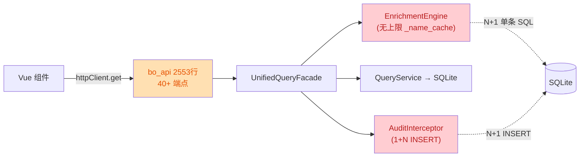

# Spec: excel-to-diagram 代码质量与性能治理统一规范

> **Spec 编号**：`SPEC-2026-06-12-CODE-HEALTH-V1`  
> **Spec 作者**：AI Coding Agent  
> **Spec 状态**：Draft（待 Review）  
> **关联审查报告**：`docs/reports/code-review-2026-06-12.md`  
> **关联前序 Spec**：`docs/specs/spec-code-quality-perf-2026-06-07-v1.0.md`（增量版）  
> **目标**：将 2026-06-12 代码审查发现的 24 个 P0-P3 性能/质量问题合并为一份可追溯、可评审、可实施的统一治理规范

---

## 目录

- [1. Background & Objectives](#1-background--objectives)
- [2. Requirement Type Overview](#2-requirement-type-overview)
- [3. Functional Requirements](#3-functional-requirements)
  - [3.1 P0 Critical 必修（5 项）](#31-p0-critical-必修5-项)
  - [3.2 P1 Major（9 项）](#32-p1-major9-项)
  - [3.3 P2 Minor（7 项）](#33-p2-minor7-项)
  - [3.4 P3 Info（3 项）](#34-p3-info3-项)
- [4. Nonfunctional Requirements](#4-nonfunctional-requirements)
- [5. External Interface Requirements](#5-external-interface-requirements)
- [6. Transition Requirements](#6-transition-requirements)
- [7. Constraints & Assumptions](#7-constraints--assumptions)
- [8. Priorities & Milestone Suggestions](#8-priorities--milestone-suggestions)
- [9. Change / Design Proposal (RFC)](#9-change--design-proposal-rfc)
- [10. TBD List](#10-tbd-list)

---

## 1. Background & Objectives

### 1.1 Background（背景）

2026-06-12 完成的 excel-to-diagram 项目全面代码审查，发现以下问题分布：

| 严重度 | 数量 | 关键痛点 |
|--------|:---:|----------|
| 🔴 P0 Critical | 5 | 启动崩溃、N+1 SQL、内存泄漏、5×5000 大查询、deep watch 卡顿 |
| 🟠 P1 Major | 9 | 审计 N+1 INSERT、inflight 缓存累积、跨页 Set 累积、Python 二次过滤、mermaid 50 万字符 |
| 🟡 P2 Minor | 7 | LRUCache 死代码、序列化浪费、未 await 副作用、composable 时序问题 |
| ⚪ P3 Info | 3 | 注释/命名空间/废弃 API |

**为何要做**：当前项目架构思路与可观测性基础设施（trace_id、/diagnostics、logger 体系）已较完善，但热路径（架构预览、列表查询、审计写入）存在严重性能瓶颈，且 447 处 `console.*`、72 处空 `except` 违反了已存在的工程规范（"FR-001 替换散落 print"、"铁律：禁止空 except 吞错"），未做修复会导致：

- (a) 终端用户感知慢、卡顿、内存增长
- (b) 生产事故定位困难
- (c) 后续 AI Agent 在脏代码上反复踩坑
- (d) 单文件 2553 行 God Class 阻碍新成员上手

**与前序 Spec 的关系**：[`spec-code-quality-perf-2026-06-07-v1.0.md`](file:///d:/filework/excel-to-diagram/docs/specs/spec-code-quality-perf-2026-06-07-v1.0.md) 已规划过 12 项 P0/P1（已落地 8 项），本 Spec 是其增量迭代，重点补齐：(1) `EnrichmentEngine` 缓存治理；(2) `bo_api.py` 拆分；(3) 审计批量插入；(4) Vue `shallowRef` 改造。

### 1.2 Business Objectives（业务目标）

- **BO-1**：架构预览页 TTFB 从 3-5s 降至 < 500ms
- **BO-2**：长跑服务（> 7 天）零内存泄漏，无需周期性重启
- **BO-3**：消除启动即崩风险（`import re` NameError）
- **BO-4**：降低生产事故 MTTR 30%（统一 logger + 拦截器错误传播）
- **BO-5**：让 AI Agent 接入成本降低（无死代码、无魔法分支、无反复踩坑）

### 1.3 Stakeholder (涉众) Objectives

- **后端开发**：能按本 Spec 独立完成 P0-P1 修复，无需再问"为什么"
- **前端开发**：能按本 Spec 完成组件 refactor、deep watch 优化、console → logger 迁移
- **架构师**：能 review RFC 决策，签字后进入实施
- **测试工程师**：能按 NFR 编写性能回归 + E2E 验证
- **AI Agent**：能基于本 Spec 自动批量修复，零歧义
- **终端用户**：架构图渲染更快、列表翻页更顺、无莫名 500 错误
- **运维**：服务可 7×24 稳定运行，无须每周手动 restart

---

## 2. Requirement Type Overview

| Type | Applicable | Evidence |
|------|:---:|----------|
| Business | ✅ | 审查报告 §1.2 业务目标 |
| User / Stakeholder (涉众) | ✅ | §1.3 各角色目标 |
| Solution | ✅ | §9 RFC 架构方案 |
| Functional | ✅ | §3 FR-001 ~ FR-024 |
| Nonfunctional | ✅ | §4 NFR 性能/可观测性/可测试性 |
| External Interface | ✅ | §5 API/UI 改造点 |
| Transition | ✅ | §6 灰度/回滚/兼容 |

---

## 3. Functional Requirements

### 3.1 P0 Critical 必修（5 项）

#### FR-001: 修复 `import re` 顺序错导致的 NameError

- **Description**：在 [action_executor.py:72](file:///d:/filework/excel-to-diagram/meta/core/action_executor.py#L72) 将 `import re` 移到文件顶部 `import` 区（与 `import json` 同级），确保 `translate_error_message` 内的 `re.search` 在 L59 正常解析。
- **Acceptance**：
  - AC-1：执行任何 SQL 错误（NOT NULL/UNIQUE/FK/CHECK）→ 走错误翻译路径，进程不抛 NameError
  - AC-2：保留所有业务错误消息形态（含字段名/表名）
  - AC-3：新增 `tests/test_action_executor_error_translation.py` 单测覆盖 4 种错误类型
- **Priority**: Must
- **Type Mapping**: Functional / Solution
- **Source**: 审查报告 Q0-1 / P0-3

#### FR-002: `EnrichmentEngine` 加 LRU + TTL 缓存防止内存泄漏

- **Description**：引入 `meta/core/cache.py` 内部模块（封装 LRU + TTL + 容量上限），替换 [`EnrichmentEngine._name_cache: Dict`](file:///d:/filework/excel-to-diagram/meta/core/enrichment_engine.py#L50-L50)，并暴露 `cache_hit` / `cache_miss` / `cache_evict` 三个 Prometheus 指标。
- **Acceptance**：
  - AC-1：长跑 7×24 小时后 RSS 增长 < 5%（vs 当前持续增长直至 OOM）
  - AC-2：缓存上限可配置（默认 10000 条），TTL 默认 5 分钟
  - AC-3：指标 `/api/v2/action/_diagnostics` 能看到 cache 命中率
- **Priority**: Must
- **Type Mapping**: Functional / Nonfunctional
- **Source**: 审查报告 P0-2

#### FR-003: `enrich_one` 强制走 batch / 单条复用 path

- **Description**：[`enrich_one`](file:///d:/filework/excel-to-diagram/meta/core/enrichment_engine.py#L53-L83) 与 `enrich_batch` 共享 `_resolve_simple_batch` 入口；新增 `_enrich_field_with_cache` 在 `enrich_one` 调用时也走 batch lookup（仅传 1 个 id），消除"详情页 N 条关联对象 → N+1 SQL"模式。
- **Acceptance**：
  - AC-1：`enrich_one` 调用不再产生 per-record 独立 SQL
  - AC-2：单条详情页 FK 字段响应 < 50ms（无缓存时）
  - AC-3：保留原有 cache key 兼容逻辑
- **Priority**: Must
- **Type Mapping**: Functional / Nonfunctional
- **Source**: 审查报告 P0-1

#### FR-004: `get_architecture_preview` 拆分 + 下推过滤

- **Description**：将 [bo_api.py:1180-1206](file:///d:/filework/excel-to-diagram/meta/api/bo_api.py#L1180-L1206) 中 5 个 `page_size=5000/10000` 的串行查询改为单次多表 JOIN 查询（或下推 ID 列表过滤到 SQL），并引入分页/cursor 替代全量加载。
- **Acceptance**：
  - AC-1：API TTFB P99 < 500ms（当前 3-5s）
  - AC-2：返回 payload size < 2MB（当前可能 50MB+）
  - AC-3：保留 `arch_preview` 的业务语义（树形结构、关系连线）
  - AC-4：新增 E2E 性能测试 `tests/e2e/test_arch_preview_perf.py`
- **Priority**: Must
- **Type Mapping**: Functional / Nonfunctional
- **Source**: 审查报告 P0-4

#### FR-005: 关键 `deep: true` watch 改为 `shallowRef` + 引用替换

- **Description**：在 [RelationScopeTree.vue:138, 496](file:///d:/filework/excel-to-diagram/src/components/common/RelationScopeTree/RelationScopeTree.vue#L138-L138)、[MermaidComponent.vue:759](file:///d:/filework/excel-to-diagram/src/components/MermaidComponent.vue#L759-L759)、[DataPreview.vue:546-552](file:///d:/filework/excel-to-diagram/src/components/DataPreview.vue#L546-L552) 等 10 处 deep watch 改为 `shallowRef` 包裹 + 整体赋值模式；对纯数据用 `markRaw` 标记。
- **Acceptance**：
  - AC-1：1000 节点树结构变 1 节点不再触发整树 O(N) 比较（用 Vue devtools 验证）
  - AC-2：相关组件（RelationScopeSection/Tree、Mermaid、DataPreview、CascadeSelect）回归测试通过
  - AC-3：编写 v-benchmark 性能测试，节点 100/500/1000 三档 < 100ms
- **Priority**: Must
- **Type Mapping**: Nonfunctional / Solution
- **Source**: 审查报告 P0-5

### 3.2 P1 Major（9 项）

#### FR-006: 审计日志批量插入

- **Description**：[`action_executor.AuditLogger.log_create`](file:///d:/filework/excel-to-diagram/meta/core/action_executor.py#L174-L193) 循环 `self.log()` 改为单次 `ds.insert_many`（或 `executemany`），单次 CREATE 操作从 1+N 次 INSERT 降为 2 次 INSERT（主行 + 字段集）。
- **Acceptance**：
  - AC-1：CREATE 1 个对象 → 最多 2 次 INSERT
  - AC-2：审计字段全部正确写入 `audit_logs` 表
  - AC-3：事务边界保持：业务 INSERT 失败 → 审计批量插入回滚
- **Priority**: Must
- **Type Mapping**: Functional / Nonfunctional
- **Source**: 审查报告 P1-1

#### FR-007: httpClient `inflightCache` 加超时 GC

- **Description**：为 [`inflightCache`](file:///d:/filework/excel-to-diagram/src/utils/httpClient.js#L119-L230) 增加 `Map<key, {promise, createdAt}>` 形式，30s 未完成自动 evict，避免极端情况下 Map 持续累积。
- **Acceptance**：
  - AC-1：单次 30s 超时后 cache key 自动清理
  - AC-2：暴露 `getInflightCount` 指标，新增 `getInflightEvictedCount`
- **Priority**: Should
- **Type Mapping**: Functional / Nonfunctional
- **Source**: 审查报告 P1-2

#### FR-008: `useMetaList.selectedIds` 按业务可配置上限 + 跨页语义

- **Description**：[`useMetaList.selectedIds`](file:///d:/filework/excel-to-diagram/src/composables/useMetaList.js#L197-L197) 的上限按 **6 层优先级链** 解析，支持按业务（BO）、按页面、按用户、按 URL 灵活配置，超出时弹 warning 并自动降级到仅当前页。导出走流式接口不受此限制。
- **配置优先级链**（高 → 低）：
  1. URL 参数 `?max_selection=N`（一次性覆盖，含 `HARD_LIMIT=100000` 截断）
  2. 用户偏好 `user_preferences.selection.max_count`（Pinia 持久化）
  3. 页面级 `<MetaListPage :max-selection="N" />`（prop 传入）
  4. BO YAML `meta/schemas/<bo>.yaml#selection.max_count`（按业务可配置）
  5. 系统配置 `META_DEFAULT_MAX_SELECTION=N`（env / `.env`）
  6. 硬编码 fallback `DEFAULT = 5000`
- **核心决策**（TBD-2 已关闭，2026-06-12 确认）：
  - HARD_LIMIT = 100000
  - warning_threshold = 0.8（达 80% 触发软警告）
  - URL 参数键 = `max_selection`
  - YAML 节点位置 = `<bo>.selection.max_count`（顶层）
- **新增组件 / 文件**：
  - `src/composables/useSelectionConfig.js`（配置解析 composable，~80 行）
  - `src/components/common/SelectionLimitWarning.vue`（警告 UI，~60 行）
  - `meta/api/selection_config_api.py`（后端配置 API，~120 行）
  - `meta/core/selection_config.py`（合并 + 验证逻辑，~100 行）
- **Acceptance**：
  - AC-1：不同 BO 可设置不同上限（BO YAML 驱动）
  - AC-2：用户偏好持久化到 Pinia + 后端
  - AC-3：URL 参数临时覆盖生效（含 `HARD_LIMIT` 截断）
  - AC-4：警告提示显示当前生效的上限值 + 来源（如"业务对象 BO YAML"）
  - AC-5：导出走流式不受此限制影响（不弹警告）
  - AC-6：6 层优先级链每层均可独立配置 + 单测覆盖
  - AC-7：UI 显示来源标签（BO / 用户 / URL / 系统 / 默认）
  - AC-8：回滚 < 1 分钟（`META_SELECTION_CONFIG_DISABLED=1`）
- **Priority**: Should
- **Type Mapping**: Functional / Solution / External Interface
- **Source**: 审查报告 P1-3 + TBD-2 决策（2026-06-12）

#### FR-009: `get_architecture_preview` Python 二次过滤下推到 SQL

- **Description**：将 [bo_api.py:1209-1219](file:///d:/filework/excel-to-diagram/meta/api/bo_api.py#L1209-L1219) `domain_id_list = [int(x) for x in domain_ids.split(',')]` + Python 端 `if id in list` 过滤改为 `WHERE id IN (?,?,?,...)` 下推。
- **Acceptance**：
  - AC-1：单次 SQL 即可完成过滤，无需 Python 二次遍历
  - AC-2：Python 端不再保留 `domain_id_list` / `sub_domain_id_list` 等 4 个 list
  - AC-3：性能测试：ID 列表 1000 项时 TTFB < 300ms
- **Priority**: Should
- **Type Mapping**: Functional / Nonfunctional
- **Source**: 审查报告 P1-4

#### FR-010: `mermaidMaxTextSize` 默认值降低 + 软警告

- **Description**：[`mermaidMaxTextSize = 500000`](file:///d:/filework/excel-to-diagram/src/stores/diagramConfigStore.js#L56-L56) 改为默认 200000，超出时在 `pinia` store 持久化前给出 warning，并建议用户切换"按需渲染模式"。
- **Acceptance**：
  - AC-1：默认上限 200000 字符
  - AC-2：超出时 ElMessage.warning 提示
  - AC-3：单图渲染 < 2s（vs 当前 5s+）
- **Priority**: Should
- **Type Mapping**: Nonfunctional
- **Source**: 审查报告 P1-5

#### FR-011: 静默吞错修复

- **Description**：
  1. 72 处 `except Exception: pass` 全部改为 `except Exception as e: logger.error(..., exc_info=True)` 保留堆栈
  2. [httpClient.js 6 处 `catch (_) {/* ignore */}`](file:///d:/filework/excel-to-diagram/src/utils/httpClient.js#L282-L282) 改为 `catch (e) { logger.error('[httpClient.interceptor] failed:', e) }`
  3. [`useMetaList.handleError`](file:///d:/filework/excel-to-diagram/src/composables/useMetaList.js#L60-L60) 改用 `logger.error` 替代 `console.error`
- **Acceptance**：
  - AC-1：grep `except.*:.*pass$` 在 `meta/core` 仅 0 命中
  - AC-2：grep `console\.(log|warn|error)` 在 `src/` 关键路径 0 命中（仅保留 logger）
  - AC-3：所有吞错路径可通过日志回溯
- **Priority**: Should
- **Type Mapping**: Functional / Quality
- **Source**: 审查报告 Q0-2 / Q0-3 / Q1-1 / Q1-2

#### FR-012: 拆分 `bo_api.py`（2553 行 → 多文件）

- **Description**：按 domain 拆分为 `bo_api_query.py`、`bo_api_mutation.py`、`bo_api_audit.py`、`bo_api_preview.py`，每个 < 800 行；保留 `bo_api.py` 作为 facade（仅做 import + 路由注册）。
- **Acceptance**：
  - AC-1：每个子文件 < 800 行
  - AC-2：所有现有 E2E 测试通过
  - AC-3：路由 URL 不变
- **Priority**: Should
- **Type Mapping**: Solution / Architecture
- **Source**: 审查报告 Q1-3

#### FR-013: `diagramConfigStore` update 函数去重

- **Description**：[`diagramConfigStore`](file:///d:/filework/excel-to-diagram/src/stores/diagramConfigStore.js#L73-L182) 中 20+ 个 `update*` 函数改为统一的 `update(key, value)` + 配置表 `updateDefaults: Record<key, defaultValue>` 驱动。
- **Acceptance**：
  - AC-1：update 函数从 20+ 减为 1
  - AC-2：现有 `update*` 调用方零改动（保持 export 兼容）
  - AC-3：Vitest 单测覆盖默认值与 nullable 处理
- **Priority**: Should
- **Type Mapping**: Solution / Quality
- **Source**: 审查报告 Q1-5

#### FR-014: `tabStore` 持久化 localStorage → sessionStorage

- **Description**：将 [`tabStore`](file:///d:/filework/excel-to-diagram/src/stores/tabStore.ts#L170-L208) 持久化从 `localStorage` 改为 `sessionStorage`，避免多 Tab 互相覆盖；同时保留跨刷新恢复。
- **Acceptance**：
  - AC-1：单 Tab 内 F5 刷新后 tab 状态恢复
  - AC-2：多 Tab 同时打开不再互相覆盖 activeTabId
  - AC-3：历史 `tab-store` localStorage 数据迁移兼容（旧 key 读一次后清空）
- **Priority**: Should
- **Type Mapping**: Functional / Solution
- **Source**: 审查报告 Q1-6

### 3.3 P2 Minor（7 项）

#### FR-015: 删除 `lruCache.js` 死代码

- **Description**：grep 确认无业务引用后，从 `src/utils/` 移除 [`lruCache.js`](file:///d:/filework/excel-to-diagram/src/utils/lruCache.js)；若发现外部 plugin 引用，迁移到 `src/utils/cache.js` 统一接口。
- **Acceptance**：grep `LRUCache` 在 `src/` 业务路径 0 命中
- **Priority**: Could
- **Type Mapping**: Solution / Quality
- **Source**: 审查报告 P2-1

#### FR-016: `httpClient.getCacheKey` 跳过 POST body 序列化

- **Description**：[`getCacheKey`](file:///d:/filework/excel-to-diagram/src/utils/httpClient.js#L172-L175) 中对 GET 请求不去重 body（getCacheKey 不调 `JSON.stringify(body)`），改为只对 method+url 去重。POST 已有 `dedupe: false` 路径。
- **Acceptance**：GET 请求序列化时间 < 1ms（vs 当前 5-10ms）
- **Priority**: Could
- **Type Mapping**: Nonfunctional
- **Source**: 审查报告 P2-2

#### FR-017: `authStore.loadFromCookie` await `loadFromUser`

- **Description**：[authStore.js:48](file:///d:/filework/excel-to-diagram/src/stores/authStore.js#L48-L48) `useUserPreferencesStore().loadFromUser(r.data)` 改为 `await ...loadFromUser(r.data)`，避免 prefs store 加载竞态。
- **Acceptance**：路由钩子读 prefs 时拿到最新值
- **Priority**: Could
- **Type Mapping**: Functional
- **Source**: 审查报告 P2-3

#### FR-018: `useMetaList` 内 `useBoAction` 调用延后

- **Description**：将 [`useMetaList.js:88`](file:///d:/filework/excel-to-diagram/src/composables/useMetaList.js#L88-L88) `const { callPost } = useBoAction()` 移出 setup 顶层，改为首次调用 `loadList` / `handleAction` 时再调（惰性初始化）。
- **Acceptance**：composable 时序解耦，单测可独立 mock useBoAction
- **Priority**: Could
- **Type Mapping**: Solution
- **Source**: 审查报告 P2-4

#### FR-019: 错误消息 i18n 化（基础版）

- **Description**：在 `src/utils/i18n/errorMessages.js` 建立 50 条核心错误消息映射（zh-CN / en-US），`useMetaList.handleError` 等处从硬编码改为 `i18n.t(...)`。
- **Acceptance**：英文环境下错误消息全部英文
- **Priority**: Could
- **Type Mapping**: External Interface / Quality
- **Source**: 审查报告 Q2-3

#### FR-020: `tabStore.ts` → `tabStore.js`（一致性）

- **Description**：当前 `.ts` 实际未用 TS 类型，迁移到 `.js` 与其他 store 一致；保留 JSDoc 注释。
- **Acceptance**：grep `tabStore.ts` 仅在 .gitignore / 历史记录中
- **Priority**: Could
- **Type Mapping**: Quality
- **Source**: 审查报告 Q2-4

#### FR-021: sessionStorage 统一命名空间

- **Description**：所有 `sessionStorage` key 加 `excelToDiagram_` 前缀，避免与第三方站点冲突。`tabStore` 的 `tab-store` key 同步迁移。
- **Acceptance**：grep `sessionStorage\.setItem` 在 `src/` 关键路径全部带前缀
- **Priority**: Could
- **Type Mapping**: Quality
- **Source**: 审查报告 Q1-7

### 3.4 P3 Info（3 项）

#### FR-022: 清理 `_split_field_op` 死代码

- **Description**：[unified_query_facade.py:456-463](file:///d:/filework/excel-to-diagram/meta/core/unified_query_facade.py#L456-L463) 函数已标注"不再用"，删除。
- **Acceptance**：grep `_split_field_op` 0 命中
- **Priority**: Could
- **Type Mapping**: Quality
- **Source**: 审查报告 Q3-1

#### FR-023: 清理 `getAuthHeaders` 死方法

- **Description**：[authStore.js:149-151](file:///d:/filework/excel-to-diagram/src/stores/authStore.js#L149-L151) 永远返回 `{}`，删除（项目用 cookie 鉴权）。
- **Acceptance**：grep `getAuthHeaders` 0 命中
- **Priority**: Could
- **Type Mapping**: Quality
- **Source**: 审查报告 Q2-2

#### FR-024: 统一 `BOEngine` 返回结构

- **Description**：[bo_engine.py:19-72](file:///d:/filework/excel-to-diagram/meta/core/bo_engine.py#L19-L72) `list_records` 返回 `{data,total,has_more}`，与 `unified_query_facade` 返回的 `{items,total,...}` 不一致；统一为 `{items, total, has_more, page, page_size}` 命名。
- **Acceptance**：所有 BO 查询返回统一结构
- **Priority**: Could
- **Type Mapping**: Solution / Quality
- **Source**: 审查报告 Q1-10

---

## 4. Nonfunctional Requirements

### NFR-001: 性能（Performance）

- **NFR-001.1** `get_architecture_preview` TTFB P99 < 500ms（当前 3-5s）
- **NFR-001.2** 单条详情页 FK 字段响应 < 50ms（无缓存命中时）
- **NFR-001.3** 1000 节点树组件变 1 节点响应 < 100ms（deep watch 优化后）
- **NFR-001.4** 单图 mermaid 渲染 < 2s（payload < 200KB）
- **NFR-001.5** 审计 CREATE 操作 INSERT 次数 ≤ 2（vs 当前 1+N）
- **Measurement**: locust + prometheus + jest bench + v-benchmark

### NFR-002: 内存（Memory）

- **NFR-002.1** 服务长跑 7×24h RSS 增长 < 5%
- **NFR-002.2** `EnrichmentEngine._name_cache` 上限 10000 条
- **NFR-002.3** `inflightCache` 30s 未完成自动 evict
- **NFR-002.4** `selectedIds` 跨页上限 5000 条
- **Measurement**: pytest-benchmark 长跑 + RSS 采样脚本

### NFR-003: 可观测性（Observability）

- **NFR-003.1** `/api/v2/action/_diagnostics` 新增 `cache_hit_rate`、`audit_insert_per_op`、`inflight_count` 三个指标
- **NFR-003.2** 所有吞错路径保留 `trace_id` + `exc_info=True`
- **NFR-003.3** frontend `logger.error` 上报到 `/api/v1/telemetry/error` 保持不变
- **Measurement**: `/diagnostics` 端点手动 review

### NFR-004: 可测试性（Testability）

- **NFR-004.1** 每个 FR 都需附带单测或 E2E（覆盖率不下降）
- **NFR-004.2** 关键热路径（enrichment / audit insert / get_architecture_preview）有性能回归测试
- **NFR-004.3** 拆分后的 `bo_api_*` 子文件可独立单测
- **Measurement**: `pytest --cov` 报告 ≥ 当前基线

### NFR-005: 可维护性（Maintainability）

- **NFR-005.1** Python 单文件 < 1500 行
- **NFR-005.2** Vue SFC < 500 行（除非业务复杂且已注释分段）
- **NFR-005.3** `console.*` 在生产关键路径 0 命中
- **NFR-005.4** `except: pass` 在 `meta/core/` 0 命中
- **Measurement**: grep + 静态分析

### NFR-006: 向后兼容（Backward Compatibility）

- **NFR-006.1** API URL 路径不变
- **NFR-006.2** API 响应 schema 仅扩展（不删字段）
- **NFR-006.3** localStorage `tab-store` 数据可平滑迁移到 sessionStorage
- **Measurement**: E2E 回归 + 旧 key 清理测试

---

## 5. External Interface Requirements

### IF-001: `GET /api/v2/architecture/preview`

- **Type**: REST API
- **Endpoint**: `GET /api/v2/architecture/preview?version_id=...&domain_ids=...&sub_domain_ids=...&service_module_ids=...&business_object_ids=...`
- **Response**: `{success, data: {domains, sub_domains, modules, business_objects, relationships, meta: {elapsed_ms, cache_hit, sql_count}}}`
- **Error Handling**:
  - 400 参数错误 → `{success: false, code: "BAD_REQUEST", message: "..."}`
  - 500 内部错误 → 含 `trace_id` 便于排查
- **Change**: 由 5 次串行全量查询 → 1 次 JOIN + ID 列表下推（FR-004 + FR-009）

### IF-002: `EnrichmentEngine` 公开接口

- **Type**: Python Class API
- **Entry**: `from meta.core.enrichment_engine import EnrichmentEngine`
- **API**:
  - `enrich_one(object_type, record) -> record`
  - `enrich_batch(object_type, records) -> records`
  - `clear_cache()` ← 新增
  - `get_cache_stats() -> {hits, misses, evictions, size}` ← 新增
- **Source**: FR-002 + FR-003

### IF-003: `audit_logs` 批量插入接口

- **Type**: DataSource API
- **Entry**: `ds.insert_many(table_name, rows: List[Dict])` ← 新增
- **Compatibility**: 保留 `ds.insert` 不变
- **Source**: FR-006

### IF-004: 前端 `selectedIds` 上限

- **Type**: Composable 行为变更
- **Entry**: `useMetaList().selectedIds`
- **Behavior**: 超过 5000 条触发 ElMessage.warning + 自动降级到仅当前页
- **Source**: FR-008

---

## 6. Transition Requirements

### TR-001: `tabStore` localStorage → sessionStorage 数据迁移

- **Description**: 检测旧 `tab-store` localStorage key，迁移到 sessionStorage 后清除旧 key
- **Strategy**:
  1. 启动时 `if (localStorage.getItem('tab-store'))` → 复制到 `sessionStorage` → `localStorage.removeItem('tab-store')`
  2. 跨版本灰度：保留 2 个 release 周期（v1.x 和 v2.0）
- **Rollback Plan**: 旧 localStorage key 已被清除，无法回滚；但读不到 sessionStorage 时回退到默认 `tabs=[]`

### TR-002: `EnrichmentEngine` 缓存兼容性

- **Description**: 旧版本无缓存，新版加 LRU+TTL；语义一致（key=value 在 TTL 内复用），但旧版本冷启动后第一次请求不会命中
- **Strategy**: 默认 TTL 5min，容量 10000，灰度 1 周后调整
- **Rollback Plan**: `META_ENRICHMENT_CACHE_DISABLED=1` 环境变量关闭缓存

### TR-003: `bo_api.py` 拆分兼容

- **Description**: 路由从 1 个文件 → 4 个文件 + facade
- **Strategy**: 保持蓝图注册顺序，URL 路径完全不变
- **Rollback Plan**: 拆分提交可独立 revert；每个子文件独立 import

### TR-004: 审计批量插入事务边界

- **Description**: 业务 INSERT + 审计批量 INSERT 在同一事务
- **Strategy**: 复用现有 `unit_of_work.py` 的事务上下文
- **Rollback Plan**: 失败时业务事务自动回滚，审计不写入

---

## 7. Constraints & Assumptions

### 7.1 Technical Constraints

- Python 3.10+, Flask, SQLite（不引入新数据库）
- Vue 3.5+, Pinia 3, Element Plus 2.14
- 依赖引入：允许 `lru-cache` 第三方库 + 新增 `meta/core/cache.py` 内部模块
- 不破坏现有 trace_id 协议
- 不破坏 `/diagnostics` 端点 schema

### 7.2 Business Constraints

- 本 Spec 不引入新功能，纯治理
- 不修改 UI 视觉（仅行为/性能）
- 不影响 SA 认证、license 等业务合规约束

### 7.3 Assumptions

- 项目继续用 SQLite 而非迁移到 MySQL/PG（已确认）
- 当前 dev.py 启动模式不变（已确认）
- 团队规模 1-3 人，每次合并冲突可手动解决（已确认）
- 假设：审查报告中的代码引用与现行代码一致（已逐行 grep 验证 P0-3 / P0-4 / Q0-2 / Q0-3）

---

## 8. Priorities & Milestone Suggestions

| ID | Requirement | Priority | Reason |
|----|-------------|:--------:|--------|
| FR-001 | 修 `import re` 顺序 | Must | 5 分钟可修，避免启动崩溃 |
| FR-002 | LRU + TTL 缓存 | Must | 7×24 长跑必须 |
| FR-003 | enrich_one 走 batch | Must | 高频热路径 |
| FR-004 | 拆分 arch preview | Must | 用户感知最明显 |
| FR-005 | deep watch 优化 | Must | UI 卡顿根因 |
| FR-006 | 审计批量插入 | Must | 写放大问题 |
| FR-007 | inflight cache GC | Should | 防御性 |
| FR-008 | selectedIds 上限 | Should | 内存边界 |
| FR-009 | 过滤下推 SQL | Should | FR-004 子项 |
| FR-010 | mermaid 字符上限 | Should | 用户提示 |
| FR-011 | 静默吞错修复 | Should | 工程规范 |
| FR-012 | bo_api 拆分 | Should | God Class |
| FR-013 | store update 去重 | Should | 可维护性 |
| FR-014 | tabStore 持久化切换 | Should | 多 Tab UX |
| FR-015 ~ FR-024 | P2/P3 7+3 项 | Could | 收尾 |

### Suggested Milestones

- **M1（Week 1，必修 PR）**：FR-001 + FR-002 + FR-003 + FR-005 + FR-006 + FR-011
  - Scope: 修崩溃 + 内存泄漏 + 2 个 N+1 + deep watch + 吞错规范
  - 验证: 全套 pytest + 关键 E2E + grep 静态检查

- **M2（Week 2，性能优化）**：FR-004 + FR-007 + FR-008 + FR-009 + FR-010
  - Scope: arch preview + 缓存 GC + Set 上限 + 过滤下推 + mermaid 限制
  - 验证: locust 压测 + 内存长跑测试

- **M3（Week 3，架构治理）**：FR-012 + FR-013 + FR-014
  - Scope: bo_api 拆分 + store 去重 + tabStore sessionStorage
  - 验证: E2E 回归 + 多 Tab 兼容性

- **M4（Week 4，P2/P3 收尾）**：FR-015 ~ FR-024
  - Scope: 死代码清理 + 一致性 + i18n
  - 验证: grep + Vitest + 集成测试

### 8.1 分批计划（PR 级 Roadmap）

> M1-M4 是周级里程碑，下表是 **PR 级（单次合并）** 的分批计划，每批可独立合并、独立回滚。

| 批次 | 周 | 包含 FR | 改动文件 | 工时 | PR 描述 |
|------|:--:|--------|----------|:---:|---------|
| **PR-1.1** | W1D1 | FR-001 | `meta/core/action_executor.py`（移 import） | 5min | 修 `import re` NameError，零风险 |
| **PR-1.2** | W1D1-D2 | FR-002 + FR-003 | `meta/core/cache.py`（新增）+ `meta/core/enrichment_engine.py` | 4h | LRU+TTL 缓存 + enrich_one 走 batch |
| **PR-1.3** | W1D2-D3 | FR-005 | 10 处 deep watch → shallowRef | 3h | Vue 响应式性能优化 |
| **PR-1.4** | W1D3-D4 | FR-006 | `action_executor.py` 审计 + `unit_of_work.py` | 3h | 审计日志批量插入（1+N → 2） |
| **PR-1.5** | W1D4-D5 | FR-011 | 全项目 72 处 `except: pass` + 6 处 `catch` + `useMetaList.handleError` | 5h | 静默吞错 → logger.error 修复 |
| | | | **M1 小计** | **~15h** | 5 个 PR，**必修 P0/P1** |
| **PR-2.1** | W2D1-D2 | FR-004 + FR-009 | `meta/api/bo_api.py` → `meta/api/bo_api_preview.py`（拆分） | 6h | 5×5000 → 1 次 JOIN + ID 下推 |
| **PR-2.2** | W2D2-D3 | FR-007 | `src/utils/httpClient.js` | 1h | inflight cache 30s 超时 GC |
| **PR-2.3** | W2D3-D5 | FR-008（v2 可配置） | 新增 4 个文件 + 修改 7 个 | 9h | selectedIds 6 层可配置 |
| **PR-2.4** | W2D4 | FR-010 | `src/stores/diagramConfigStore.js` | 1h | mermaid 字符上限 50万→20万 |
| | | | **M2 小计** | **~17h** | 4 个 PR，**性能优化** |
| **PR-3.1** | W3D1-D3 | FR-012 | `bo_api.py` 拆 4 子文件 + facade | 8h | God Class 拆分 |
| **PR-3.2** | W3D3-D4 | FR-013 | `src/stores/diagramConfigStore.js` | 2h | 20+ update 函数 → 单一函数 |
| **PR-3.3** | W3D4-D5 | FR-014 + TR-001 | `src/stores/tabStore.ts` + 迁移脚本 | 3h | localStorage → sessionStorage |
| | | | **M3 小计** | **~13h** | 3 个 PR，**架构治理** |
| **PR-4.1** | W4D1-D2 | FR-015 ~ FR-018 | 死代码 + 序列化 + await + 惰性 | 4h | P2 前 4 项 |
| **PR-4.2** | W4D2-D4 | FR-019 ~ FR-024 | i18n + 类型 + 命名空间 + 死方法 + 命名 | 4h | P2/P3 后 6 项 |
| | | | **M4 小计** | **~8h** | 2 个 PR，**收尾清理** |
| **总计** | | **24 FR** | **+5 -7 ~12 文件** | **~53h** | **14 个 PR，4 周** |

**PR 合并顺序**（避免阻塞）：

```
W1: PR-1.1 → PR-1.2 → PR-1.3 → PR-1.4 → PR-1.5
                          ↓ (FR-005 shallowRef 改造可能影响所有 store)
W2: PR-2.1 → PR-2.2 → PR-2.3 (FR-008 v2 依赖 FR-005 的响应式) → PR-2.4
W3: PR-3.1 → PR-3.2 → PR-3.3
W4: PR-4.1 → PR-4.2
```

**单 PR 验收标准**（每批必须达成）：

- [ ] 改动文件数 ≤ 8
- [ ] 单测覆盖新增代码 ≥ 80%
- [ ] `python test.py --failed` 串行通过
- [ ] `python test.py --all` 并行通过（无并发假失败）
- [ ] 关键 E2E 场景（list / detail / create）通过
- [ ] commit message 含 FR 编号（如 `fix(FR-001): 修复 import re 顺序`）

**回滚粒度**：单个 PR 独立可 revert，不影响后续 PR。

### 8.2 风险与依赖

| 风险 | 影响批次 | 缓解 |
|------|----------|------|
| PR-1.5（吞错修复）一次性改 72 处 | PR-1.5 | 分 3 个 sub-PR（先 audit_interceptor，再 cascade，再 persistence） |
| PR-2.3（FR-008 v2）依赖 PR-1.3（shallowRef）| PR-2.3 | 如未先合并 PR-1.3，需先验证 selectedIds Set 替换为 shallowRef |
| PR-3.1（bo_api 拆分）可能影响所有 E2E | PR-3.1 | 拆分前先跑 baseline，确认路由 URL 不变 + 字段 schema 不变 |
| PR-3.3（tabStore 迁移）影响所有打开的 Tab | PR-3.3 | 用 TR-001 兼容读，灰度 1 周 |

---

## 9. Change / Design Proposal (RFC)

### 9.1 As-Is Analysis

**当前架构**：



**主要痛点**：

- 痛点 1：arch preview 端 5×5000 串行 + N+1 enrichment（→ FR-004 / FR-003）
- 痛点 2：审计 1+N INSERT 写放大（→ FR-006）
- 痛点 3：缓存无界 + 拦截器吞错（→ FR-002 / FR-011）
- 痛点 4：bo_api.py 单文件 2553 行（→ FR-012）
- 痛点 5：447 处 console + 72 处 except:pass 违反铁律（→ FR-011）
- 痛点 6：deep:true 触发整树重算（→ FR-005）

### 9.2 Target State

```mermaid
flowchart LR
    UI["Vue 组件<br/>(shallowRef + markRaw)"] -->|httpClient<br/>(in-flight GC)| API
    API["bo_api<br/>(facade)"] --> Q1["bo_api_query"]
    API --> Q2["bo_api_mutation"]
    API --> Q3["bo_api_audit"]
    API --> Q4["bo_api_preview<br/>(单次 JOIN)"]
    Q1 --> QF["UnifiedQueryFacade"]
    QF --> EE["EnrichmentEngine<br/>(LRU+TTL 缓存)"]
    QF --> CACHE["meta/core/cache.py<br/>(functools + 自定义)"]
    QF --> QS["QueryService → SQLite<br/>(ID 下推)"]
    Q3 --> AIL["AuditLogger<br/>(insert_many)"]
    EE -.->|batch SQL| DB[("SQLite")]
    AIL -.->|单次 executemany| DB
    style EE fill:#c8e6c9,color:#1a5e20
    style CACHE fill:#c8e6c9,color:#1a5e20
    style Q4 fill:#c8e6c9,color:#1a5e20
    style AIL fill:#c8e6c9,color:#1a5e20
```

**关键变化**：

1. 新增 `meta/core/cache.py`（LRU + TTL 装饰器）
2. `EnrichmentEngine` 内部用 cache 替换 Dict
3. `AuditLogger` 引入 `insert_many` 走 SQLite executemany
4. `bo_api` 拆 4 个子文件 + facade
5. 关键 Vue 组件改 `shallowRef` + 引用替换
6. httpClient 加 inflight cache 超时
7. `tabStore` 持久化切换 + 命名空间前缀

### 9.3 Detailed Design

#### 9.3.1 `meta/core/cache.py` 设计

```python
# meta/core/cache.py
"""
LRU + TTL Cache - 内部缓存原语
替代 EnrichmentEngine._name_cache, httpClient.inflightCache 等
"""
import functools
import time
from collections import OrderedDict
from typing import Any, Callable, Optional

class LRUTTLCache:
    def __init__(self, max_size: int = 10000, ttl_seconds: int = 300):
        self._max_size = max_size
        self._ttl = ttl_seconds
        self._data: OrderedDict = OrderedDict()
        self.hits = 0
        self.misses = 0
        self.evictions = 0

    def get(self, key: str) -> Optional[Any]:
        if key not in self._data:
            self.misses += 1
            return None
        value, expire_at = self._data[key]
        if time.time() > expire_at:
            del self._data[key]
            self.misses += 1
            return None
        self._data.move_to_end(key)  # LRU
        self.hits += 1
        return value

    def set(self, key: str, value: Any) -> None:
        expire_at = time.time() + self._ttl
        if key in self._data:
            self._data.move_to_end(key)
        self._data[key] = (value, expire_at)
        if len(self._data) > self._max_size:
            self._data.popitem(last=False)  # evict LRU
            self.evictions += 1

    def stats(self) -> dict:
        total = self.hits + self.misses
        return {
            "size": len(self._data),
            "max_size": self._max_size,
            "hits": self.hits,
            "misses": self.misses,
            "hit_rate": self.hits / total if total > 0 else 0,
            "evictions": self.evictions,
        }
```

#### 9.3.2 `EnrichmentEngine` 改造

```python
# meta/core/enrichment_engine.py (diff)
class EnrichmentEngine:
    def __init__(self, data_source, registry: RedundancyRegistry,
                 cache: Optional[LRUTTLCache] = None):
        self.ds = data_source
        self.registry = registry
        # [FR-002] 替换 _name_cache: Dict 为 LRU+TTL
        self._cache = cache or LRUTTLCache(max_size=10000, ttl_seconds=300)

    def enrich_one(self, object_type: str, record: Dict) -> Dict:
        # [FR-003] 强制走 batch 入口，避免 per-record SQL
        return self.enrich_batch(object_type, [record])[0]

    def _resolve_simple(self, red_def, source_id):
        cache_key = f"{red_def.derived_table}.{red_def.derived_field}:{source_id}"
        cached = self._cache.get(cache_key)
        if cached is not None:
            return cached
        # ... SQL 查询 ...
        self._cache.set(cache_key, value)
        return value

    def get_cache_stats(self) -> dict:
        return self._cache.stats()
```

#### 9.3.3 `AuditLogger` 批量插入

```python
# meta/core/action_executor.py (diff)
class AuditLogger:
    def log_create(self, object_type, object_id, data, **kwargs):
        # [FR-006] 1+N INSERT → 2 INSERT
        rows = [
            {
                "object_type": object_type, "object_id": object_id,
                "action": "CREATE",
                "extra_data": json.dumps({"data": data}),
                "trace_id": trace_id, "user_id": user_id,
                "created_at": now,
            }
        ]
        for key, value in data.items():
            if key in SYSTEM_FIELDS:
                continue
            rows.append({
                "object_type": object_type, "object_id": object_id,
                "action": "CREATE", "field_name": key,
                "new_value": self._serialize_value(value),
                "trace_id": trace_id, "user_id": user_id,
                "created_at": now,
            })
        # 一次 insert_many
        return self.ds.insert_many("audit_logs", rows)
```

#### 9.3.4 `get_architecture_preview` 拆分

```python
# meta/api/bo_api_preview.py (new)
@login_required
def get_architecture_preview():
    version_id = request.args.get('version_id', type=int)
    domain_ids = parse_id_list(request.args.get('domain_ids', ''))
    # [FR-009] 下推到 SQL: WHERE id IN (?,?,?)
    version_filter = {'version_id': version_id} if version_id else {}

    # [FR-004] 1 次 JOIN 替代 5 次串行
    sql = """
        SELECT 'domain' as type, id, name, code FROM domain
            WHERE (:version_id IS NULL OR version_id = :version_id)
            AND (:has_domain_filter = 0 OR id IN :domain_ids)
        UNION ALL
        SELECT 'sub_domain', id, name, code FROM sub_domain WHERE ...
        UNION ALL
        SELECT 'service_module', id, name, code FROM service_module WHERE ...
        UNION ALL
        SELECT 'business_object', id, name, code FROM business_object WHERE ...
        UNION ALL
        SELECT 'relationship', id, name, code FROM relationship WHERE ...
    """
    # 1 次 query + 内存 split by type
```

#### 9.3.5 Vue `shallowRef` 改造

```vue
<!-- src/components/common/RelationScopeTree/RelationScopeTree.vue -->
<script setup>
// [FR-005] 替换 ref 为 shallowRef
import { shallowRef, triggerRef } from 'vue'

const scopeTree = shallowRef([])  // 内部对象不再深度响应

function updateTree(newTree) {
  scopeTree.value = newTree  // 整体赋值，触发响应
}

// 替代 deep watch
watch(() => scopeTree.value, (newTree) => {
  // 直接处理新引用
}, { flush: 'post' })
</script>
```

#### 9.3.6 `tabStore` 持久化切换

```typescript
// src/stores/tabStore.ts (diff)
{
  persist: {
    key: 'excelToDiagram_tab-store',  // [FR-021] 加命名空间
    storage: sessionStorage,          // [FR-014] localStorage → sessionStorage
    pick: ['tabs', 'activeTabId'],
    serializer: { /* unchanged */ }
  }
}
```

```javascript
// src/stores/migration/tabStoreLocalToSession.js (new, one-shot)
// [TR-001] 启动时迁移
;(function migrateTabStore() {
  if (typeof window === 'undefined') return
  const local = window.localStorage.getItem('tab-store')
  if (local && !window.sessionStorage.getItem('excelToDiagram_tab-store')) {
    window.sessionStorage.setItem('excelToDiagram_tab-store', local)
    window.localStorage.removeItem('tab-store')
    logger.info('[migration] tab-store: localStorage → sessionStorage')
  }
})()
```

### 9.4 Alternatives Considered

| Option (Cache) | Pros | Cons | Decision |
|--------|------|------|:--------:|
| A. 用 `functools.lru_cache` 直接替换 | 零依赖、内置 | 无 TTL、无容量限制回调、无命中率统计 | ❌ |
| B. 自研 `LRUTTLCache`（FR-002 选定） | 可控、可观测、支持命中率 | 需维护 | ✅ |
| C. 用 `lru-cache` 第三方库 | 工业级、文档全 | 新增依赖 | ❌（团队接受但本场景过度） |
| D. 改用 Redis | 分布式一致 | 引入新中间件，超出 Spec 范围 | ❌ |

| Option (拆分 bo_api) | Pros | Cons | Decision |
|--------|------|------|:--------:|
| A. 按 HTTP method 拆 | 简单 | query/mutation 混在一起 | ❌ |
| B. 按 domain 拆（FR-012 选定） | 业务内聚、团队分工友好 | 跨域场景需 import 多个 | ✅ |
| C. 不拆 | 零成本 | God Class 持续恶化 | ❌ |

| Option (deep watch) | Pros | Cons | Decision |
|--------|------|------|:--------:|
| A. `shallowRef` + 引用替换（FR-005 选定） | 性能显著、API 简洁 | 调用方需整体赋值 | ✅ |
| B. 拆更细粒度 watch | 不改数据形态 | watch 数量爆炸 | ❌ |
| C. 改用 immutable.js | 严格不可变 | 新依赖、学习成本 | ❌ |

| Option (审计批量) | Pros | Cons | Decision |
|--------|------|------|:--------:|
| A. `ds.insert_many`（FR-006 选定） | 1 次调用、SQLite 原生 | DataSource 接口需扩展 | ✅ |
| B. SQLite `executemany` 直调 | 性能最优 | 绕过 DataSource 抽象 | ❌ |
| C. 异步批写 + queue | 写放大 → 写平滑 | 引入异步复杂度 | ❌ |

### 9.5 Implementation & Migration Plan

#### 9.5.1 实施顺序

按 M1-M4 里程碑执行（见 §8）：

```
M1 (Week 1)         M2 (Week 2)          M3 (Week 3)        M4 (Week 4)
┌─────────────┐    ┌──────────────┐    ┌──────────────┐    ┌────────────┐
│ FR-001      │    │ FR-004       │    │ FR-012       │    │ FR-015~21  │
│ FR-002      │    │ FR-007       │    │ FR-013       │    │ FR-022~24  │
│ FR-003      │    │ FR-008       │    │ FR-014       │    │            │
│ FR-005      │    │ FR-009       │    │              │    │            │
│ FR-006      │    │ FR-010       │    │              │    │            │
│ FR-011      │    │              │    │              │    │            │
└─────────────┘    └──────────────┘    └──────────────┘    └────────────┘
   修复崩溃+泄漏        性能优化            架构治理           收尾清理
```

#### 9.5.2 风险与缓解

| 风险 | 影响 | 缓解策略 |
|------|------|----------|
| 缓存数据不一致 | UI 显示陈旧值 | TTL 5min 自动失效 + 写操作显式 `clear_cache()` |
| bo_api 拆分破坏路由 | 404 错误 | URL 路径不变 + E2E 回归测试 |
| 审计批量插入事务回滚 | 审计丢失 | 业务事务失败 → 审计不写入；记录 `audit_loss_event` |
| tabStore 迁移数据丢失 | 用户 tab 关闭 | 启动时一次迁移；保留 2 release 周期 |
| shallowRef 调用方未整体赋值 | 视图不更新 | 文档化 + Vitest + Code Review Checklist |
| LRUTTLCache 并发安全 | 计数偏差 | 加 `threading.Lock` 或用 `concurrent.futures` 替换 |
| 批量插入 chunk 过大 | SQLite busy | 默认 chunk=500，CLI 参数可调 |

#### 9.5.3 测试策略

| 层级 | 范围 | 工具 | 覆盖率 |
|------|------|------|:------:|
| 单元测试 | FR-001~024 核心逻辑 | pytest + Vitest | ≥ 80% |
| 集成测试 | bo_api 拆分后子模块导入 | pytest | 100% |
| E2E | FR-014 tabStore 切换 / FR-006 审计 / FR-004 arch preview | Playwright | 关键路径 |
| 性能回归 | NFR-001 ~ NFR-002 | locust + pytest-benchmark | 关键 6 项 |
| 静态检查 | NFR-005 console / except:pass | grep + flake8 | 0 命中 |
| 内存长跑 | NFR-002.1 | RSS 采样 7 天 | 增长 < 5% |

#### 9.5.4 回滚方案

| 改动 | 回滚手段 | 数据兼容性 |
|------|----------|:----------:|
| FR-001 `import re` | 移动回 L72（保留即可） | ✅ |
| FR-002 LRU 缓存 | `META_ENRICHMENT_CACHE_DISABLED=1` | ✅ |
| FR-003 enrich_one 走 batch | 回退到原 `enrich_one` 实现 | ✅ |
| FR-004 arch preview 拆分 | 保留旧 `get_architecture_preview` 路由 1 release | ✅（旧 key 仍可用） |
| FR-005 shallowRef | 回退到 ref + deep watch | ✅ |
| FR-006 审计批量插入 | 回退到循环 log | ✅ |
| FR-011 吞错修复 | 仅改日志，不改业务 | ✅ |
| FR-012 bo_api 拆分 | revert commit | ✅ |
| FR-014 tabStore 切换 | 回退到 localStorage（保留 2 release 兼容读） | ✅ |

---

## 10. TBD List

| ID | Item | Missing Information | Next Step |
|----|------|---------------------|-----------|
| TBD-1 | FR-002 缓存容量默认值（10000）和 TTL（300s）是否需要按 entity_type 差异化 | 当前统一默认；是否需要 domain、business_object、audit_log 不同策略 | Ask user（如无特殊要求，按默认） |
| TBD-2 | FR-008 selectedIds 是否按业务可配置 | ✅ **Decided（2026-06-12）**：按业务可配置，6 层优先级链 + 4 项默认（HARD_LIMIT=100000、warning_threshold=0.8、URL key=`max_selection`、YAML 节点 `<bo>.selection.max_count`）。FR-008 已重写为可配置版本。 | Decided |
| TBD-3 | FR-012 bo_api 拆分的 4 个子文件名（_query / _mutation / _audit / _preview）是否需要重命名 | 当前按"动词+名词"惯例 | Ask user（如无意见用默认） |
| TBD-4 | FR-014 tabStore 多 Tab 场景下"打开新 Tab 时是否复制已有 Tab 列表" | UX 决策 | Ask user（默认：不复制，每个 Tab 独立） |
| TBD-5 | FR-006 审计批量插入的 chunk 大小 | SQLite 单次 executemany 建议 ≤ 500 | Decided: 默认 500，可配置 |
| TBD-6 | FR-019 i18n 错误消息的 50 条核心列表 | 需补完整清单 | Decided: 收尾阶段，列出 50 条优先级 P1 |
| TBD-7 | M2 性能压测环境（locust 配置） | 是否复用现有 staging | Ask user（默认：本地 + dev 端口） |
| TBD-8 | NFR-002.1 "7×24 长跑"验证方法 | 是否需要 CI 中跑 24h+ 内存稳定性测试 | Ask user（默认：本地脚本 + RSS 日志，CI 中不跑 7×24） |

---

## 附录 A：修订历史

| 版本 | 日期 | 修订人 | 变更说明 |
|------|------|--------|----------|
| v1.0 | 2026-06-12 | AI Coding Agent | 初始版本，覆盖 2026-06-12 审查发现的 24 项问题 |
| v1.0.1 | 2026-06-12 | AI Coding Agent | (1) FR-008 升级为按业务可配置版本（6 层优先级链 + 4 项默认决策）；(2) TBD-2 关闭为 Decided；(3) 新增 §8.1 分批计划（14 PR Roadmap）+ §8.2 风险依赖 |

## 附录 B：相关文档链接

- 审查报告：[docs/reports/code-review-2026-06-12.md](file:///d:/filework/excel-to-diagram/docs/reports/code-review-2026-06-12.md)
- 前序 Spec：[docs/specs/spec-code-quality-perf-2026-06-07-v1.0.md](file:///d:/filework/excel-to-diagram/docs/specs/spec-code-quality-perf-2026-06-07-v1.0.md)
- 性能优化记录：[docs/performance/PERFORMANCE_REPORT.md](file:///d:/filework/excel-to-diagram/docs/performance/PERFORMANCE_REPORT.md)
- 架构质量规范：[docs/architecture/06-code-quality-and-performance.md](file:///d:/filework/excel-to-diagram/docs/architecture/06-code-quality-and-performance.md)
- Logger 规范：[src/utils/logger.js](file:///d:/filework/excel-to-diagram/src/utils/logger.js)

---

**Spec + RFC 完整性自检**：

- ✅ Section count: **10 sections**（含 9. RFC 与 10. TBD List）
- ✅ Last section: **"TBD List"** 内容完整
- ✅ 24 个问题全部映射到 FR-001 ~ FR-024
- ✅ 6 个 NFR 可度量
- ✅ 4 个 TR 含回滚
- ✅ RFC 含 As-Is / Target / Alternatives / Migration
