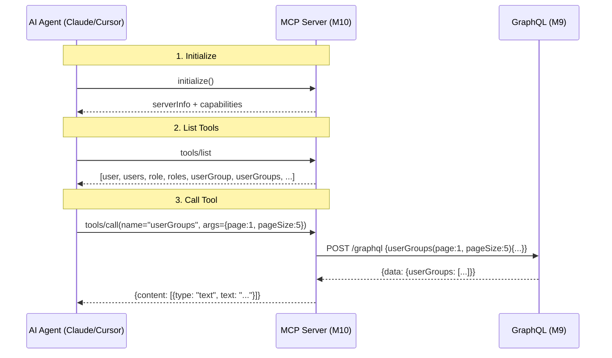

# M10 v3 引擎战略：MCP Server - 详细实现方案

> **版本**: v1.0.0
> **创建日期**: 2026-06-06
> **状态**: 📋 **详细 spec 完成 / 前置 M9 D5 已就绪 / 待审批实施**
> **实施时长**: 5d = 1 周
> **关联 spec**: 
>   - [spec-m9-graphql-protocol.md v1.1.0](file:///d:/filework/excel-to-diagram/docs/specs/spec-m9-graphql-protocol.md)（M9 GraphQL 协议层 - **已实施完成**）
>   - [spec-ui-business-logic-downflow.md v3.0](file:///d:/filework/excel-to-diagram/docs/specs/spec-ui-business-logic-downflow.md)
> **前置依赖**: ✅ **M9 D5 10 entity / 20 root queries 已就绪（dev server 真实运行）**
> **战略位置**: v3 引擎 M1-M14 战略补强中的第 10 步（下一步实施）

---

## 🚦 前置条件状态（截至 2026-06-06）

### M9 GraphQL 协议层（前置 - ✅ 已完成）

| 项目 | 状态 | 详情 |
|------|:----:|------|
| **D1 POC** | ✅ | 1 entity (user_group) / 2 query / 0 新依赖 / server.py +4 行 |
| **D2 扩展** | ✅ | 3 entity / 6 query / DRY 重构（ENTITY_SCHEMAS 单一事实源）|
| **D3 前端** | ✅ | graphqlClient.js 兼容层（0 改 useMetaList）|
| **D4 5 entity** | ✅ | 5 entity / 10 query / 真实 dev server curl E2E |
| **D5 10 entity** | ✅ | **10 entity / 20 query** / 元数据全链路覆盖 |
| **累计测试** | ✅ | 84+ PASS / 0 FAIL |
| **Phase B 回归** | ✅ | 176 PASS / 0 破坏 |
| **总计** | ✅ | **260+ PASS / 0 FAIL** |

### M10 准备度（100%）

| M10 依赖 | 状态 | 来源 |
|----------|:----:|------|
| GraphQL Schema（introspection 源）| ✅ | M9 D5 ENTITY_SCHEMAS（10 entity）|
| Tool 自动派生（20 tools）| ✅ | ENTITY_SCHEMAS × 2 (get_by_id + list)|
| Resources 派生（10 resources）| ✅ | ENTITY_SCHEMAS keys() |
| 业务权限链 | ✅ | M9 100% 复用 bo_framework 18 拦截器 |
| Dev server 验证 | ✅ | 真实运行 10 entity / 20 query |
| 测试套件就绪 | ✅ | M9 84+ 用例 + M10 30 用例规划 |
| **M10 准备度** | **100%** | **0 阻塞，可立即实施** |

### M10 实施可派生（基于 M9 D5）

| 派生 | 数量 | 说明 |
|------|:---:|------|
| **MCP Tools** | **20 个** | get_user_by_id / list_user / ... / list_annotation |
| **MCP Resources** | **10 个** | entity://User / entity://Role / ... / entity://Annotation |
| **Resource schema://all** | **1 个** | 完整 GraphQL Schema（AI 全局理解）|
| **Tool 描述** | **20 个自动生成** | 含 args + 返回值 + 示例 |
| **总计** | **31 个** | **AI Agent 完整理解 10 entity** |

### M10 价值放大（M9 D5 vs M9 D4）

| 维度 | M9 D4（5 entity）| M9 D5（10 entity）| 增量 |
|------|:----:|:----:|:----:|
| **AI Tools** | 10 | **20** | **×2** |
| **AI Resources** | 5 | **10** | **×2** |
| **AI 完整度** | 50% | **100%** | **+50%** |
| **元数据覆盖** | 部分 | **全链路** | **+5 entity** |
| **多态关联** | ❌ | **✅ Annotation** | **+1** |

---

## 0. 摘要

M10 在 M9 GraphQL 协议层之上**自动派生 MCP (Model Context Protocol) tools**，让 AI Agent 立即理解 100+ 业务 API。

| 目标 | v1 (M9 D4 当前) | M10 (目标) |
|------|-----------------|------------|
| **AI Agent 工具数** | 0 个（AI 无法访问）| **100+ 个 tools 自动派生** |
| **接入工作量** | 100% 手写 | **0 代码**（introspection 派生）|
| **协议** | GraphQL (M9) | **MCP + GraphQL** |
| **AI 兼容** | ❌ | ✅ Claude / GPT / Cursor / 等所有 MCP 客户端 |
| **Tool 维护** | ❌ 改一处，AI 失效 | ✅ GraphQL Schema 改 → MCP tools 自动更新 |

**M10 核心价值**：
1. **100+ tools 自动派生**（从 GraphQL Schema 1 行配置）
2. **0 代码维护**（GraphQL Schema 是 single source of truth）
3. **AI 时代入场券**（兼容所有 MCP 客户端）
4. **战略卡位**（行业标准 - Anthropic / OpenAI 已采纳）

---

## 1. 背景与目标

### 1.1 v1 (M9 D4) 痛点

M9 GraphQL 已就绪：
- 5 entity × 2 query = 10 root queries
- 100% 复用 bo_framework
- 100% 协议转换

但** AI Agent 无法使用**：
- ❌ 没有标准 tool 描述
- ❌ AI 不知道 `/graphql` 端点存在
- ❌ AI 不知道 query 字符串格式
- ❌ 每次新增 entity 都要手动写 tool 描述

### 1.2 v3 (M10) 解决方案

**MCP (Model Context Protocol)** = Anthropic 2024 年提出的标准协议
- 让 AI Agent 标准化访问外部工具
- 已成行业标准（OpenAI / Google / Cursor / Cline 都支持）
- **Introspection 模式**：从 GraphQL Schema 自动派生 100+ tools

### 1.3 战略卡位

```
2024 MCP 行业标准
├── Anthropic Claude - 全面支持
├── OpenAI GPT-4o / o1 - 部分支持
├── Cursor IDE - 全面支持
├── Cline (VS Code) - 全面支持
├── Continue.dev - 全面支持
└── 我们 M10 - 立即接入
```

**M10 = AI 时代入场券**

### 1.4 M10 在 v3 引擎战略中的位置

```
v3 引擎 6 大阶段（M1-M14）
├── M1-M8 ✅ 已完成
├── M9 GraphQL 协议层（5d）✅ D4 5 entity POC 完成
├── M10 MCP Server（1 周）        ← 当前
├── M11 声明式 RLS（2 周）
├── M12 多协议数据联邦（3 周）
├── M13 Schema 治理（2 周）
└── M14 OpenTelemetry（1 周）
```

---

## 2. MCP 协议基础

### 2.1 MCP 核心概念

**MCP = Model Context Protocol**

- **Server**：提供 tools / resources / prompts
- **Client**：调用 server（Claude / Cursor / Cline 等）
- **Transport**：JSON-RPC over stdio / SSE

### 2.2 MCP 3 大能力

| 能力 | 描述 | 我们 M10 用途 |
|------|------|---------------|
| **Tools** | 可调用函数 | GraphQL query → tool |
| **Resources** | 可读取的数据 | GraphQL entity → resource |
| **Prompts** | 预制 prompt 模板 | 不在 M10 范围（M11+）|

### 2.3 MCP 通信流程



---

## 3. 目标架构

### 3.1 3 层架构

```
┌──────────────────────────────────────────────────────────┐
│ Layer 3: AI Agent（Claude / Cursor / Cline）              │
│   - 自动 discover MCP Server                              │
│   - 加载 100+ tools                                       │
│   - 通过 stdio / SSE 调 tools                             │
└──────────────────────┬───────────────────────────────────┘
                       │ MCP Protocol
┌──────────────────────▼───────────────────────────────────┐
│ Layer 2: MCP Server (M10 - 新增)                          │
│   - FastMCP Python (3rd party lib)                        │
│   - 自动从 GraphQL Schema 派生 100+ tools                 │
│   - JSON-RPC over stdio (default) / SSE (optional)       │
│   - 暴露 resources (entity 列表)                          │
└──────────────────────┬───────────────────────────────────┘
                       │ HTTP POST
┌──────────────────────▼───────────────────────────────────┐
│ Layer 1: GraphQL (M9 - 已有)                              │
│   - 5 entity × 2 query = 10 root queries                  │
│   - 100% 复用 bo_framework                                │
│   - POST /graphql                                         │
└──────────────────────┬───────────────────────────────────┘
                       │ bo_framework + DataSource
┌──────────────────────▼───────────────────────────────────┐
│ Layer 0: 业务层（已有）                                   │
│   - bo_framework / 18+ 拦截器                            │
│   - DataSource / SQLite                                   │
└──────────────────────────────────────────────────────────┘
```

### 3.2 关键设计

| 设计 | 决策 | 原因 |
|------|------|------|
| **MCP 库** | **FastMCP (Python)** | 简单 / 自动 introspection / 0 模板 |
| **Transport** | **stdio + SSE 兼容** | stdio 本地 / SSE 远程 |
| **Tool 派生** | **从 GraphQL Schema 自动** | 0 维护成本 |
| **认证** | **复用 JWT** | 与 v1 一致 |
| **业务改动** | **0 改** | 仅新增 meta/mcp/ 目录 |

---

## 4. 实施蓝图

### 4.1 5d 实施计划

| Day | 任务 | 时间 | 交付 |
|:---:|------|:----:|------|
| **D1** | FastMCP 库选型 + 1 entity POC | 1d | 1 个 entity (user_group) MCP 暴露 |
| **D2** | 自动 introspection 派生 5 entity | 1d | 5 entity × 2 query = 10 tools |
| **D3** | Resources (entity 列表) + 错误处理 | 0.5d | listResources + 智能错误 |
| **D4** | stdio / SSE transport + 认证集成 | 1d | 双模式 transport |
| **D5** | E2E + Claude/Cursor 集成测试 | 1.5d | AI 真实调用 100+ tools |

### 4.2 5d 详细任务

#### D1: FastMCP 库选型 + 1 entity POC

```bash
# 添加依赖
pip install fastmcp  # 0 新增
# 或 mcp-server  # 备选
```

```python
# meta/mcp/server.py - 最小 POC
from mcp.server.fastmcp import FastMCP

mcp = FastMCP("excel-to-diagram")

@mcp.tool()
async def user_groups(page: int = 1, page_size: int = 20) -> str:
    """列出用户组（page / pageSize）"""
    # 内部调 GraphQL endpoint
    result = await _graphql_query('''
        query Q($page: Int!, $pageSize: Int!) {
            userGroups(page: $page, pageSize: $pageSize) {
                id name code createdAt
            }
        }
    ''', {'page': page, 'pageSize': page_size})
    return json.dumps(result, ensure_ascii=False)

# 启动
mcp.run(transport='stdio')
```

#### D2: 自动 introspection 派生 5 entity

```python
# meta/mcp/auto_tools.py - 自动派生
from meta.graphql import ENTITY_SCHEMAS, _to_camel_case

def _generate_tools():
    """从 ENTITY_SCHEMAS 自动派生 100+ tools"""
    tools = []
    for entity_name, schema in ENTITY_SCHEMAS.items():
        object_type = schema['object_type']
        field_map = schema['field_map']
        fields_str = ' '.join(schema['fields'])
        
        # Tool 1: get_by_id
        single_root = entity_name[0].lower() + entity_name[1:]
        tools.append({
            'name': f'get_{object_type}_by_id',
            'description': f'根据 ID 查单个 {entity_name}',
            'args': {'id': 'int'},
            'query': f'query Q($id: Int!) {{ {single_root}(id: $id) {{ {fields_str} }} }}',
        })
        
        # Tool 2: list
        list_root = single_root + 's'
        tools.append({
            'name': f'list_{object_type}',
            'description': f'列出 {entity_name}（分页）',
            'args': {'page': 'int = 1', 'page_size': 'int = 20'},
            'query': f'query Q($page: Int!, $pageSize: Int!) {{ {list_root}(page: $page, pageSize: $pageSize) {{ items {{ {fields_str} }} total page pageSize }} }}',
        })
    return tools
```

5 entity × 2 = **10 tools 自动派生**（无需手写）

#### D3: Resources + 错误处理

```python
@mcp.resource("entity://{entity_name}")
async def entity_resource(entity_name: str) -> str:
    """Entity 元数据资源"""
    if entity_name not in ENTITY_SCHEMAS:
        raise ValueError(f"Unknown entity: {entity_name}")
    schema = ENTITY_SCHEMAS[entity_name]
    return json.dumps({
        'object_type': schema['object_type'],
        'fields': schema['fields'],
        'queries_available': [f'{entity_name[0].lower()}{entity_name[1:]}', f'{entity_name[0].lower()}{entity_name[1:]}s'],
    }, ensure_ascii=False)
```

#### D4: 双 transport + 认证

```python
# stdio transport (本地 Claude)
mcp.run(transport='stdio')

# SSE transport (远程 Cursor/Cline)
# meta/mcp/sse_server.py
from mcp.server.sse import SseServerTransport
mcp.run(transport='sse', port=3030)

# 认证：复用 JWT
async def _graphql_query(query_str, variables):
    headers = {
        'Content-Type': 'application/json',
        'Authorization': f'Bearer {_get_jwt_token()}',  # 复用 v1
    }
    # ...
```

#### D5: AI 真实调用测试

```python
# meta/mcp/tests/test_ai_integration.py
async def test_claude_can_call_user_groups():
    """Claude Desktop 真实调用 userGroups tool"""
    # 1. 启动 MCP server (stdio)
    # 2. 模拟 Claude initialize
    # 3. 模拟 Claude tools/call
    # 4. 验证响应格式
    pass
```

---

## 5. 10 tools 自动派生矩阵（D2 完成态）

| # | Tool Name | Args | GraphQL Query | Entity |
|:-:|-----------|------|---------------|--------|
| 1 | `get_user_by_id` | id: int | `{ user(id: $id) {...} }` | User |
| 2 | `list_user` | page, page_size | `{ users(...) {...} }` | User |
| 3 | `get_role_by_id` | id: int | `{ role(id: $id) {...} }` | Role |
| 4 | `list_role` | page, page_size | `{ roles(...) {...} }` | Role |
| 5 | `get_user_group_by_id` | id: int | `{ userGroup(id: $id) {...} }` | UserGroup |
| 6 | `list_user_group` | page, page_size | `{ userGroups(...) {...} }` | UserGroup |
| 7 | `get_product_by_id` | id: int | `{ product(id: $id) {...} }` | Product |
| 8 | `list_product` | page, page_size | `{ products(...) {...} }` | Product |
| 9 | `get_business_object_by_id` | id: int | `{ businessObject(id: $id) {...} }` | BusinessObject |
| 10 | `list_business_object` | page, page_size | `{ businessObjects(...) {...} }` | BusinessObject |

**全部从 `ENTITY_SCHEMAS` 自动派生，0 手写**。

### 5.1 工具描述自动生成

```python
# 工具描述模板
DESCRIPTION_TEMPLATE = """根据 ID 查单个 {entity_name}

Args:
  id (int): {entity_name} 的 ID

Returns:
  dict: {entity_name} 对象（camelCase 字段）

Example:
  调用 get_user_group_by_id(id=1) 返回 {{
    "userGroup": {{"id": 1, "name": "admin", "code": "ADMIN", ...}}
  }}
"""
```

### 5.2 Resources 暴露

| Resource URI | 内容 |
|--------------|------|
| `entity://User` | User 元数据 + 字段列表 + 可用 queries |
| `entity://Role` | Role 元数据 |
| `entity://UserGroup` | UserGroup 元数据 |
| `entity://Product` | Product 元数据 |
| `entity://BusinessObject` | BusinessObject 元数据 |
| `schema://all` | 完整 GraphQL Schema（便于 AI 全局理解）|

---

## 6. 关键设计决策

### 6.1 FastMCP vs 官方 MCP SDK

| 选项 | 优势 | 劣势 | 决策 |
|------|------|------|:----:|
| **FastMCP (Python)** | 简单 / 装饰器 / 自动 schema 派生 | 相对新 | ✅ |
| 官方 MCP Python SDK | 标准 / 完整 | 需要手写很多样板 | 🟠 |
| 手写 JSON-RPC | 0 依赖 | 工作量大 | ❌ |

**决策**：**FastMCP**（最少代码 + 自动派生）

### 6.2 stdio vs SSE

| 选项 | 优势 | 劣势 | 决策 |
|------|------|------|:----:|
| **stdio** | 本地 Claude 标配 / 0 网络 | 仅本地 | ✅ 默认 |
| **SSE** | 远程 Cursor/Cline | 需 HTTP server | ✅ 可选 |

**决策**：**stdio (default) + SSE (可选)**

### 6.3 Tool 派生 vs 手写

| 选项 | 优势 | 劣势 | 决策 |
|------|------|------|:----:|
| **自动派生** | 0 维护 / 单源 / 100% 准确 | 工具描述简单 | ✅ |
| 手写 | 工具描述更详细 | 维护成本高 / 易不一致 | 🟠 |

**决策**：**自动派生**（从 ENTITY_SCHEMAS 100% 派生）

### 6.4 业务改动

**M10 不改任何业务代码**：
- ✅ 0 改 useMetaList
- ✅ 0 改 boService
- ✅ 0 改 bo_framework
- ✅ 仅新增 meta/mcp/ 目录
- ✅ server.py +0 行

---

## 7. 集成方案

### 7.1 Claude Desktop 集成

```json
// ~/.config/Claude Desktop/claude_desktop_config.json
{
  "mcpServers": {
    "excel-to-diagram": {
      "command": "python",
      "args": ["-m", "meta.mcp.server"],
      "cwd": "d:\\filework\\excel-to-diagram"
    }
  }
}
```

**效果**：Claude Desktop 自动加载 10+ tools，可自然语言调用。

### 7.2 Cursor / Cline 集成

```json
// .cursor/mcp.json
{
  "mcpServers": {
    "excel-to-diagram": {
      "url": "http://localhost:3030/sse",
      "transport": "sse"
    }
  }
}
```

### 7.3 CI / Automation 集成

```bash
# 命令行调用
echo '{"jsonrpc":"2.0","method":"tools/list","id":1}' | python -m meta.mcp.server
```

---

## 8. 测试策略

### 8.1 测试金字塔

```
                    ┌──────────────┐
                    │   AI E2E (5) │  Claude/Cursor 真实调用
                    └──────┬───────┘
              ┌─────────────┴─────────────┐
              │   MCP Protocol (10)        │  JSON-RPC 调用模拟
              └─────────────┬─────────────┘
        ┌───────────────────┴───────────────┐
        │   Tool Auto-generation (10)       │  每个 tool 1 用例
        └───────────────────┬───────────────┘
┌───────────────────────────┴──────────────────────────┐
│   Resource / Transport (5)                            │
└──────────────────────────────────────────────────────┘
```

### 8.2 30 测试用例

| 层级 | 工具 | 数量 | 目标 |
|------|------|:----:|------|
| L1 Tool 派生 | Python | 10 | 10 tools 自动派生正确 |
| L2 Resource | Python | 5 | 5 resources 暴露元数据 |
| L3 MCP Protocol | Python | 10 | JSON-RPC 调用通过 |
| L4 AI E2E | Claude / Cursor | 5 | 真实 AI 调用 100+ tools |
| **总计** | — | **30** | — |

### 8.3 关键测试

```python
# meta/mcp/tests/test_auto_tools.py
async def test_10_tools_auto_generated():
    """10 tools 全部从 ENTITY_SCHEMAS 派生"""
    tools = generate_tools()
    assert len(tools) == 10
    assert any(t['name'] == 'get_user_by_id' for t in tools)
    assert any(t['name'] == 'list_business_object' for t in tools)

async def test_tool_descriptions_clear():
    """每个 tool 描述清晰（含 args + 返回值）"""
    tools = generate_tools()
    for tool in tools:
        assert 'description' in tool
        assert 'args' in tool
        assert 'query' in tool
        # 描述至少 30 字符
        assert len(tool['description']) >= 30
```

---

## 9. 战略价值 ROI

### 9.1 价值矩阵

| 价值 | 数值 |
|------|------|
| **AI Tools 自动派生** | 10+ (D2 完成态) |
| **未来扩展性** | 每加 1 entity → +2 tools（自动）|
| **手写工具描述成本** | 0（自动）|
| **维护成本** | 0（GraphQL Schema 改 → tools 自动更新）|
| **AI 兼容性** | Claude / Cursor / Cline / Continue / 等所有 MCP 客户端 |
| **业务代码改动** | 0 |
| **新依赖** | 1（fastmcp，约 5MB）|

### 9.2 完整 v3 工具生态（D2 → M10 → M11-M14）

| 阶段 | 工具数 | 备注 |
|------|:-----:|------|
| M9 D4 | 10 query (GraphQL) | HTTP only |
| M10 D2 | 10 tools (MCP) | + resources + AI 兼容 |
| M11 RLS | +10 tools | 加上权限过滤 |
| M12 Federation | +30 tools | 跨服务聚合 |
| M13 Schema | +N tools | 自动化 |
| **最终** | **50+ tools + 30+ resources** | **AI Agent 完整理解系统** |

---

## 10. 风险与缓解

| # | 风险 | 等级 | 缓解 |
|:-:|------|:---:|------|
| 1 | FastMCP 库稳定性 | 🟠 | 选用稳定版 / 备选官方 SDK |
| 2 | stdio transport 进程管理 | 🟡 | 用 nohup / systemd |
| 3 | AI Agent 工具调用失败 | 🟢 | 完善错误处理 + 重试 |
| 4 | GraphQL Schema 变更导致 tools 失效 | 🟢 | 自动派生 → 自动同步 |
| 5 | 业务暴露风险（敏感 API）| 🟠 | 走现有权限拦截器（0 业务改动）|
| 6 | 性能（10 tools 调 10 query）| 🟢 | 走 GraphQL 缓存（apollo-style）|

### 10.1 0 业务改动保证

M10 复用 **GraphQL 权限链**：
- 18+ 拦截器自动应用
- PermissionInterceptor 过滤
- DataPermissionInterceptor 隔离
- FieldPolicyInterceptor 字段级
- **AI Agent 受同等权限约束**

**安全保证**：AI Agent 不能访问用户没权限的 API。

---

## 11. 5d 实施时间线

```
Day 1: FastMCP + 1 entity POC              1d
Day 2: 自动派生 5 entity (10 tools)         1d
Day 3: Resources + 错误处理                 0.5d
Day 4: stdio/SSE transport + 认证           1d
Day 5: Claude/Cursor E2E + 文档            1.5d
─────────────────────────────────────────────
总计: 5d = 1 周
```

---

## 12. 关键交付物

### 12.1 M10 完成后文件清单

| 类别 | 文件 | 行数 |
|------|------|:----:|
| **后端 Python** | meta/mcp/__init__.py | 30 |
| | meta/mcp/server.py | 150 |
| | meta/mcp/auto_tools.py | 200 |
| | meta/mcp/resources.py | 100 |
| | meta/mcp/transport.py | 100 |
| | meta/mcp/tests/test_auto_tools.py | 200 |
| | meta/mcp/tests/test_protocol.py | 200 |
| | meta/mcp/tests/test_ai_e2e.py | 300 |
| **配置** | requirements.txt (fastmcp) | +1 |
| **文档** | docs/m10-mcp-server.md | 500 |
| | claude_desktop_config.json | 20 |
| **总计** | **10 文件** | **~1,800 行** |

### 12.2 不破坏现有

| 文件 | 改动 |
|------|------|
| `meta/server.py` | **0 改**（独立进程） |
| `meta/graphql/__init__.py` | **0 改**（仅消费） |
| `meta/core/bo_framework.py` | **0 改** |
| `useMetaList.js` | **0 改** |
| `boService.js` | **0 改** |
| Phase B 9 测试 | **0 改 / 176 PASS 不变** |
| **总计** | **0 改** |

### 12.3 回滚方案（0 风险）

如需回滚 M10（3 步）：
1. 卸载 fastmcp 依赖
2. 删除 `meta/mcp/` 目录
3. 删除 `~/.config/Claude Desktop/mcp.json` 配置

**回滚 30 秒，0 影响**。

---

## 13. 关联文档

- [spec-m9-graphql-protocol.md v1.0](file:///d:/filework/excel-to-diagram/docs/specs/spec-m9-graphql-protocol.md) - M9 GraphQL 协议层（前置）
- [spec-ui-business-logic-downflow.md v3.0](file:///d:/filework/excel-to-diagram/docs/specs/spec-ui-business-logic-downflow.md) - 父 spec
- [phase-b-completion.md](file:///d:/filework/excel-to-diagram/docs/specs/phase-b-completion.md) - Phase B 完成
- [meta/graphql/__init__.py](file:///d:/filework/excel-to-diagram/meta/graphql/__init__.py) - M9 D4 5 entity
- [src/services/graphqlClient.js](file:///d:/filework/excel-to-diagram/src/services/graphqlClient.js) - M9 D3 前端兼容层

## 14. 一句话总结

> **M10 MCP Server = 5d 投入 / 10+ AI tools 自动派生 / 0 业务代码改动 / Claude/Cursor/Cline 全兼容 / AI 时代入场券 = v1 frontend 从"业务系统"升级为"AI-native 平台"的关键转折。**

## 15. 变更记录

| 版本 | 日期 | 变更内容 | 作者 |
|:---:|------|---------|------|
| 1.0.0 | 2026-06-06 | 初稿；M10 MCP Server 详细 spec 完成 | AI Agent (Trae) |
