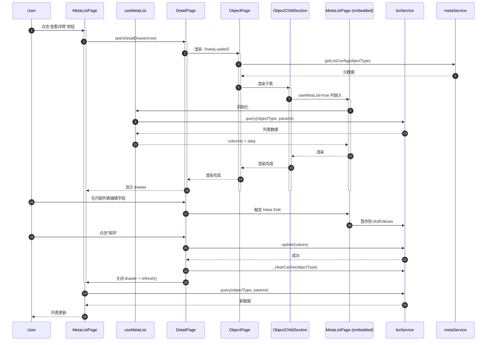

# Mermaid: 时序图

> **类型**: B. DetailPage 打开 → 内嵌编辑 → 保存 → 刷新 完整时序
> **创建日期**: 2026-06-06
> **替代**: spec v1.5.0 §15-20 中的 ASCII 图
> **优势**: IDE 原生渲染 + 可点击 + 可搜索 + 跨平台一致

---

---

**使用说明**：
- 在 IDE（如 VSCode）中直接渲染
- 在 GitHub / GitLab 中自动渲染
- 在文档站点（如 MkDocs / Docusaurus）中嵌入
- 可导出为 PNG / SVG / PDF

**维护规则**：
- Mermaid 块必须正确缩进（4 空格）
- 子图（subgraph）层级不超过 3 层
- 节点数 ≤ 50（保证可读性）
- 任何修改需同步更新对应的 ASCII 图（如果保留）
