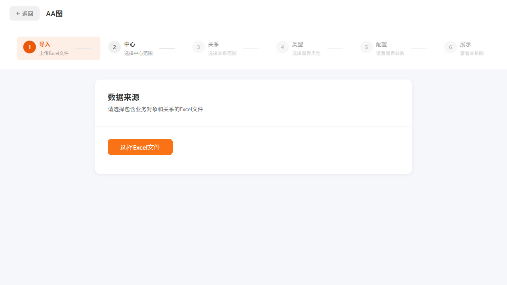
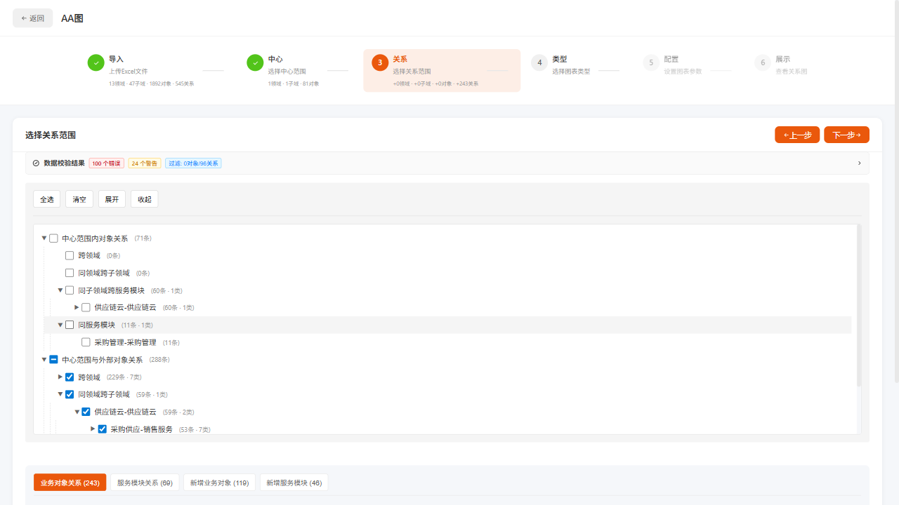
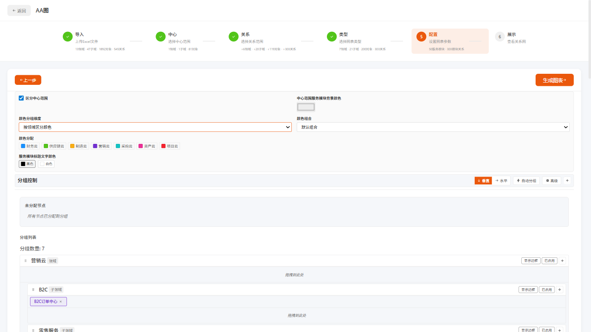
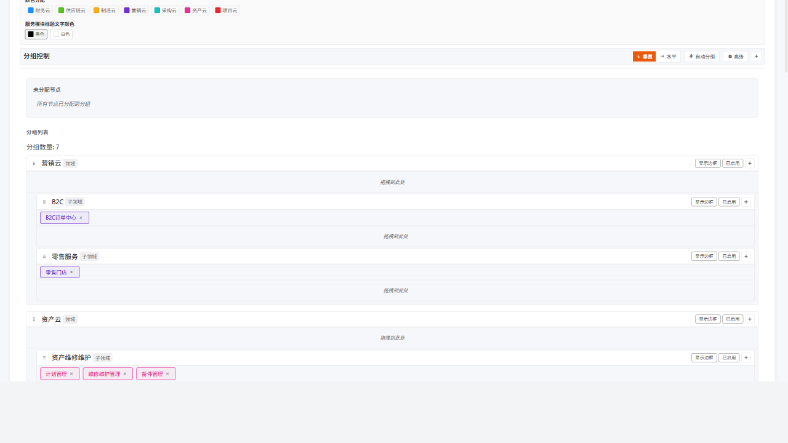
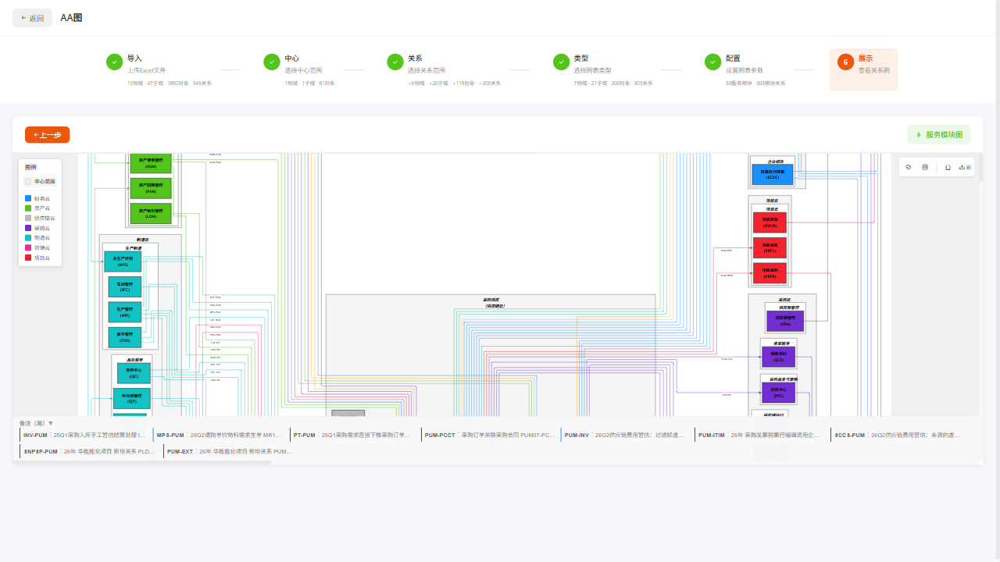
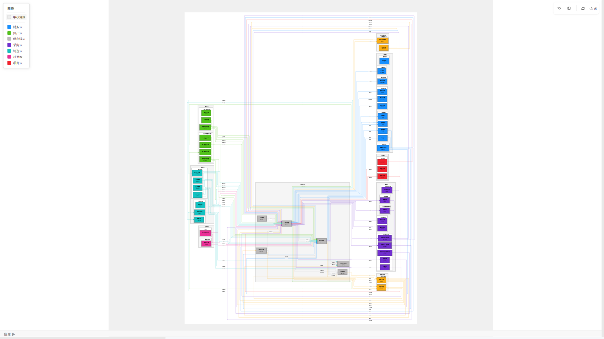
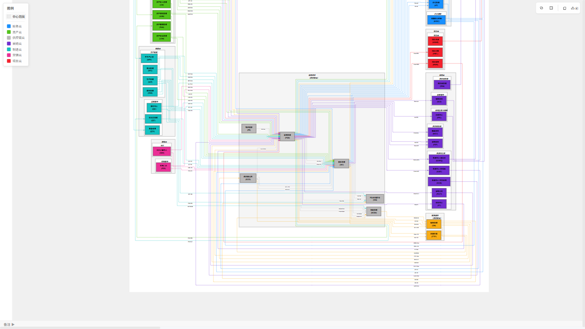

# AA图 - 业务对象关系图生成工具

## 产品介绍

AA图是一款基于Excel数据生成业务对象关系图的工具，支持Mermaid图表导出，可视化展示业务领域、对象及其关系。

---

## 功能特性

- 📊 **数据导入** - 支持Excel文件导入业务对象关系数据
- 🔍 **数据校验** - 自动校验数据完整性和引用关系
- 🌳 **领域选择** - 支持多层级业务领域选择（云领域、子域）
- 📈 **多种图表类型** - 业务对象图、服务模块图、汇总图等
- 🎨 **颜色维度** - 支持按领域、类型、业务对象等维度着色
- 🖼️ **Mermaid导出** - 支持简洁版和彩色版HTML导出
- 🔎 **缩放拖拽** - 支持滚轮缩放和鼠标拖拽移动
- 📹 **视频录制** - 支持操作过程录屏

---

## 操作流程

### 第一步：上传Excel文件

1. 打开应用首页，点击「AA图」进入
2. 点击上传区域，选择Excel文件
3. 等待数据解析和校验

**截图示意：**

**说明：** 上传后系统自动解析数据，右侧表格显示业务对象关系明细，下方显示校验结果（错误和警告数量）。

---

### 第二步：选择业务领域

1. 在左侧树形结构中选择目标领域（如：供应链云）
2. 展开领域节点，选择具体的子域或业务对象（如：采购供应）
3. 选择后右侧显示该领域的业务对象和服务模块列表

**截图示意：**

**说明：** 支持多选，可同时选择多个业务领域进行关系分析。

---

### 第三步：展开并全选关系

1. 点击「展开」按钮查看所有可选关系
2. 点击「全选」选中所有关系
3. 确认业务对象和服务模块列表

**截图示意：**

---

### 第四步：选择图表类型

1. 点击「下一步」进入图表类型选择
2. 选择需要的图表类型：
   - **业务对象图** - 展示业务对象之间的关系
   - **服务模块图** - 展示服务模块及其关联
   - **汇总图** - 高级汇总视图

**截图示意：**

**提示：** 双击图表类型可快速选择

---

### 第五步：配置图表参数

1. 进入配置页面，设置图表参数
2. 选择颜色维度（按领域、类型、业务对象等）
3. 选择形状维度
4. 点击「生成图表」预览

**截图示意：**

---

### 第六步：查看生成结果

1. 系统生成Mermaid关系图
2. 在画布区域显示图表
3. 支持以下操作：
   - 🖱️ **滚轮缩放** - 鼠标滚轮放大/缩小
   - ✋ **拖拽移动** - 按住鼠标拖动画布
   - 🖥️ **全屏查看** - 点击全屏按钮

**截图示意：**

---

### 第七步：导出HTML

1. 点击导出按钮，选择导出格式：
   - **彩色完整版** - 支持ELK布局，CDN加载，交互功能完整
   - **简洁版** - 离线可用，内嵌Mermaid

**截图示意：**

**提示：** 彩色版支持更好的颜色区分和布局算法，适合复杂关系展示。

---

## 数据格式要求

Excel文件需包含以下Sheet：

### 业务对象 Sheet
| 列名 | 说明 | 示例 |
|------|------|------|
| 编码 | 业务对象唯一标识 | BO001 |
| 名称 | 业务对象名称 | 采购订单 |
| 类型 | 对象类型 | 主数据/交易对象 |
| 领域 | 所属领域 | 供应链云 |

### 关系 Sheet
| 列名 | 说明 | 示例 |
|------|------|------|
| 关系类型 | 关系描述 | 采购订单-库存转移 |
| 源业务对象编码 | 起始对象 | PO001 |
| 目标业务对象编码 | 目标对象 | INV001 |
| 服务模块 | 所属服务 | 采购模块 |

---

## 使用场景

1. **业务建模** - 可视化现有业务对象及其关系
2. **系统分析** - 理解业务模块间的依赖关系
3. **文档生成** - 导出图表用于文档和汇报
4. **培训演示** - 展示业务架构全景

---

## 注意事项

1. ⚠️ **数据校验** - 上传后请关注校验结果，确保数据质量
2. ⚠️ **选择范围** - 数据量较大时注意选择范围，避免生成过多节点
3. ⚠️ **浏览器兼容** - 推荐使用Chrome/Firefox最新版
4. ⚠️ **ELK布局** - 仅彩色完整版支持ELK布局算法

---

## 视频演示

完整操作演示视频：`videos/manual-session/page@bb5ddf60a680a91ad939b2961bce4861.webm`

---

*文档生成时间：2026-04-17*